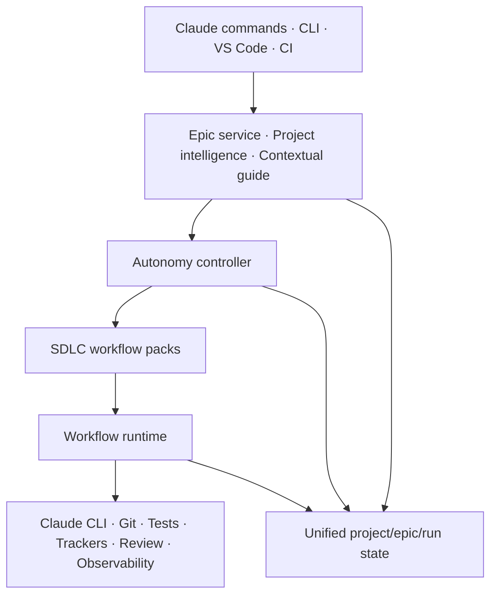

# AIDLC System Redesign — Workflow Runner + SDLC Framework + Autonomous Engineering

**Trạng thái:** Draft v0.2 — đã chốt các product decisions vòng đầu  
**Mục tiêu:** Giữ cả ba giá trị sản phẩm nhưng thống nhất chúng trong một kiến trúc, một state model và một command surface.

## 0. Product decisions đã chốt

1. Autonomy mặc định của project mới là **`guide`**.
2. Chỉ artifact được artifact policy chọn mới được commit; run state, cache và artifact trung gian không tự động vào Git.
3. Project Context chỉ refresh bằng **explicit command**, không tự refresh theo drift hay số commit.
4. Model provider interface được thiết kế ngay từ đầu; **Claude là provider mặc định**.
5. **AST graph và artifact annotation được bundle mặc định**; Test Agent và observability là module tùy chọn.
6. Giữ tên **Epic** trong UI, CLI, folder và domain model; Autonomous Delivery trở thành một execution mode của Epic.
7. **External communication** là hard gate mặc định, kể cả trong `unattended` mode.

## 1. Product thesis

AIDLC không cần chọn một trong ba hướng. Ba hướng phải là ba lớp của cùng một hệ thống:

1. **Workflow Runner** là runtime tổng quát: chạy agent/skill/tool theo graph có state.
2. **SDLC Framework** là các workflow pack có opinion: cung cấp stage, quality policy, artifact template và guide.
3. **Autonomous Engineering System** là autonomy controller: quyết định phần nào AI được tự làm, khi nào phải hỏi, khi nào dừng và cách recover.



Workflow Runner không biết “feature PR” là gì. SDLC pack định nghĩa điều đó. Autonomous layer không tạo một workflow khác; nó chỉ điều khiển workflow hiện có theo policy.

## 2. Nguyên tắc thiết kế

### 2.1 Command-first, UI-second

- 100% capability phải chạy được từ Claude Code command hoặc CLI.
- Extension chỉ là visual client và observer; không được chứa orchestration logic độc quyền.
- Mỗi UI action phải ánh xạ 1:1 tới một application command có schema ổn định.
- Headless mode không phụ thuộc VS Code, webview hay terminal ẩn.

### 2.2 Một Epic model duy nhất

`epic`, `run` và `delivery` hiện đang chồng state lên nhau. Thiết kế mới dùng:

- **Project**: profile và policy của repository.
- **Epic**: một feature, bug, refactor, spike hoặc maintenance request.
- **Workflow**: execution graph đã compile cho Epic.
- **Run**: một lần thực thi workflow.
- **Stage**: đơn vị tiến độ mà user nhìn thấy.
- **Action**: tác vụ nội bộ của stage, chỉ hiện trong chế độ chi tiết.

Autonomous Delivery không còn có state model riêng. Nó là một execution mode của Epic với autonomy policy cao hơn.

### 2.3 Ít stage, action thích ứng

- User chỉ nên thấy tối đa khoảng 3–5 stage chính.
- Các thao tác scan, snapshot, validate, publish manifest và sync rule là action nội bộ, không mặc định trở thành step ngang hàng.
- Workflow được compile theo project, loại Epic, độ rủi ro và autonomy policy.
- Không tạo artifact nếu artifact đó không phục vụ quyết định, execution hoặc audit.

### 2.4 Project-aware thay vì preset cứng

- Hệ thống phân tích project trước khi đề xuất workflow.
- Agent role, skill và model được chọn từ capability cần thiết, không chỉ từ tên phase.
- Mọi recommendation phải có lý do, evidence và confidence.
- User có thể accept, thay thế hoặc lock selection.

### 2.5 Progressive disclosure

- Người mới nhìn thấy “việc tiếp theo cần làm”.
- Người dùng nâng cao có thể mở workflow graph, agent, model, validator và raw state.
- AST graph và annotation là bundled capability nhưng chỉ xuất hiện đúng context. Testing và observability là optional capability module, không cạnh tranh trên màn hình chính.

## 3. Workflow model mới: 5 stage chuẩn

Thay vì 7 + 14 + 7 step, SDLC mặc định dùng năm stage có thể co giãn:

| Stage | Trách nhiệm | Action có thể chạy bên trong |
|---|---|---|
| **Understand** | Hiểu project và yêu cầu | scan project, refresh context, clarify, scope, acceptance criteria |
| **Plan** | Chọn giải pháp và execution graph | design, risk analysis, task/package split, test strategy |
| **Build** | Thực hiện thay đổi | implementation, migrations, unit tests, parallel subruns |
| **Verify** | Chứng minh thay đổi đúng | review, integration, quality commands, security/domain checks |
| **Ship** | Đưa thay đổi tới điểm bàn giao | commit/branch policy, PR, release evidence, post-merge context update |

### 3.1 Adaptive profiles

Workflow compiler chọn profile thay vì bắt mọi Epic chạy đủ mọi action:

#### Quick

Dành cho thay đổi nhỏ, rủi ro thấp:

```text
Understand → Build → Verify
```

Plan được tạo ngắn bên trong Understand. Ship là tùy chọn.

#### Standard

Dành cho feature/bug thông thường:

```text
Understand → Plan → Build → Verify → Ship
```

#### Parallel

Dành cho thay đổi lớn có ownership tách được:

```text
Understand → Plan → Build[subruns song song] → Verify[integrate] → Ship
```

Work package là subrun của Build, không tạo thêm bảy stage trên timeline chính.

#### Regulated

Dành cho project yêu cầu audit/compliance:

- Vẫn giữ năm stage.
- Bổ sung evidence, traceability và mandatory gates bên trong stage.
- Không biến mỗi tài liệu compliance thành một step riêng.

### 3.2 Mapping từ Cohesive Delivery cũ

| Luồng cũ | Luồng mới |
|---|---|
| define-charter, scan-project, model-project, check-drift, publish-context | Project analysis service + Understand actions |
| capture-context, specify, clarify | Understand |
| plan, tasks-package, analyze-contract | Plan |
| prepare-worktree, test-plan, implement, package-test | Build subrun |
| await-packages, integrate, integration-context, package/cohesion review, system-test | Verify |
| open-pr, await-merge, project-sync | Ship |

Project Context trở thành project service có version rõ ràng. Hệ thống có thể cảnh báo context cũ nhưng chỉ refresh khi user chạy explicit command; Start Epic không tự refresh.

## 4. Autonomy model có thể tùy chỉnh

Autonomy là policy độc lập áp dụng cho từng stage:

| Mode | Hành vi |
|---|---|
| `guide` | Không mutation; giải thích chính xác user phải làm gì và vì sao |
| `assist` | AI phân tích, đề xuất plan/diff/command; user xác nhận trước mutation |
| `auto` | Tự chạy stage, retry và validate; dừng tại gate được cấu hình |
| `unattended` | Tự chạy end-to-end; chỉ dừng ở hard safety gate hoặc blocker không thể recover |

Mọi stage phải hỗ trợ đủ bốn mode. User có thể trộn mode trong cùng một workflow:

```yaml
# .aidlc/autonomy.yaml
default: guide

stages:
  understand: auto
  plan: assist
  build: unattended
  verify: auto
  ship: guide

gates:
  destructive_changes: always
  dependency_changes: risk-based
  external_communication: always
  merge_default_branch: always

recovery:
  max_attempts: 3
  on_validation_failure: repair-and-retry
  on_ambiguous_requirement: ask
```

`external_communication` bao gồm tạo hoặc gửi PR, issue, comment, email/chat, release announcement, publish package và mọi hành động giao tiếp ra hệ thống bên ngoài. Hệ thống luôn phải preview nội dung, đích đến và chờ xác nhận rõ ràng; `unattended` không được bypass gate này.

### 4.1 “Hỗ trợ 100%” nghĩa là gì?

Cho mọi stage, hệ thống phải cung cấp:

- `explain`: giải thích mục tiêu, input, output và điều kiện hoàn thành.
- `preview`: cho biết sẽ làm gì trước khi mutation.
- `execute`: thực thi bằng Claude và tools.
- `validate`: kiểm tra output bằng evidence thực tế.
- `recover`: đề xuất hoặc tự chạy cách sửa.
- `resume`: tiếp tục từ durable state.
- `audit`: cho biết ai/cái gì đã quyết định và thay đổi gì.

Manual/assist không phải phiên bản bị cắt giảm của autonomous. Chúng dùng cùng engine và cùng state, chỉ khác quyền quyết định.

## 5. Command surface trong Claude

Claude Code là primary execution surface cho người dùng muốn làm việc bằng command line:

```text
/aidlc setup
/aidlc analyze-project
/aidlc recommend
/aidlc epic start "Add portfolio risk alerts"
/aidlc epic run EPIC-001 --mode auto
/aidlc epic next EPIC-001
/aidlc epic status EPIC-001
/aidlc epic explain EPIC-001
/aidlc epic resume EPIC-001
/aidlc epic review EPIC-001
/aidlc epic ship EPIC-001
```

Shell CLI có semantic tương đương:

```bash
aidlc project analyze
aidlc epic start --title "Add portfolio risk alerts"
aidlc epic run EPIC-001 --mode unattended
aidlc epic status EPIC-001
aidlc epic resume EPIC-001
```

Nguyên tắc thực thi:

- Trong Claude Code, `/aidlc ...` gọi cùng application service với CLI.
- Trong CI/headless, CLI có thể điều phối Claude CLI subprocess.
- Extension gọi cùng command API và subscribe event; không tự implement một flow riêng.
- Mọi command trả về typed result gồm `status`, `nextAction`, `evidence`, `warnings` và `recoveryActions`.

Project Context có command riêng và không chạy ngầm:

```text
/aidlc context status
/aidlc context refresh

aidlc project context status
aidlc project context refresh
```

Start Epic dùng context version đã publish gần nhất. Nếu context có dấu hiệu cũ, command trả warning và recovery action `Refresh context`, nhưng không tự mutation.

## 6. Project Intelligence và recommendation

### 6.1 Project analysis

`aidlc project analyze` thu thập facts:

- Ngôn ngữ, framework, platform và version.
- Build system, package manager và quality commands.
- Kiến trúc/module boundaries.
- Test framework và test coverage signal.
- CI/CD và Git conventions.
- Domain signal từ code, docs và dependency.
- Security/compliance/risk signal.
- Repo size, change frequency và hotspot.
- Tool/MCP/capability đang có.

Facts và recommendation phải tách riêng. Facts có evidence path; recommendation có confidence và reason.

### 6.2 Capability-based selection

Thay vì gắn cứng `developer` vào mọi Build step, hệ thống thực hiện:

```text
Project facts + work request + risk
→ required capabilities
→ candidate skills
→ composed agent role
→ model policy
→ workflow profile
```

Agent là một role được compose từ capability, không phải một prompt khổng lồ cố định.

### 6.3 Model policy

Model provider là extension point của core ngay từ phiên bản đầu. Claude là provider mặc định, nhưng workflow và state không phụ thuộc vào Claude-specific model ID.

```ts
interface ModelProvider {
  readonly id: string;
  discoverModels(): Promise<ModelDescriptor[]>;
  resolve(request: ModelRequirement): Promise<ResolvedModel>;
  execute(request: ModelExecutionRequest): Promise<ModelExecutionResult>;
  validateConfiguration(): Promise<ProviderDiagnostic[]>;
}
```

`ModelRequirement` mô tả capability, context size, reasoning tier, tool support, latency và cost preference. `ResolvedModel` ghi provider, model ID và version vào run lock để audit/reproduce.

Workflow không hard-code model version cụ thể. Nó yêu cầu model tier:

- `fast`: scan, format, deterministic transforms.
- `balanced`: implementation thông thường.
- `deep`: architecture, ambiguous planning, high-risk changes.
- `review`: independent verification với context tách biệt.

Resolver mặc định ánh xạ tier sang model Claude đang khả dụng. Provider khác có thể được cài sau mà không thay workflow schema, Epic state hoặc agent definition.

### 6.4 Ví dụ: iOS trading project

Project analyzer có thể đề xuất:

```yaml
project:
  platforms: [ios]
  languages: [swift]
  frameworks: [swiftui]
  domains: [trading, portfolio-management]
  risks: [financial-precision, realtime-data, credential-security]

recommendation:
  workflow_profile: standard
  roles:
    understand:
      agent: product-domain-analyst
      skills: [trading-domain, acceptance-criteria]
      model_tier: deep
    plan:
      agent: ios-architect
      skills: [swift-architecture, swift-concurrency, trading-domain]
      model_tier: deep
    build:
      agent: senior-ios-developer
      skills: [swiftui, swift-concurrency, xcode-build, financial-decimal-safety]
      model_tier: balanced
    verify:
      agent: ios-reviewer
      skills: [xctest, ios-security, trading-invariants, code-review]
      model_tier: review
```

UI/CLI phải hiển thị lý do, ví dụ: “Đề xuất `financial-decimal-safety` vì project xử lý giá/portfolio và đang dùng floating-point ở domain layer.”

### 6.5 Apply recommendation

Recommendation không tự ý thay đổi project:

1. Generate proposal.
2. User accept toàn bộ hoặc chỉnh từng selection.
3. Ghi selection đã chấp nhận vào lock file.
4. Runtime dùng lock file cho tới khi user yêu cầu refresh hoặc project drift vượt threshold.

## 7. Folder structure chuẩn cho Claude project

Mục tiêu là phân biệt rõ execution interface, AIDLC state và tài liệu của project:

```text
project-root/
├── CLAUDE.md                     # Hướng dẫn chính cho Claude; managed block tối thiểu
├── AGENTS.md                     # Quy tắc cho coding agents
├── .claude/
│   ├── commands/
│   │   └── aidlc.md              # /aidlc command entry point
│   ├── agents/                   # Project-local agent roles
│   ├── skills/
│   │   └── <skill>/SKILL.md      # Project-local reusable skills
│   └── settings.json             # Chỉ cấu hình Claude cần thiết
├── .aidlc/
│   ├── project.yaml              # Project identity, facts và source policy
│   ├── autonomy.yaml             # Quyền tự động và gates
│   ├── artifacts.yaml            # Artifact nào được giữ và commit
│   ├── catalog/
│   │   ├── recommendations.yaml  # Proposal từ analyzer
│   │   └── selection.lock.yaml   # Agent/skill/model đã được chấp nhận + hashes
│   ├── workflows/
│   │   ├── default.yaml          # Workflow selection/override của project
│   │   └── custom/               # Workflow custom, nếu có
│   ├── epics/
│   │   └── <epic-id>/
│   │       ├── epic.yaml         # Requirement, profile và current run
│   │       ├── state.json        # Unified Epic state
│   │       ├── plan.md           # Human-readable execution preview
│   │       ├── review.md         # Aggregate review hiện tại
│   │       └── evidence/         # Machine-readable evidence/index
│   ├── runs/
│   │   └── <run-id>/             # Event log, checkpoints và action state
│   └── cache/                    # Regenerable scan/model caches; gitignored
└── docs/
    ├── project/                  # Canonical architecture/domain/conventions
    ├── decisions/                # ADR hoặc decision records
    └── epics/<epic-id>/           # Chỉ artifact được policy chọn để đọc/commit
```

### 7.1 Source-of-truth rules

- `.claude/agents` và `.claude/skills` là canonical project-local execution assets.
- `~/.claude` chỉ là candidate catalog, không tự động trở thành project dependency.
- `.aidlc/catalog/selection.lock.yaml` snapshot ID, origin, version và hash của asset đã chọn.
- `.aidlc` lưu config/state và mặc định gitignore state runtime; `docs` chỉ lưu artifact được policy chọn để con người review hoặc commit.
- Không ghi cùng một review bundle vào hai thư mục.
- `CLAUDE.md` và `AGENTS.md` chỉ dùng managed block nhỏ, không overwrite nội dung của project.

### 7.2 Artifact commit policy

Artifact không được commit chỉ vì một action đã sinh ra file. Mỗi artifact type phải khai báo lifecycle:

```yaml
# .aidlc/artifacts.yaml
defaults:
  persist: runtime
  commit: false

types:
  specification:
    path: docs/epics/{epic}/SPEC.md
    persist: project
    commit: true
  architecture-decision:
    path: docs/decisions/{id}.md
    persist: project
    commit: true
  execution-plan:
    persist: runtime
    commit: false
  review-log:
    persist: runtime
    commit: false
```

- Code và config mà Epic chủ ý thay đổi vẫn theo Git policy bình thường.
- Generated plan, raw transcript, run state, cache và evidence tạm nằm trong `.aidlc` và không tự vào commit.
- Trước Commit/Ship, hệ thống preview chính xác artifact nào sẽ được stage.
- Workflow pack có default artifact policy; project có thể override rõ ràng.

### 7.3 Validator packaging

Bundled validator không nên được copy hàng loạt vào project.

- Validator mặc định được load từ versioned workflow pack.
- Project chỉ lưu validator override thực sự custom.
- Lock file ghi pack version và validator hashes.
- Upgrade pack không tạo `.aidlc-new` cho file mà project chưa override.
- Nếu override xung đột với base mới, hệ thống tạo một reconciliation task có diff và lựa chọn rõ ràng; không chặn bằng một toast không có hành động.

## 8. Help và guide là một subsystem chính

Help không chỉ là một Markdown guide dài. Mọi stage, action, validator và error phải có metadata:

- `why`: tại sao việc này tồn tại.
- `inputs`: cần gì trước khi chạy.
- `outputs`: sẽ tạo hoặc thay đổi gì.
- `doneWhen`: bằng chứng hoàn thành.
- `next`: bước tiếp theo.
- `recovery`: cách sửa từng loại lỗi.

### 8.1 Command hỗ trợ

```text
/aidlc help
/aidlc help start
/aidlc explain current
/aidlc next
/aidlc doctor
/aidlc doctor --fix
/aidlc why-blocked EPIC-001
```

### 8.2 Contextual help trong extension

Mỗi màn hình phải trả lời được bốn câu hỏi mà không cần đọc tài liệu ngoài:

1. Tôi đang ở đâu?
2. Hệ thống đang làm gì?
3. Tại sao nó dừng?
4. Tôi nên làm gì tiếp theo?

Error UI phải hiển thị structured recovery actions như `Retry`, `Apply fix`, `Open diff`, `Change policy`, `Skip with reason`, thay vì chỉ hiện raw exception.

### 8.3 Onboarding theo ba nhu cầu

Lần đầu setup, user chọn một entry path:

- **Run my workflow:** cấu hình runner tối thiểu.
- **Use an SDLC pack:** chọn standard/profile và guided stages.
- **Automate this project:** analyze project, review recommendation và chọn autonomy policy.

Ba path dùng cùng project structure và có thể nâng cấp qua lại mà không migrate state.

## 9. Extension UX mới

Extension nên có bốn khu vực chính:

### Home

- Project readiness.
- Project profile/recommendation status.
- Current Epic và “Next action”.
- Autonomy mode hiện tại.
- Blocker kèm recovery button.

### Epics

- Một danh sách Epic thống nhất; Autonomous Delivery là mode của Epic, không phải loại state riêng.
- Timeline tối đa năm stage.
- Stage đang chạy, evidence, gate và next action.
- Toggle `Guide`, `Assist`, `Auto`, `Unattended` theo stage.

### Studio

- Workflow, agent, skill, model policy và validator override.
- Đây là advanced surface; không bắt user mới hiểu để chạy feature đầu tiên.

### Guide & Diagnostics

- Contextual documentation.
- Doctor và project health.
- Structured errors/recovery history.
- Raw logs chỉ nằm trong advanced details.

AST graph và annotation được bundle mặc định nhưng xuất hiện trong đúng context: graph khi cần hiểu code, annotation khi review artifact. Test Agent và observability là optional capability module, không phải sản phẩm cạnh tranh trên navigation chính.

## 10. Module boundaries

### Core bắt buộc

- `runtime`: graph execution, state, events, checkpoints và recovery.
- `epic`: unified Epic application service.
- `project-intelligence`: analyzer, facts và recommendation.
- `autonomy`: policy, gates, retries và escalation.
- `guide`: contextual help và structured remediation.
- `model-provider`: provider interface, resolver và execution contract.
- `claude-provider`: model provider mặc định và Claude command/CLI execution.

### Workflow packs

- `sdlc-core`: năm stage chuẩn.
- `speckit`: action/template theo Spec Kit.
- `cohesive`: parallel package, explicit project-context refresh và integration policy.
- `regulated`: traceability/compliance evidence.

### Bundled capability modules

- AST graph.
- Artifact annotation.

Hai module bundled có thể disable bằng project policy nhưng luôn được hỗ trợ và version cùng AIDLC.

### Optional capability modules

- Requirements connectors.
- Test Agent.
- Observability/token analytics.
- Issue tracker và Git provider adapters.

Module optional đăng ký capability vào runtime; nó không thêm một state machine riêng.

## 11. Unified state transitions

Epic chỉ cần state machine cấp cao:

```text
draft
→ ready
→ running
→ waiting-for-user | blocked | paused
→ review
→ shipping
→ completed
```

Stage/action có substate riêng nhưng không tạo thêm khái niệm delivery status cạnh tranh.

Mọi transition ghi event append-only:

```yaml
at: 2026-08-09T10:30:00Z
actor: agent:senior-ios-developer
command: aidlc.action.execute
epic: EPIC-001
stage: build
action: implement-ios-alert
from: running
to: validating
evidence:
  - git-diff:sha256:...
  - test:xcodebuild-test:passed
```

`state.json` là projection để đọc nhanh; event log mới là audit source.

## 12. Migration từ hệ thống hiện tại

### Phase 0 — Product contract

- Freeze việc thêm subsystem mới vào extension monolith.
- Chốt terminology: Project, Epic, Workflow, Run, Stage, Action, Capability.
- Chốt command/result/error schema.

### Phase 1 — Unified application API

- Tạo `EpicService` dùng chung cho CLI và extension.
- Mapping Epic và Autonomous Delivery cũ sang một Epic state.
- Định nghĩa `ModelProvider` contract và ship Claude provider mặc định.
- Extension không gọi orchestrator trực tiếp; chỉ gọi application commands.
- Exit criteria: cùng một Epic chạy/resume được từ CLI và VS Code mà không diverge; workflow không chứa Claude-specific model ID.

### Phase 2 — Project Intelligence

- Chuẩn hóa project facts.
- Tạo recommender agent/skill/model/workflow.
- Thêm proposal + selection lock.
- Thêm explicit Project Context status/refresh commands; không có background refresh.
- Exit criteria: iOS trading fixture nhận recommendation có evidence và có thể override; Project Context chỉ đổi revision sau explicit refresh.

### Phase 3 — Adaptive five-stage SDLC

- Xây workflow compiler.
- Chuyển action cũ vào năm stage.
- Thêm Quick, Standard, Parallel và Regulated profile.
- Exit criteria: một small feature không cần hơn ba visible stage; parallel feature không cần hơn năm.

### Phase 4 — Autonomy Controller

- Thêm policy theo stage, typed gates, retry/recovery và unattended mode.
- Ship `/aidlc` Claude command và shell CLI tương đương.
- Exit criteria: một Epic có thể đổi từ guide/assist sang auto giữa run mà không migrate state.

### Phase 5 — Thin extension UX

- Thay sidebar/Builder-centric UX bằng Home, Epics, Studio và Guide.
- Hiển thị next action và structured recovery.
- Exit criteria: user mới có thể analyze project và chạy work đầu tiên mà không mở `workspace.yaml`.

### Phase 6 — Modularize integrations

- Bundle AST graph và annotation như capability module chính thức; chuyển Test Agent và observability thành optional capability module.
- Giữ compatibility adapter trong ít nhất một migration window.
- Exit criteria: tắt một module không ảnh hưởng runtime cốt lõi.

### 12.1 Migration safety

- `aidlc migrate --preview` phải cho thấy file/state mapping trước khi ghi.
- Không xóa `.aidlc/runs`, epic artifacts hoặc custom validators tự động.
- Legacy `workspace.yaml` tiếp tục đọc được qua compatibility adapter.
- Migration ghi backup manifest và có rollback command.
- Built-in asset upgrade dùng version/lock, không suy đoán customization chỉ từ việc file đã tồn tại.

## 13. Success criteria

Redesign chỉ thành công nếu đạt được các tiêu chí đo được:

- Một Epic có đúng một nguồn state chính.
- 100% hành động UI chạy được từ Claude command/CLI.
- Default workflow không vượt quá năm visible stage.
- Small change không vượt quá ba visible stage.
- Project analyzer đề xuất agent/skill/model kèm evidence và confidence.
- User có thể cấu hình autonomy theo từng stage.
- Project mới mặc định ở `guide`; tăng autonomy là quyết định rõ ràng của user.
- Model provider interface hoạt động độc lập với Claude-specific model ID; Claude là provider mặc định.
- Project Context chỉ thay đổi qua explicit refresh command.
- Chỉ artifact được policy chọn xuất hiện trong commit preview.
- External communication luôn yêu cầu human approval.
- AST graph và annotation có sẵn mặc định nhưng không làm nặng primary navigation.
- Start/resume/recovery idempotent và không tạo state trùng.
- Không còn copy bundled validator gây `.aidlc-new` trong đường chạy thông thường.
- Mọi blocker có ít nhất một recovery action hoặc giải thích rõ vì sao cần human input.
- Người dùng mới có thể biết “next action” mà không hiểu internal state machine.

## 14. Product decisions vòng đầu

| Chủ đề | Quyết định |
|---|---|
| Default autonomy | `guide` |
| Artifact commit | Chỉ artifact được policy chọn |
| Project Context refresh | Explicit command |
| Model architecture | Provider interface từ đầu; Claude mặc định |
| Bundled capabilities | AST graph và annotation |
| Domain terminology | Giữ tên Epic |
| Additional hard gate | External communication |

Các quyết định mới tiếp theo sẽ được bổ sung thành decision record thay vì để dưới dạng câu hỏi mở trong tài liệu này.
