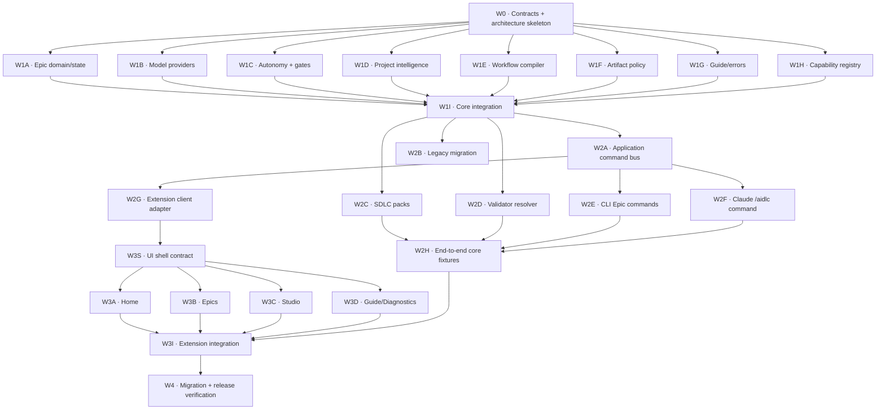

# TODO — AIDLC System Redesign Multi-Agent Execution

**Nguồn thiết kế:** [`AIDLC_SYSTEM_REDESIGN.md`](./AIDLC_SYSTEM_REDESIGN.md)  
**Trạng thái:** Planning / chưa bắt đầu implementation  
**Mục tiêu:** Cho nhiều agent triển khai song song nhưng vẫn giữ một contract, một Epic state model và một integration path kiểm soát được.

## 0. Product decisions không được tự thay đổi

- Default autonomy là `guide`.
- Chỉ artifact được artifact policy chọn mới được commit.
- Project Context chỉ refresh bằng explicit command.
- Model provider interface tồn tại từ đầu; Claude là provider mặc định.
- AST graph và annotation được bundle mặc định.
- Dùng tên `Epic` trong UI, CLI, folder và domain model.
- External communication luôn là hard gate, kể cả `unattended`.
- User chỉ nhìn thấy tối đa năm stage: Understand, Plan, Build, Verify, Ship.
- Autonomous Delivery là execution mode của Epic, không có state machine riêng.

Nếu một task cần thay đổi quyết định trên, agent phải dừng và gửi decision request; không được tự mở rộng scope.

## 1. Quy tắc phối hợp bắt buộc

### 1.1 Mỗi agent dùng branch/worktree riêng

Tên branch đề xuất:

```text
codex/redesign-<task-id>-<short-name>
```

Ví dụ:

```text
codex/redesign-w1b-model-provider
```

Không cho nhiều agent cùng sửa một working tree. Mỗi agent bắt đầu từ cùng baseline commit đã được coordinator ghi nhận.

### 1.2 Coordinator là người duy nhất sửa TODO khi agents đang chạy

- Agent không tick checkbox trực tiếp trong file này để tránh merge conflict.
- Agent báo `DONE`, `BLOCKED` hoặc `DECISION_NEEDED` cho coordinator.
- Nếu cần handoff file, agent tạo file riêng dưới `.agents/handoffs/<task-id>.md`.
- Coordinator cập nhật trạng thái sau khi merge hoặc reject handoff.

### 1.3 Không sửa hotspot nếu task không cho phép

Các file sau chỉ integration agent được sửa:

- `packages/core/src/index.ts`
- `packages/core/src/schema/WorkspaceSchema.ts`
- `packages/cli/src/index.ts`
- `packages/extension/src/extension.ts`
- `packages/extension/src/v2/workspaceWebview.ts`
- `packages/extension/src/v2/workspaceCommands.ts`
- `packages/extension/src/webview/components/AppSidebar.tsx`
- `packages/extension/src/webview/components/WorkspaceShell.tsx`
- `packages/extension/src/webview/lib/types.ts`
- `packages/extension/src/webview/lib/bridge.ts`
- mọi `package.json`, `pnpm-lock.yaml`, README và CHANGELOG

Agent feature phải tạo module/file mới trong ownership path được giao. Không “tiện tay” wire export, command hoặc UI shell.

### 1.4 Contract-first

- Không bắt đầu Wave 1 trước khi W0 được merge.
- Các lane Wave 1 chỉ import types/contracts đã chốt từ W0.
- Nếu contract thiếu, agent gửi change proposal cho W0 integrator; không tạo type trùng trong lane của mình.
- Breaking contract change cần chạy lại toàn bộ contract tests trước khi các lane rebase.

### 1.5 Handoff tối thiểu

Mỗi agent phải báo:

```markdown
Task: W1-X
Status: DONE | BLOCKED | DECISION_NEEDED
Branch/commit: ...
Files changed: ...
Public API added: ...
Tests run: ...
Known limitations: ...
Integration steps required: ...
```

## 2. Dependency graph



## 3. Wave 0 — Contract freeze (tuần tự)

### [ ] W0 — Domain contracts và architecture skeleton

**Chế độ:** SERIAL  
**Owner:** một architecture agent  
**Blocks:** toàn bộ Wave 1

**Được sửa:**

- `packages/core/src/contracts/**` mới
- `packages/core/test/contracts-*.test.ts` mới
- `AIDLC_SYSTEM_REDESIGN.md` chỉ khi cần làm rõ contract đã được chủ sản phẩm duyệt

**Không được sửa:** hotspot trong §1.3.

**Deliverables:**

- [ ] `Epic`, `EpicStatus`, `EpicType`, `EpicProfile`.
- [ ] `Stage`, `StageId`, `StageStatus`, `Action`, `ActionStatus`.
- [ ] `EpicRun`, `RunEvent`, `EvidenceRef`, `ActorRef`.
- [ ] `ApplicationCommand`, `CommandResult`, `NextAction`.
- [ ] `AidlcError`, `ErrorCode`, `RecoveryAction`.
- [ ] `AutonomyMode`, `AutonomyPolicy`, `GatePolicy`, `GateDecision`.
- [ ] `ModelProvider`, `ModelDescriptor`, `ModelRequirement`, `ResolvedModel`.
- [ ] `ProjectFacts`, `ProjectRecommendation`, `RecommendationEvidence`.
- [ ] `ArtifactPolicy`, `ArtifactDescriptor`, `ArtifactLifecycle`.
- [ ] `Capability`, `CapabilityProvider`, `CapabilityRequirement`.
- [ ] Serialization schema/version cho mọi durable contract.
- [ ] Quy ước ID: `EPIC-*`, run ID và event ID.
- [ ] Contract tests cho parse/serialize/backward-compatible optional fields.

**Acceptance:**

```bash
pnpm --filter @aidlc/core test
pnpm --filter @aidlc/core build
```

**Exit gate:** Coordinator review và merge. Sau merge, mọi Wave 1 agent rebase từ commit này.

## 4. Wave 1 — Core foundations (chạy song song)

W1A–W1H có thể chạy đồng thời sau W0. Mỗi lane có ownership path riêng.

### [ ] W1A — Unified Epic domain, event log và state projection

**Depends on:** W0  
**Ownership:**

- `packages/core/src/epic/**` mới
- `packages/core/test/epic-*.test.ts` mới

**Deliverables:**

- [ ] `EpicService` create/load/list/update/resume idempotent.
- [ ] Một Epic state thay cho sự chồng lấn Epic/Delivery.
- [ ] Append-only event store và `state.json` projection.
- [ ] Atomic writes và schema versioning.
- [ ] State machine: `draft → ready → running → waiting-for-user|blocked|paused → review → shipping → completed`.
- [ ] Không tạo Epic trùng; Start existing Epic trả existing state + next action.
- [ ] Tests cho crash recovery, invalid transition và concurrent revision check.

**Không làm:** migration DeliveryState cũ; thuộc W2B.

### [ ] W1B — Model provider interface và Claude provider mặc định

**Depends on:** W0  
**Ownership:**

- `packages/core/src/models/**` mới
- `packages/core/test/model-provider-*.test.ts` mới

**Deliverables:**

- [ ] Provider registry.
- [ ] Provider-neutral model resolution theo tier/capability/context/tool/cost.
- [ ] Claude provider mặc định dùng Claude CLI adapter.
- [ ] Model selection lock có provider, model ID, version và reason.
- [ ] Fake provider cho deterministic tests.
- [ ] Không để workflow hoặc Epic state phụ thuộc Claude-specific ID.
- [ ] Diagnostics khi provider thiếu auth/model/tool capability.

**Không làm:** đăng ký export trong core index; W1I làm.

### [ ] W1C — Autonomy policy, gates và recovery engine

**Depends on:** W0  
**Ownership:**

- `packages/core/src/autonomy/**` mới
- `packages/core/test/autonomy-*.test.ts` mới

**Deliverables:**

- [ ] Modes `guide`, `assist`, `auto`, `unattended`.
- [ ] Default policy luôn là `guide`.
- [ ] Per-stage override.
- [ ] Hard gates cho destructive change, merge default branch và external communication.
- [ ] External communication classifier: PR, issue, comment, email/chat, release announcement, publish package.
- [ ] Preview payload gồm destination, content summary và mutation scope.
- [ ] Retry/recovery policy và escalation to human.
- [ ] Test chứng minh `unattended` không bypass external communication.
- [ ] Test chuyển mode giữa run không migrate state.

### [ ] W1D — Project Intelligence và recommendation engine

**Depends on:** W0  
**Ownership:**

- `packages/core/src/project/**` mới
- `packages/core/test/project-intelligence-*.test.ts` mới
- `packages/core/test/fixtures/projects/**` mới

**Deliverables:**

- [ ] Facts: languages, frameworks, platforms, build/test/CI, architecture, domain, risk, hotspots và capabilities.
- [ ] Evidence path + confidence cho từng fact.
- [ ] Capability requirements từ project facts + Epic request.
- [ ] Recommendation cho workflow profile, agent role, skills và model tier.
- [ ] Proposal/accept/override/lock flow.
- [ ] iOS trading fixture đề xuất senior iOS developer, Swift/iOS skills và trading/financial precision skills.
- [ ] Project Context status chỉ báo stale; không tự refresh.
- [ ] Explicit `refreshContext()` API; revision chỉ đổi qua API này.

**Không làm:** CLI commands; W2E làm.

### [ ] W1E — Adaptive five-stage workflow compiler

**Depends on:** W0  
**Ownership:**

- `packages/core/src/workflows/**` mới
- `packages/core/test/workflow-compiler-*.test.ts` mới

**Deliverables:**

- [ ] Canonical stage IDs: Understand, Plan, Build, Verify, Ship.
- [ ] Actions nằm bên trong stage và có dependency DAG.
- [ ] Profiles Quick, Standard, Parallel và Regulated.
- [ ] Small Epic có tối đa ba visible stages.
- [ ] Standard/Parallel/Regulated có tối đa năm visible stages.
- [ ] Work package là Build subrun, không phải top-level stage.
- [ ] Compiler input gồm ProjectFacts, Epic, selected capabilities, autonomy policy và SDLC pack.
- [ ] Deterministic compiled workflow hash.

### [ ] W1F — Artifact lifecycle và commit policy

**Depends on:** W0  
**Ownership:**

- `packages/core/src/artifacts/**` mới
- `packages/core/test/artifact-policy-*.test.ts` mới

**Deliverables:**

- [ ] Parse/validate `.aidlc/artifacts.yaml`.
- [ ] Default `persist: runtime`, `commit: false`.
- [ ] Resolve artifact path theo Epic/stage/action.
- [ ] Commit allowlist chỉ gồm artifact có `commit: true`.
- [ ] Preview artifact/code/config sẽ được stage; module không tự chạy `git add`.
- [ ] Không ghi một review bundle ở nhiều canonical locations.
- [ ] Tests path traversal, unknown artifact type và policy override.

### [ ] W1G — Contextual guide và structured diagnostics

**Depends on:** W0  
**Ownership:**

- `packages/core/src/guide/**` mới
- `packages/core/test/guide-*.test.ts` mới

**Deliverables:**

- [ ] Guide metadata: why, inputs, outputs, doneWhen, next, recovery.
- [ ] `explain`, `next`, `whyBlocked`, `doctor` application-neutral services.
- [ ] Structured errors luôn có code, summary, detail và recovery actions.
- [ ] Guide mode tạo instruction/preview nhưng không mutation.
- [ ] Fallback guide khi workflow pack thiếu localized content.
- [ ] Tests đảm bảo mọi canonical stage có help đầy đủ.

### [ ] W1H — Capability registry và bundled capability contracts

**Depends on:** W0  
**Ownership:**

- `packages/core/src/capabilities/**` mới
- `packages/core/test/capability-*.test.ts` mới

**Deliverables:**

- [ ] Capability registry, enable/disable policy và health status.
- [ ] Bundled descriptors cho AST graph và artifact annotation.
- [ ] Optional descriptors cho Test Agent và observability.
- [ ] Runtime không phụ thuộc VS Code implementation của capability.
- [ ] Project analyzer có thể query capability availability.
- [ ] Tests: bundled default enabled; project policy có thể disable; optional mặc định absent/disabled.

### [ ] W1I — Core integration và public exports

**Chế độ:** SERIAL INTEGRATION  
**Depends on:** W1A–W1H  
**Owner:** core integrator

**Được sửa:**

- `packages/core/src/index.ts`
- `packages/core/src/schema/WorkspaceSchema.ts`
- integration tests mới

**Deliverables:**

- [ ] Review duplicate concepts/API giữa các lane.
- [ ] Wire public exports một lần.
- [ ] Thêm config references cho autonomy/artifact/provider/capability mà không nhét runtime state vào `workspace.yaml` cũ.
- [ ] Chốt module dependency direction; không có circular imports.
- [ ] Core build và toàn bộ tests pass.
- [ ] Ghi integration notes cho Wave 2.

## 5. Wave 2 — Application, CLI, Claude command và compatibility

### [ ] W2A — Application command bus

**Depends on:** W1I  
**Ownership:**

- `packages/core/src/application/**` mới
- `packages/core/test/application-command-*.test.ts` mới

**Deliverables:**

- [ ] Typed command dispatcher dùng `ApplicationCommand`/`CommandResult`.
- [ ] Epic commands: start, run, next, status, explain, resume, review, ship.
- [ ] Project commands: analyze, recommend, context status, context refresh.
- [ ] Gate commands: preview, approve, reject.
- [ ] Artifact commands: preview commit selection.
- [ ] CLI/extension không cần gọi domain service trực tiếp.
- [ ] Deterministic in-memory adapters cho tests.

### [ ] W2B — Legacy migration và compatibility adapter

**Depends on:** W1I  
**Ownership:**

- `packages/core/src/migration/**` mới
- `packages/core/test/migration-*.test.ts` mới

**Deliverables:**

- [ ] Preview migration từ legacy epic/run/delivery sang unified Epic.
- [ ] Map `.aidlc/deliveries`, `.aidlc/runs` và `docs/epics` không mất audit history.
- [ ] Backup manifest + rollback plan.
- [ ] Không xóa legacy files khi chưa có explicit apply confirmation.
- [ ] Compatibility reader cho `workspace.yaml` hiện tại.
- [ ] Idempotent migration và partial-failure recovery.

### [ ] W2C — SDLC workflow packs

**Depends on:** W1E, W1F, W1G  
**Ownership:**

- `packages/core/src/packs/**` mới
- `packages/core/templates/v3/**` mới
- `packages/core/test/workflow-pack-*.test.ts` mới

**Deliverables:**

- [ ] `sdlc-core` pack năm stage.
- [ ] `speckit` action mapping.
- [ ] `cohesive` parallel Build subruns + explicit context refresh.
- [ ] `regulated` evidence/traceability policy.
- [ ] Guide metadata và artifact policy đi cùng pack.
- [ ] Không copy validator hoặc output placeholder vào project.

### [ ] W2D — Versioned validator resolver

**Depends on:** W1F, W1H  
**Ownership:**

- `packages/core/src/validators/**` mới
- `packages/core/test/validator-resolver-*.test.ts` mới

**Deliverables:**

- [ ] Load bundled validator từ versioned pack.
- [ ] Project chỉ lưu explicit override.
- [ ] Pack/validator lock hashes.
- [ ] Không tạo `.aidlc-new` cho bundled validator thông thường.
- [ ] Override conflict tạo structured reconciliation task có diff/actions.
- [ ] Validator result dùng typed evidence/error contract.

### [ ] W2E — CLI Epic/project commands

**Depends on:** W2A  
**Ownership:**

- `packages/cli/src/commands/v3/**` mới
- CLI command tests mới trong ownership directory

**Không sửa:** `packages/cli/src/index.ts`; W2I làm.

**Deliverables:**

- [ ] `aidlc epic start|run|next|status|explain|resume|review|ship`.
- [ ] `aidlc project analyze|recommend`.
- [ ] `aidlc project context status|refresh`.
- [ ] `aidlc gate preview|approve|reject`.
- [ ] `--json` output giữ typed command result.
- [ ] Exit code ổn định cho success, waiting-for-user, blocked và invalid input.

### [ ] W2F — Claude `/aidlc` command surface

**Depends on:** W2A, W1G  
**Ownership:**

- `packages/core/templates/claude/**` mới
- tests fixture riêng cho command templates

**Deliverables:**

- [ ] Project command entry `.claude/commands/aidlc.md` hoặc Claude-supported equivalent.
- [ ] `/aidlc setup`, `analyze-project`, `recommend`.
- [ ] `/aidlc epic ...` parity với CLI.
- [ ] `/aidlc context status|refresh`.
- [ ] `/aidlc help|next|why-blocked|doctor`.
- [ ] Command luôn dùng current Claude session ở interactive mode.
- [ ] Không có capability chỉ tồn tại trong VS Code UI.

### [ ] W2G — Extension application client adapter

**Depends on:** W2A  
**Ownership:**

- `packages/extension/src/v3/client/**` mới
- `packages/extension/test/v3-client-*.test.ts` mới

**Deliverables:**

- [ ] Thin client gọi application command bus.
- [ ] Subscribe typed events/state projections.
- [ ] Không chứa orchestration/business logic.
- [ ] Fake client cho webview tests.
- [ ] Stable transport message schema cho UI v3.

### [ ] W2H — End-to-end core/CLI fixtures

**Depends on:** W2C–W2F  
**Ownership:**

- `packages/core/test/fixtures/redesign/**` mới
- `packages/core/test/redesign-e2e-*.test.ts` mới
- `packages/cli/test/redesign-*.test.ts` mới nếu test dir được tạo

**Fixtures bắt buộc:**

- [ ] Small TypeScript Epic: Quick profile, ba visible stages.
- [ ] iOS trading Epic: project recommendation đúng role/skills/model tiers.
- [ ] Parallel feature: Build subruns nhưng năm visible stages.
- [ ] External PR/comment action bị hard gate trong unattended mode.
- [ ] Context stale warning không tự refresh; explicit refresh tăng revision.
- [ ] Artifact preview chỉ chọn policy-approved artifacts.
- [ ] Non-Claude fake provider chạy cùng workflow contract.

### [ ] W2I — CLI/core pack integration

**Chế độ:** SERIAL INTEGRATION  
**Depends on:** W2A–W2H

**Được sửa:**

- `packages/cli/src/index.ts`
- core/CLI package manifests nếu thực sự cần
- root scripts nếu thực sự cần

**Deliverables:**

- [ ] Register v3 commands mà không phá legacy CLI trong migration window.
- [ ] Wire Claude template install.
- [ ] Resolve command naming conflicts.
- [ ] Core + CLI build/test pass.

## 6. Wave 3 — Extension UX v3

### [ ] W3S — UI shell contracts và component boundaries

**Chế độ:** SERIAL  
**Depends on:** W2G  
**Ownership:**

- `packages/extension/src/webview/v3/contracts/**` mới
- `packages/extension/src/webview/v3/shell/**` mới
- tests riêng

**Deliverables:**

- [ ] View state types cho Home, Epics, Studio và Guide.
- [ ] Navigation contract.
- [ ] Shared loading/error/gate/recovery components.
- [ ] Agent lanes W3A–W3D có fixture state ổn định và không cần sửa shared types.

### [ ] W3A — Home

**Depends on:** W3S  
**Ownership:** `packages/extension/src/webview/v3/home/**` mới

- [ ] Project readiness/profile/recommendation.
- [ ] Current Epic và next action.
- [ ] Current autonomy mode.
- [ ] Blocker + structured recovery actions.
- [ ] Không hiển thị raw internal steps mặc định.

### [ ] W3B — Epics

**Depends on:** W3S  
**Ownership:** `packages/extension/src/webview/v3/epics/**` mới

- [ ] Unified Epic list; không có Autonomous Delivery list riêng.
- [ ] Timeline tối đa năm stages.
- [ ] Action details mở theo progressive disclosure.
- [ ] Per-stage autonomy selector.
- [ ] Gate preview/approve/reject.
- [ ] Artifact/evidence/review surfaces.

### [ ] W3C — Studio

**Depends on:** W3S  
**Ownership:** `packages/extension/src/webview/v3/studio/**` mới

- [ ] Workflow packs và compiled workflow preview.
- [ ] Agent role/skill/model recommendations.
- [ ] Model provider configuration/diagnostics.
- [ ] Artifact policy editor.
- [ ] Capability toggles: bundled AST graph/annotation; optional modules.

### [ ] W3D — Guide & Diagnostics

**Depends on:** W3S  
**Ownership:** `packages/extension/src/webview/v3/guide/**` mới

- [ ] Contextual help trả lời location/action/why stopped/next.
- [ ] Doctor diagnostics và `Apply fix` actions.
- [ ] Why-blocked view.
- [ ] Raw logs chỉ ở advanced details.
- [ ] Guide mode onboarding mặc định.

### [ ] W3E — Bundled AST graph contextual integration

**Depends on:** W2G, W3S  
**Ownership:**

- `packages/extension/src/v3/capabilities/astGraph/**` mới
- tests mới trong cùng namespace

**Deliverables:**

- [ ] Adapter dùng implementation AST graph hiện tại qua capability contract.
- [ ] Project analysis có thể request structural facts.
- [ ] UI link xuất hiện trong Understand/diagnostics context, không chiếm primary navigation.
- [ ] Disable policy hoạt động.

### [ ] W3F — Bundled annotation contextual integration

**Depends on:** W2G, W3S  
**Ownership:**

- `packages/extension/src/v3/capabilities/annotation/**` mới
- tests mới trong cùng namespace

**Deliverables:**

- [ ] Adapter dùng renderer/Annotron hiện tại qua capability contract.
- [ ] Annotation mở từ artifact/review context.
- [ ] Feedback trở thành structured Epic review action.
- [ ] Không tạo review state machine riêng.

### [ ] W3I — Extension integration

**Chế độ:** SERIAL INTEGRATION  
**Depends on:** W3A–W3F, W2H

**Được sửa:**

- các hotspot extension trong §1.3
- `packages/extension/package.json` nếu cần contributes/settings
- entry points của Vite nếu cần

**Deliverables:**

- [ ] Wire client adapter vào UI v3.
- [ ] Home/Epics/Studio/Guide navigation.
- [ ] Giữ compatibility entry cho UI cũ trong migration window.
- [ ] Không duplicate orchestration trong webview host.
- [ ] Command Palette gọi application commands chung.
- [ ] Extension tests, typecheck và bundle pass.

## 7. Wave 4 — Migration, hardening và release gate

### [ ] W4A — Project folder migration

- [ ] Tạo `.aidlc/project.yaml`, `autonomy.yaml`, `artifacts.yaml` qua preview/apply.
- [ ] Migrate canonical assets sang `.claude/agents` và `.claude/skills` có lock hashes.
- [ ] Migrate Epic state sang `.aidlc/epics/<epic-id>`.
- [ ] Chỉ policy-approved artifacts sang `docs/epics/<epic-id>`.
- [ ] Cache/runtime state được gitignore.
- [ ] Không overwrite `CLAUDE.md`/`AGENTS.md`; chỉ managed block.

### [ ] W4B — Backward compatibility

- [ ] Legacy workflow.yaml/pipeline runner tiếp tục hoạt động.
- [ ] Legacy Epic UI có migration banner thay vì tự migrate.
- [ ] Legacy Cohesive Delivery state đọc được.
- [ ] CLI cũ có deprecation message và lệnh thay thế chính xác.
- [ ] Không xóa legacy code trước khi telemetry/manual pilot xác nhận.

### [ ] W4C — Security và policy verification

- [ ] External communication matrix đầy đủ.
- [ ] Destructive action gates.
- [ ] Path traversal và symlink tests.
- [ ] Secret redaction trong event/evidence/log.
- [ ] Unattended retry budget và runaway protection.
- [ ] Model provider credential isolation.

### [ ] W4D — Performance và concurrency

- [ ] Event store concurrent revision test.
- [ ] Parallel Build subruns không ghi chung mutable artifact.
- [ ] Cancellation, resume và process cleanup.
- [ ] Large repo Project Intelligence benchmark.
- [ ] AST scan không block primary Epic execution.

### [ ] W4E — Documentation và guides

- [ ] `/aidlc help` canonical command reference.
- [ ] Three onboarding paths: runner, SDLC pack, automate project.
- [ ] Project analyzer recommendation guide.
- [ ] Autonomy/gate guide.
- [ ] Migration/rollback guide.
- [ ] Provider authoring guide.
- [ ] Capability authoring guide.

### [ ] W4F — Release verification

```bash
pnpm --filter @aidlc/core test
pnpm --filter @aidlc/core build
pnpm --filter aidlc build
pnpm --filter aidlc-o00ontcong test
pnpm --filter aidlc-o00ontcong typecheck
pnpm package:extension
git diff --check
```

- [ ] Clean-room install fixture.
- [ ] Legacy workspace migration preview/apply/rollback.
- [ ] Claude `/aidlc` interactive smoke.
- [ ] CLI unattended smoke dừng đúng external communication gate.
- [ ] Extension VSIX manual smoke.
- [ ] Verify VSIX contains freshly built core code.

## 8. Parallel dispatch matrix

| Wave | Task IDs có thể chạy cùng lúc | Số lane an toàn | Merge order |
|---|---|---:|---|
| 0 | W0 | 1 | W0 |
| 1 | W1A, W1B, W1C, W1D, W1E, W1F, W1G, W1H | 8 | lane commits → W1I |
| 2a | W2A, W2B, W2C, W2D | 4 | W2A trước command clients |
| 2b | W2E, W2F, W2G | 3 | lane commits → W2H → W2I |
| 3a | W3A, W3B, W3C, W3D | 4 | sau W3S |
| 3b | W3E, W3F | 2 | trước W3I |
| 4 | W4A, W4B, W4C, W4D, W4E | 5 | tất cả → W4F |

Không chạy integration task cùng lúc với feature lanes mà nó đang tích hợp.

## 9. Shared acceptance matrix

| Requirement | Test owner | Blocking assertion |
|---|---|---|
| Default guide | W1C/W2H | New project không mutation khi chưa tăng autonomy |
| Fewer steps | W1E/W2H | Small ≤3, mọi profile ≤5 visible stages |
| 100% command support | W2E/W2F | UI action matrix có CLI và `/aidlc` equivalent |
| Project recommendations | W1D/W2H | iOS trading fixture đúng agent/skills/model tier + evidence |
| Standard folder | W2B/W4A | Preview/apply/rollback deterministic |
| Artifact-only commit | W1F/W2H | Commit preview không chứa runtime/intermediate files |
| Explicit context refresh | W1D/W2H | Stale warning không đổi revision; refresh command có đổi |
| Provider interface | W1B/W2H | Fake non-Claude provider chạy cùng workflow |
| Claude default | W1B | Resolver chọn Claude khi không cấu hình provider |
| AST graph bundled | W1H/W3E | Enabled mặc định, có thể disable |
| Annotation bundled | W1H/W3F | Enabled mặc định, feedback vào Epic review |
| Epic terminology | W0/W3B | Không còn user-facing Work/Delivery entity mới |
| External communication gate | W1C/W2H/W4C | Unattended không được gửi/mở/publish trước approval |
| Contextual guide | W1G/W3D | Mỗi stage có why/input/output/done/next/recovery |

## 10. Definition of Done cho từng agent

Một task chỉ được coi là DONE khi:

- [ ] Chỉ sửa ownership paths đã giao.
- [ ] Không có unrelated formatting hoặc generated files.
- [ ] Public API có doc comment và typed errors.
- [ ] Có positive, negative và recovery/idempotency tests phù hợp.
- [ ] Test command cụ thể đã chạy và được báo trong handoff.
- [ ] `git diff --check` pass.
- [ ] Không làm yếu hard gate hoặc đổi product decision.
- [ ] Không thêm dependency nếu chưa có explicit integration approval.
- [ ] Handoff ghi rõ integration steps và known limitations.

## 11. Prompt mẫu để giao cho agent

```text
Bạn đang thực hiện task <TASK-ID> trong AIDLC redesign.

Đọc đầy đủ:
- AGENTS.md
- AIDLC_SYSTEM_REDESIGN.md
- AIDLC_SYSTEM_REDESIGN_TODO.md, riêng task <TASK-ID>

Chỉ sửa các ownership paths của task. Không sửa shared hotspots, package manifests,
public index exports hoặc TODO. Import contracts đã merge từ Wave 0; không tạo type
song song. Thêm tests trong ownership path, chạy acceptance commands, rồi trả handoff:
status, branch/commit, files changed, API added, tests, limitations, integration steps.

Nếu contract thiếu hoặc cần đổi product decision, dừng với DECISION_NEEDED.
```

## 12. Coordinator checklist

### Trước khi dispatch

- [ ] Chọn và ghi baseline commit.
- [ ] Đảm bảo user changes hiện tại đã được bảo toàn/snapshot.
- [ ] Tạo worktree/branch riêng cho từng lane.
- [ ] Chỉ dispatch task có dependencies đã merge.
- [ ] Gửi cùng contract/design revision cho mọi agent.

### Khi nhận handoff

- [ ] Kiểm tra ownership violations.
- [ ] Đọc test output, không chỉ tin trạng thái DONE.
- [ ] Chạy targeted tests sau merge từng lane.
- [ ] Resolve contract conflict ở integration task, không sửa ngược lane tùy tiện.
- [ ] Cập nhật TODO ở branch coordinator.

### Trước khi mở wave tiếp theo

- [ ] Merge integration task của wave hiện tại.
- [ ] Chạy full core tests và build.
- [ ] Ghi API/decision deltas.
- [ ] Yêu cầu các agent wave sau rebase từ integration commit mới.

## 13. MVP cut line

MVP mới chỉ được tuyên bố hoàn thành khi có:

- [ ] Unified Epic state và application command bus.
- [ ] Five-stage adaptive workflow.
- [ ] Guide/assist/auto/unattended với default guide.
- [ ] External communication hard gate.
- [ ] Project analyzer + recommendation + iOS trading fixture.
- [ ] Provider-neutral model contract + Claude default.
- [ ] Explicit Project Context refresh.
- [ ] Artifact commit policy.
- [ ] CLI và Claude `/aidlc` parity.
- [ ] Home + Epics + Guide UI tối thiểu.
- [ ] AST graph và annotation qua bundled capability contracts.
- [ ] Legacy migration preview và rollback.

Studio nâng cao, regulated pack đầy đủ, Test Agent và observability có thể hoàn thiện sau MVP nếu core contracts đã ổn định.

