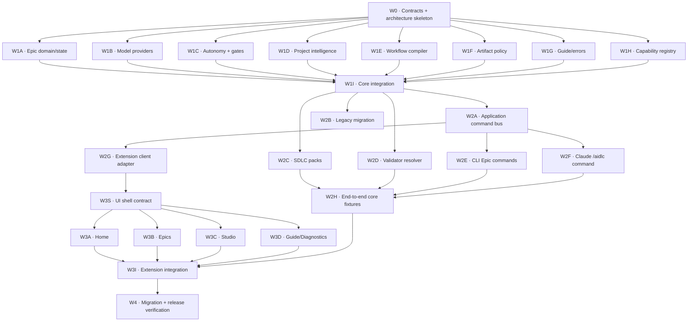

# TODO — AIDLC System Redesign Multi-Agent Execution

**Nguồn thiết kế:** [`AIDLC_SYSTEM_REDESIGN.md`](./AIDLC_SYSTEM_REDESIGN.md)  
**Trạng thái:** Toàn bộ implementation và release gate tự động đã hoàn tất trong working tree hiện tại. VSIX đã cài và mở clean-room Cursor window; Command Palette activation bị macOS Accessibility chặn. Claude interactive smoke đã chạy tới dispatcher nhưng bị chặn bởi Claude Code chưa đăng nhập. Baseline commit trước redesign: `9da9121`.
**Mục tiêu:** Cho nhiều agent triển khai song song nhưng vẫn giữ một contract, một Epic state model và một integration path kiểm soát được.

**Ký hiệu trạng thái:** `[x]` đã triển khai và có acceptance evidence; `[~]` đã có code/test nhưng còn acceptance hoặc integration chưa hoàn thành; `[ ]` chưa bắt đầu. Commit/release gate được theo dõi riêng ở W4F.

## 0. Product decisions không được tự thay đổi

- Default autonomy là `guide`.
- Chỉ artifact được artifact policy chọn mới được commit.
- Project Context chỉ refresh bằng explicit command.
- Model provider interface tồn tại từ đầu; Claude là provider mặc định.
- AST graph và annotation được bundle mặc định.
- Dùng tên `Epic` trong UI, CLI, folder và domain model.
- External communication luôn là hard gate, kể cả `unattended`.
- User chỉ nhìn thấy tối đa năm stage: Understand, Plan, Build, Verify, Ship.
- Autonomous Delivery là execution mode của Epic, không có state machine riêng.

Nếu một task cần thay đổi quyết định trên, agent phải dừng và gửi decision request; không được tự mở rộng scope.

## 1. Quy tắc phối hợp bắt buộc

### 1.1 Mỗi agent dùng branch/worktree riêng

Tên branch đề xuất:

```text
codex/redesign-<task-id>-<short-name>
```

Ví dụ:

```text
codex/redesign-w1b-model-provider
```

Không cho nhiều agent cùng sửa một working tree. Mỗi agent bắt đầu từ cùng baseline commit đã được coordinator ghi nhận.

### 1.2 Coordinator là người duy nhất sửa TODO khi agents đang chạy

- Agent không tick checkbox trực tiếp trong file này để tránh merge conflict.
- Agent báo `DONE`, `BLOCKED` hoặc `DECISION_NEEDED` cho coordinator.
- Nếu cần handoff file, agent tạo file riêng dưới `.agents/handoffs/<task-id>.md`.
- Coordinator cập nhật trạng thái sau khi merge hoặc reject handoff.

### 1.3 Không sửa hotspot nếu task không cho phép

Các file sau chỉ integration agent được sửa:

- `packages/core/src/index.ts`
- `packages/core/src/schema/WorkspaceSchema.ts`
- `packages/cli/src/index.ts`
- `packages/extension/src/extension.ts`
- `packages/extension/src/v2/workspaceWebview.ts`
- `packages/extension/src/v2/workspaceCommands.ts`
- `packages/extension/src/webview/components/AppSidebar.tsx`
- `packages/extension/src/webview/components/WorkspaceShell.tsx`
- `packages/extension/src/webview/lib/types.ts`
- `packages/extension/src/webview/lib/bridge.ts`
- mọi `package.json`, `pnpm-lock.yaml`, README và CHANGELOG

Agent feature phải tạo module/file mới trong ownership path được giao. Không “tiện tay” wire export, command hoặc UI shell.

### 1.4 Contract-first

- Không bắt đầu Wave 1 trước khi W0 được merge.
- Các lane Wave 1 chỉ import types/contracts đã chốt từ W0.
- Nếu contract thiếu, agent gửi change proposal cho W0 integrator; không tạo type trùng trong lane của mình.
- Breaking contract change cần chạy lại toàn bộ contract tests trước khi các lane rebase.

### 1.5 Handoff tối thiểu

Mỗi agent phải báo:

```markdown
Task: W1-X
Status: DONE | BLOCKED | DECISION_NEEDED
Branch/commit: ...
Files changed: ...
Public API added: ...
Tests run: ...
Known limitations: ...
Integration steps required: ...
```

## 2. Dependency graph



## 3. Wave 0 — Contract freeze (tuần tự)

### [x] W0 — Domain contracts và architecture skeleton

**Chế độ:** SERIAL  
**Owner:** một architecture agent  
**Blocks:** toàn bộ Wave 1

**Được sửa:**

- `packages/core/src/contracts/**` mới
- `packages/core/test/contracts-*.test.ts` mới
- `AIDLC_SYSTEM_REDESIGN.md` chỉ khi cần làm rõ contract đã được chủ sản phẩm duyệt

**Không được sửa:** hotspot trong §1.3.

**Deliverables:**

- [x] `Epic`, `EpicStatus`, `EpicType`, `EpicProfile`.
- [x] `Stage`, `StageId`, `StageStatus`, `Action`, `ActionStatus`.
- [x] `EpicRun`, `RunEvent`, `EvidenceRef`, `ActorRef`.
- [x] `ApplicationCommand`, `CommandResult`, `NextAction`.
- [x] `AidlcError`, `ErrorCode`, `RecoveryAction`.
- [x] `AutonomyMode`, `AutonomyPolicy`, `GatePolicy`, `GateDecision`.
- [x] `ModelProvider`, `ModelDescriptor`, `ModelRequirement`, `ResolvedModel`.
- [x] `ProjectFacts`, `ProjectRecommendation`, `RecommendationEvidence`.
- [x] `ArtifactPolicy`, `ArtifactDescriptor`, `ArtifactLifecycle`.
- [x] `Capability`, `CapabilityProvider`, `CapabilityRequirement`.
- [x] Serialization schema/version cho mọi durable contract.
- [x] Quy ước ID: `EPIC-*`, run ID và event ID.
- [x] Contract tests cho parse/serialize/backward-compatible optional fields.

**Acceptance:**

```bash
pnpm --filter @aidlc/core test
pnpm --filter @aidlc/core build
```

**Exit gate:** Coordinator review và merge. Sau merge, mọi Wave 1 agent rebase từ commit này.

## 4. Wave 1 — Core foundations (chạy song song)

W1A–W1H có thể chạy đồng thời sau W0. Mỗi lane có ownership path riêng.

### [x] W1A — Unified Epic domain, event log và state projection

**Depends on:** W0  
**Ownership:**

- `packages/core/src/epic/**` mới
- `packages/core/test/epic-*.test.ts` mới

**Deliverables:**

- [x] `EpicService` create/load/list/update/resume idempotent.
- [x] Một Epic state thay cho sự chồng lấn Epic/Delivery.
- [x] Append-only event store và `state.json` projection.
- [x] Atomic writes và schema versioning.
- [x] State machine: `draft → ready → running → waiting-for-user|blocked|paused → review → shipping → completed`.
- [x] Không tạo Epic trùng; Start existing Epic trả existing state + next action.
- [x] Tests cho crash recovery, invalid transition và concurrent revision check; smoke đa process xác nhận một CAS winner và không mất event của tám writer đồng thời.

**Không làm:** migration DeliveryState cũ; thuộc W2B.

### [x] W1B — Model provider interface và Claude provider mặc định

**Depends on:** W0  
**Ownership:**

- `packages/core/src/models/**` mới
- `packages/core/test/model-provider-*.test.ts` mới

**Deliverables:**

- [x] Provider registry.
- [x] Provider-neutral model resolution theo tier/capability/context/tool/cost.
- [x] Claude provider mặc định dùng Claude CLI adapter.
- [x] Model selection lock có provider, model ID, version và reason.
- [x] Fake provider cho deterministic tests.
- [x] Không để workflow hoặc Epic state phụ thuộc Claude-specific ID.
- [x] Diagnostics khi provider thiếu auth/model/tool capability.

**Không làm:** đăng ký export trong core index; W1I làm.

### [x] W1C — Autonomy policy, gates và recovery engine

**Depends on:** W0  
**Ownership:**

- `packages/core/src/autonomy/**` mới
- `packages/core/test/autonomy-*.test.ts` mới

**Deliverables:**

- [x] Modes `guide`, `assist`, `auto`, `unattended`.
- [x] Default policy luôn là `guide`.
- [x] Per-stage override.
- [x] Hard gates cho destructive change, merge default branch và external communication.
- [x] External communication classifier: PR, issue, comment, email/chat, release announcement, publish package.
- [x] Preview payload gồm destination, content summary và mutation scope.
- [x] Retry/recovery policy và escalation to human.
- [x] Test chứng minh `unattended` không bypass external communication.
- [x] Test chuyển mode giữa run không migrate state.

### [x] W1D — Project Intelligence và recommendation engine

**Depends on:** W0  
**Ownership:**

- `packages/core/src/project/**` mới
- `packages/core/test/project-intelligence-*.test.ts` mới
- `packages/core/test/fixtures/projects/**` mới

**Deliverables:**

- [x] Facts: languages, frameworks, platforms, build/test/CI, architecture, domain, risk, hotspots và capabilities.
- [x] Evidence path + confidence cho từng fact mới (legacy facts vẫn parse backward-compatible khi thiếu confidence).
- [x] Capability requirements từ project facts + Epic request.
- [x] Recommendation cho workflow profile, agent role, skills và model tier.
- [x] Proposal/accept/override/lock flow.
- [x] iOS trading fixture đề xuất senior iOS developer, Swift/iOS skills và trading/financial precision skills.
- [x] Project Context status chỉ báo stale; không tự refresh.
- [x] Explicit `refreshContext()` API; revision chỉ đổi qua API này.

**Không làm:** CLI commands; W2E làm.

### [x] W1E — Adaptive five-stage workflow compiler

**Depends on:** W0  
**Ownership:**

- `packages/core/src/workflows/**` mới
- `packages/core/test/workflow-compiler-*.test.ts` mới

**Deliverables:**

- [x] Canonical stage IDs: Understand, Plan, Build, Verify, Ship.
- [x] Actions nằm bên trong stage và có dependency DAG.
- [x] Profiles Quick, Standard, Parallel và Regulated.
- [x] Small Epic có tối đa ba visible stages.
- [x] Standard/Parallel/Regulated có tối đa năm visible stages.
- [x] Work package là Build subrun, không phải top-level stage.
- [x] Compiler input gồm ProjectFacts, Epic, selected capabilities, autonomy policy và SDLC pack.
- [x] Deterministic compiled workflow hash.

### [x] W1F — Artifact lifecycle và commit policy

**Depends on:** W0  
**Ownership:**

- `packages/core/src/artifacts/**` mới
- `packages/core/test/artifact-policy-*.test.ts` mới

**Deliverables:**

- [x] Parse/validate `.aidlc/artifacts.yaml`.
- [x] Default `persist: runtime`, `commit: false`.
- [x] Resolve artifact path theo Epic/stage/action.
- [x] Commit allowlist chỉ gồm artifact có `commit: true`.
- [x] Preview artifact/code/config sẽ được stage; module không tự chạy `git add`.
- [x] Không ghi một review bundle ở nhiều canonical locations.
- [x] Tests path traversal, unknown artifact type và policy override.

### [x] W1G — Contextual guide và structured diagnostics

**Depends on:** W0  
**Ownership:**

- `packages/core/src/guide/**` mới
- `packages/core/test/guide-*.test.ts` mới

**Deliverables:**

- [x] Guide metadata: why, inputs, outputs, doneWhen, next, recovery.
- [x] `explain`, `next`, `whyBlocked`, `doctor` application-neutral services.
- [x] Structured errors luôn có code, summary, detail và recovery actions.
- [x] Guide mode tạo instruction/preview nhưng không mutation.
- [x] Fallback guide khi workflow pack thiếu localized content.
- [x] Tests đảm bảo mọi canonical stage có help đầy đủ.

### [x] W1H — Capability registry và bundled capability contracts

**Depends on:** W0  
**Ownership:**

- `packages/core/src/capabilities/**` mới
- `packages/core/test/capability-*.test.ts` mới

**Deliverables:**

- [x] Capability registry, enable/disable policy và health status.
- [x] Bundled descriptors cho AST graph và artifact annotation.
- [x] Optional descriptors cho Test Agent và observability.
- [x] Runtime không phụ thuộc VS Code implementation của capability.
- [x] Project analyzer có thể query capability availability.
- [x] Tests: bundled default enabled; project policy có thể disable; optional mặc định absent/disabled.

### [x] W1I — Core integration và public exports

**Chế độ:** SERIAL INTEGRATION  
**Depends on:** W1A–W1H  
**Owner:** core integrator

**Được sửa:**

- `packages/core/src/index.ts`
- `packages/core/src/schema/WorkspaceSchema.ts`
- integration tests mới

**Deliverables:**

- [x] Review duplicate concepts/API giữa các lane; public-name collision của guide metadata đã được loại bỏ.
- [x] Wire public exports một lần.
- [x] Thêm config references cho autonomy/artifact/provider/capability mà không nhét runtime state vào `workspace.yaml` cũ.
- [x] Chốt module dependency direction; có test quét toàn bộ relative import graph và reject circular imports.
- [x] Core build và toàn bộ tests pass.
- [x] Ghi integration notes cho Wave 2.

## 5. Wave 2 — Application, CLI, Claude command và compatibility

### [x] W2A — Application command bus

**Depends on:** W1I  
**Ownership:**

- `packages/core/src/application/**` mới
- `packages/core/test/application-command-*.test.ts` mới

**Deliverables:**

- [x] Typed command dispatcher dùng `ApplicationCommand`/`CommandResult`.
- [x] Epic commands: start, run, next, status, explain, resume, review, ship.
- [x] Project commands: analyze, recommend, context status, context refresh.
- [x] Gate commands: preview, approve, reject.
- [x] Artifact commands: preview commit selection.
- [x] CLI/extension command paths đi qua application bus; host chỉ giữ adapter cho capability VS Code-native.
- [x] Deterministic in-memory command/fake client adapters cho tests.

### [x] W2B — Legacy migration và compatibility adapter

**Depends on:** W1I  
**Ownership:**

- `packages/core/src/migration/**` mới
- `packages/core/test/migration-*.test.ts` mới

**Deliverables:**

- [x] Preview migration từ legacy epic/run/delivery sang unified Epic.
- [x] Map `.aidlc/deliveries`, `.aidlc/runs` và `docs/epics` theo logical Epic; giữ source references và import history/events/audit log vào append-only event store.
- [x] Backup manifest + rollback plan.
- [x] Không xóa legacy files khi chưa có explicit apply confirmation.
- [x] Compatibility reader cho `workspace.yaml` hiện tại.
- [x] Idempotent migration và partial-failure recovery.

### [x] W2C — SDLC workflow packs

**Depends on:** W1E, W1F, W1G  
**Ownership:**

- `packages/core/src/packs/**` mới
- `packages/core/templates/v3/**` mới
- `packages/core/test/workflow-pack-*.test.ts` mới

**Deliverables:**

- [x] `sdlc-core` pack năm stage.
- [x] `speckit` action mapping.
- [x] `cohesive` parallel Build subruns + explicit context refresh.
- [x] `regulated` evidence/traceability policy.
- [x] Guide metadata và artifact policy đi cùng pack.
- [x] Không copy validator hoặc output placeholder vào project.

### [x] W2D — Versioned validator resolver

**Depends on:** W1F, W1H  
**Ownership:**

- `packages/core/src/validators/**` mới
- `packages/core/test/validator-resolver-*.test.ts` mới

**Deliverables:**

- [x] Load bundled validator từ versioned pack.
- [x] Project chỉ lưu explicit override.
- [x] Pack/validator lock hashes.
- [x] Không tạo `.aidlc-new` cho bundled validator thông thường.
- [x] Override conflict tạo structured reconciliation task có diff/actions.
- [x] Validator result dùng typed evidence/error contract.

### [x] W2E — CLI Epic/project commands

**Depends on:** W2A  
**Ownership:**

- `packages/cli/src/commands/v3/**` mới
- CLI command tests mới trong ownership directory

**Không sửa:** `packages/cli/src/index.ts`; W2I làm.

**Deliverables:**

- [x] Canonical `aidlc epic start|run|next|status|explain|resume|review|ship`; giữ alias `epic-v3` trong migration window và `run --mode` đầy đủ.
- [x] Canonical `aidlc project analyze|recommend|setup`; giữ alias `project-v3`/`project3`.
- [x] Canonical context `status|refresh` ở `aidlc context` và `aidlc project context`; giữ alias v3.
- [x] Canonical gate `preview|approve|reject` ở `aidlc gate` (preview có `--epic-id`/`--stage`); giữ alias v3.
- [x] `--json` output giữ typed command result.
- [x] Exit code ổn định cho success, waiting-for-user, blocked và invalid input.
- [x] `guide-v3 help|doctor|why-blocked` map tới application commands.

### [x] W2F — Claude `/aidlc` command surface

**Depends on:** W2A, W1G  
**Ownership:**

- `packages/core/templates/claude/**` mới
- tests fixture riêng cho command templates

**Deliverables:**

- [x] Project command entry `.claude/commands/aidlc.md` hoặc Claude-supported equivalent.
- [x] `/aidlc analyze-project`/`recommend`/`setup` đã map; setup đi qua `project.setup` (confirm bắt buộc để apply).
- [x] `/aidlc epic ...` parity với CLI v3, gồm `run --mode`.
- [x] `/aidlc context status|refresh`.
- [x] `/aidlc help`/`help start`/`doctor`/`why-blocked`/`next` đã map.
- [x] Template chạy như thin command trong current Claude interactive session, không tự mở model session khác.
- [x] Không có capability chỉ tồn tại trong VS Code UI.

### [x] W2G — Extension application client adapter

**Depends on:** W2A  
**Ownership:**

- `packages/extension/src/v3/client/**` mới
- `packages/extension/test/v3-client-*.test.ts` mới

**Deliverables:**

- [x] Thin client gọi application command bus.
- [x] Subscribe typed durable state projections qua host subscription và filesystem watcher.
- [x] Không chứa orchestration/business logic.
- [x] Fake client cho webview tests.
- [x] Stable transport message schema cho UI v3.

### [x] W2H — End-to-end core/CLI fixtures

**Depends on:** W2C–W2F  
**Ownership:**

- `packages/core/test/fixtures/redesign/**` mới
- `packages/core/test/redesign-e2e-*.test.ts` mới
- `packages/cli/test/redesign-*.test.ts` mới nếu test dir được tạo

**Fixtures bắt buộc:**

- [x] Small TypeScript Epic: Quick profile, ba visible stages.
- [x] iOS trading Epic: project recommendation đúng role/skills/model tiers.
- [x] Parallel feature: Build subruns nhưng năm visible stages.
- [x] External PR/comment action bị hard gate trong unattended mode.
- [x] Context stale warning không tự refresh; explicit refresh tăng revision.
- [x] Artifact preview chỉ chọn policy-approved artifacts.
- [x] Non-Claude fake provider chạy cùng workflow contract.

### [x] W2I — CLI/core pack integration

**Chế độ:** SERIAL INTEGRATION  
**Depends on:** W2A–W2H

**Được sửa:**

- `packages/cli/src/index.ts`
- core/CLI package manifests nếu thực sự cần
- root scripts nếu thực sự cần

**Deliverables:**

- [x] Register v3 commands mà không phá legacy CLI trong migration window.
- [x] Wire Claude template install qua `project.setup` / `installClaudeAidlcCommand`.
- [x] Canonical groups là mặc định; giữ migration-safe `*-v3` aliases và legacy groups với deprecation replacement chính xác.
- [x] Core + CLI build/test pass.

## 6. Wave 3 — Extension UX v3

### [x] W3S — UI shell contracts và component boundaries

**Chế độ:** SERIAL  
**Depends on:** W2G  
**Ownership:**

- `packages/extension/src/webview/v3/contracts/**` mới
- `packages/extension/src/webview/v3/shell/**` mới
- tests riêng

**Deliverables:**

- [x] View state types cho Home, Epics, Studio và Guide.
- [x] Navigation contract.
- [x] Shared loading/error/gate/recovery components.
- [x] Agent lanes W3A–W3D có fixture state ổn định và không cần sửa shared types.

### [x] W3A — Home

**Depends on:** W3S  
**Ownership:** `packages/extension/src/webview/v3/home/**` mới

- [x] Project readiness/profile/recommendation.
- [x] Current Epic và next action.
- [x] Current autonomy mode.
- [x] Blocker + structured recovery actions.
- [x] Không hiển thị raw internal steps mặc định.

### [x] W3B — Epics

**Depends on:** W3S  
**Ownership:** `packages/extension/src/webview/v3/epics/**` mới

- [x] Unified Epic list; không có Autonomous Delivery list riêng.
- [x] Timeline tối đa năm stages.
- [x] Action details mở theo progressive disclosure.
- [x] Per-stage autonomy selector.
- [x] Gate preview/approve/reject.
- [x] Artifact/evidence/review surfaces nhận projection từ evidence refs bền vững của Epic actions.

### [x] W3C — Studio

**Depends on:** W3S  
**Ownership:** `packages/extension/src/webview/v3/studio/**` mới

- [x] Workflow packs và compiled workflow preview.
- [x] Agent role/skill/model recommendations.
- [x] Model provider diagnostics và editor chọn provider mặc định; credentials không được lưu trong project config.
- [x] Artifact policy editor parse/validate JSON qua application command chung.
- [x] Capability toggles: bundled AST graph/annotation; optional modules.

### [x] W3D — Guide & Diagnostics

**Depends on:** W3S  
**Ownership:** `packages/extension/src/webview/v3/guide/**` mới

- [x] Contextual help trả lời location/action/why stopped/next.
- [x] Doctor diagnostics và `Apply fix` actions.
- [x] Why-blocked view.
- [x] Raw logs không xuất hiện trong primary view; advanced details hiển thị evidence/log refs khi user mở rộng.
- [x] Guide mode onboarding mặc định.

### [x] W3E — Bundled AST graph contextual integration

**Depends on:** W2G, W3S  
**Ownership:**

- `packages/extension/src/v3/capabilities/astGraph/**` mới
- tests mới trong cùng namespace

**Deliverables:**

- [x] Adapter capability AST graph và host dispatch dùng command AST graph hiện tại.
- [x] Project analysis phát hiện `.ast-graph/graph.db` và xuất structural graph/hotspot facts có evidence.
- [x] UI link xuất hiện trong Epic/Understand context, không chiếm primary navigation.
- [x] Disable policy hoạt động.

### [x] W3F — Bundled annotation contextual integration

**Depends on:** W2G, W3S  
**Ownership:**

- `packages/extension/src/v3/capabilities/annotation/**` mới
- tests mới trong cùng namespace

**Deliverables:**

- [x] Host chạy Annotron đã cài từ `~/.claude/tools/annotron/bin/annotron` cho artifact path đã kiểm tra nằm trong workspace.
- [x] Annotation action xuất hiện từ artifact/review context.
- [x] Feedback trở thành structured Epic review action và append audit event.
- [x] Không tạo review state machine riêng.

### [x] W3I — Extension integration

**Chế độ:** SERIAL INTEGRATION  
**Depends on:** W3A–W3F, W2H

**Được sửa:**

- các hotspot extension trong §1.3
- `packages/extension/package.json` nếu cần contributes/settings
- entry points của Vite nếu cần

**Deliverables:**

- [x] Wire client adapter vào UI v3.
- [x] Home/Epics/Studio/Guide navigation.
- [x] Giữ compatibility entry cho UI cũ trong migration window.
- [x] Không duplicate orchestration trong webview host.
- [x] Command Palette gọi application commands chung cho project analyze/setup và Epic next/resume.
- [x] Extension tests, typecheck và bundle pass.

## 7. Wave 4 — Migration, hardening và release gate

### [x] W4A — Project folder migration

- [x] Tạo `.aidlc/project.yaml`, `autonomy.yaml`, `artifacts.yaml` qua preview/apply.
- [x] Migrate canonical assets sang `.claude/agents` và `.claude/skills` có lock hashes.
- [x] Migrate Epic state sang `.aidlc/epics/<epic-id>`.
- [x] Chỉ policy-approved artifacts sang `docs/epics/<epic-id>`.
- [x] Cache/runtime state được gitignore.
- [x] Không overwrite `CLAUDE.md`/`AGENTS.md`; setup chỉ tạo managed `.claude/commands/aidlc.md`, nên không cần chèn block vào root instruction files.

### [x] W4B — Backward compatibility

- [x] Legacy workflow.yaml/pipeline runner tiếp tục hoạt động và full legacy tests vẫn pass.
- [x] Legacy Epic UI có migration banner/notification thay vì tự migrate.
- [x] Legacy Cohesive Delivery state được compatibility reader và migration preview đọc/correlate.
- [x] CLI cũ có deprecation message và lệnh thay thế chính xác.
- [x] Không xóa legacy code; canonical và legacy command paths cùng tồn tại trong migration window.

### [x] W4C — Security và policy verification

- [x] External communication matrix đầy đủ.
- [x] Destructive action gates.
- [x] Path traversal và symlink tests, gồm artifact source trong layout migration.
- [x] Secret redaction trước khi append event/evidence/log.
- [x] Unattended retry budget và runaway protection.
- [x] Model provider credential isolation; backend credentials chỉ được forward khi backend tương ứng được bật hoặc workspace explicit override.

### [x] W4D — Performance và concurrency

- [x] Event store concurrent revision test đa process: một CAS winner, tám concurrent events được giữ đủ.
- [x] Parallel Build subruns không ghi chung mutable artifact.
- [x] Cancellation registry và process cleanup primitives; resume lifecycle có regression tests.
- [x] Project Intelligence large-repo fixture 1.000 source files + AST graph, budget CI 5 giây.
- [x] Regression test chứng minh primary Epic start/run/next không gọi implicit project analysis/AST scan.

### [x] W4E — Documentation và guides

- [x] `/aidlc help` canonical command reference.
- [x] Three onboarding paths: runner, SDLC pack, automate project.
- [x] Project analyzer recommendation guide.
- [x] Autonomy/gate guide.
- [x] Migration/rollback guide.
- [x] Provider authoring guide.
- [x] Capability authoring guide.

### [~] W4F — Release verification

```bash
pnpm --filter @aidlc/core test
pnpm --filter @aidlc/core build
pnpm --filter aidlc build
pnpm --filter aidlc-o00ontcong test
pnpm --filter aidlc-o00ontcong typecheck
pnpm package:extension
git diff --check
```

- [x] Clean-room install fixture (pack → npm install → canonical setup/layout validation).
- [x] Legacy workspace migration preview/apply/rollback.
- [~] Claude `/aidlc` template/install/dispatch tests pass; PTY thật nhận `/aidlc help` nhưng model session dừng với `Not logged in · Please run /login` (`claude auth status`: `loggedIn=false`).
- [x] CLI unattended smoke dừng đúng external communication gate và ghi evidence.
- [~] VSIX archive/bundle/manifest smoke pass; cài thành công vào Cursor, xác minh `o00ontcong.aidlc-o00ontcong@3.4.12`, mở clean-room window với Extension Host chạy; Command Palette activation còn bị macOS chặn UI automation (`osascript ... not allowed to send keystrokes`).
- [x] Verify VSIX contains freshly built core code (bundle chứa hard-gate invariant mới).

**Acceptance evidence — 2026-08-09:**

- `pnpm --filter @aidlc/core test`: 60 files, 479 tests pass.
- `pnpm --filter @aidlc/core build` và `pnpm build`: pass.
- `pnpm --filter @aidlc/core test:concurrency`: `updateWinners=1`, `concurrentEvents=8`, `totalEvents=9`.
- `pnpm --filter aidlc build`, `test:redesign`, `test:clean-install`: pass; unattended smoke dừng ở `external_communication`.
- `pnpm --filter aidlc-o00ontcong test`: 8 files, 50 tests pass; `typecheck`: pass.
- `pnpm package:extension`: pass, tạo `packages/extension/aidlc-o00ontcong-3.4.12.vsix` (131 files); `unzip -t`, fresh hard-gate invariant và canonical command manifest checks pass.
- Cursor install smoke: `code --install-extension ... --force` pass; installed version là `o00ontcong.aidlc-o00ontcong@3.4.12`; clean-room Cursor window/Extension Host khởi động, không có activation error được quan sát trước khi UI automation bị chặn.
- Claude interactive PTY: clean-room setup cài `.claude/commands/aidlc.md`, Claude nhận `/aidlc help`; execution bị chặn bởi external auth (`loggedIn=false`, `authMethod=none`).
- Cohesive Delivery compatibility recovery: lỗi runner được ghi append-only và redacted dưới `.aidlc/runs/<run>/logs`, checkpoint không đổi, CLI có `cohesive logs/resume`, UI hiển thị delivery state và direct actions theo auth/doctor/log/resume, validator reconciliation, aggregate review/rework, context edit và post-merge completion. Action-matrix regression tests pass.
- VSIX chứa recovery UI mới được build và cài lại bằng Cursor CLI `--force`; `cursor --list-extensions --show-versions` xác nhận `o00ontcong.aidlc-o00ontcong@3.4.12`.
- `git diff --check`: pass.

## 8. Parallel dispatch matrix

| Wave | Task IDs có thể chạy cùng lúc | Số lane an toàn | Merge order |
|---|---|---:|---|
| 0 | W0 | 1 | W0 |
| 1 | W1A, W1B, W1C, W1D, W1E, W1F, W1G, W1H | 8 | lane commits → W1I |
| 2a | W2A, W2B, W2C, W2D | 4 | W2A trước command clients |
| 2b | W2E, W2F, W2G | 3 | lane commits → W2H → W2I |
| 3a | W3A, W3B, W3C, W3D | 4 | sau W3S |
| 3b | W3E, W3F | 2 | trước W3I |
| 4 | W4A, W4B, W4C, W4D, W4E | 5 | tất cả → W4F |

Không chạy integration task cùng lúc với feature lanes mà nó đang tích hợp.

## 9. Shared acceptance matrix

| Requirement | Test owner | Blocking assertion |
|---|---|---|
| Default guide | W1C/W2H | New project không mutation khi chưa tăng autonomy |
| Fewer steps | W1E/W2H | Small ≤3, mọi profile ≤5 visible stages |
| 100% command support | W2E/W2F | UI action matrix có CLI và `/aidlc` equivalent |
| Project recommendations | W1D/W2H | iOS trading fixture đúng agent/skills/model tier + evidence |
| Standard folder | W2B/W4A | Preview/apply/rollback deterministic |
| Artifact-only commit | W1F/W2H | Commit preview không chứa runtime/intermediate files |
| Explicit context refresh | W1D/W2H | Stale warning không đổi revision; refresh command có đổi |
| Provider interface | W1B/W2H | Fake non-Claude provider chạy cùng workflow |
| Claude default | W1B | Resolver chọn Claude khi không cấu hình provider |
| AST graph bundled | W1H/W3E | Enabled mặc định, có thể disable |
| Annotation bundled | W1H/W3F | Enabled mặc định, feedback vào Epic review |
| Epic terminology | W0/W3B | Không còn user-facing Work/Delivery entity mới |
| External communication gate | W1C/W2H/W4C | Unattended không được gửi/mở/publish trước approval |
| Contextual guide | W1G/W3D | Mỗi stage có why/input/output/done/next/recovery |

## 10. Definition of Done cho từng agent

Một task chỉ được coi là DONE khi:

- [ ] Chỉ sửa ownership paths đã giao.
- [ ] Không có unrelated formatting hoặc generated files.
- [ ] Public API có doc comment và typed errors.
- [ ] Có positive, negative và recovery/idempotency tests phù hợp.
- [ ] Test command cụ thể đã chạy và được báo trong handoff.
- [ ] `git diff --check` pass.
- [ ] Không làm yếu hard gate hoặc đổi product decision.
- [ ] Không thêm dependency nếu chưa có explicit integration approval.
- [ ] Handoff ghi rõ integration steps và known limitations.

## 11. Prompt mẫu để giao cho agent

```text
Bạn đang thực hiện task <TASK-ID> trong AIDLC redesign.

Đọc đầy đủ:
- AGENTS.md
- AIDLC_SYSTEM_REDESIGN.md
- AIDLC_SYSTEM_REDESIGN_TODO.md, riêng task <TASK-ID>

Chỉ sửa các ownership paths của task. Không sửa shared hotspots, package manifests,
public index exports hoặc TODO. Import contracts đã merge từ Wave 0; không tạo type
song song. Thêm tests trong ownership path, chạy acceptance commands, rồi trả handoff:
status, branch/commit, files changed, API added, tests, limitations, integration steps.

Nếu contract thiếu hoặc cần đổi product decision, dừng với DECISION_NEEDED.
```

## 12. Coordinator checklist

### Trước khi dispatch

- [ ] Chọn và ghi baseline commit.
- [ ] Đảm bảo user changes hiện tại đã được bảo toàn/snapshot.
- [ ] Tạo worktree/branch riêng cho từng lane.
- [ ] Chỉ dispatch task có dependencies đã merge.
- [ ] Gửi cùng contract/design revision cho mọi agent.

### Khi nhận handoff

- [ ] Kiểm tra ownership violations.
- [ ] Đọc test output, không chỉ tin trạng thái DONE.
- [ ] Chạy targeted tests sau merge từng lane.
- [ ] Resolve contract conflict ở integration task, không sửa ngược lane tùy tiện.
- [ ] Cập nhật TODO ở branch coordinator.

### Trước khi mở wave tiếp theo

- [ ] Merge integration task của wave hiện tại.
- [ ] Chạy full core tests và build.
- [ ] Ghi API/decision deltas.
- [ ] Yêu cầu các agent wave sau rebase từ integration commit mới.

## 13. MVP cut line

MVP mới chỉ được tuyên bố hoàn thành khi có:

- [x] Unified Epic state và application command bus.
- [x] Five-stage adaptive workflow.
- [x] Guide/assist/auto/unattended với default guide.
- [x] External communication hard gate.
- [x] Project analyzer + recommendation + iOS trading fixture.
- [x] Provider-neutral model contract + Claude default.
- [x] Explicit Project Context refresh.
- [x] Artifact commit policy.
- [x] CLI và Claude `/aidlc` parity; canonical groups là mặc định và `*-v3` aliases được giữ cho migration window.
- [x] Home + Epics + Guide UI tối thiểu.
- [x] AST graph và annotation qua bundled capability contracts.
- [x] Legacy migration preview và rollback.

Studio nâng cao, regulated pack đầy đủ, Test Agent và observability có thể hoàn thiện sau MVP nếu core contracts đã ổn định.
