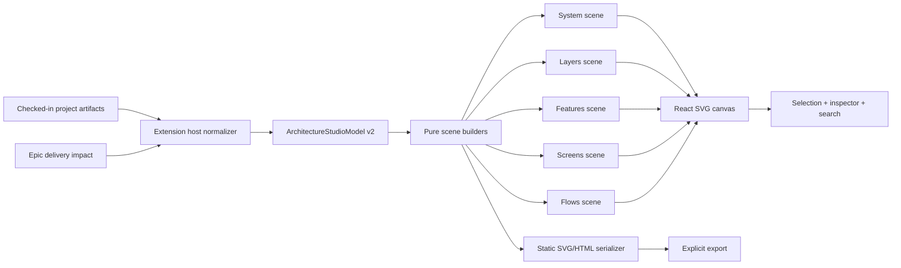

# Architecture Studio — kế hoạch thay thế hoàn toàn tab `Architecture`

> Trạng thái: Ready for implementation  
> Phạm vi: thay toàn bộ UI, renderer, interaction model và export của tab `Architecture`  
> Visual foundation: [`cathrynlavery/diagram-design`](https://github.com/cathrynlavery/diagram-design), pin tham chiếu ban đầu tại commit `648c2a597839301e06df1e7434a08bde9f42eed3`  
> Cập nhật 2026-08-23: Architecture Studio có agent riêng và source of truth độc lập tại
> `docs/project/architecture/ARCHITECTURE-STUDIO.json`. Mọi tham chiếu Epic/data
> Project Context cũ trong plan ban đầu được thay thế bởi boundary này.

## 1. Quyết định

Thay `ArchitectureExplorer` hiện tại bằng một product surface mới tên nội bộ là
**Architecture Studio**. Navigation bên ngoài vẫn dùng nhãn `Architecture` để
không phá mental model của người dùng.

Tab mới sẽ:

- bỏ hoàn toàn UI bốn nút hiện tại, Mermaid canvas và Archify preview;
- dùng visual grammar của `diagram-design` cho mọi diagram;
- render deterministic, offline và CSP-safe ngay trong extension;
- giữ khả năng đọc architecture từ repo, drill-down và evidence;
- có một nút chạy Architecture Agent để tạo manifest riêng, không dùng dữ liệu Epic;
- hỗ trợ inspect, search, filter, export và accessibility như một công cụ sản
  phẩm, không chỉ là một ảnh sơ đồ.

Không nhúng trực tiếp plugin/skill vào runtime. `diagram-design` là một skill tạo
HTML/SVG bằng agent, không phải JavaScript rendering library có API ổn định.
AIDLC sẽ triển khai một renderer typed, deterministic theo design grammar của
repo này và ghi attribution theo MIT license.

## 2. Kết quả sản phẩm mong muốn

Người dùng mở tab và trả lời được bốn câu hỏi mà không rời workspace:

1. Hệ thống gồm những vùng và thành phần nào?
2. Một feature/screen nằm ở đâu và liên quan tới những gì?
3. Code path, UI surface và dependency của một thay đổi chạy qua đâu?
4. Sơ đồ dựa trên evidence nào, còn thiếu hoặc stale ở đâu?

Definition of success ở cấp sản phẩm:

- overview đọc được trong 5 giây ở viewport laptop thông thường;
- một node bất kỳ đi tới file/evidence hoặc flow liên quan trong tối đa 2 thao tác;
- không cần bấm “Render verified overview” trước khi thấy diagram chất lượng cao;
- light/dark đều dùng cùng semantic hierarchy, không biến diagram thành rainbow;
- export tạo SVG/HTML độc lập, không có network request hoặc script tùy ý.

## 3. UX mới

### 3.1 Layout desktop

```text
┌──────────────────────────────────────────────────────────────────────────────┐
│ Architecture  /  System map      Search…        Filters   Export   ⋯       │
├──────────────────┬───────────────────────────────────────┬───────────────────┤
│ VIEWS            │                                       │ INSPECTOR         │
│ ● System map     │                                       │ Astro Origin      │
│   Layers         │       EDITORIAL SVG CANVAS            │ Backend · focal   │
│   Features       │                                       │                   │
│   Screens        │       zones · nodes · relations       │ Details           │
│   Flows          │                                       │ Relationships     │
│                  │                                       │ Evidence          │
│ OUTLINE          │                                       │ Delivery impact   │
│ ▾ Web            │                                       │                   │
│   Cloudflare     │                                       │ Open source ↗     │
│   Astro Origin   │                                       │                   │
├──────────────────┴───────────────────────────────────────┴───────────────────┤
│ Fresh · revision 7       8 nodes · 9 relations       −  100%  +  Fit         │
└──────────────────────────────────────────────────────────────────────────────┘
```

Kích thước mặc định:

- navigator trái: `224px`, có thể collapse;
- inspector phải: `320px`, có thể collapse;
- canvas chiếm phần còn lại, tối thiểu `520px`;
- toolbar và status bar cố định, chỉ canvas pan/zoom;
- ở width `< 1100px`, inspector thành drawer;
- ở width `< 760px`, cả navigator và inspector thành drawer, canvas full width.

### 3.2 Năm view chính

| View | Visual grammar | Nội dung | Quy tắc density |
|---|---|---|---|
| `System map` | Architecture | Component, integration, store, external system, trust boundary | 5–9 node; cluster phần phụ |
| `Layers` | Layer stack + nested zones | Presentation/domain/data/infrastructure và dependency giữa layer | 3–8 layer |
| `Features` | Dependency graph/tree | Area → feature → entrypoint, phủ delivery impact | 7–12 node mỗi focus |
| `Screens` | Nested/user journey | Tab/flow → screen → sheet/action và navigation transition | một area mỗi lần |
| `Flows` | Data flow/sequence | Code flow và surfaces của feature được chọn | 5–10 bước |

View là các perspective của cùng một model, không phải năm loại artifact riêng.
Selection được giữ khi chuyển view nếu cùng entity còn tồn tại.

### 3.3 Interaction model

- Click node: select và mở inspector.
- Double click hoặc `Enter`: drill down tới view phù hợp nhất.
- Click edge: xem direction, label, confidence và evidence.
- `Open source`: gọi host mở đúng file/symbol; không dùng URL giả trong SVG.
- Search theo node, feature, screen, file và symbol; kết quả làm mờ phần không match.
- Filter theo `kind`, layer, delivery status và confidence.
- Pan bằng drag; zoom bằng `Ctrl/Cmd + wheel`; `F` fit diagram; `0` reset.
- `1..5` chuyển view; `/` focus search; `Esc` clear selection/drawer.
- Navigator là semantic outline thay thế cho việc buộc screen reader duyệt SVG.
- View state gồm selected view/entity, zoom, pan, filter và collapsed zones được
  persist qua `acquireVsCodeApi().setState()`; không ghi vào artifact dự án.

### 3.4 Inspector

Inspector có bốn section, không dùng tab lồng sâu:

1. `Details`: role, kind, layer, summary, file/symbol.
2. `Relationships`: inbound/outbound, label, protocol và direction.
3. `Evidence`: path, confidence, revision, open-source action.
4. `Generation`: manifest revision, thời gian tạo và trạng thái Architecture Agent.

Delivery status được biểu diễn bằng badge/icon/text (`+`, `~`, `−`, `✓`), không
tô toàn bộ node bằng xanh/vàng/đỏ. Accent chỉ dành cho 1–2 focal node.

### 3.5 Trạng thái hệ thống

- `loading`: skeleton cho navigator/inspector, canvas giữ tỷ lệ ổn định;
- `ready`: hiển thị diagram ngay, không cần bước render thủ công;
- `empty`: giải thích artifact còn thiếu và action mở workflow Project Context;
- `partial`: diagram vẫn dùng được, có data-quality receipt trong status bar;
- `stale`: banner nhỏ với source revision/mtime và action refresh;
- `error`: giữ outline/evidence đọc được nếu renderer thất bại.

## 4. Visual system

### 4.1 Semantic tokens

UI chrome tiếp tục hòa vào VS Code theme. Canvas dùng palette ổn định, lấy cảm
hứng từ `diagram-design` nhưng dùng AIDLC green làm focal accent.

| Token | Light | Dark | Vai trò |
|---|---|---|---|
| `paper` | `#f6f7f3` | `#171c19` | canvas background |
| `paper-2` | `#ecefe8` | `#202722` | secondary surface/store |
| `ink` | `#19231d` | `#f2f5f2` | text/stroke chính |
| `muted` | `#53645a` | `#b3c0b7` | relation/secondary text |
| `soft` | `#7b8980` | `#849189` | tag/boundary |
| `rule` | `rgba(25,35,29,.14)` | `rgba(242,245,242,.14)` | hairline |
| `accent` | `#16a36a` | `#4ade80` | 1–2 focal node |
| `accent-tint` | `rgba(22,163,106,.09)` | `rgba(74,222,128,.11)` | focal fill |
| `link` | `#2e64a8` | `#78a8e8` | HTTP/external relation |

Không gọi Google Fonts. Font phải được self-host trong VSIX với license đi kèm
hoặc dùng fallback offline. Mục tiêu là:

- title/editorial aside: `Instrument Serif`;
- node name/UI: `Geist`;
- protocol/path/tag: `Geist Mono`;
- fallback: system serif/sans/monospace tương ứng.

### 4.2 Diagram grammar

- grid cơ sở `4px`, mọi tọa độ và kích thước được snap vào grid;
- primary flow giữ một hướng nhất quán trong từng view;
- connector off-axis luôn orthogonal với corner radius `8px`;
- node trên/dưới dùng top/bottom port; node trái/phải dùng side port;
- crossing thứ cấp có bridge/hop; không bridge cả hai cạnh;
- zone chỉ dùng cho tier/trust boundary thật, tối đa 3 zone trong System map;
- edge được vẽ trước node; legend nằm ngoài vùng diagram chính;
- node có tối đa 3 tầng text: tag, name, sublabel;
- label dài dùng deterministic wrap/ellipsis và hiển thị đầy đủ trong inspector;
- static là mặc định; phase đầu không có autoplay/motion.

### 4.3 Component treatment

| Role | Treatment |
|---|---|
| focal | `accent-tint` + `accent` stroke |
| backend | `paper` + `ink` stroke |
| store | `paper-2` + `muted` stroke |
| external | muted fill + 30% ink stroke |
| input/user | 10% muted fill + soft stroke |
| async/optional | dashed `4,3` |
| security/boundary | accent 5% fill + dashed accent stroke |

## 5. Kiến trúc kỹ thuật đích



### 5.1 Nguyên tắc boundary

- Extension host đọc file và kiểm tra containment như hiện tại.
- Webview chỉ nhận typed, curated model; raw AST database không đi xuống webview.
- Layout và scene building là pure functions để test không cần DOM.
- React dựng SVG element trực tiếp; không dùng `dangerouslySetInnerHTML`.
- Export serializer dùng cùng `DiagramScene`, tránh một renderer thứ hai có layout
  khác với canvas.
- Không chạy agent hoặc Python trong đường render tương tác.
- `diagram-design` upstream chỉ là reference/design dependency, không là runtime
  dependency và không tự update trong bản phát hành.

### 5.2 Model mới

```ts
interface ArchitectureStudioModel {
  schemaVersion: 1;
  revision?: number;
  generatedAt?: string;
  sourcePaths: string[];
  freshness: 'fresh' | 'stale' | 'unknown';
  quality: {
    status: 'complete' | 'partial';
    warnings: string[];
  };
  nodes: ArchitectureEntity[];
  edges: ArchitectureRelation[];
  features: ArchitectureFeature[];
  screens: ArchitectureScreen[];
  flows: Record<string, ArchitectureFlow>;
}

interface ArchitectureEntity {
  id: string;
  label: string;
  kind?: string;
  role?: string;
  layer?: string;
  summary?: string;
  file?: string;
  symbol?: string;
  confidence?: number;
  evidence: string[];
}

interface ArchitectureRelation {
  id: string;
  source: string;
  target: string;
  label?: string;
  protocol?: string;
  role?: 'main' | 'branch' | 'async' | 'return' | 'error';
  confidence?: number;
  evidence: string[];
}
```

Normalizer phải giữ lại metadata hiện đang bị rơi khi
`architectureGraphFromJson()` chỉ trả `id/label/kind` và `source/target`.

### 5.3 Scene model

```ts
interface DiagramScene {
  id: string;
  title: string;
  description: string;
  viewBox: [number, number];
  zones: SceneZone[];
  edges: SceneEdge[];
  nodes: SceneNode[];
  legend: LegendEntry[];
  receipt: LayoutReceipt;
}
```

`LayoutReceipt` ghi rõ node nào được cluster, label nào bị rút gọn, relation nào
được giữ ở technical outline nhưng không vẽ trong focus scene. Không được silently
drop dữ liệu.

### 5.4 Artifact policy

Canonical source là một manifest do Architecture Agent sở hữu:

- `docs/project/architecture/ARCHITECTURE-STUDIO.json`.

Agent không được đọc/ghi `docs/epics/**` hoặc `.aidlc/runs/**`. System, layers,
features, screens và flows đều nằm trong manifest này.

Runtime diagram được tạo trong memory, không tự ghi file. Chỉ action `Export`
mới tạo:

- `ARCHITECTURE-SNAPSHOT.svg`; hoặc
- `ARCHITECTURE-SNAPSHOT.html` cho bản editorial có summary/receipt.

Output phải self-contained, script-free, không remote asset. PNG là phase sau và
chỉ bật khi có rasterizer đã được package/kiểm soát; không thêm Playwright vào
runtime extension chỉ để export PNG.

## 6. Kế hoạch triển khai

### Phase 0 — Freeze contract và fixtures

Mục tiêu: khóa behavior cần giữ trước khi thay UI.

- Tạo fixture nhỏ, vừa và dense cho đủ năm view.
- Fixture phải có edge label, confidence, evidence, file/symbol và standalone flows.
- Chụp baseline của UI cũ chỉ để đối chiếu chức năng, không dùng làm visual target.
- Ghi ADR: “`diagram-design` là design reference, AIDLC owns deterministic renderer”.
- Ghi attribution và upstream commit trong `THIRD_PARTY_NOTICES.md` hoặc file
  tương đương của extension.

Exit gate:

- fixture biểu diễn đủ dữ liệu hiện có;
- không còn câu hỏi về source of truth hoặc quyền sở hữu renderer.

### Phase 1 — Typed model và host reader

Mục tiêu: tách data contract khỏi `workspaceWebview.ts`.

- Tạo `ArchitectureStudioModel` và normalizer riêng.
- Preserve `role/layer/file/symbol/label/confidence/evidence/protocol`.
- Parse toàn bộ perspective từ manifest riêng; không merge state từ Epic.
- Tính freshness từ manifest/revision/mtime.
- Trả explicit partial-data receipt thay vì silently coi file lỗi là empty.
- Viết unit test cho malformed JSON, duplicate id, dangling edge, cycle và path.

Exit gate:

- webview state không còn chứa Mermaid source hoặc Archify base64/path;
- toàn bộ fixture normalize deterministic.

### Phase 2 — Renderer primitives và deterministic layout

Mục tiêu: có scene builder thuần, chưa cần UI hoàn chỉnh.

- Implement token/theme resolver.
- Implement text measurement/wrap với bundled font metrics hoặc deterministic
  approximation có test.
- Implement zone, node, tag, legend, arrow marker và accessible metadata.
- Implement orthogonal router, port selection, bridge/hop và label placement.
- Implement stable layout: sort theo semantic rank rồi stable id; cấm force-directed
  random layout.
- Implement node budget, clustering và `LayoutReceipt`.
- Viết geometry tests cho overlap, edge-through-node, clipped label và viewBox.

Exit gate:

- cùng input/theme luôn tạo cùng scene JSON;
- zero node overlap và zero off-axis diagonal connector trong fixture chuẩn.

### Phase 3 — Architecture Studio shell + System map

Mục tiêu: tab mới chạy end-to-end với view đầu tiên.

- Thay component root bằng three-pane shell.
- Implement toolbar, navigator, canvas, inspector và status bar.
- Implement System map theo Architecture grammar.
- Implement pan/zoom/fit, selection, keyboard và responsive drawers.
- Implement ready/loading/empty/partial/stale/error states.
- Inspector mở file/evidence qua host message có containment check.

Exit gate:

- System map dùng được không cần Archify/Mermaid;
- keyboard và mouse đều inspect/open được node;
- không có remote request trong webview.

### Phase 4 — Layers, Features, Screens và Flows

Mục tiêu: thay đủ chức năng của tab cũ và mở rộng thành năm perspective.

- `Layers`: layer stack + dependency spine.
- `Features`: area/parent/feature/entrypoint từ manifest độc lập.
- `Screens`: hub map và một navigation slice mỗi area.
- `Flows`: chuyển giữa code flow/surface flow trong cùng inspector context.
- Cross-view navigation giữ selection và breadcrumb.
- Search/filter hoạt động trên toàn model, không chỉ scene đang visible.

Exit gate:

- mọi chức năng Overview/Code tree/Screen tree/Feature flow cũ có đường tương
  đương hoặc tốt hơn;
- dense fixture vẫn có focus scene đọc được và receipt không drop im lặng.

### Phase 5 — Export, accessibility và polish

Mục tiêu: artifact production-ready.

- Export SVG tối giản và full-editorial HTML.
- Prefix mọi SVG id để nhiều diagram có thể inline cùng trang.
- `<svg role="img">` có `<title>` và `<desc>`; decorative icon `aria-hidden`.
- Outline, search, buttons và inspector đạt keyboard/focus order hợp lý.
- `prefers-reduced-motion` là complete static state; phase đầu không autoplay.
- Add local font assets + license hoặc chốt system fallback trước release.
- Thêm full-editorial summary cards: headline, key relationships, data-quality
  receipt; không đưa cards vào canvas tương tác.

Exit gate:

- SVG/HTML mở offline, không script/network request;
- axe/manual keyboard pass; screen reader đọc được title, outline và selection.

### Phase 6 — Cutover và xóa legacy

Mục tiêu: thay thế hoàn toàn, không ship hai renderer.

- Xóa `ArchitectureExplorer.tsx` sau khi `ArchitectureStudio` được nối vào shell.
- Xóa `packages/extension/src/v2/archifyOverview.ts` và test tương ứng.
- Xóa `vendor/archify/` và bản copy packaging nếu có.
- Xóa `copy:archify` khỏi `compile`/`package` scripts.
- Xóa message `renderArchifyOverview`.
- Xóa `archifyOverviewPath` và `archifyOverviewSvgBase64` khỏi state/types.
- Xóa handling `ARCHIFY-OVERVIEW.json/html`; file cũ trong project được ignore,
  không tự động delete dữ liệu người dùng.
- Bỏ import Mermaid khỏi tab Architecture. Giữ dependency `mermaid` vì
  `EpicVisuals.tsx` vẫn đang dùng nó.
- Giữ các entry lịch sử trong `CHANGELOG.md`; chỉ thêm release note thay thế.

Exit gate:

- `rg -n "Archify|archify|ARCHIFY"` chỉ còn historical changelog/migration note;
- không còn file runtime/package dependency Archify;
- tab Architecture không import hoặc render Mermaid.

### Phase 7 — Verification và release

Mục tiêu: chứng minh parity, chất lượng và package integrity.

- Unit: normalizer, scene builder, router, clustering, serializer.
- Component: selection, cross-view navigation, search/filter, empty/error states.
- Visual regression: light/dark tại `1440×900`, `1024×768`, `760×800`.
- Stress: 100/500 entity model, label Unicode/Vietnamese dài, cycle/dangling edge.
- Security: malicious label, SVG/XML escaping, path traversal, oversized export.
- Package VSIX sạch; xác nhận không còn `vendor/archify` và font/license có mặt.
- Manual smoke trong VS Code thực, không chỉ harness.

Exit gate:

- `pnpm --filter @aidlc/core test` pass;
- `pnpm --filter aidlc-o00ontcong test` pass;
- `pnpm --filter aidlc-o00ontcong typecheck` pass;
- VSIX install smoke pass và tab hoạt động offline.

## 7. File impact dự kiến

### Thêm

```text
packages/core/src/project/architectureStudio/
├── model.ts
├── normalize.ts
├── scene.ts
├── layout/
│   ├── architecture.ts
│   ├── layers.ts
│   ├── features.ts
│   ├── screens.ts
│   ├── flows.ts
│   └── orthogonalRouter.ts
├── serializeSvg.ts
└── tokens.ts

packages/extension/src/webview/components/architecture/
├── ArchitectureStudio.tsx
├── ArchitectureToolbar.tsx
├── ArchitectureNavigator.tsx
├── ArchitectureCanvas.tsx
├── ArchitectureInspector.tsx
├── ArchitectureStatusBar.tsx
└── ArchitectureEmptyState.tsx

packages/extension/src/v2/architectureStudioState.ts
packages/extension/media/fonts/*
packages/core/test/architecture-studio-*.test.ts
packages/extension/test/architectureStudio*.test.tsx
```

Tên/thư mục có thể được điều chỉnh theo conventions hiện hữu, nhưng boundary
`core model/layout` ↔ `extension host` ↔ `webview UI` phải được giữ.

### Sửa

- `packages/core/src/project/architectureGraphs.ts`: chuyển compatibility reader
  sang normalizer mới hoặc giữ wrapper deprecated trong một release.
- `packages/extension/src/v2/workspaceWebview.ts`: dùng state builder mới, thêm
  refresh/export/open-evidence messages, bỏ Archify handling.
- `packages/extension/src/webview/lib/types.ts`: thay `ArchitectureExplorerState`
  bằng `ArchitectureStudioState`.
- `packages/extension/src/webview/components/WorkspaceShell.tsx`: mount tab mới.
- `packages/extension/src/webview/styles.css`: architecture layout/tokens/focus.
- `packages/extension/harness/state.ts`: fixtures mới.
- `packages/extension/package.json`: packaging font/notice, bỏ `copy:archify`.
- `packages/extension/CHANGELOG.md`: migration/release note.

### Xóa ở cutover

- `packages/extension/src/webview/components/ArchitectureExplorer.tsx`;
- `packages/extension/src/v2/archifyOverview.ts`;
- `packages/extension/test/archifyOverview.test.ts`;
- `vendor/archify/`;
- generated package copy của `vendor/archify/`.

## 8. Acceptance criteria

### Functional

- Năm view render từ cùng model và chuyển view không mất selection hợp lệ.
- Node/edge inspector hiển thị đúng source/evidence từ standalone manifest.
- Một nút chạy Architecture Agent và manifest được refresh tự động khi agent ghi xong.
- Search/filter, pan/zoom/fit, responsive drawer và export hoạt động.
- Empty/partial/stale/error state có action phục hồi rõ ràng.
- Không cần action render trung gian.

### Visual

- Một scene chỉ có 1–2 focal node.
- Connector off-axis là orthogonal; không edge xuyên node trong fixture chuẩn.
- Không label bị clip; truncation luôn có full value trong inspector.
- Light/dark giữ hierarchy tương đương và đạt contrast WCAG AA cho text.
- Status không lấn át architecture hierarchy bằng màu nền toàn node.

### Technical

- Renderer deterministic và pure ở lớp scene/layout.
- Không `dangerouslySetInnerHTML` cho diagram runtime.
- Không network request, remote font, arbitrary script hoặc agent execution khi mở tab.
- Raw AST database không đi xuống webview.
- Không còn Archify runtime/package coupling.
- Diagram Architecture không còn phụ thuộc Mermaid.

### Accessibility

- Full keyboard navigation cho toolbar, outline, canvas selection và inspector.
- SVG có accessible name/description; decorative content bị ẩn.
- Focus visible ở cả light/dark.
- Reduced-motion luôn cho complete static state.

## 9. Rủi ro và mitigation

| Rủi ro | Mức | Mitigation |
|---|---:|---|
| `diagram-design` không có renderer API | Cao | AIDLC sở hữu typed deterministic renderer; upstream chỉ là pinned design reference |
| Graph thật vượt density 4/10 | Cao | focus scene, clustering, navigator outline và explicit layout receipt |
| Mất metadata khi normalize | Cao | model v2 giữ evidence/label/protocol/confidence; contract tests trước UI |
| Font remote bị CSP/offline chặn | Trung bình | self-host WOFF2 + license hoặc deterministic system fallback |
| Layout khác giữa webview và export | Cao | cùng `DiagramScene` và token resolver cho React SVG/serializer |
| Xóa Archify làm mất artifact cũ | Trung bình | không tự delete file trong user project; chỉ ngừng đọc và ghi migration note |
| Visual regression khác OS | Trung bình | bundle font, fixed metrics, screenshot CI trên một canonical platform |
| Dense scene chậm | Trung bình | scene budget, memoization, không force simulation, stress test 500 entity |
| Upstream thay đổi visual rules | Thấp | pin commit; nâng version bằng review/ADR, không auto-sync |

## 10. Rollout và rollback

Trong development có thể dùng flag nội bộ `architectureStudioV2` để so sánh hai
implementation. Flag này không được ship trong release final.

Cutover chỉ diễn ra sau Phase 5. Rollback release-level là revert commit cutover;
canonical JSON/MMD không đổi nên không cần data migration ngược. Các file
`ARCHIFY-OVERVIEW.*` cũ vẫn nằm nguyên trong project người dùng và có thể mở thủ
công, nhưng tab mới không đọc chúng.

## 11. Ước lượng

| Phase | Effort dự kiến |
|---|---:|
| 0. Contract/fixtures/ADR | 1–2 engineer-days |
| 1. Model + host reader | 2–3 |
| 2. Layout/renderer primitives | 4–5 |
| 3. Studio shell + System map | 3–4 |
| 4. Bốn view còn lại | 4–6 |
| 5. Export/accessibility/polish | 2–3 |
| 6. Cutover/cleanup | 1–2 |
| 7. Verification/release | 2–3 |

Tổng: khoảng **19–28 engineer-days**, tùy độ phức tạp của dense graph và mức
pixel fidelity yêu cầu cho export.

## 12. Definition of done cuối cùng

- Tab `Architecture` mới là implementation duy nhất được ship.
- UI, renderer, interaction và export đều không còn dấu vết runtime của Archify.
- Mọi perspective dùng visual language thống nhất dựa trên `diagram-design`.
- Dữ liệu repo/evidence được bảo toàn; không có dependency đọc dữ liệu Epic.
- Package hoạt động offline, CSP-safe, accessible và deterministic.
- Test, typecheck, VSIX package và manual smoke đều pass.
