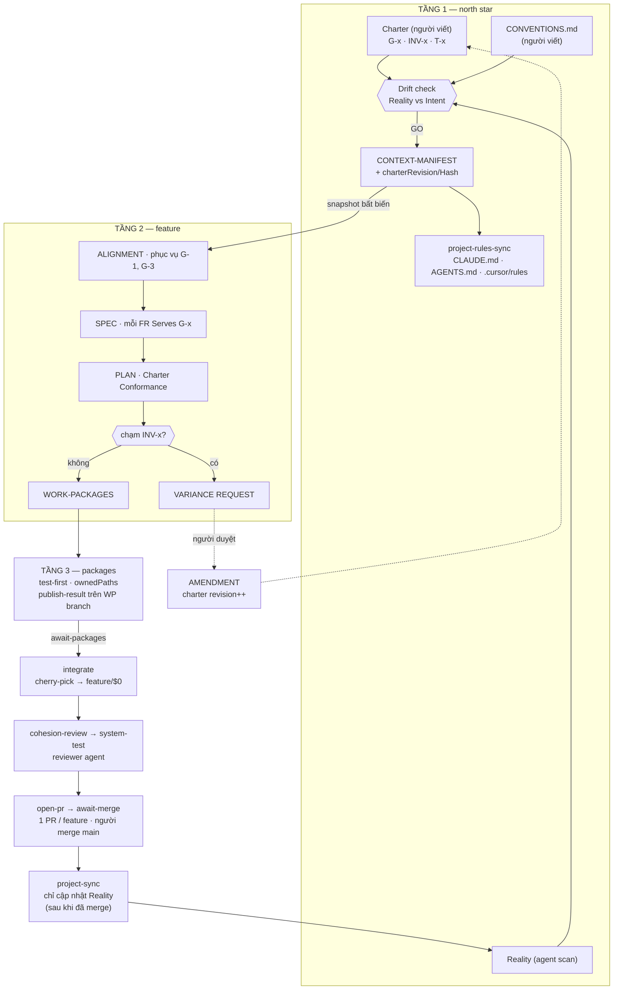

# Cohesive Delivery — Kiến trúc Charter (north star) và kỷ luật thực thi

Bản thiết kế hợp nhất cho Cohesive Delivery. Thay thế cách tiếp cận "Thinking Board đặt ở
cấp epic" trong nhánh `feat/custom`.

- **Tài liệu này**: *nên xây thế nào và tại sao* — kiến trúc + playbook Bước 0–4. Là mốc
  thống nhất trước khi code.
- [`COHESIVE_DELIVERY_UI_GUIDE.md`](COHESIVE_DELIVERY_UI_GUIDE.md): *dùng trên UI thế nào* (cập nhật sau khi triển khai).
- [`COHESIVE_PIPELINES_TODO.md`](COHESIVE_PIPELINES_TODO.md): trạng thái triển khai.

Trạng thái: **đề xuất, chưa triển khai.** Ngày: 2026-08-07.

---

## 1. Vấn đề

Cohesive Delivery hiện có ba tầng pipeline: `project-context` → `cohesive-feature` →
`cohesive-work-package`. Tầng 1 đáng lẽ là điểm neo chung của cả project, nhưng thực tế
nó không giữ được vai trò đó.

### 1.1 Tầng 1 không chứa ý chí con người

Pipeline `project-context` là `scan-project → model-project → review-context →
publish-context` — toàn bộ mang tính **mô tả**: agent đọc repo rồi viết lại "code đang
như thế nào". Không có artifact nào nói "chúng ta muốn đi đâu" và "cái gì tuyệt đối
không được phá".

Vì tầng 1 không có chỗ cho intent, intent bị đẩy xuống tầng 2 (mỗi epic tự khai
`GOALS.md` / `ARCHITECTURE.md` / `TECH.md`). Hệ quả:

| Triệu chứng | Hệ quả |
|---|---|
| Mỗi epic tự khai constraints kiến trúc | N epic = N kiến trúc, không có trọng tài |
| `project-sync` chép kết quả feature ngược lên tầng 1 | Drift được **hợp thức hoá** thay vì bị chặn |
| Không có ID nối Goal → Requirement → Task → Package | Package pass mọi gate mà không phục vụ mục tiêu nào |

Vòng lặp cuối cùng là thứ huỷ hoại north star: feature phá kiến trúc xong, tầng 1 tự sửa
mình cho khớp.

### 1.2 Kỷ luật thực thi còn hở

Ngoài vấn đề quản trị ý định ở trên, bốn điểm sau chưa đạt:

1. **Human duyệt lời tự khai, không duyệt diff.** `implement-package` có
   `humanReview: true` nhưng artifact là `PACKAGE-SUMMARY.md` — bản tường thuật của agent
   về chính nó. Extension chưa có diff viewer.
2. **Self-review.** `cohesion-review` do cùng họ agent đã viết code thực hiện. Không có
   agent thứ ba chỉ-đọc.
3. **Test sau code.** Thứ tự tầng 3 là `implement-package` → `package-test`. Không có
   bước viết test đỏ trước.
4. **Charter vô hình với agent ngoài pipeline.** Nếu mở Cursor hoặc chạy `claude` tay
   trong repo, agent đó không biết invariant nào tồn tại. Ràng buộc chỉ áp cho pipeline
   AIDLC, không áp cho repo — một lối đi vòng làm sụp toàn bộ luật kế thừa.
5. **Thiếu vòng Ship.** Pipeline dừng ở `publish-result` / `project-sync`. Không có kỷ luật
   tường minh: commit nhỏ → PR → review (người + AI hỗ trợ) → merge; agent không được
   merge thẳng `main`.
6. **Bootstrap dự án chưa đủ rõ.** Rule files và Reality docs có, nhưng chưa map rõ chỗ
   chứa conventions / cách chạy test / style guide cho lần setup đầu.

### 1.3 Thứ đã có sẵn, nên tận dụng

[`StandardProfile.ts`](packages/core/src/profiles/StandardProfile.ts) đã có
`resolveStandard` với precedence **epic > workspace > default**. Đó chính là cơ chế
kế thừa cần dùng — Charter xây **trên** nó, không dựng song song.

---

## 2. Bốn luật kiến trúc

| # | Luật | Nội dung |
|---|---|---|
| **L1** | Intent sống ở tầng 1 | North star do người viết, agent chỉ đọc. Tầng 2/3 **kế thừa**, không sáng tác. |
| **L2** | Chỉ được thu hẹp | Feature được phép khắt khe hơn project, **không bao giờ** nới lỏng. Muốn nới → amendment lên tầng 1. |
| **L3** | Không có gì mồ côi | Mọi requirement trỏ ≥1 Goal; mọi task trỏ requirement; mọi package trỏ task. Validator chặn orphan hai chiều. |
| **L4** | Tách Intent / Reality / Conformance | `project-sync` chỉ cập nhật **Reality**. Sửa **Intent** phải qua người. Drift phải hiện ra, không được im lặng khớp lại. |

**L4 là luật quan trọng nhất** — nó chính là thứ ngăn phần con phá phần chung.

---

## 2b. Playbook vận hành (khớp workflow khuyến nghị)

Kiến trúc trên map 1-1 sang playbook thực tế. Đây là lớp *làm thế nào từng ngày*;
§3–§11 là lớp *cưỡng chế bằng artifact + validator*.

### Nguyên tắc cốt lõi → chỗ cưỡng chế

| Nguyên tắc | Cơ chế trong Charter |
|---|---|
| Spec trước, code sau | Tầng 2 `SPEC → PLAN → TASKS` trước tầng 3; không có path nhảy thẳng implement |
| Chia nhỏ task + AC | `AC:` bắt buộc trên mỗi TASK; `deliveryBudget`; ownedPaths |
| Human-in-the-loop | Người sở hữu charter; approve SPEC/PLAN; duyệt **diff** (§8.A); VR/AMD |
| Context bền vững | Charter + `CONVENTIONS.md` + `project-rules-sync` → CLAUDE.md / AGENTS.md / `.cursor/rules` |
| Safety net | Worktree/feature branch; test → lint → typecheck fail-closed; reviewer riêng; **PR trước merge** (§8.I) |

### Bước 0 — Chuẩn bị dự án (một lần)

1. Người viết Charter (`NORTH-STAR` / `ARCHITECTURE-PRINCIPLES` / `TECH-POLICY`) +
   `docs/project/conventions/CONVENTIONS.md` (stack, pattern, chỗ không được đụng, lệnh
   test/lint/typecheck, style, quy ước commit/PR).
2. Chạy `project-context`: `define-charter` → scan → model → `check-drift` → review →
   publish → `project-rules-sync` (chiếu charter + tóm tắt conventions ra rule files).
3. Repo dùng Git từ đầu; nhánh mặc định bảo vệ (`shipPolicy.defaultBranch`); mọi package
   chạy trên feature branch / worktree (`prepare-worktree`).

### Bước 1 — Định nghĩa yêu cầu (Spec)

1. Start Epic: chọn Goals từ charter + WHAT/Scope + ràng buộc riêng (chỉ được hẹp hơn).
2. Agent đọc snapshot charter + codebase → sinh `ALIGNMENT` → `SPEC` (mỗi FR `Serves: G-x`).
3. **Người review & chỉnh SPEC** (clarify) — bước không được bỏ.
4. Agent sinh `PLAN` (+ Charter Conformance) → `TASKS` (mỗi task `Implements: FR-x` + `AC:`).
5. Người approve plan trước khi tách work packages.

Công cụ ngoài pipeline (Cursor Plan mode, Claude Code, Spec Kit) vẫn dùng được — miễn
artifact ghi đúng chỗ và pass validator; charter/rules áp cho mọi agent (§8.E).

### Bước 2 — Thực thi từng task nhỏ

Mỗi package = 1–vài task, trong `deliveryBudget`. Prompt chuẩn (§8.H):

> Implement TASK-x theo PLAN/TASKS. Chỉ sửa file trong `ownedPaths`. Viết test đỏ trước
> (`package-test-plan`), rồi code cho pass. Chạy quality gates. Không đụng `protectedPaths`
> / charter. Không merge `main`.

### Bước 3 — Verify & Review

1. Agent: test / lint / typecheck (fail-closed).
2. Người: xem **diff** trên Epic card — không chỉ nhìn “test pass”.
3. Reviewer agent (model khác, chỉ-đọc) chạy `package-review` / `cohesion-review`.
4. Không bao giờ để agent merge thẳng nhánh mặc định (§8.I).

### Bước 4 — Commit & Ship

1. Commit nhỏ trong worktree của package, message theo `CONVENTIONS.md`;
   `PACKAGE-RESULT.json` ghi commits + files. Package **không** tự mở PR.
2. Feature coordinator cherry-pick các package đã duyệt vào `feature/$0` (`integrate`,
   đã có sẵn) → `cohesion-review` → `system-test`.
3. Sau khi pass, mở **đúng 1 PR cho cả feature** (`feature/$0 → defaultBranch`) → CI
   gates → người review (AI review hỗ trợ nếu `allowAiAssistReview`).
4. Chỉ người (hoặc bot merge đã cấu hình *sau* approve) được merge `main`.
5. Nếu đổi kiến trúc/ý định: amendment lên charter (người duyệt) → bump revision →
   `project-rules-sync` lại; **không** để `project-sync` tự sửa Intent. Spec/PLAN của epic
   đang chạy đánh dấu stale nếu cần recapture.

---

## 3. Cấu trúc artifact

### 3.1 Tầng 1 — north star

```
docs/project/
├── charter/                        ← INTENT · người sở hữu
│   ├── NORTH-STAR.md               G-1..G-n: goal, metric, non-goals
│   ├── ARCHITECTURE-PRINCIPLES.md  INV-1..n: invariant, boundary, protected paths
│   ├── TECH-POLICY.md              T-1..n: must-use / forbidden / allowed
│   └── CHARTER.json                bản máy đọc được + revision + hash
├── context/                        ← REALITY · agent scan (giữ nguyên hiện có)
│   ├── PROJECT-SCAN.md · ARCHITECTURE-MAP.md · DOMAIN-MODEL.md
│   ├── SHARED-CONTRACTS.md · ENGINEERING-RULES.md
│   └── CONTEXT-MANIFEST.json       + charterRevision, charterHash
├── conventions/                    ← CÁCH LÀM · người sở hữu (Bước 0)
│   └── CONVENTIONS.md              style, pattern, chỗ không được đụng,
│                                   cách chạy test/lint/typecheck, commit/PR
└── conformance/
    ├── DRIFT-REPORT.md             Reality vs Intent, theo từng INV-x
    └── amendments/AMD-001.md       đề xuất sửa Charter — người duyệt
```

`ENGINEERING-RULES.md` (Reality) mô tả *repo đang làm gì*. `CONVENTIONS.md` (Intent vận
hành) mô tả *repo phải làm thế nào*. Khi lệch → hiện trên `DRIFT-REPORT.md`, không tự
đồng bộ. `project-rules-sync` chiếu tóm tắt conventions vào rule files cùng charter.

### 3.2 `CHARTER.json`

```jsonc
{
  "revision": 3,
  "hash": "sha256:…",              // hash của 3 file .md, khớp mới hợp lệ
  "goals": [
    { "id": "G-1", "title": "…", "metric": "…", "status": "active" }
  ],
  "nonGoals": ["…"],
  "invariants": [
    { "id": "INV-1", "rule": "…", "scope": ["packages/core/**"], "severity": "blocking" }
  ],
  "techRules": [
    { "id": "T-1", "kind": "forbidden", "value": "moment", "reason": "…" }
  ],
  "protectedPaths": ["packages/core/src/schema/**"],
  "deliveryBudget": { "maxFilesPerPackage": 12, "maxTasksPerPackage": 6 },
  "requiredQualityGates": ["test", "lint", "typecheck"],
  "shipPolicy": {
    "requirePullRequest": true,
    "forbidAgentMergeToDefaultBranch": true,
    "defaultBranch": "main",
    "allowAiAssistReview": true          // Bugbot / CodeRabbit hỗ trợ, không thay người
  }
}
```

`requiredQualityGates` chỉ liệt kê **tên gate**; lệnh cụ thể lấy từ workspace config /
`CONVENTIONS.md`. Charter quy định *phải có gate nào*, workspace quy định *chạy bằng
lệnh gì*. `shipPolicy` là safety net **cấp feature** (sau `system-test`): feature agent
mở đúng 1 PR `feature/$0 → defaultBranch`; package agent không mở PR; **không ai** trong
pipeline được merge nhánh mặc định.

### 3.3 Tầng 2 — feature

Bỏ `GOALS.md` / `ARCHITECTURE.md` / `TECH.md` ở cấp epic. Thay bằng:

```
docs/epics/<epic>/artifacts/
├── ALIGNMENT.md                    feature phục vụ G-1, G-3 + đóng góp cụ thể
│                                   + ràng buộc riêng (chỉ được HẸP hơn charter)
├── PROJECT-CONTEXT-SNAPSHOT.md     + charterRevision / charterHash đã chốt
├── SPEC.md                         mỗi FR-x có `Serves: G-x`
├── PLAN.md                         + `## Charter Conformance`: bảng INV-x → tuân thủ bằng cách nào
├── TASKS.md                        mỗi TASK-x có `Implements: FR-x` + `AC:` riêng
├── variance-requests/VR-001.md     khi buộc phải chạm invariant
└── … (phần delivery giữ nguyên)
```

Điểm mấu chốt: tầng 2 **khai báo mình phục vụ mục tiêu nào**, không **định nghĩa mục tiêu**.

---

## 4. Chuỗi truy vết

```
G-x  (CHARTER.json)
 └── FR-x   (SPEC.md          · "Serves: G-1, G-3")
      └── TASK-x  (TASKS.md   · "Implements: FR-2" + "AC: …")
           └── WP-x  (WORK-PACKAGES.json · tasks[], serves[] suy ra từ task)
                └── commit  (PACKAGE-RESULT.json · tasks[], commits[], filesChanged[]
                             trên branch feature/$0-WP-x, KHÔNG tự merge)
                     └── cherry-pick vào feature/$0  (INTEGRATION-SUMMARY.md · do
                          feature coordinator thực hiện theo dependency order)
                          └── PR  (PR-LINK.md · feature/$0 → defaultBranch · 1 PR /
                               feature, mở sau cohesion-review + system-test pass)
```

Ship là hoạt động **cấp feature**, không phải cấp package — xem sửa ở §7/§8.I.

Validator kiểm **hai chiều**:

- *Xuôi*: mọi `G-x` mà `ALIGNMENT.md` tuyên bố phục vụ phải có ≥1 `FR-x` thực hiện.
- *Ngược*: mọi `FR-x` phải trỏ về ≥1 `G-x` hợp lệ. Không có FR mồ côi.

Cùng nguyên tắc áp cho FR→TASK, TASK→WP, và WP→commit→cherry-pick→PR.

---

## 5. Ma trận quyền ghi

Đây là cơ chế thực sự bảo vệ north star.

| Artifact | Người | Feature agent | Package agent | Reviewer agent |
|---|---|---|---|---|
| `charter/*` | ✅ ghi | ❌ đọc | ❌ đọc | ❌ đọc |
| `conventions/*` | ✅ ghi | ❌ đọc | ❌ đọc | ❌ đọc |
| `conformance/amendments/*` | ✅ **duyệt** | ✅ đề xuất | ❌ | ❌ |
| `context/*` (Reality) | review | ✅ qua `project-sync` | ❌ | ❌ |
| `ALIGNMENT / SPEC / PLAN / TASKS` | approve | ✅ ghi | ❌ đọc | ❌ đọc |
| code + test (trên `feature/$0-WP-x`) | review diff | ❌ | ✅ ghi | ❌ đọc |
| cherry-pick vào `feature/$0` (`integrate`) | approve | ✅ ghi | ❌ | ❌ đọc |
| `PR-LINK.md` / mở PR (`feature/$0` → default) | approve merge | ✅ mở PR | ❌ | ❌ đọc |
| merge `defaultBranch` | ✅ only | ❌ | ❌ | ❌ |
| báo cáo review | approve | ❌ | ❌ | ✅ ghi |

**Đường duy nhất chạm vào north star là qua chữ ký người.** Không có cửa sau cho agent.
**Đường duy nhất vào `main` là người (hoặc merge queue sau approve) — agent không merge.**

---

## 6. Luồng tổng thể



Đường nét đứt là **van an toàn**: khi một feature thực sự cần phá invariant, nó không
được tự phá — phải leo lên tầng 1, người quyết, charter bump revision, và **mọi epic khác
đang chạy bị đánh dấu `stale charter`** buộc phải recapture. Kiến trúc thay đổi có ý thức,
không bị bào mòn. Package không ship; feature agent dừng ở PR; người (hoặc merge queue sau
approve) mới đưa vào nhánh mặc định.

---

## 7. Thứ tự phase

```
TẦNG 1  define-charter (human)          ← mới
        → scan-project → model-project
        → check-drift                    ← mới
        → review-context (human) → publish-context
        → project-rules-sync             ← mới (§8.E)

TẦNG 2  capture-context → specify → clarify (human) → plan (human)
        → tasks-package → analyze-contract → await-packages
        → integrate → integration-context
        → cohesion-review        [reviewer-agent]     ← đổi chủ (§8.B)
        → system-test            [fail-closed]        ← §8.G
        → open-pr / await-merge  [shipPolicy]         ← mới (§8.I), 1 lần/feature,
                                                          feature/$0 → defaultBranch
        → project-sync                                  chạy SAU merge (Reality
                                                          phản ánh code đã vào main)

TẦNG 3  load-package → prepare-worktree
        → package-test-plan (test đỏ)                 ← mới (§8.C)
        → implement-package (+ REVIEW-DIFF)           ← §8.A
        → package-test
        → package-review         [reviewer-agent]     ← mới (§8.B)
        → publish-result         [protected-path]     ← §8.F
        (không mở PR ở đây — package chỉ tồn tại trên branch feature/$0-WP-x;
         feature coordinator cherry-pick vào feature/$0 ở bước `integrate`)
```

---

## 8. Kỷ luật thực thi

Chín bổ sung biến kiến trúc quản trị ý định (§2–§7) + playbook (§2b) thành kiến trúc
thực thi được.

### A. Diff-first review gate

`implement-package` sinh thêm `REVIEW-DIFF.md`. Validator `diff-review.mjs` đối chiếu
`git diff --name-only` với `ownedPaths` của package — file nằm ngoài phạm vi thì reject.
Extension thêm diff pane trên Epic card để `humanReview` là duyệt **diff thật**, không
phải duyệt bản tường thuật.

### B. Reviewer persona độc lập

Thêm `cohesive-reviewer-agent`: **model khác** với implementer, capability chỉ đọc, không
được ghi code. Sở hữu `package-review` (tầng 3, mới) và `cohesion-review` (tầng 2, chuyển
chủ từ `cohesive-feature-agent`).

### C. Test-first

Chèn `package-test-plan` **trước** `implement-package`, với
`producesContains: ['## Failing Tests']`. `package-test` phải chứng minh commit test có
trước commit implementation.

### D. Budget cho task và package

`CHARTER.json.deliveryBudget` giới hạn `maxFilesPerPackage` và `maxTasksPerPackage`;
`work-packages.mjs` reject khi vượt. Mỗi task trong `TASKS.md` phải có `AC:` riêng — không
chỉ AC ở cấp spec — để task đủ nhỏ và review được.

### E. Charter projection ra rule files

Phase `project-rules-sync` ghi block có marker vào `CLAUDE.md`, `AGENTS.md`,
`.cursor/rules/aidlc-charter.mdc`:

```markdown
<!-- aidlc:charter start · revision 3 · sha256:… -->
…G-x, INV-x, T-x, protectedPaths ở dạng ngắn gọn…
…tóm tắt CONVENTIONS (lệnh test/lint, style, ship)…
<!-- aidlc:charter end -->
```

Ghi **một chiều** (charter + conventions → rule files). Validator so hash trong marker với
charter revision hiện tại; lệch = `stale rules`.

Đây là bổ sung then chốt: nó biến charter từ *tài liệu của pipeline* thành *luật của repo*,
áp cho mọi agent bất kể ai gọi — Cursor, Claude Code chạy tay, hay pipeline AIDLC.

### F. Protected paths

Khai trong `ARCHITECTURE-PRINCIPLES.md` và `CHARTER.json.protectedPaths`.
`package-result.mjs` reject nếu diff chạm mà không có variance đã duyệt.

### G. Quality gate fail-closed

`project-ci.mjs` hiện pass khi workspace chưa khai lệnh test/lint/typecheck — gate rỗng vẫn
xanh. Đổi thành reject khi thiếu gate nào trong `requiredQualityGates`. Lệnh cụ thể lấy từ
workspace config hoặc mục tương ứng trong `CONVENTIONS.md`.

### H. Prompt contract cho mỗi package

Skill `cohesive-work-package` / slash command `implement-package` nhúng prompt cứng
(không để agent tự diễn giải phạm vi):

```text
Implement the tasks listed in this package according to PLAN.md and TASKS.md.
- Only modify files in ownedPaths. Do not touch protectedPaths or docs/project/charter/**.
- Follow package-test-plan: failing tests first, then implementation until green.
- Run requiredQualityGates (test, lint, typecheck) before finishing.
- Produce REVIEW-DIFF.md summarizing the real git diff.
- Stay on feature/$FEATURE-WP-x. Do not open a PR. Do not merge defaultBranch.
  Ship (open-pr / await-merge) belongs to the feature coordinator after system-test.
- If you must violate an invariant: stop and file variance-requests/VR-xxx.md instead.
```

Validator `diff-review.mjs` + `package-result.mjs` là lưới an toàn khi agent bỏ qua prompt.

### I. Ship / PR gate (một lần mỗi feature, không AI merge main)

Ship là hoạt động **cấp feature**, đặt sau `system-test`, **không** đặt sau
`publish-result` ở cấp package. Package không bao giờ tự mở PR hay tự merge — nó chỉ
tồn tại trên `feature/$0-WP-x`; feature coordinator cherry-pick vào `feature/$0` ở
bước `integrate` (đã có sẵn trong `cohesive-feature-workflow.md`). Đặt ship ở cấp
package sẽ phá chính bước `integrate`: package A có thể merge vào `main` trước khi
package B — mà B lại phụ thuộc — được `cohesion-review` chấp thuận, để lại code chưa
qua đánh giá tính cố kết nằm trong nhánh mặc định.

Sau `system-test` pass, feature chưa "xong" cho đến khi thỏa `shipPolicy`:

| Luật | Cưỡng chế |
|---|---|
| Package không tự merge, chỉ cherry-pick bởi coordinator | `integrate` (đã có) là điểm merge duy nhất trước ship |
| Mở đúng 1 PR / feature, từ `feature/$0` | phase `open-pr` ghi `PR-LINK.md` (URL, base=defaultBranch, head=feature/$0) |
| Agent **không** merge nhánh mặc định | `forbidAgentMergeToDefaultBranch`; skill/reviewer cấm lệnh merge vào `main`/`master` ở cả 2 tầng |
| Người duyệt PR (AI review chỉ hỗ trợ) | `await-merge` = human gate; Bugbot/CodeRabbit optional qua `allowAiAssistReview` |
| `project-sync` chạy sau merge, không trước | Reality phải phản ánh code đã vào `main`, không phải code còn ở `feature/$0` |
| Đổi kiến trúc → amendment, không sửa ngầm | `project-sync` reject mọi diff vào `charter/**`; conventions đổi = người sửa `CONVENTIONS.md` rồi rules-sync |

Commit message: theo `CONVENTIONS.md` (khuyến nghị conventional commits / 1 ý / package).
Pipeline không bắt format message trừ khi workspace gắn hook — nhưng
`PACKAGE-RESULT.json` phải liệt kê đủ commits để truy vết TASK → commit → cherry-pick →
PR.

---

## 9. Bảng cưỡng chế

| Gate | Validator | Chặn cái gì |
|---|---|---|
| `define-charter` | `charter.mjs` (mới) | ID trùng; `hash` không khớp 3 file `.md`; goal không có metric; thiếu `CONVENTIONS.md` khi bootstrap |
| `check-drift` | `charter.mjs` | `DRIFT-REPORT.md` thiếu INV-x nào |
| `project-rules-sync` | `rules-sync.mjs` (mới) | marker block lệch charter revision |
| `specify` | `charter-alignment.mjs` (mới) | FR thiếu `Serves: G-x` hợp lệ; G-x tuyên bố mà không FR nào phục vụ |
| `plan` | `charter-alignment.mjs` | `## Charter Conformance` thiếu INV-x; dùng tech `forbidden` mà không có VR |
| `tasks-package` | `work-packages.mjs` (mở rộng) | task không trỏ FR; task thiếu `AC:`; vượt `deliveryBudget` |
| `analyze-contract` | `feature-contract.mjs` (mở rộng) | contract thiếu `## Charter Invariants`; `charterHash` snapshot lệch hiện tại → stale |
| `implement-package` | `diff-review.mjs` (mới) | file thay đổi nằm ngoài `ownedPaths` |
| `package-review` | `package-review.mjs` (mới) | báo cáo review không do reviewer persona ghi; không có verdict |
| `publish-result` | `package-result.mjs` (mở rộng) | diff chạm `protectedPaths` không có VR duyệt; package tự merge/PR thay vì chỉ để lại commit trên `feature/$0-WP-x` |
| `cohesion-review` | `integration-cohesion.mjs` (mở rộng) | có INV-x = `VIOLATED` mà không VR duyệt → **NO-GO** |
| `system-test` | `project-ci.mjs` (mở rộng) | thiếu gate trong `requiredQualityGates` |
| `open-pr` (cấp feature, sau system-test) | `ship.mjs` (mới) | thiếu `PR-LINK.md`; head ≠ `feature/$0`; có >1 PR cho cùng feature |
| `await-merge` (cấp feature) | `ship.mjs` (mới) | phát hiện agent merge vào `defaultBranch`; PR chưa approved mà đánh dấu done |
| `project-sync` | `project-context.mjs` (mở rộng) | chạy trước khi PR merged; diff chạm `docs/project/charter/**` hoặc tự sửa `conventions/**` → reject |

---

## 10. UI

| Chỗ | Thay đổi |
|---|---|
| Workspace panel | **Charter Board** 4 cột: `Goals · Principles · Tech Policy · Drift`. Đây là nơi north star hiển thị — mở project ra là thấy. |
| Workspace panel | Link tới `CONVENTIONS.md` + trạng thái rules-sync (fresh / stale). |
| Epic card | **Alignment strip** mỏng: chip `G-1` `G-3` + badge `aligned` / `variance pending` / `stale charter`. Không còn Thinking Board ở cấp epic. |
| Epic card | **Diff pane** cho các step có `humanReview` chạm code (§8.A). |
| Feature epic card | **Ship strip**: link PR (feature/$0 → defaultBranch) + badge `open` / `approved` / `merged` (§8.I). Không hiện ở package card — package không tự ship. |
| Start Epic modal | *(a)* multi-select Goals đọc từ `CHARTER.json`, *(b)* ô WHAT/Scope, *(c)* ô ràng buộc riêng kèm hint "chỉ được hẹp hơn charter". Chưa có charter → chặn và mời chạy `project-context` trước. |

---

## 11. Đường di chuyển từ nhánh `feat/custom`

Code đã viết tái sử dụng được gần hết — chủ yếu là đổi tầng.

| Hiện tại | Thành |
|---|---|
| [`thinkingArtifacts.ts`](packages/core/src/epics/thinkingArtifacts.ts) | `charterArtifacts.ts` ở scope project; seed **một lần** lúc bootstrap, không seed per-epic |
| [`ThinkingBoard.tsx`](packages/extension/src/webview/components/ThinkingBoard.tsx) | `CharterBoard.tsx` (workspace webview) + `AlignmentStrip.tsx` (Epic card) |
| `thinkingSeed` trong [`EpicScaffold.ts`](packages/core/src/runs/EpicScaffold.ts) | `alignmentSeed` — ghi `ALIGNMENT.md`, không ghi ARCHITECTURE/TECH |
| `requires: GOALS/ARCHITECTURE/TECH` ở feature phases | `requires: docs/project/charter/CHARTER.json` + `ALIGNMENT.md` |
| `templates/cohesive/artifacts/{GOALS,ARCHITECTURE,TECH}.md` | chuyển thành charter template ở scope project |
| — | Thêm `cohesive-reviewer-agent` + skill tương ứng |
| — | Thêm template `docs/project/conventions/CONVENTIONS.md` |
| — | Thêm phases `open-pr` / `await-merge` **trên `cohesive-feature`** (sau `system-test`, trước `project-sync`); không thêm vào work-package |

### Ba lát cắt triển khai

Mỗi lát vẫn chạy được, không để repo ở trạng thái nửa vời.

1. **Charter ở tầng 1** — `charterArtifacts.ts`, phase `define-charter` / `check-drift` /
   `project-rules-sync`, validator `charter.mjs` + `rules-sync.mjs`, seed `CONVENTIONS.md`.
2. **Alignment ở tầng 2 + Ship + siết gate** — `ALIGNMENT.md`, `charter-alignment.mjs`,
   `ship.mjs` + `open-pr` / `await-merge` (1 PR / feature), mở rộng `work-packages.mjs` /
   `feature-contract.mjs` / `integration-cohesion.mjs` / `project-ci.mjs` /
   `project-context.mjs` (project-sync chỉ sau merge).
3. **Kỷ luật thực thi tầng 3 + UI** — `package-test-plan`, `cohesive-reviewer-agent`,
   `diff-review.mjs`, `package-review.mjs`, Charter Board, Alignment strip, diff pane,
   Ship strip (feature card only), Start Epic modal mới.

---

## 12. Điểm cần chốt trước khi code

1. **Charter với repo đã có sẵn code.** Lần đầu bật, `check-drift` gần chắc chắn ra một
   đống VIOLATED. **Đề xuất chốt:** `INV-x.severity: "advisory"` mặc định lúc bootstrap;
   người nâng từng invariant lên `"blocking"` khi đã xử lý xong baseline.
2. **Quan hệ Charter ↔ StandardProfile.** **Đề xuất chốt (L2):** charter thắng tuyệt đối
   cho Intent; epic/StandardProfile override chỉ được **thu hẹp** thêm (không nới
   `forbidden`, không bỏ `protectedPaths`, không tắt `requiredQualityGates`).
3. **Chi phí model.** Thêm reviewer agent riêng ở cả hai tầng làm tăng số lần gọi model.
   **Đề xuất chốt:** mặc định bật `package-review`; `cohesion-review` reviewer-agent có thể
   tắt bằng workspace flag cho tới khi đo chi phí ổn.
4. **Kích thước diff pane.** Package đúng budget vẫn có thể ra diff lớn (generated files).
   **Đề xuất chốt:** hỗ trợ `.aidlc/diffignore`; file match vẫn nằm trong ownedPaths check
   nhưng ẩn khỏi diff pane mặc định (có nút "show ignored").
5. **Ship khi chưa có remote / GitHub.** `requirePullRequest` cần đường thoát: workspace
   flag `shipPolicy.allowLocalMergeWithHumanOnly` cho mono-dev — vẫn cấm agent tự merge
   `main`, nhưng `await-merge` chỉ cần người bấm Approve trên UI thay vì URL PR.
