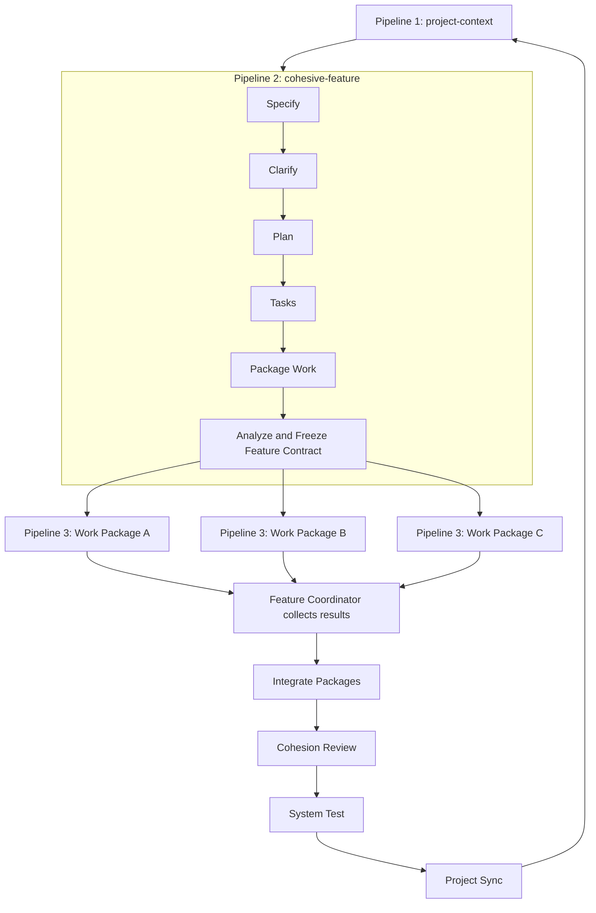

# TODO — Cohesive Multi-Pipeline Workflow

> Cập nhật 2026-08-08: tài liệu bên dưới là checklist của prototype workspace-local
> ban đầu. Bundle hiện đã nằm trong core/extension và có thêm execution profile opt-in
> `existing-project-autonomous`: tự chạy `project-context` → feature → dynamic workers
> → integration/system-test/open PR → aggregate human review; merge vẫn human-only.
> Xem guide canonical tại `packages/extension/media/guides/cohesive-delivery.md`.

## Trạng thái triển khai — 2026-08-05

### Đã hoàn thành

- [x] Thêm project-level autonomous orchestrator có durable delivery state, dependency-aware workers, aggregate review và selective rework.
- [x] Cho existing project tự suy luận provisional Goals/architecture/policy từ evidence, human edit/confirm sau.
- [x] Thêm CLI + VS Code commands; đây là feature mở rộng, không thay guided mode và không phụ thuộc Jira.

- [x] Thêm ba pipeline workspace-local: `project-context`, `cohesive-feature`, `cohesive-work-package`.
- [x] Giữ nguyên pipeline `speckit-full` và run `EPIC-002`.
- [x] Không sửa bất kỳ file nào trong `packages/extension/**` hoặc `packages/core/**`.
- [x] Thêm ba agent điều phối, mỗi agent chỉ có một workflow skill để tránh việc autopilot trộn nhiều skill của cùng persona.
- [x] Thêm ba project-local workflow skills chứa phase contracts và stop conditions.
- [x] Thêm 21 slash commands có namespace theo pipeline.
- [x] Thêm validators cho Project Context, Work Package scheduling, Feature Contract, Package Context, Worktree State, Package Result, Await Packages, Integration Cohesion và Project CI.
- [x] Thêm `.aidlc/cohesive-ci.json`; validator từ chối auto-pass khi không có command.
- [x] Workspace schema và cross-reference validation thành công: 7 agents, 9 skills, 4 pipelines.
- [x] Toàn bộ validator module qua `node --check`.
- [x] Positive validator smoke fixture qua đủ 9 validator contracts, bao gồm một Git worktree thật trong thư mục tạm.
- [x] Missing/stale artifact smoke calls trả structured reject thay vì crash/pass sai.
- [x] CLI scaffold smoke test thành công cho cả ba pipeline trong workspace tạm.
- [x] Core build và CLI build thành công.
- [x] 230/230 core tests pass.

### Chưa thực hiện — cần chạy khi sử dụng thật

- [ ] Chạy `project-context` trên repository thật và human-review các context artifacts.
- [ ] Cấu hình lại `.aidlc/cohesive-ci.json` nếu project muốn thêm/bớt command ngoài build và core tests hiện tại.
- [ ] Chạy một feature pilot có ít nhất hai work packages độc lập trong worktree thật.
- [ ] Đánh giá chất lượng grouping, write scopes và contract definitions từ output LLM thực tế.
- [ ] Xác nhận merge/cherry-pick strategy trên feature pilot trước khi áp dụng cho feature lớn.
- [ ] Sau pilot, quyết định có nên version-control `.aidlc/` hay tiếp tục giữ workspace-local theo `.gitignore` hiện tại.

> Lưu ý: `.gitignore` hiện bỏ qua toàn bộ `.aidlc/`. Vì vậy workspace YAML, skills và validators mới tồn tại trong workspace hiện tại nhưng không xuất hiện trong Git status. Slash commands và tài liệu TODO không bị ignore.

## 1. Mục tiêu

Xây dựng một hệ thống gồm ba pipeline AIDLC có thể chạy nhiều nhóm công việc song song nhưng vẫn giữ được tính thống nhất của toàn project và toàn feature.

Ba pipeline dự kiến:

1. `project-context` — duy trì kiến thức và các ràng buộc chung của project.
2. `cohesive-feature` — sở hữu mục tiêu feature từ Specify cho đến Integration và System Test.
3. `cohesive-work-package` — thực thi một nhóm task có tính kết dính; có thể khởi chạy nhiều run song song.

Đơn vị chạy song song là **work package**, không phải từng task riêng lẻ. Những task dùng chung module, file, domain concept hoặc shared contract phải được gom vào cùng một work package.

## 2. Phạm vi thực hiện

### Trong phạm vi

- Chỉnh `.aidlc/workspace.yaml` để khai báo agents, skills, slash commands và ba pipeline.
- Tạo project-local skills phục vụ từng phase.
- Tạo slash commands tương ứng.
- Tạo validator scripts cho project context, feature contract, work-package scheduling, package result, integration cohesion và CI.
- Định nghĩa artifact contracts giữa ba pipeline.
- Định nghĩa cách quản lý task/package bằng manifest và result files.
- Định nghĩa cách dùng feature branch, package branch và Git worktree để chạy song song an toàn.
- Kiểm thử pipeline trong workspace tạm trước khi sử dụng với epic thật.

### Ngoài phạm vi

- Không sửa `packages/extension/**`.
- Không sửa `packages/core/**`.
- Không sửa React/webview/UI của AIDLC.
- Không tạo custom runner hoặc hierarchy orchestrator.
- Không tạo baseline store hoặc baseline pinning framework.
- Không tự động spawn pipeline con từ extension.
- Không tạo pipeline riêng cho từng task nhỏ.
- Không migrate hoặc thay đổi `EPIC-002`.
- Không xóa hoặc sửa hành vi của `speckit-full` và `aidlc-workflow-full` trong lần triển khai đầu tiên.

## 3. Nguyên tắc thiết kế bắt buộc

- Project Context là nguồn ràng buộc chung cho mọi feature.
- Feature Coordinator là owner duy nhất của goal, spec, plan, task graph và integration outcome.
- Work Package không được tự Specify hoặc tự thiết kế lại kiến trúc.
- Mọi work package phải dùng cùng một revision của `FEATURE-CONTRACT.md`.
- Shared contract là read-only đối với worker; muốn thay đổi phải gửi change request về Feature Coordinator.
- Work package hoàn thành không đồng nghĩa feature hoàn thành.
- Feature chỉ hoàn thành sau Integration, Cohesion Review, System Test và Project Sync.
- Các worker không cùng ghi một manifest/status file để tránh race condition.
- Mỗi worker chỉ ghi artifact/result trong run directory của chính nó.
- Status board phải được derive từ các result files, không phải được nhiều worker cập nhật trực tiếp.
- Hai package sửa cùng file hoặc cùng shared contract không được chạy song song.
- Mỗi package chạy trong branch và worktree riêng.
- Không để artifact placeholder tồn tại sẵn rồi vượt qua file-existence gate.

## 4. Kiến trúc tổng thể



## 5. Quy ước thư mục và artifact

### 5.1 Project-level context

```text
docs/project/context/
├── PROJECT-CONTEXT.md
├── ARCHITECTURE-MAP.md
├── DOMAIN-MODEL.md
├── SHARED-CONTRACTS.md
├── ENGINEERING-RULES.md
└── CONTEXT-MANIFEST.json
```

### 5.2 Feature Coordinator artifacts

```text
docs/epics/<FEATURE>/artifacts/
├── PROJECT-CONTEXT-SNAPSHOT.md
├── SPEC.md
├── PLAN.md
├── TASKS.md
├── FEATURE-CONTRACT.md
├── WORK-PACKAGES.json
├── ANALYSIS.md
├── TASK-BOARD.md
├── PACKAGE-RESULTS.md
├── INTEGRATION-CONTEXT.md
├── INTEGRATION-SUMMARY.md
├── COHESION-REPORT.md
├── SYSTEM-TEST-REPORT.md
└── PROJECT-UPDATE.md
```

### 5.3 Work Package artifacts

Mỗi work package sử dụng một run id riêng, theo convention:

```text
<FEATURE>-WP-<NN>
```

Ví dụ:

```text
EPIC-123-WP-01
EPIC-123-WP-02
```

Artifact layout:

```text
docs/epics/<FEATURE>-WP-<NN>/artifacts/
├── PACKAGE-CONTEXT.md
├── IMPLEMENT-STATE.md
├── CHANGE-REQUEST.md          # chỉ tạo khi cần thay đổi plan/contract
├── PACKAGE-SUMMARY.md
├── PACKAGE-TEST-REPORT.md
└── PACKAGE-RESULT.json
```

## 6. Pipeline 1 — `project-context`

### 6.1 Mục tiêu

Tạo và duy trì project knowledge dùng chung mà không xây thêm baseline framework. Context được tạo từ code, documentation, ADR và cấu hình thực tế của repository.

### 6.2 Khi nào chạy

- Lần đầu thiết lập workflow.
- Trước một feature lớn nếu context chưa tồn tại hoặc đã cũ.
- Sau khi một feature làm thay đổi architecture, domain model hoặc shared contract.
- Theo yêu cầu thủ công của Tech Lead.

### 6.3 Phase dự kiến

```text
scan-project
analyze-architecture
extract-domain-contracts
define-engineering-rules
review-project-context
publish-project-context
```

### 6.4 TODO chi tiết

- [ ] Khai báo pipeline `project-context` trong `.aidlc/workspace.yaml`.
- [ ] Tạo agent riêng cho từng phase để tránh lỗi core nạp toàn bộ `agent.skills`.
- [ ] Tạo skill `project-scan`:
  - [ ] Đọc package/workspace layout.
  - [ ] Phát hiện application boundaries và libraries.
  - [ ] Phát hiện build, lint, typecheck và test commands.
  - [ ] Liệt kê architecture/ADR/domain documents hiện có.
  - [ ] Không suy diễn kiến trúc chỉ từ tên thư mục nếu chưa có bằng chứng.
- [ ] Tạo skill `project-architecture`:
  - [ ] Mô tả module boundaries.
  - [ ] Mô tả allowed dependency direction.
  - [ ] Ghi các pattern hiện đang được sử dụng.
  - [ ] Ghi các khu vực legacy hoặc ngoại lệ.
- [ ] Tạo skill `project-domain-contracts`:
  - [ ] Trích xuất domain vocabulary.
  - [ ] Liệt kê shared interfaces/APIs/events/schema.
  - [ ] Ghi owner/module của từng contract.
  - [ ] Phân biệt public contract và internal detail.
- [ ] Tạo skill `project-engineering-rules`:
  - [ ] Coding/testing conventions.
  - [ ] Security/privacy requirements.
  - [ ] Observability requirements.
  - [ ] Definition of Done dùng chung.
- [ ] Tạo human-review phase trước khi publish.
- [ ] Tạo `CONTEXT-MANIFEST.json` gồm:
  - [ ] `revision`.
  - [ ] `sourceCommit`.
  - [ ] `generatedAt`.
  - [ ] Hash của từng context artifact.
- [ ] Tạo validator `.aidlc/validators/project-context.mjs`:
  - [ ] Reject nếu thiếu artifact bắt buộc.
  - [ ] Reject nếu còn placeholder marker.
  - [ ] Reject nếu context manifest thiếu source commit hoặc hash.
  - [ ] Reject nếu manifest tham chiếu file không tồn tại.

### 6.5 Exit criteria

- [ ] Project Context đã được human approve.
- [ ] Context artifacts có revision và source commit.
- [ ] Feature pipeline có thể snapshot chính xác revision này.

## 7. Pipeline 2 — `cohesive-feature`

### 7.1 Mục tiêu

Sở hữu toàn bộ feature lifecycle: lấy project context, xác định feature goal, thiết kế, phân task thành work package, chờ worker results, tích hợp, review độ kết dính, system test và cập nhật project knowledge.

### 7.2 Phase dự kiến

```text
capture-project-snapshot
specify
clarify
plan
tasks
package-work
feature-analyze
publish-feature-contract
await-work-packages
collect-package-results
integrate-packages
build-integration-context
cohesion-review
system-test
project-sync
final-review
```

### 7.3 Capture project snapshot

- [ ] Đọc `docs/project/context/CONTEXT-MANIFEST.json`.
- [ ] Copy/render project context liên quan vào `PROJECT-CONTEXT-SNAPSHOT.md`.
- [ ] Ghi `projectContextRevision`, `sourceCommit` và context hashes vào snapshot.
- [ ] Reject nếu project context chưa được publish hoặc manifest không hợp lệ.
- [ ] Ghi rõ context nào không liên quan đến feature để giảm prompt noise.

### 7.4 Specify

- [ ] Đọc feature title/description từ `state.json`.
- [ ] Đọc external inputs từ `inputs.json`.
- [ ] Không yêu cầu `docs/epics/<EPIC>/<EPIC>.md` vì scaffold hiện không tạo file này.
- [ ] Đọc `PROJECT-CONTEXT-SNAPSHOT.md`.
- [ ] Tạo `SPEC.md` gồm:
  - [ ] Overview và user/business goal.
  - [ ] Primary scenarios.
  - [ ] Edge/error scenarios.
  - [ ] Functional requirements có stable ID.
  - [ ] Non-functional requirements có số đo.
  - [ ] Acceptance criteria có stable ID.
  - [ ] Compatibility với hành vi hiện tại.
  - [ ] Out of scope.
  - [ ] Open clarifications.

### 7.5 Clarify

- [ ] Tìm mọi `[NEEDS CLARIFICATION]`.
- [ ] Hỏi câu đóng, có lựa chọn cụ thể.
- [ ] Cập nhật requirement và acceptance criteria tương ứng.
- [ ] Ghi `## Clarifications` vào `SPEC.md`.
- [ ] Không cho qua nếu còn ambiguity chưa resolve/defer có lý do.
- [ ] Human review `SPEC.md` sau Clarify.

### 7.6 Plan

- [ ] Đọc `PROJECT-CONTEXT-SNAPSHOT.md` và `SPEC.md`.
- [ ] Tạo `PLAN.md` gồm:
  - [ ] Technical approach.
  - [ ] Existing patterns được tái sử dụng.
  - [ ] Module/component boundaries.
  - [ ] Data model/migrations.
  - [ ] APIs/interfaces/events/contracts.
  - [ ] Shared contract impact.
  - [ ] File-impact map.
  - [ ] Compatibility/backward migration.
  - [ ] Security/observability/test strategy.
  - [ ] Requirement traceability.
  - [ ] ADR required/not required.
  - [ ] Risks và decisions chưa chốt.
- [ ] Reject nếu Plan tự thay đổi feature scope thay vì trả về Specify/Clarify.
- [ ] Human review `PLAN.md`.

### 7.7 Tasks

- [ ] Tạo `TASKS.md` với task ID ổn định.
- [ ] Mỗi task phải có:
  - [ ] `What`.
  - [ ] `Depends on`.
  - [ ] `Implements` requirement IDs.
  - [ ] Affected modules/files.
  - [ ] Shared contracts dùng/thay đổi.
  - [ ] Done condition.
  - [ ] Test to write/run.
  - [ ] Parallel-safety note.
- [ ] Không đưa architecture decision mới vào task.
- [ ] Không tạo task orphan không liên quan đến Plan hoặc requirement.

### 7.8 Package Work

- [ ] Tạo `WORK-PACKAGES.json`.
- [ ] Gom task vào cùng package nếu chúng:
  - [ ] Sửa cùng file/module.
  - [ ] Cùng sở hữu shared contract.
  - [ ] Cùng thay đổi một domain aggregate.
  - [ ] Có dependency chặt.
  - [ ] Cần một integration test chung.
  - [ ] Có nguy cơ tạo abstraction trùng nhau.
- [ ] Chỉ cho phép package chạy song song khi:
  - [ ] Không có package dependency.
  - [ ] Write scopes không overlap.
  - [ ] Không cùng thay đổi shared contract.
  - [ ] Không phụ thuộc output chưa có của package khác.
- [ ] Mỗi package phải có:
  - [ ] `id`, `name`, `runId`.
  - [ ] Danh sách task IDs.
  - [ ] `dependsOn` package IDs.
  - [ ] `writeScope`.
  - [ ] Read-only shared contracts.
  - [ ] Required upstream results.
  - [ ] Acceptance criteria subset.
  - [ ] Package Definition of Done.
- [ ] Tạo exact run id convention `<FEATURE>-WP-<NN>`.
- [ ] Tạo validator `.aidlc/validators/work-packages.mjs`:
  - [ ] Mọi task được assign đúng một lần.
  - [ ] Không task trùng package.
  - [ ] Package dependency graph không cycle.
  - [ ] Parallel packages không overlap file scope.
  - [ ] Parallel packages không cùng thay đổi shared contract.
  - [ ] Mọi package trace về requirement và Plan.

### 7.9 Feature Analyze và Feature Contract

- [ ] Tạo `ANALYSIS.md` kiểm tra:
  - [ ] Project Context ↔ Spec.
  - [ ] Spec ↔ Plan.
  - [ ] Plan ↔ Tasks.
  - [ ] Tasks ↔ Work Packages.
  - [ ] Shared contract consistency.
  - [ ] Requirement coverage.
  - [ ] Orphans/scope creep.
  - [ ] Dependency/package correctness.
- [ ] Verdict bắt buộc là `GO` hoặc `NO-GO`.
- [ ] Tạo validator `.aidlc/validators/feature-contract.mjs`.
- [ ] Validator reject nếu verdict không phải `GO`.
- [ ] Tạo `FEATURE-CONTRACT.md` gồm:
  - [ ] Feature goal.
  - [ ] Invariants.
  - [ ] Architecture decisions.
  - [ ] Shared contracts.
  - [ ] Domain vocabulary.
  - [ ] NFRs.
  - [ ] Feature Definition of Done.
  - [ ] Change request protocol.
  - [ ] Project context revision.
  - [ ] Feature contract revision.
  - [ ] Base commit.
- [ ] Tính và ghi feature contract hash.
- [ ] Human review và freeze contract trước khi cho worker chạy.

### 7.10 Await và Collect Work Packages

- [ ] `await-work-packages` đọc `WORK-PACKAGES.json` và package result paths.
- [ ] Không cho qua nếu required package chưa có `PACKAGE-RESULT.json`.
- [ ] Không cho qua nếu package status là `failed`, `blocked` hoặc `change_requested`.
- [ ] Cho phép package `deferred` chỉ khi có lý do và human approval.
- [ ] Reject package result dùng sai project context revision.
- [ ] Reject package result dùng stale feature contract revision/hash.
- [ ] Tạo `PACKAGE-RESULTS.md` tổng hợp kết quả.
- [ ] Tạo lại `TASK-BOARD.md` từ manifest + result files.
- [ ] Không cho worker ghi trực tiếp `TASK-BOARD.md`.

### 7.11 Integrate Packages

- [ ] Tính merge order từ package dependency graph.
- [ ] Kiểm tra branch/commit của mỗi package tồn tại.
- [ ] Kiểm tra commit chưa bị integrate hai lần.
- [ ] Merge/cherry-pick vào feature integration branch theo thứ tự.
- [ ] Ghi conflict và cách resolve.
- [ ] Không giải quyết conflict bằng cách bỏ behavior mà không cập nhật Feature Contract.
- [ ] Chạy smoke test sau mỗi package hoặc dependency wave.
- [ ] Tạo `INTEGRATION-SUMMARY.md`.

### 7.12 Integration Context

- [ ] Tạo `INTEGRATION-CONTEXT.md` từ code/diff thực tế.
- [ ] Ghi planned versus actual changes.
- [ ] Ghi final changed files.
- [ ] Ghi final shared contracts.
- [ ] Ghi deviations và change requests.
- [ ] Ghi cross-package interactions.
- [ ] Ghi test coverage và remaining risks.
- [ ] Ghi project documentation cần cập nhật.

### 7.13 Cohesion Review

- [ ] Tạo `COHESION-REPORT.md`.
- [ ] Kiểm tra duplicate abstractions giữa packages.
- [ ] Kiểm tra naming/conventions thống nhất.
- [ ] Kiểm tra module boundaries.
- [ ] Kiểm tra shared contracts đúng Feature Contract.
- [ ] Kiểm tra behavior ngoài scope.
- [ ] Kiểm tra requirement → package → commit → test traceability.
- [ ] Kiểm tra feature tạo thành vertical outcome hoàn chỉnh.
- [ ] Tạo validator `.aidlc/validators/integration-cohesion.mjs`.
- [ ] Validator reject nếu verdict không phải `GO`.
- [ ] Human review cohesion report.

### 7.14 System Test

- [ ] Tạo `.aidlc/validators/project-ci.mjs`.
- [ ] Không sử dụng `CHECKS=[]` rồi auto-pass.
- [ ] Xác định commands từ project config/package scripts.
- [ ] Chạy lint.
- [ ] Chạy typecheck.
- [ ] Chạy unit tests liên quan.
- [ ] Chạy integration/regression tests.
- [ ] Chạy build/package nếu cần.
- [ ] Tạo `SYSTEM-TEST-REPORT.md`.
- [ ] Report phải ghi command, exit code và kết quả.

### 7.15 Project Sync

- [ ] So sánh Integration Context với Project Context hiện tại.
- [ ] Cập nhật architecture map nếu module boundary thay đổi.
- [ ] Cập nhật domain model nếu domain vocabulary/relationship thay đổi.
- [ ] Cập nhật shared contract documentation nếu contract thay đổi.
- [ ] Tạo/cập nhật ADR nếu có architectural decision mới.
- [ ] Không cập nhật tài liệu chỉ dựa trên Plan; phải dựa trên final code/diff.
- [ ] Tạo `PROJECT-UPDATE.md` ghi rõ file nào được cập nhật hoặc vì sao không cần cập nhật.
- [ ] Tăng project context revision sau human approval.

### 7.16 Exit criteria

- [ ] Mọi required package done hoặc approved deferred.
- [ ] Tất cả commits đã integrate.
- [ ] Cohesion verdict `GO`.
- [ ] System tests pass.
- [ ] Project docs/context đã sync.
- [ ] Human final review hoàn tất.

## 8. Pipeline 3 — `cohesive-work-package`

### 8.1 Mục tiêu

Thực thi một nhóm task liên quan trên branch/worktree riêng. Pipeline này reusable và có thể có nhiều run song song.

### 8.2 Phase dự kiến

```text
load-package
validate-context
prepare-worktree
implement-package
package-test
publish-result
```

### 8.3 Load Package

- [ ] Đọc `inputs.json` để lấy feature id và package id.
- [ ] Đọc `FEATURE-CONTRACT.md`.
- [ ] Đọc `WORK-PACKAGES.json`.
- [ ] Chỉ lấy package trùng với package id của run.
- [ ] Tạo `PACKAGE-CONTEXT.md` gồm:
  - [ ] Package goal.
  - [ ] Assigned tasks.
  - [ ] Requirement/AC subset.
  - [ ] Write scope.
  - [ ] Read-only contracts.
  - [ ] Dependency results.
  - [ ] Base commit.
  - [ ] Project context revision.
  - [ ] Feature contract revision/hash.

### 8.4 Validate Context

- [ ] Reject nếu package chưa ở trạng thái ready.
- [ ] Reject nếu dependency package chưa done.
- [ ] Reject nếu Feature Contract revision/hash không khớp manifest.
- [ ] Reject nếu base commit không tồn tại.
- [ ] Reject nếu package không có task.
- [ ] Reject nếu write scope overlap với một package đang chạy song song mà manifest không cho phép.

### 8.5 Worktree và branch

- [ ] Dùng branch convention `feature/<FEATURE>-<PACKAGE>`.
- [ ] Dùng worktree convention `.aidlc/worktrees/<FEATURE>/<PACKAGE>`.
- [ ] Tạo branch từ `baseCommit` hoặc integrated dependency commit được manifest chỉ định.
- [ ] Không chạy hai worker trong cùng worktree.
- [ ] Không dùng lệnh Git phá hủy hoặc reset work của package khác.
- [ ] Ghi branch/worktree/base commit vào `IMPLEMENT-STATE.md`.

### 8.6 Implement Package

- [ ] Thực hiện task theo dependency order nội bộ.
- [ ] Cập nhật `IMPLEMENT-STATE.md` sau mỗi task.
- [ ] Mỗi task phải ghi:
  - [ ] Status.
  - [ ] Files changed.
  - [ ] Test written/run.
  - [ ] Commit SHA.
  - [ ] Deviations.
- [ ] Không sửa file ngoài write scope nếu chưa ghi deviation.
- [ ] Không thay đổi shared contract nếu không có quyền trong package definition.
- [ ] Không tự mở rộng feature scope.
- [ ] Nếu phát hiện Plan/Contract không đủ:
  - [ ] Dừng phần bị ảnh hưởng.
  - [ ] Tạo `CHANGE-REQUEST.md`.
  - [ ] Ghi package status `change_requested`.
  - [ ] Không tự sửa Feature Contract.

### 8.7 Package Test

- [ ] Chạy test gắn với từng task.
- [ ] Chạy package-level tests.
- [ ] Chạy lint/typecheck trên vùng ảnh hưởng nếu có thể.
- [ ] Tạo `PACKAGE-TEST-REPORT.md`.
- [ ] Không publish done nếu test bắt buộc fail.

### 8.8 Publish Result

- [ ] Tạo `PACKAGE-SUMMARY.md`.
- [ ] Tạo `PACKAGE-RESULT.json` theo schema cố định.
- [ ] Result phải có:
  - [ ] Feature id.
  - [ ] Package id.
  - [ ] Final status.
  - [ ] Context revision/hash.
  - [ ] Base commit.
  - [ ] Branch/worktree.
  - [ ] Commits.
  - [ ] Completed/deferred tasks.
  - [ ] Changed files.
  - [ ] Tests.
  - [ ] Contract changes.
  - [ ] Deviations.
  - [ ] Change requests.
- [ ] Tạo validator `.aidlc/validators/package-result.mjs`.
- [ ] Validator kiểm tra result schema.
- [ ] Validator kiểm tra task coverage.
- [ ] Validator kiểm tra commit SHA và changed files.
- [ ] Validator reject nếu package tuyên bố done nhưng còn task pending/failed.

### 8.9 Exit criteria

- [ ] Package result có schema hợp lệ.
- [ ] Mọi task trong package có final status.
- [ ] Required tests pass.
- [ ] Commits tồn tại trên package branch.
- [ ] Mọi deviation/change request được ghi rõ.

## 9. Change Request Protocol

### 9.1 Khi nào phải tạo change request

- Shared contract không đủ hoặc sai.
- Architecture decision trong Plan không khả thi.
- Task cần sửa file/module ngoài package write scope.
- Requirement/acceptance criteria mâu thuẫn với code hoặc nhau.
- Dependency giữa packages bị thiếu.
- Có security/data migration impact chưa được Plan xử lý.

### 9.2 Nội dung `CHANGE-REQUEST.md`

- [ ] Request id.
- [ ] Feature/package/task liên quan.
- [ ] Vấn đề phát hiện.
- [ ] Bằng chứng từ code/test.
- [ ] Feature Contract section bị ảnh hưởng.
- [ ] Package khác có thể bị ảnh hưởng.
- [ ] Đề xuất thay đổi.
- [ ] Work đã thực hiện và work đang bị block.

### 9.3 Xử lý tại Feature Coordinator

- [ ] Review change request.
- [ ] Nếu reject, ghi rationale và cho package tiếp tục theo contract cũ.
- [ ] Nếu accept:
  - [ ] Quay lại Spec/Plan/Tasks/Package Work tương ứng.
  - [ ] Tăng feature contract revision.
  - [ ] Tính lại feature contract hash.
  - [ ] Xác định package nào stale.
  - [ ] Revalidate hoặc rerun package bị ảnh hưởng.
- [ ] Không invalidate package không bị ảnh hưởng nếu context/contract subset của nó không đổi.

## 10. Task và package status model

### 10.1 Package statuses

```text
planned
blocked
ready
in_progress
change_requested
done
deferred
failed
stale
integrated
```

### 10.2 Task statuses

```text
pending
ready
in_progress
blocked
done
deferred
failed
```

### 10.3 Status ownership

- Feature Coordinator sở hữu planned dependency graph và expected package state.
- Work Package chỉ sở hữu result/status trong `PACKAGE-RESULT.json` của chính nó.
- Integration phase derive final package/task board.
- Không worker nào được sửa result của worker khác.

## 11. Agents và skills

Do core hiện nạp toàn bộ `agent.skills` trong autopilot, mỗi phase sẽ dùng một agent chỉ có đúng một skill.

### 11.1 Project Context agents

- [ ] `ctx-project-scan` → `ctx-project-scan` skill.
- [ ] `ctx-project-architecture` → `ctx-project-architecture` skill.
- [ ] `ctx-project-domain` → `ctx-project-domain` skill.
- [ ] `ctx-project-review` → `ctx-project-review` skill.
- [ ] `ctx-project-publish` → `ctx-project-publish` skill.

### 11.2 Feature agents

- [ ] `cohesive-capture-context`.
- [ ] `cohesive-specify`.
- [ ] `cohesive-clarify`.
- [ ] `cohesive-plan`.
- [ ] `cohesive-tasks`.
- [ ] `cohesive-package-work`.
- [ ] `cohesive-feature-analyze`.
- [ ] `cohesive-publish-contract`.
- [ ] `cohesive-await-packages`.
- [ ] `cohesive-integrate`.
- [ ] `cohesive-integration-context`.
- [ ] `cohesive-cohesion-review`.
- [ ] `cohesive-system-test`.
- [ ] `cohesive-project-sync`.

### 11.3 Work Package agents

- [ ] `wp-load-package`.
- [ ] `wp-validate-context`.
- [ ] `wp-prepare-worktree`.
- [ ] `wp-implement`.
- [ ] `wp-test`.
- [ ] `wp-publish-result`.

## 12. Workspace files cần tạo hoặc chỉnh sửa

### 12.1 Workspace configuration

- [ ] Cập nhật `.aidlc/workspace.yaml`:
  - [ ] Thêm agents với namespace mới, không đè agents hiện tại.
  - [ ] Thêm skills với project-local paths.
  - [ ] Thêm slash commands có namespace rõ ràng.
  - [ ] Thêm ba pipelines.
  - [ ] Giữ nguyên pipelines/recipes hiện tại.
  - [ ] Chạy schema/cross-reference validation.

### 12.2 Skills

```text
.aidlc/skills/project-context/
.aidlc/skills/cohesive-feature/
.aidlc/skills/cohesive-work-package/
```

- [ ] Tạo một markdown skill cho mỗi phase.
- [ ] Mỗi skill ghi rõ inputs, outputs, gate và stop conditions.
- [ ] Không tham chiếu `.claude/skills/_gate-check.md` bị thiếu.
- [ ] Không yêu cầu artifact/file mà scaffold không tạo.
- [ ] Không chứa instruction tự thay đổi feature scope.

### 12.3 Validators

```text
.aidlc/validators/
├── project-context.mjs
├── feature-contract.mjs
├── work-packages.mjs
├── package-result.mjs
├── await-packages.mjs
├── integration-cohesion.mjs
└── project-ci.mjs
```

- [ ] Mỗi validator default-export đúng AutoReviewer contract.
- [ ] Mỗi validator trả `{ decision, reason }`.
- [ ] Validator error/exception phải trả reject có lý do hữu ích.
- [ ] Không validator nào pass khi chưa cấu hình check bắt buộc.

### 12.4 Slash commands

```text
.claude/commands/project-context-*.md
.claude/commands/cohesive-feature-*.md
.claude/commands/cohesive-work-package-*.md
```

- [ ] Command đọc `state.json` và `inputs.json` của đúng run.
- [ ] Command ghi đúng artifact path.
- [ ] Command ghi rõ khi nào người dùng Mark Step Done.
- [ ] Command không dùng bare phase name có thể conflict với pipeline hiện tại.

### 12.5 Artifact templates

- [ ] Không seed placeholder artifact trong lần đầu.
- [ ] Đưa cấu trúc artifact vào skill instructions.
- [ ] Chỉ cân nhắc template seeding sau khi có validator kiểm tra placeholder/content đầy đủ.

## 13. Quy trình chạy dự kiến

### 13.1 Chuẩn bị Project Context

- [ ] Start `project-context` run.
- [ ] Review và approve published context.
- [ ] Ghi nhận context revision.

### 13.2 Start Feature Coordinator

- [ ] Start feature epic với pipeline `cohesive-feature`.
- [ ] Điền title, description và inputs; không để feature intent trống.
- [ ] Chạy tới `publish-feature-contract`.
- [ ] Review `WORK-PACKAGES.json`.
- [ ] Approve Feature Contract.

### 13.3 Start parallel Work Packages

- [ ] Liệt kê package status `ready`.
- [ ] Start một `cohesive-work-package` run cho mỗi ready package.
- [ ] Truyền feature/package id trong `inputs.json`.
- [ ] Mở terminal/process riêng cho mỗi package cần chạy song song.
- [ ] Mỗi package dùng branch/worktree riêng.
- [ ] Khi dependency package hoàn thành, start package vừa được unblock.

### 13.4 Integrate Feature

- [ ] Quay lại Feature Coordinator.
- [ ] Chạy `await-work-packages` validator.
- [ ] Collect package results.
- [ ] Integrate theo dependency order.
- [ ] Chạy Cohesion Review.
- [ ] Chạy System Test.
- [ ] Sync Project Context.
- [ ] Human final review.

## 14. Kiểm thử và xác minh

### 14.1 Workspace validation

- [ ] `.aidlc/workspace.yaml` parse thành công.
- [ ] Mọi agent id unique.
- [ ] Mọi skill id/path resolve được.
- [ ] Mọi pipeline step agent/skill tồn tại.
- [ ] Mọi slash command có command file tương ứng.
- [ ] Không làm thay đổi pipeline/run hiện tại.

### 14.2 Project Context tests

- [ ] Missing context artifact → reject.
- [ ] Placeholder content → reject.
- [ ] Manifest thiếu hash/source commit → reject.
- [ ] Valid context → pass.

### 14.3 Feature Contract tests

- [ ] Missing Project Context snapshot → block Specify/Plan.
- [ ] Unresolved clarification → reject.
- [ ] Missing requirement traceability → reject.
- [ ] `ANALYSIS.md` NO-GO → block publish/worker execution.
- [ ] Invalid/stale contract hash → reject.

### 14.4 Package scheduling tests

- [ ] Task assigned zero lần → reject.
- [ ] Task assigned hai lần → reject.
- [ ] Package dependency cycle → reject.
- [ ] Parallel packages overlap file scope → reject.
- [ ] Parallel packages thay đổi cùng contract → reject.
- [ ] Valid packages → pass.

### 14.5 Worker tests

- [ ] Worker dùng stale Feature Contract → reject.
- [ ] Dependency package chưa done → reject.
- [ ] Worker sửa ngoài write scope không ghi deviation → reject.
- [ ] Package done nhưng task pending → reject.
- [ ] Package result thiếu commit/test → reject.
- [ ] Change request flow tạo đúng status.

### 14.6 Parallel execution test

- [ ] Tạo feature fixture có ít nhất hai independent packages.
- [ ] Start hai worker runs với hai terminal/process.
- [ ] Xác nhận mỗi worker có RunState riêng.
- [ ] Xác nhận mỗi worker có worktree/branch riêng.
- [ ] Xác nhận không có file/artifact race.
- [ ] Xác nhận results được coordinator collect đúng.

### 14.7 Integration tests

- [ ] Package result thiếu → await phase block.
- [ ] Stale context/hash → integration reject.
- [ ] Commit không tồn tại → reject.
- [ ] Duplicate commit integration → reject.
- [ ] Shared contract drift → cohesion NO-GO.
- [ ] Requirement chưa có code/test → cohesion NO-GO.
- [ ] Valid integrated feature → GO.

### 14.8 Regression checks

- [ ] `speckit-full` vẫn load được.
- [ ] `aidlc-workflow-full` vẫn load được.
- [ ] `EPIC-002` không bị sửa.
- [ ] Existing `.claude/commands` không bị overwrite.
- [ ] Existing validators không bị overwrite.

## 15. Triển khai theo giai đoạn

### Giai đoạn A — Contracts trước, chưa chạy agent

- [ ] Chốt artifact schemas.
- [ ] Chốt naming conventions.
- [ ] Chốt status models.
- [ ] Chốt project/feature/package revision rules.
- [ ] Chốt work package grouping rules.
- [ ] Viết validators với fixtures trước.

### Giai đoạn B — Project Context pipeline

- [ ] Thêm agents/skills/pipeline.
- [ ] Chạy trên workspace tạm.
- [ ] Review chất lượng context output.
- [ ] Sửa prompt cho đến khi context đủ chính xác và không quá dài.

### Giai đoạn C — Feature front half

- [ ] Thêm Specify → Package Work → Feature Contract.
- [ ] Test traceability và scheduling validators.
- [ ] Chưa triển khai worker cho đến khi contract ổn định.

### Giai đoạn D — Work Package pipeline

- [ ] Thêm load/validate/worktree/implement/test/result phases.
- [ ] Test một package đơn.
- [ ] Test hai package song song.
- [ ] Test change request và stale contract.

### Giai đoạn E — Feature back half

- [ ] Thêm await/collect/integrate/context/cohesion/test/sync.
- [ ] Test integration dependency order.
- [ ] Test final project context update.

### Giai đoạn F — Smoke test end-to-end

- [ ] Tạo feature fixture nhỏ có 2–3 work packages.
- [ ] Chạy toàn bộ ba pipelines.
- [ ] Ghi lại thao tác thủ công còn cần thiết.
- [ ] Đánh giá token/time/merge overhead.
- [ ] Chỉ sau khi pass mới cân nhắc dùng cho epic thật.

## 16. Acceptance criteria tổng thể

- [ ] Có đúng ba pipeline mới: Project Context, Feature Coordinator và Work Package.
- [ ] Không sửa extension/core source.
- [ ] Feature Coordinator giữ run mở từ Specify đến Final Review.
- [ ] Nhiều work packages có thể chạy đồng thời bằng run/worktree riêng.
- [ ] Không chạy pipeline riêng cho từng task nhỏ.
- [ ] Task liên quan được gom thành cohesive work package.
- [ ] Mọi worker dùng cùng Project Context revision và Feature Contract revision/hash.
- [ ] Worker không thể âm thầm thay shared contract.
- [ ] Change Request quay lại Feature Coordinator và làm stale package bị ảnh hưởng.
- [ ] Không có concurrent write vào shared status/manifest file.
- [ ] Task Board được derive từ package results.
- [ ] Integration theo dependency order.
- [ ] Cohesion Review kiểm tra toàn feature, không chỉ từng package.
- [ ] System Test chạy command thật và không auto-pass khi chưa cấu hình.
- [ ] Final project knowledge được cập nhật từ code/diff thực tế.
- [ ] Existing pipelines và `EPIC-002` không bị thay đổi.

## 17. Các quyết định cần chốt trước khi bắt đầu triển khai

- [ ] Chọn thư mục canonical cho Project Context: `docs/project/context/` hay `.aidlc/context/`.
  - Đề xuất: `docs/project/context/` vì đây là project knowledge cần review và commit.
- [ ] Chọn số lượng work package chạy song song tối đa.
  - Đề xuất ban đầu: không hard-code; giới hạn vận hành 3 package đồng thời.
- [ ] Chọn merge strategy: merge commit hay cherry-pick package commits.
  - Đề xuất: cherry-pick theo dependency order để integration history rõ ràng.
- [ ] Chọn worktree root.
  - Đề xuất: `.aidlc/worktrees/<FEATURE>/<PACKAGE>` và thêm vào `.gitignore`.
- [ ] Chọn cách start worker runs.
  - Đề xuất ban đầu: CLI/terminal thủ công; không thêm extension automation.
- [ ] Chọn project CI commands tối thiểu.
  - Cần đọc scripts hiện có trước khi cấu hình validator.
- [ ] Chọn policy khi package deferred.
  - Đề xuất: bắt buộc human approval tại Feature Coordinator.
- [ ] Chọn policy khi Project Context thay đổi trong lúc feature đang chạy.
  - Đề xuất: không tự invalidate; Cohesion Review đánh giá ảnh hưởng và yêu cầu rebase/revalidate khi cần.

## 18. Definition of Done cho công việc triển khai pipeline

Công việc tạo pipeline chỉ được coi là hoàn tất khi:

- Ba pipeline parse và validate thành công.
- Skills/slash commands/validators resolve đầy đủ.
- Một feature fixture chạy end-to-end.
- Ít nhất hai independent work packages chạy song song trong worktree riêng.
- Feature Coordinator thu thập và tích hợp được package results.
- Stale contract, file overlap và shared-contract drift đều bị validator reject.
- Cohesion Review và System Test tạo verdict chính xác.
- Project Context được cập nhật sau integration.
- Không có thay đổi trong extension/core source.
- Không có thay đổi ngoài ý muốn đối với existing pipelines hoặc existing epic runs.

## 19. Checkpoint mới — đóng gói thành built-in workflow (2026-08-05)

> Phần này ghi đè quyết định cũ “không sửa core source”. Sau khi bản workspace-local
> đã được kiểm chứng, người dùng yêu cầu đóng gói giống hai workflow built-in hiện có,
> không yêu cầu chạy CLI thủ công và vẫn **không sửa `packages/extension/**`**.

### 19.1 Quyết định kiến trúc đã chốt

- [x] Tạo **một built-in preset card** tên `Cohesive Delivery`.
- [x] Khi apply preset, cài nguyên tử ba pipeline:
  - `project-context` — 4 bước;
  - `cohesive-feature` — 12 bước, pipeline chính điều phối feature;
  - `cohesive-work-package` — 5 bước, có thể tạo nhiều run/worktree song song.
- [x] Giữ ba tầng context:
  - canonical Project Context;
  - immutable Feature Context/Contract;
  - bounded Work Package Context + stable Package Result.
- [x] Không dùng artifact template rỗng cho bundle này; nếu seed file rỗng thì gate
  dựa trên file existence có thể pass sai trước khi agent thật sự tạo context.
- [x] Không sửa code extension. Dùng installer generic hiện có bằng cách mở rộng
  model/composer preset ở core.
- [x] Toàn bộ 21 slash command dùng chung namespace `/cohesive-feature-*` để installer
  generic hiện tại tạo được command cho cả ba pipeline mà không cần special case trong extension.

### 19.2 Core preset model — hoàn tất

- [x] Mở rộng `PhaseDef` với `requires`, `produces`, `producesContains`.
- [x] Mở rộng `BuiltinWorkflow` với `primaryPhases`, `additionalPipelines`, `seedArtifacts`.
- [x] `loadBuiltinPreset()` compose một bundle thành nhiều pipeline trong cùng
  `workspace.yaml`.
- [x] Agents, skills và slash commands được aggregate trên toàn bộ 21 phase.
- [x] Companion pipeline lookup hoạt động qua `getBuiltinWorkflowByPipelineId()`.
- [x] `builtinClaudeCommand()` ghi đầy đủ mọi explicit output, thay `{epic}` bằng
  `$ARGUMENTS`, và cảnh báo không tạo placeholder.
- [x] `writeBuiltinAutoReviewValidators()` copy cả runner lẫn shared helper `lib.mjs`,
  không overwrite file người dùng đã có.
- [x] `getBuiltinArtifactTemplates()` trả `{}` khi `seedArtifacts: false`.

File chính:

- `packages/core/src/presets/builtinWorkflows.ts`

### 19.3 Built-in Cohesive Delivery assets — hoàn tất

- [x] 3 persona files trong `packages/core/templates/cohesive/agents/`.
- [x] 3 workflow skills trong `packages/core/templates/cohesive/skills/`.
- [x] 10 validator modules trong `packages/core/templates/cohesive/validators/`
  (9 runner + `lib.mjs`).
- [x] `project-ci.mjs` ưu tiên `.aidlc/cohesive-ci.json`; nếu chưa có thì tự nhận
  các package scripts `lint`, `typecheck`, `test`, `build`. Không có command thật thì reject.
- [x] Extension build tự copy `packages/core/templates/cohesive/` vào bundle bằng
  script `copy:templates` hiện có; không thêm logic riêng trong extension.

### 19.4 Automated tests — hoàn tất

- [x] Thêm `packages/core/test/cohesive-delivery-builtin.test.ts`.
- [x] Assert preset materialize đúng 3 pipeline, 3 agent, 3 skill, 21 command.
- [x] Assert step counts là 4 / 12 / 5.
- [x] Assert cross-pipeline gates và auto-review runner được giữ nguyên.
- [x] Assert companion pipeline lookup đúng phase set.
- [x] Assert không pre-seed artifact gate outputs.
- [x] Assert copy đủ validators và không overwrite `lib.mjs` người dùng.
- [x] Assert command prompt chứa cả `TASKS.md` và `WORK-PACKAGES.json`.
- [x] Điều chỉnh recipe integration test để workflow không có recipes là hợp lệ.

Kết quả kiểm chứng:

- [x] `pnpm --filter @aidlc/core test` — **22 files, 235 tests passed**.
- [x] `pnpm -r build` — core và CLI build pass.
- [x] `pnpm --filter aidlc typecheck` — extension và webview typecheck pass.
- [x] `pnpm --filter aidlc compile` — extension compile/bundle pass và copy cohesive templates pass.
- [x] Runtime smoke qua compiled core — pipeline counts `12 / 4 / 5`, tổng 3 agents,
  3 skills, 21 commands.
- [x] `git diff --check` — không có whitespace error.
- [x] `packages/extension/src/**` không có diff.
- [x] `docs/epics/EPIC-002` không bị sửa.

### 19.5 Việc chưa làm / handoff nếu cần tiếp tục

- [ ] Mở Extension Development Host và click **Load Template → Cohesive Delivery**
  để smoke-test tương tác UI thật. Automated compile đã pass nhưng chưa click UI trong phiên này.
- [ ] Chạy một feature thật end-to-end với ít nhất hai package workers song song;
  đây là acceptance test vận hành, không phải blocker của việc đóng gói preset.
- [ ] Nếu muốn CLI cũng có alias riêng như `aidlc preset apply cohesive`, thêm một generic
  built-in adapter trong `packages/cli/src/commands/preset.ts`. Không cần cho luồng extension
  mà người dùng đang yêu cầu, nên chưa mở rộng scope.
- [ ] Companion pipelines hiện được cài từ cùng built-in preset, nhưng badge `builtin` trong
  một số view cũ có thể chỉ nhận pipeline chính `cohesive-feature`, vì extension đang kiểm tra
  `workflow.pipelineId` đơn. Sửa badge đòi hỏi edit extension; cố ý chưa làm theo yêu cầu.

### 19.6 Trạng thái handoff

- Built-in bundle implementation: **COMPLETE**.
- Automated validation/build: **PASS**.
- Extension source edits: **NONE**.
- Manual UI and real parallel-feature smoke: **PENDING**.
