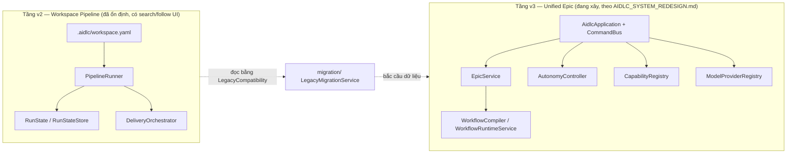

# AIDLC Monorepo — Phân tích tính năng & Design Brief hợp nhất

> **Tài liệu này gộp 3 file phân tích được tạo trước đó** (`PHAN_TICH_CHUC_NANG.md` — tổng quan kiến trúc, `CHUC_NANG_CHI_TIET.md` — chi tiết từng command/API/UI, `DESIGN_BRIEF_UIUX.md` — design brief cho redesign) thành **một nguồn sự thật duy nhất**, viết ở mức mô tả đủ để một AI khác (agent thiết kế, agent lập kế hoạch redesign) đọc và hiểu toàn bộ hệ thống hiện có **mà không cần đọc lại source code**.
>
> Khảo sát dựa trên: source code repo tại commit `6fb8c99` **cộng với** các thay đổi đang pending chưa commit (`git status` tại thời điểm viết — xem mục 0.1), README.md, AGENTS.md, `docs/UNIFIED_SYSTEM_GUIDE.md`, `docs/USER_WORKFLOW.md`, `COHESIVE_CHARTER_ARCHITECTURE.md`, `AIDLC_SYSTEM_REDESIGN.md`.
>
> **Mục đích dùng tài liệu**: bạn (chủ repo) đang cần **re-design lại toàn bộ** sản phẩm. Đây là bản kiểm kê "hiện trạng đầy đủ" — bao gồm cả những chỗ hai tầng kiến trúc (v2 legacy / v3 redesign) đang lệch pha nhau — để bản redesign mới không vô tình làm mất tính năng đã có giá trị, và biết chính xác cần giữ/bỏ/hợp nhất cái gì.

---

## 0.1 Ghi chú: thay đổi mới nhất chưa commit (v3.4.14 → v3.4.20)

Tại thời điểm viết tài liệu, `packages/extension` có 7 file đã sửa nhưng **chưa commit** so với commit gần nhất (`6fb8c99`). Đây là một thay đổi hành vi **quan trọng và nhất quán** đáng để bản redesign cân nhắc làm nguyên tắc thiết kế chính thức, nên được tóm tắt riêng ở đây trước khi vào chi tiết:

**Chủ đề chung: loại bỏ mọi tiến trình CLI chạy ngầm/ẩn, thay bằng phiên Claude hiển thị + hợp đồng resume theo checkpoint rõ ràng.**

- **Autonomous Delivery** (Cohesive Delivery cho project có sẵn): trước đây khi bấm **Start**/**Resume**, extension gọi `aidlc cohesive run`/`aidlc cohesive resume` — có lúc chạy nền, có lúc mở terminal CLI. Nay extension **chỉ ghi 2 file bền vững** (`.aidlc/deliveries/<id>/request.md` và `.claude/commands/aidlc-autonomous-delivery.md`) rồi mở **1 phiên Claude tương tác hiển thị** chạy slash command `/aidlc-autonomous-delivery <delivery-id>`. Claude — không phải extension hay CLI — là bên thực thi toàn bộ chain project-context → feature → work packages → integration/tests → PR → aggregate review, có narrate từng bước trong terminal.
- **Hợp đồng resume theo checkpoint (mandatory, viết thẳng vào system prompt của slash command)**: không bao giờ xoá/reset một run, worktree, artifact hay phase đã approve; khi được gọi lại (resume), phải xác định phase/work-package đầu tiên đang `awaiting_work`/`pending`/`rejected`/failed, **chỉ chạy lại nhánh đó** và các phase phụ thuộc xuôi dòng cần thiết, và phải báo cáo checkpoint đã chọn trước khi làm bất cứ việc gì.
- **Recovery action mới ở cấp step thường (không chỉ Autonomous Delivery)**: nút "Rerun" cũ (chỉ mở modal sửa feedback) được thay bằng 2 nút — **"Run again with Claude"** (tăng revision, reset step, mở lại đúng slash command kèm feedback cũ — one-click) và **"Edit feedback first"** (mở modal sửa feedback trước khi chạy lại, hành vi cũ). Với step đang `awaiting_work` mà đã có lần chạy trước đó (`tokenUsage.calls > 0` hoặc có `history`) nhưng Claude thoát/lỗi mà không đổi state, nút chính đổi nhãn từ "Run with Claude" → **"Run again with Claude"** để người dùng khỏi phải tự suy luận là bấm lại được.
- **Doctor cho Autonomous Delivery**: không còn chạy `aidlc doctor` CLI; nay chỉ hiện thông báo hướng dẫn mở terminal Claude để tự chẩn đoán.
- Toàn bộ help text liên quan (`getting-started.md`, `guides/cohesive-delivery.md`, `askCommand.ts` "Ask AIDLC", help tự sinh cho mỗi step trong `builtinWorkflows.ts`) đã được đồng bộ theo hành vi mới — có test riêng (`autonomousDeliveryUi.test.ts`) khẳng định 4 nguồn help này không lệch pha nhau.

**Ý nghĩa cho redesign**: sản phẩm đang tự sửa mình theo hướng "không có hộp đen" — mọi hành động tự động phải **hiển thị được** (visible), **có thể tiếp diễn đúng chỗ** (resumable at checkpoint), và **có 1 nút phục hồi rõ ràng** khi something fails. Nên coi đây là 1 nguyên tắc thiết kế bắt buộc cho UI mới, không chỉ là chi tiết cài đặt (xem thêm mục 15.3 nguyên tắc thiết kế #4 đã được củng cố thêm bởi thay đổi này).

---

## 1. Tổng quan hệ thống

**AIDLC** ("AI-Driven SDLC") là một hệ thống điều khiển **Claude Code** để tự động hoá vòng đời phát triển phần mềm theo pipeline khai báo. Ý tưởng cốt lõi: mọi cấu hình (agent, skill, pipeline, compliance standard) sống trong một file khai báo dưới `.aidlc/` của project đích; một *runner* dùng cấu hình đó để gọi `claude` (shell-out CLI) theo từng bước, ghi lại state, và cho phép người dùng theo dõi/approve/reject qua nhiều giao diện khác nhau.

Repo là **pnpm monorepo** với 3 package:

| Package | Vai trò |
|---|---|
| `packages/core` (`@aidlc/core`) | Engine lõi thuần TypeScript, không phụ thuộc `vscode` — loader, schema, runner, pipeline, application boundary. Dùng chung bởi CLI, extension, và test. |
| `packages/cli` (`aidlc`) | CLI terminal độc lập, gọi `@aidlc/core` để chạy pipeline, quản lý workspace, xem dashboard. |
| `packages/extension` (`aidlc-o00ontcong`, publisher `o00ontcong`, hiện `v3.4.20`) | VS Code extension — sidebar webview, Builder UI, tích hợp MCP server `ast-graph`, wizard command palette. |

Cả CLI và Extension đều là **lớp mỏng (thin adapter)** phía trên `@aidlc/core` — không tự cài lại logic nghiệp vụ (ngoại lệ mới nhất: Autonomous Delivery giờ giao toàn bộ logic thực thi cho **Claude** qua slash command, xem mục 0.1 — cũng là một dạng "thin adapter", chỉ chuyển giao cho một executor khác).

---

## 2. Kiến trúc hai tầng song song (v2 legacy / v3 redesign)

Repo hiện đang trong giai đoạn **migrate** giữa hai kiến trúc, cùng tồn tại trong mã nguồn:



- **Tầng v2 — "workspace.yaml pipeline"**: `packages/core/src/runs`, `delivery/`, `schema/WorkspaceSchema.ts`, `presets/builtinWorkflows.ts`; phía CLI là các lệnh `run`, `step`, `watch`, `tail`, `dashboard`, `cohesive`. Mô hình pipeline/step cổ điển: pipeline gồm nhiều step, mỗi step gọi 1 skill, state lưu trong `.aidlc/runs/*.json`. Đây là hệ đã có test/CI đầy đủ, **và là nơi duy nhất hiện có UI search + follow Epic** (xem mục 8).
- **Tầng v3 — "unified Epic redesign"**: `packages/core/src/application`, `epic/`, `workflows/`, `autonomy/`, `capabilities/`, `models/`, `migration/`; phía CLI là `packages/cli/src/commands/v3/registerRedesign.ts`; phía extension là `packages/extension/src/v3/`. Mô hình mới: **Project → Epic → Workflow (compiled) → Run → Stage → Action**, với một **CommandBus** duy nhất mà CLI, Extension, và slash-command Claude (`/aidlc`) đều gọi vào — đảm bảo logic nghiệp vụ chỉ tồn tại một nơi. **Chưa có search/filter/follow** ở tầng này (xem mục 6.11, 8).
- `migration/` (`LegacyCompatibility.ts`, `LegacyMigrationService.ts`) là cầu nối: đọc (read-only) record cũ (delivery/run/epic-scaffold/workspace) và cho phép migrate tường minh, có thể rollback, sang Epic thống nhất.

---

## 3. `packages/core` — engine lõi

### 3.1 Application boundary

- **`AidlcApplication.ts`** — "single application boundary shared by CLI, Claude command, and Extension adapters". Khởi tạo toàn bộ service con (Epic, ProjectIntelligence, ArtifactPolicy, Autonomy, Capability, ModelProvider, WorkflowRuntime, Guide, Migration…) và đăng ký ~30 command qua `registerCommands()`.
- **`CommandBus.ts`** — cơ chế CQRS đơn giản: `register(name, handler)`, `dispatch(command)` (validate bằng Zod, lỗi → `CommandResult` chuẩn với `error.code`), `command(id, name, actor, payload)`. Mọi command trả về hình dạng thống nhất: `status, nextAction, evidence, warnings, recoveryActions, error`.

### 3.2 Module theo thư mục `src/`

| Module | Chức năng |
|---|---|
| `application/` | Boundary command duy nhất (CLI/Claude/Extension đều đi qua đây). |
| `artifacts/` | `ArtifactPolicyService` — chọn artifact nào được phép commit, preview commit set trước khi ghi (an toàn đường dẫn). |
| `autonomy/` | `AutonomyController` (đánh giá gate theo mode), `AutonomyPolicyStore` (`.aidlc/autonomy.yaml`), `AutonomyRunCoordinator` (gate approve/reject gắn với Epic). |
| `capabilities/` | `CapabilityRegistry` — enable/disable capability (`ast-graph`, `artifact-annotation`…) độc lập với state machine workflow. |
| `contracts/` | Zod schema + type dùng toàn hệ thống (epic, stage, run, autonomy, capability, command, model, project, artifact, errors, ids) — nguồn sự thật chung. |
| `delivery/` | Hệ **Cohesive Delivery cũ**: `DeliveryOrchestrator`, `DeliveryReview`, `DeliveryStateStore` — autonomous delivery cho project hiện có, dựa trên pipeline + charter artifacts. Bundled orchestrator này vẫn là engine chạy bên dưới `aidlc cohesive` CLI; **nhưng từ v3.4.14 trở đi, Extension không còn gọi engine này qua CLI ngầm** — xem mục 0.1 và 7.9. |
| `epic/` | `EpicService` (state machine Epic idempotent + audit log), `EpicStore` (filesystem store dưới `.aidlc/epics`, `.aidlc/runs`). |
| `epics/` | Tiện ích autopilot: `ContextCollector` (tự phát hiện spec_url/codebase_paths), `PlanGenerator` (sinh preview plan), `alignmentArtifacts.ts` (ALIGNMENT.md), `charterArtifacts.ts` (NORTH-STAR.md, ARCHITECTURE-PRINCIPLES.md, CHARTER.json ở tầng project). |
| `guide/` | `GuideService` — next-action theo stage (understand/plan/build/verify/ship), giải thích vì sao Epic bị blocked. |
| `help/` | `aidlcGuide.ts` — nội dung help dùng chung cho CLI `ask`/`guide` và Extension "Ask AIDLC", tránh drift giữa 2 UI. |
| `loader/` | `WorkspaceLoader` (find→parse→validate→resolve→cache `workspace.yaml`), `SkillLoader`, `EnvResolver` (`${env:VAR}`), `AssetDiscovery` (scan skill/agent ở 3 scope: aidlc/project/global). |
| `migration/` | Cầu nối dữ liệu cũ ↔ mới, reversible. |
| `models/` | Trừu tượng hoá model provider: `ClaudeCliProvider` (spawn `claude`), `FakeModelProvider` (test), `ModelProviderRegistry`, `ModelProviderConfigStore`, `ModelSelectionLockStore`, `modelResolution.ts` (ranking theo capability/tier). |
| `packs/` | `SdlcPacks.ts` (built-in workflow pack), `WorkflowPackLock.ts` (hash lock cho pack). |
| `presets/` | `builtinWorkflows.ts` (preset 9-phase SDLC cho nhiều stack: iOS/web/.NET/Spring/Go/Electron/React Native…; mỗi step tự sinh Help markdown — **nay có thêm mục "Recovery and execution mode"** giải thích nút "Run again with Claude", xem 0.1), `globalDefaults.ts` (cài persona/skill mặc định vào `~/.claude`), `commandModel.ts` (2 lớp command: shortcut `/plan` + dispatcher `/aidlc <epic> [phase]`), `annotationTools.ts` (cài annotron + epic-memory vào `~/.claude`), `templateRenderer.ts`, `validatorManifest.ts`. |
| `profiles/` | `StandardProfile.ts` — resolve compliance standard (`none/agile-lite/hybrid/iso-ieee`) theo precedence epic > workspace > default. |
| `project/` | `ProjectIntelligenceService` — phân tích project, sinh recommendation, accept/override/lock, quản lý Project Context (`.aidlc/project.yaml`). |
| `release/` | `ClaudeCommandInstaller` (cài `.claude/commands/aidlc.md`), `ProjectLayoutMigration` (layout chuẩn, additive), `ReleaseVerification`. |
| `runner/` | `RunnerRegistry`, `DefaultRunner` (shell-out `claude`), `CustomRunnerLoader` (runner JS tuỳ biến), `claudeEnv.ts` (strip API key gây lỗi auth). |
| `runs/` | Engine pipeline v2: `PipelineRunner`, `RunState(Store)`/`GitRunStateStore`, `PipelineAssembler`/`TaskClassifier`/`PipelineAdapter` (autopilot brief→recipe→pipeline), `execEngine.ts` (vòng lặp unattended step→review→advance), `AutoReviewer.ts`, `budget.ts` (cost ceiling), `verifyRun.ts` (drift check), `runReport.ts`, `EpicScaffold.ts`, `ExecutionFailureLog.ts` (secret-redacted). |
| `schema/` | `WorkspaceSchema.ts` — Zod schema cho `.aidlc/workspace.yaml`. |
| `validators/` | `ValidatorResolver` — chọn version validator bundled cho path redesign. |
| `workflows/` | `WorkflowCompiler` (Epic + facts + pack + autonomy → `CompiledWorkflow` có hash), `CompiledWorkflowStore` (`.aidlc/epics/<id>/workflow.json`), `WorkflowRuntimeService` (`next()`, `executeApproved()`). |

---

## 4. `packages/cli` — Tổng quan lệnh

CLI chỉ gọi `claude --print --append-system-prompt <skill>` — **không** gọi Anthropic SDK trực tiếp, không hỗ trợ model runner khác ngoài Claude Code. `packages/cli/src/index.ts` dùng `commander`; hook `preAction` bật quiet mode và activate run-state backend từ `workspace.yaml` trước mọi lệnh.

| Lệnh | Chức năng |
|---|---|
| `init` | Scaffold `.aidlc/` workspace cho project mới |
| `validate` | Validate `workspace.yaml` theo schema + cross-reference |
| `list` | In agents/skills/pipelines từ workspace.yaml |
| `status` | List runs hoặc xem chi tiết 1 run |
| `doctor` | Kiểm tra workspace, claude binary, env, skills, run state |
| `agent` / `skill` / `pipeline` | Quản lý agent/skill/pipeline trong workspace.yaml (add/list/show/remove) |
| `preset` | Apply/list preset (built-in + saved) |
| `run` | Quản lý run: start/mark-done/approve/reject/rerun/exec/verify/report |
| `cohesive` | Orchestration Cohesive Delivery cấp project (CLI vẫn có đầy đủ nhóm lệnh này — chỉ Extension không còn gọi qua nó nữa, xem mục 0.1) |
| `step` | Điều khiển step trực tiếp (start/done/skip/reset/set/jump) |
| `watch` / `tail` | Live-render / stream state transitions |
| `dashboard` | Serve dashboard browser cho runs/workflows/epics (click-to-approve) |
| `epic` | Unified Epic lifecycle (list/status…) |
| `recipe` | Quản lý task-type recipe |
| `monitor` | Cài/kiểm tra agents-observe plugin (token usage, observability) |
| `ask` | Hỏi Claude về AIDLC (grounded bằng knowledge nội bộ) |
| `guide` | In reference card getting-started tĩnh (không LLM) |
| `globals` | Install/uninstall workflow agents+skills vào `~/.claude/` |
| `analyze` | Analyze requirement, scaffold task breakdown (REQ-NNN) |
| `-v3` (registerRedesign) | Adapter terminal cho `AidlcApplication` (tầng redesign) — chỉ parse/present |

---

## 5. `packages/cli` — Chi tiết từng lệnh & flag

### 5.0 Global options (`packages/cli/src/index.ts`)

| Option | Hành vi |
|---|---|
| `-w, --workspace <path>` | Root workspace; fallback `AIDLC_WORKSPACE` env → `process.cwd()` |
| `-q, --quiet` | Tắt các dòng `info()` trang trí (không tắt lỗi/JSON) |
| `--version` | Từ `package.json` |

Hook `preAction` tự động chọn backend lưu run-state (`persistence` trong `workspace.yaml`) trước mọi subcommand. **Không có** `--json` toàn cục — mỗi subcommand tự khai `--json` riêng.

### 5.1 `agent` — CRUD agent trong `workspace.yaml`

| Subcommand | Flags | Hành vi |
|---|---|---|
| `agent add` | `--id`, `--name` (bắt buộc), `--skills <ids>` (CSV, bắt buộc), `--model` (mặc định `claude-sonnet-4-5`), `--capabilities`, `--description`, `--runner` (`default`/`custom`), `--runner-path` | Bắt buộc mọi skill id đã tồn tại trong `doc.skills` trước khi thêm; `--runner custom` mà thiếu `--runner-path` → lỗi; validate schema trước khi ghi |
| `agent list` | `--json` | List agent (model, runner khác default, description) |
| `agent show <id>` | — | In toàn bộ object agent |
| `agent remove <id>` | — | Xóa agent theo id |
| `agent run <id>` | `--message`, `--context <k=v>` (lặp), `--context-file`, `--dry-run` | **One-shot**: spawn Claude trực tiếp với skill của agent, **không tạo run state file** (khác `run start`); `--dry-run` chỉ in system prompt |

**Không có `agent update`/`edit`** — sửa chỉ qua remove + add lại, hoặc sửa tay YAML.

### 5.2 `skill` — CRUD skill

| Subcommand | Flags | Hành vi |
|---|---|---|
| `skill add` | `--id`, `--template <name>` **hoặc** `--path <file>` (bắt buộc chọn đúng 1) | Với `--template`: ghi file `.md` thật vào `.aidlc/skills/<id>.md` từ template có sẵn. Với `--path`: chỉ tham chiếu file đã có, không copy |
| `skill list` | `--json`, `--templates` (list template built-in) | |
| `skill show <id>` | — | Builtin → in ghi chú; có `path` → đọc nội dung file thật |
| `skill remove <id>` | — | Xóa entry khỏi `workspace.yaml`; **không xóa file `.md`** trên đĩa |

Không có `skill edit`.

### 5.3 `pipeline` — CRUD pipeline + phân loại task-type (recipe)

| Subcommand | Flags | Hành vi |
|---|---|---|
| `pipeline add` | `--id`, `--steps <agents>` (CSV theo thứ tự, bắt buộc), `--human-review`, `--on-failure <stop\|continue>`, `--produces <paths>` (phân đoạn `:` theo step) | Validate mọi agent id đã tồn tại |
| `pipeline recipes` | `--json` | List `doc.recipes` |
| `pipeline classify <brief...>` | `--llm` (dùng `claude` phân loại, fallback heuristic khi lỗi/timeout 60s), `--generate` (assemble luôn), `--id`, `--epic`, `--json` | Phân loại brief text → 1 recipe (task-type) |
| `pipeline generate` | `--recipe <id>` (bắt buộc), `--id`, `--epic`, `--from <pipelineId>`, `--dry-run` | Assemble pipeline mới từ 1 recipe có sẵn |
| `pipeline list` | `--json` | List pipeline + chain step |
| `pipeline show <id>` | — | Chi tiết từng step, đánh dấu `[review]` |
| `pipeline remove <id>` | — | Xóa pipeline |

### 5.4 `epic` — Epic lifecycle (LEGACY + cầu nối sang engine unified)

File này **vừa** đọc trực tiếp `docs/epics/<id>/state.json` (legacy) **vừa** dispatch sang `AidlcApplication` (unified) tùy tình huống.

| Subcommand | Flags | Hành vi |
|---|---|---|
| `epic list` | `--json`, `--status <pending\|in_progress\|done\|failed>` | **DEPRECATED** (cảnh báo khi chạy) — đọc `docs/epics/*/state.json`, filter theo status, in bảng |
| `epic status <id>` (alias `show`) | `--json` | Thử load qua engine unified trước; chỉ rơi về legacy nếu epic không tồn tại trong hệ mới |
| `epic start [epicId]` | Legacy: `--recipe`, `--pipeline`, `--brief`, `--llm`, `--from`; Unified: `--title`, `--desc`, `--type`, `--profile`; chung: `--json`, `--input <k=v>` | 2 nhánh tách biệt theo có cờ legacy hay không — legacy scaffold `docs/epics/<id>/state.json`; unified dispatch `epic.start` |
| `epic run <id>` | `--mode <guide\|assist\|auto\|unattended>`, `--pack` (mặc định `sdlc-core`), `--json` | Dispatch `epic.run` — compile + start workflow run trong engine unified |
| `epic prepare/next/explain/resume/review/ship <id>` | `--json` | Mỗi lệnh chỉ dispatch `epic.<action>` sang `AidlcApplication` — không có logic riêng ở CLI |

**Không có `epic search`.** Filter gần nhất: `epic list --status <status>` (chỉ theo trạng thái, không theo từ khóa/tag).

### 5.5 `run` — vòng đời run (pipeline engine legacy, 521 dòng)

| Subcommand | Flags | Hành vi |
|---|---|---|
| `run start <pipelineId>` | `--id`, `--context`, `--context-file` | Tạo run mới |
| `run mark-done <runId>` | — | **Validate artifact `produces` phải tồn tại thật trên đĩa** trước khi advance |
| `run approve <runId>` | `--comment` | Approve step đang `awaiting_review` |
| `run reject <runId>` | `--reason` (bắt buộc) | Reject, gợi ý `run rerun` |
| `run rerun <runId>` | `--feedback` | Bump revision, reset step hiện tại |
| `run request-update <runId> <step>` | `--feedback` | Mở lại step đã approved để sửa (cascade reset các step sau) |
| `run delete <runId>` | `--force` | Xóa run |
| `run open <runId>` | `--path` | In JSON state hoặc path file |
| `run exec <runId>` | `--until`, `--auto-approve`, `--require-complete`, `--message`, `--dry-run`, `--json` | **Chạy tự động**: spawn Claude thật, stream output, tự advance qua step, dừng ở `human_review` trừ `--auto-approve`; exit code 0/2/1 dùng cho CI gating |
| `run verify <runId>` | `--json` | Read-only: kiểm tra drift artifact |
| `run report <runId>` | `--format <md\|json>`, `--output` | Render report |

### 5.6 `step` — điều khiển trực tiếp từng step

| Subcommand | Hành vi |
|---|---|
| `step start <runId> <step>` | Set step → `awaiting_work`, demote step trước đó về `pending` |
| `step done <runId> <step>` | Set step → `approved`, **không validate `produces`** (khác `run mark-done`) |
| `step skip <runId> <step>` | Giống `done` với feedback cố định "Skipped via aidlc step skip." |
| `step reset <runId> <step>` | Reset step về `pending`, không cascade |
| `step set <runId> <step> <status>` | Set status tùy ý (`pending/awaiting_work/awaiting_auto_review/awaiting_review/approved/rejected`) |
| `step jump <runId> <step>` | Di chuyển pointer, **tự auto-approve mọi step pending phía trước** |

### 5.7 `watch` — theo dõi run real-time (full-screen re-render)

`aidlc watch [runId]` — cơ chế: `chokidar.watch('.aidlc/runs/*.json')` (fs-events + `awaitWriteFinish` polling 30ms nội bộ để chờ file ghi ổn định) + debounce 150ms trước khi render lại, `clearScreen()` mỗi frame. Không có `runId` → bảng nhiều run; có `runId` → chi tiết pipeline 1 run với marker `▶` ở step hiện tại. Dừng bằng Ctrl+C.

### 5.8 `tail` — theo dõi run real-time (event-diff, giống `tail -f`)

`aidlc tail [runId]` — `--json` (NDJSON). Khác `watch`: **không** debounce, **không** clear screen — giữ snapshot trước/sau của mỗi run và in **chỉ phần thay đổi** (`run_new`, `run_gone`, `run_status`, `pointer`, `step_status`, `step_revision`) theo từng dòng log có timestamp. `--json` để pipe vào `jq`/bot Slack.

### 5.9 `dashboard` — web dashboard (HTTP + Server-Sent Events, không dùng WebSocket)

`aidlc dashboard` — `-p/--port` (mặc định 8787), `--host` (mặc định 127.0.0.1).

- API: `GET /api/runs`, `GET /api/runs/:id`, `GET /api/workspace`, `GET /api/epics` (legacy), `GET /events` (SSE, heartbeat 15s), `POST /api/action` (approve/reject/rerun/mark-done).
- **Live update**: `chokidar` watch `runs/*.json` + `workspace.yaml` + `docs/epics/*/state.json` → debounce 100ms → broadcast `data: refresh` qua SSE tới mọi client browser đang mở.
- UI 3 tab: **Runs** (list + panel action approve/reject/rerun/mark-done — "click-to-approve"), **Builder** (Workflows/Agents/Skills, chỉ đọc), **Epics** (filter theo status all/in_progress/pending/done/failed, client-side).

### 5.10 `status` / `list` — xem nhanh

- `aidlc status [runId]`: không truyền id → list phẳng mọi run (không filter); có id → chi tiết run + từng step.
- `aidlc list`: tổng hợp cả 3 loại cấu hình (agents/skills/pipelines) trong 1 lệnh, gọn hơn các lệnh `list` riêng của từng nhóm.

### 5.11 `recipe` / `preset`

- `recipe init` (`--dry-run`): back-fill recipes từ pipeline có sẵn cho workspace tạo trước khi có khái niệm recipe; idempotent.
- `preset list` (`--json`): list 4 preset built-in (`code-review`, `release-notes`, `sdlc`, `cohesive-delivery`) + preset đã lưu.
- `preset apply <name>`: merge **additive-only** (`addIfMissing` theo id, không bao giờ overwrite) agent/skill/pipeline/recipe vào workspace; preset `sdlc`/`cohesive-delivery` còn cài file markdown vào `~/.claude/`.
- `preset save <name>`: serialize toàn bộ `workspace.yaml` hiện tại thành `.aidlc/presets/<name>.json`.

### 5.12 `monitor` — plugin `agents-observe` (quan sát session Claude, khác dashboard AIDLC)

`aidlc monitor` — `--dry-run`, `--open`, `--start`, `--json`. Phát hiện/cài plugin ngoài `agents-observe` (cổng cố định `4981`), pin `AGENTS_OBSERVE_LOCAL_DATA_ROOT` trong `~/.claude/settings.json` (chỉ sửa key `env`, backup `.bak` trước khi ghi), `--start` khởi chạy server (Docker hoặc local), `--open` mở dashboard trình duyệt.

### 5.13 `globals` — cài/gỡ workflow toàn cục + memory-hook

| Subcommand | Hành vi |
|---|---|
| `globals status` | List trạng thái cài đặt mọi built-in workflow dưới `~/.claude/` |
| `globals install [ids...]` | Ghi agent/skill markdown vào `~/.claude/{agents,skills}`; luôn cài kèm annotron + epic-memory + `/annotate-artifact`, `/epic-context` |
| `globals uninstall [ids...]` | Gỡ có phạm vi — giữ file còn dùng chung bởi workflow khác |
| `globals memory-hook <enable\|disable\|status>` | Toggle hook `UserPromptSubmit` trong `~/.claude/settings.json` — tự inject `epic-memory.json` digest khi prompt nhắc epic |

### 5.14 `cohesive` — Cohesive Delivery orchestration (project-level autonomous delivery)

> Nhóm lệnh này vẫn tồn tại đầy đủ và hoạt động khi gọi trực tiếp từ CLI. Từ v3.4.14, **Extension không còn gọi nhóm lệnh này ngầm** — xem mục 0.1 và 7.9 để biết cơ chế mới của Extension.

| Subcommand | Hành vi |
|---|---|
| `cohesive run` | Tạo `DeliveryRequest` (title/description/acceptance/constraint/source), chạy orchestrator, in tiến trình chi tiết theo stage/step |
| `cohesive resume <id>` | Resume delivery, in `lastFailure`/`lastError` trước khi tiếp tục |
| `cohesive status [id]` | List mọi delivery hoặc chi tiết 1 delivery |
| `cohesive logs <id>` | `--tail`, `--json` — execution failure log durable, đánh dấu `current` vs `recovered` |
| `cohesive add-task <id>` | Thêm task review thủ công, có thể gắn vào run/step cụ thể |
| `cohesive rework <id>` | Route pending human task, rerun phần bị ảnh hưởng |
| `cohesive review <id>` | In/đường dẫn Markdown review tổng hợp |
| `cohesive resume-after-merge <id>` | Chạy await-merge/project-sync sau khi PR merge |
| `cohesive confirm-context <id>` | Ghi nhận chỉnh sửa tay lên "project charter" đã suy luận, mặc định trigger rework có chọn lọc |
| `cohesive reconcile-validators` | Giải quyết xung đột `.aidlc-new` (validator bundle mới) — interactive diff hoặc `--keep`/`--accept`/`--list` |

### 5.15 `analyze` — phân tích requirement → task breakdown tương tác

`aidlc analyze` — `--source`, `--text`, `--platform <jira|github|linear|redmine|local>`, `--parent`, `--project-key`, `--brief`, `--instruction`, `--id`, `-y`. Không cần `workspace.yaml`. Mọi flag thiếu được hỏi qua `readline`. Sinh `runId` dạng `REQ-NNN` tự tăng, ghi `inputs.json` vào `docs/task-breakdowns/<runId>/`, tự cài slash command `/analyze-requirements` vào `.claude/commands/` nếu chưa có. **Chỉ scaffold — không tự phân tích bằng LLM** (gợi ý chạy `/analyze-requirements` trong Claude).

### 5.16 `init` / `validate` / `doctor` / `guide` / `ask`

| Lệnh | Hành vi |
|---|---|
| `init --name` | Scaffold `.aidlc/{workspace.yaml,skills/,runs/}`, idempotent |
| `validate --strict --json` | Validate schema + referential integrity (agent/skill/recipe tham chiếu tồn tại); không `--strict` → chỉ warning |
| `doctor --json` | 7 health-check: workspace, `claude` binary, chế độ auth hiệu lực, skill file tồn tại, custom runner path, run state đọc được, Node ≥18 |
| `guide` | In tĩnh reference card, không gọi LLM |
| `ask <prompt...>` | Spawn Claude với system prompt nhúng toàn bộ `AIDLC_KNOWLEDGE`, stream trả lời — hỏi về AIDLC, không phải về code |

### 5.17 `v3/registerRedesign.ts` — command surface engine unified (adapter thuần, không chứa logic)

Mọi lệnh nhóm này chỉ dispatch `{command, payload}` sang `AidlcApplication.bus` và in JSON kết quả (exit code `ok`→0, `waiting-for-user`→2, `blocked`→3, khác→1).

| Nhóm | Subcommand | Flags chính |
|---|---|---|
| `epic-v3` (alias `epic3`) | `start <id>`, `status/show <id>`, `resume <id>`, `run <id>`, `prepare/next/explain/review/ship <id>` | `--title`, `--type`, `--profile`, `--mode`, `--pack`, `--json` |
| `project` (alias `project-v3/project3`) | `setup`, `analyze`, `recommend`, `recommend-accept`, `recommend-lock`, `recommend-override`, `context-refresh`, `context status/refresh` | `--confirm`, `--force-claude-command`, `--project-id`, `--source-commit`, `--profile`, `--json` |
| `context` (alias `context-v3/context3`) | `refresh`, `status` | `--project-id`, `--source-commit`, `--json` |
| `gate` (alias `gate-v3/gate3`) | `preview`, `approve <epic-id> <gate-id>`, `reject <epic-id> <gate-id>` | `--content-summary`, `--mode`, `--stage`, `--mutation`, `--destructive`, `--merge-default-branch`, `--external-communication`, `--risk`, `--reason`, `--json` |
| `guide-v3` (alias `guide3`) | `help [topic]`, `doctor`, `why-blocked <epic-id>` (alias `why`) | `--json` |
| `artifact` (alias `artifact-v3/artifact3`) | `preview-commit <epic-id> <type...>` | `--json` (chỉ preview, không commit thật) |
| `migration` / `migrate` | `preview`, `apply <id>`, `rollback <id>` | `--confirm`, `--json` |

**Lưu ý**: nhóm `epic-v3` là alias tương thích — lệnh chính thức `epic` (không hậu tố) do §5.4 đăng ký và dispatch cùng payload.

---

## 6. Core Application (`@aidlc/core` — `AidlcApplication` + `CommandBus`)

### 6.1 Toàn bộ 37 command đăng ký trong `CommandBus`

| Command | Input chính | Effect |
|---|---|---|
| `epic.start` | `CreateEpicInput` | Tạo epic (idempotent) |
| `epic.run` | `epicId, packId?, mode?` | Đổi autonomy mode nếu có, compile workflow, start run |
| `epic.prepare` | `epicId` | `draft` → `ready` |
| `epic.next` | `epicId` | Chạy action kế tiếp của workflow |
| `epic.status` | `epicId` | Trả epic hiện tại |
| `epic.resume` | `epicId` | Resume epic đang `waiting-for-user/blocked/paused` |
| `epic.explain` | `epicId` | Epic + blocker + pending gate |
| `epic.review` | `epicId` | `running` → `review` |
| `epic.ship` | `epicId` | `review` → `shipping` → `completed` |
| `epic.stage.autonomy.set` | `epicId, stageId, autonomy` | Set autonomy riêng cho 1 stage |
| `project.context.refresh` | `projectId?, sourceCommit?` | Quét + ghi, bump revision |
| `project.analyze` | như trên | Chỉ đọc, không ghi |
| `project.context.status` | `sourceCommit?` | `{context, stale}` |
| `project.recommend` | — | Sinh `ProjectRecommendation`, ghi proposal |
| `project.setup` | `confirm?, forceClaudeCommand?` | Preview layout; chỉ apply khi `confirm:true` |
| `gate.preview` | `subject, mode?, epicId?, stageId?` | Mô phỏng gate, không mutate |
| `migration.preview/apply/rollback` | `migrationId?, confirm?` | Cầu nối dữ liệu legacy → unified |
| `gate.request` | `epicId, stageId, actionId?, subject` | Có thể chuyển epic sang `waiting-for-user` |
| `gate.approve` | `epicId, gateId, reason?` | Approve gate; nếu có `actionId` thì **thực thi ngay** action đó |
| `gate.reject` | `epicId, gateId, reason?` | Epic → `paused` |
| `artifact.preview.commit` | `types[], epicId` | Preview, không ghi |
| `artifact.policy.update` | `policy` | Ghi `.aidlc/artifacts.yaml` |
| `workflow.compile` | `epicId, packId, ...` | Compile + lưu `CompiledWorkflow` |
| `capability.enabled.set` | `capabilityId, enabled` | Ghi `.aidlc/capabilities.yaml` |
| `model.diagnose` | — | Danh sách `ProviderDiagnostic` |
| `model.provider.default.set` | `providerId` | Ghi `.aidlc/providers.yaml` |
| `project.recommend.accept/override/lock` | — | Đổi status proposal; `lock` ghi file mới `recommendation.lock.yaml` |
| `guide.explain` | `stage` | `GuideMetadata` tĩnh |
| `guide.doctor` | — | Health-check capabilities + model providers |
| `guide.help` | `topic?` | `GuideHelpTopic` tĩnh |
| `guide.why.blocked` | `epicId?`/`error?` | Giải thích + recovery actions |
| `epic.review.feedback` | `epicId, artifactId, feedback` | Ghi audit event, không đổi status |
| `recovery.apply` | `epicId?, action, reason?` | `epic.resume`/`retry`/`apply-fix` → resume; else chỉ trả nextAction |

`CommandBus.register()` throw nếu đăng ký trùng tên — chống trùng lặp command (không phải cơ chế CRUD dữ liệu).

### 6.2 `EpicService` + `EpicStore` — chi tiết state machine

| Method | Hành vi |
|---|---|
| `create()` | Tạo epic `status:'draft', revision:0`; throw nếu id đã tồn tại |
| `start()` | Idempotent wrapper của `create()` |
| `load()` / `require()` | Đọc epic (`null` vs throw nếu không có) |
| `list()` | **Trả toàn bộ**, sort theo `updatedAt` giảm dần — **không có filter theo status/tag** (model `Epic` không có field `tag`) |
| `update()` | Optimistic-lock bằng `expectedRevision`; chặn đổi `stages` khi có run active |
| `transition()` | Chuyển status theo state machine hợp lệ; validate pending gate phải approve trước khi resume |
| `startRun()` | Tạo `EpicRun` đầu tiên, epic → `running` |
| `updateRunProgress()` | Ghi audit event **trước**, rồi mới lưu 2 projection (`EpicRun`, `Epic`) |
| `resume()` | Chỉ resume trạng thái chờ — quyết định gate chỉ do `AutonomyRunCoordinator.decide()` |
| `events()` | Gộp epic-level + run-level event |
| `record()` | Ghi 1 audit record không đổi status (vd. review feedback) |

`EpicStore` (filesystem, `.aidlc/epics/`, `.aidlc/runs/`): optimistic-lock bằng file `.lock`, **append-only** `events.ndjson` (redact secrets), ghi atomic (tmp + fsync + rename), tự phục hồi projection từ event log nếu crash giữa lúc ghi (`recoverProjection`).

### 6.3 Workflow — compile, chạy, approve/reject action

- **`WorkflowCompiler.compileWorkflow()`**: chọn stage hiển thị theo profile (`quick` bỏ stage `plan`), lấy action từ pack, validate DAG (id kebab-case, không trùng, không tự phụ thuộc, không thiếu capability/dependency, không cycle qua DFS) → hash SHA-256 deterministic.
- **`WorkflowRuntimeService.next()`**: tìm action kế tiếp theo dependency graph; mode `guide` → chỉ trả guidance; cần approval → gọi `AutonomyRunCoordinator.guard()`.
- **`executeApproved()`**: alias của `next()` với `approvedActionId` — cách 1 action đã được approve **thực sự chạy**.
- **`execute()`** (nội bộ): resolve model qua `ModelProviderRegistry` → gọi `provider.execute()` → lưu evidence (hash SHA-256, ghi `.aidlc/runs/<run>/evidence/<action>.json`) → retry tối đa `autonomy.recovery.maxAttempts`, hết lượt → epic `blocked`.
- **Luồng approve/reject đầy đủ**: `epic.next` → action cần gate → epic `waiting-for-user` + tạo `PendingGate` → `gate.approve`/`gate.reject` → `AutonomyRunCoordinator.decide()` → approved: `EpicService.resume()` rồi `AidlcApplication` tự gọi `runtime.executeApproved()`; rejected: epic → `paused`.
- **`CompiledWorkflowStore`**: `.aidlc/epics/<id>/workflow.json` + tự sinh `plan.md` (checklist theo stage).

### 6.4 Autonomy — cơ chế "hard gate" (implement chính xác ở đâu)

- `HARD_GATE_KINDS = ['destructive_changes', 'merge_default_branch', 'external_communication']` (`contracts/autonomy.ts`).
- `resolveGatePolicy()`: nếu là hard gate → luôn `{enforcement:'always', hard:true}` **bất kể config** đặt gì.
- `isGateBypassableInMode()`: nếu `hard` → luôn `false`, **không mode nào (kể cả `unattended`) bypass được**.
- Enforce **2 lần độc lập**: (a) schema Zod reject config đặt hard gate khác `'always'`; (b) `resolveGatePolicy` bỏ qua config bất kể schema có bị lách hay không.
- `AutonomyController.gateForSubject()`: map field boolean của action (`destructive`, `mergeDefaultBranch`, `externalCommunication`) → gate kind tương ứng.
- `AutonomyRunCoordinator.guard()/decide()/recover()`: đánh giá gate → tạo `PendingGate`; so khớp decision; chính sách retry (`planRecovery`: hết lượt → escalate, `onValidationFailure:'ask'` → hỏi người dùng, `'stop'` → escalate, else → retry).
- `AutonomyPolicyStore`: đọc/ghi `.aidlc/autonomy.yaml`, fallback default policy nếu chưa có.

### 6.5 `CapabilityRegistry`

`register()`/`unregister()`/`list()`/`get()` (throw nếu không tồn tại) — `isEnabled()` đọc override, fallback `enabledByDefault` — `setEnabled()` set override in-memory (ghi đĩa do `AidlcApplication` gọi `CapabilityPolicyStore.save()` ngay sau) — `health()`/`healthAll()` — `resolveRequirements()` check capability bắt buộc có `enabled && healthy`. Policy override lưu `.aidlc/capabilities.yaml`.

### 6.6 Model provider

- `ModelProviderRegistry`: `register()`/`unregister()` (tự chọn default mới nếu default bị xóa)/`setDefault()`/`getDefault()`/`resolve()` (rank ứng viên, thử theo điểm cao→thấp, throw kèm diagnostics nếu không ai thỏa)/`diagnose()`.
- `ModelProviderConfigStore`: `.aidlc/providers.yaml { defaultProvider }` — **không lưu credential**.
- `ModelSelectionLockStore.record()`: ghi `.aidlc/catalog/selection.lock.yaml` — audit trail model đã dùng cho từng tổ hợp epic/stage/action (không phải hard-lock ngăn đổi provider).
- `rankModelCandidates()`: hard filter = `tier` khớp + `contextWindowTokens` đủ + `supportsTools` (nếu cần); soft score = khớp `latencyClass`/`costClass` (+20 mỗi cái) + context headroom (tối đa +5); tie-break bằng so sánh chuỗi để **deterministic**.

### 6.7 `ProjectIntelligenceService`

| Method | Hành vi | Ghi file |
|---|---|---|
| `analyze()` | Quét `package.json`, tên file/dir (Xcode/Swift, domain trading qua từ khóa path, CI config, monorepo, hotspot theo dir, `.ast-graph/graph.db`) | Không ghi |
| `refreshContext()` | `analyze()` + bump revision | `.aidlc/project.yaml` |
| `contextStatus()` | Xác định context "stale" (uninitialized hoặc source commit không khớp) | Không ghi |
| `recommend()` | Sinh role/profile gợi ý (`regulated` nếu domain trading, else `standard`) | Không ghi |
| `propose()` | `recommend()` + lưu | `.aidlc/catalog/recommendation.proposal.yaml` |
| `accept()`/`override()` | Đổi status proposal / thay roles+profile | Ghi lại **cùng file** proposal |
| `lock()` | Yêu cầu proposal đã accepted/overridden | Ghi **file mới** `recommendation.lock.yaml` — duy nhất workflow compiler thực sự đọc |

### 6.8 Loader — CRUD agent/skill tầng thấp thực sự nằm ở đâu

**Điểm quan trọng**: `packages/core/src/loader/` (`AssetDiscovery.ts`, `SkillLoader.ts`, `WorkspaceLoader.ts`) **chỉ đọc (discover/load)** — không có method ghi hoặc xóa skill/agent.

- `AssetDiscovery`: quét 3 scope theo ưu tiên `project > aidlc > global` (`.claude/{skills,agents}` dự án, `.aidlc/{skills,agents}` workspace, `~/.claude/{skills,agents}` toàn cục). Cùng id ở nhiều scope → đánh dấu `overridden:true` (không throw lỗi — đây là "validate trùng tên" thực tế). `targetPath()` chỉ **tính** đường dẫn ghi cho asset mới, không tự ghi.
- **Việc ghi file thật (`fs.writeFileSync`, check "already exists → overwrite?") nằm ở `packages/extension/src/v2/wizards.ts`** — ngoài `core/src`. Core chỉ cung cấp discovery + tính path; add/remove file thật là trách nhiệm CLI/Extension.
- `SkillLoader`: đọc nội dung markdown skill khai báo trong `workspace.yaml` (builtin theo map cố định hoặc path tương đối), cache theo instance — thuộc **hệ workspace.yaml pipeline cũ**, khác với discovery 3-scope trên.

### 6.9 `ArtifactPolicyService`

`preview()`: resolve artifact type → path thật, chỉ giữ `commit:true`, throw nếu 2 type resolve trùng path. Policy **không phải allow-list glob path** mà là registry theo "artifact type" (path template có placeholder `{epic}/{stage}/{action}/{id}`). Default: `commit:false` cho mọi type — **không loại artifact nào tự động commit** trừ khi khai báo opt-in. Có `assertSafeRelative()` chặn path tuyệt đối hoặc chứa `..`.

### 6.10 `GuideService`

`explain(stage)` (metadata tĩnh) — `next()`/`nextOrFallback()` (never "cụt đường") — `doctor()`/`diagnose()` (health-check capability + model provider) — `whyBlocked()`/`whyEpicBlocked()` (giải thích + gợi ý command khắc phục) — `help(topic)` (tĩnh).

### 6.11 Xác nhận: không có "search"/"follow"/"watch"/"subscribe" trong `core/src`

Grep toàn bộ `core/src` (bao gồm `epic/`, `workflows/`, `application/`):
- `filter` chỉ là `Array.prototype.filter()` thông thường trong logic nội bộ.
- `search` chỉ có 1 kết quả không liên quan (`String.prototype.search()` tìm marker trong `charterArtifacts.ts`).
- `watch`/`subscribe`/`EventEmitter`/`fs.watch`/`chokidar`: **0 implementation thật** trong `core/src` — chỉ xuất hiện trong comment/help text mô tả lệnh CLI (`aidlc watch`/`tail`/`dashboard`/`monitor`).
- `follow`: chỉ nghĩa "việc cần làm tiếp theo" (`severity: 'follow-up'`), không liên quan theo dõi real-time.

→ **Engine Epic "redesign" (unified) hiện chưa có API search/filter/follow/watch nào.** Cơ chế theo dõi duy nhất là poll thủ công (`epic.status`/`epic.explain`) hoặc đọc audit log (`EpicService.events()`).

---

## 7. `packages/extension` — VS Code Extension

### 7.1 Kiến trúc 3 lớp

- **V2** (`src/v2/*` + `src/webview/{sidebar,workspace,monitor,report,standard}`): hệ chính, dựa `workspace.yaml`. **Đây là nơi duy nhất có search/follow epic đầy đủ.**
- **V3** (`src/v3/*` + `src/webview/v3/*`): surface mới, dispatch qua `AidlcApplication.bus` (37 command ở §6.1). Mở bằng `aidlc.v3.open`.
- **AST Graph** (`src/v2/astGraph/*`): tích hợp phụ trợ (binary CLI, MCP server, report webview).

### 7.2 Toàn bộ 41 command trong Command Palette (`contributes.commands`)

| Command ID | Title | Chức năng |
|---|---|---|
| `aidlc.project.analyze` | Analyze Project (Unified) | Dispatch `project.analyze` (V3) |
| `aidlc.project.setup` | Preview Project Setup (Unified) | Dispatch `project.setup` (V3) |
| `aidlc.epic.next` | Run Next Epic Action (Unified) | Hỏi Epic id → dispatch `epic.next` (V3) |
| `aidlc.epic.resume` | Resume Epic (Unified) | Dispatch `epic.resume` (V3) |
| `aidlc.v3.open` | Open AIDLC Workspace | Mở panel `aidlc.v3.workspace` |
| `aidlc.openBuilder` | Open Workspace Builder | Mở webview Builder |
| `aidlc.showWorkspaceConfig` | Show Workspace Config | In `workspace.yaml` ra Output channel |
| `aidlc.initWorkspace` | Init Sample Workspace | QuickPick preset/empty → scaffold |
| `aidlc.openGettingStarted` | Open Getting Started Guide | Mở markdown preview |
| `aidlc.ask` | Ask AIDLC | Prompt → Claude → preview trả lời |
| `aidlc.addSkill` | Add Skill | Wizard (template/paste/upload/blank) |
| `aidlc.addAgent` | Add Agent | Wizard tạo agent |
| `aidlc.addPipeline` | Add Pipeline (chain agents) | Wizard nối agent thành pipeline |
| `aidlc.generateFromRecipe` | Generate Pipeline from Recipe | Sinh pipeline từ recipe |
| `aidlc.openClaudeTerminal` | Open Claude CLI Terminal | Mở terminal, chạy `claude` |
| `aidlc.savePreset` | Save Workspace as Template | Lưu preset |
| `aidlc.applyPreset` | Load Template | Áp preset |
| `aidlc.deletePreset` | Delete Saved Template | Xóa preset đã lưu |
| `aidlc.installWorkflowGlobals` | Install Workflow Globals (~/.claude) | Cài workflow toàn cục |
| `aidlc.uninstallWorkflowGlobals` | Uninstall Workflow Globals | Gỡ |
| `aidlc.migrateEpics` | Migrate Epic State Files | Migrate state file legacy |
| `aidlc.startEpic` | Start Epic | Wizard khởi tạo epic |
| `aidlc.startAutonomousDelivery` | Start Autonomous Delivery for Existing Project | Bắt đầu Cohesive Delivery (nay mở Claude master command — xem 7.9) |
| `aidlc.resumeAutonomousDelivery` | Resume Autonomous Delivery | Resume delivery (nay mở lại Claude master command — xem 7.9) |
| `aidlc.openAutonomousReviewSummary` | Open Autonomous Delivery Review Summary | Mở review summary |
| `aidlc.addAutonomousReviewTask` | Add Autonomous Delivery Review Task | Thêm task review |
| `aidlc.editInferredProjectContext` | Edit and Confirm Inferred Project Context | Sửa/xác nhận context suy luận |
| `aidlc.resumeAutonomousAfterMerge` | Resume Autonomous Delivery After Merge | Resume sau merge |
| `aidlc.reconcileValidatorConflicts` | Resolve Validator Conflicts | Giải quyết conflict validator |
| `aidlc.analyzeRequirements` | Analyze Requirements → Create Tasks | Wizard phân tích requirement |
| `aidlc.openEpicsList` | Open Epics List | Mở tab Epics |
| `aidlc.insertDemoEpic` | Insert Demo Epic (EPIC-100) | Chèn epic demo |
| `aidlc.loadDemoProject` | Load Demo Project (6 epics) | Load project demo |
| `aidlc.showTokenUsage` | Show Claude Token Usage | Mở Token Report |
| `aidlc.refreshTokenUsage` | Refresh Claude Token Usage | Re-scan `~/.claude/projects/*.jsonl` |
| `aidlc.openMonitor` | Open AIDLC Monitor | Mở panel Monitor |
| `aidlc.astGraph.openReport` | Open AST Graph Report | Mở report webview |
| `aidlc.astGraph.rescan` | Rescan AST Graph (clean) | Rescan sạch |
| `aidlc.astGraph.reregisterMcp` | Re-register AST Graph MCP Server | Đăng ký lại MCP |
| `aidlc.selectStandard` | Select SDLC Standard | Chọn chuẩn compliance |
| `aidlc.refreshSidebar` | Refresh Skills & Agents Catalog | Refresh sidebar |

### 7.3 Command ẩn (đăng ký nhưng KHÔNG trong Command Palette — chỉ gọi từ webview)

| Command ID | Gọi từ đâu |
|---|---|
| `aidlc.v3.command` | Transport nội bộ webview V3 |
| `aidlc.savePresetInline` | Nút "Save current as template" |
| `aidlc.runStepWithFeedback` | Nút "Run with Claude" / "Run again with Claude" / "Update with feedback" trong `EpicCard`, và Claude master command của Autonomous Delivery (xem 7.9) |
| `aidlc.rerunAndRunWithClaude` (message type nội bộ webview, xử lý trong `workspaceWebview.ts`) | Nút **"Run again with Claude"** trên step `rejected`: reset revision rồi gọi tiếp `runStepWithFeedback` trong 1 thao tác |
| `aidlc.startPipelineRun` | Nút "Start pipeline run" |
| `aidlc.markStepDone` / `.approveStep` / `.rejectStep` / `.rerunStep` / `.runAutoReview` | Nút gate trong `RunGate` (EpicCard) — `.rerunStep` giờ là hành động "Edit feedback first" (mở modal), tách khỏi "Run again with Claude" (one-click) |
| `aidlc.verifyRun` / `.runReport` / `.openRunState` / `.deleteRun` / `.deleteEpic` | Nút Verify/Report/Open state.json/Delete trong `EpicCard` |

### 7.4 Menu / cấu hình đáng chú ý

- `menus.view/title` trên sidebar: Open Builder, Open Epics List, Open Claude Terminal, Open AST Graph Report, Open Monitor, Start Autonomous Delivery, Select Standard, Refresh Sidebar, Ask AIDLC.
- Không có keybinding tùy chỉnh; có 1 walkthrough `aidlc.gettingStarted` (6 bước).
- Setting đáng chú ý: `aidlc.monitor.pollIntervalSeconds` (10s), `aidlc.tokenMonitor.refreshSeconds` (60s), `aidlc.astGraph.autoRescanDebounceSeconds` (5s), `aidlc.workspace.epicsDirectory` (mặc định `docs/epics`).

### 7.5 AST Graph — luồng chi tiết

Binary `ast-graph` (pin version, SHA256 verify, strip macOS quarantine) → `scanner.ts` chạy `ast-graph scan` ghi `.ast-graph/graph.db`, tự watch nguồn (`**/*.{ts,tsx,js,...}`, debounce theo setting) + watch git HEAD (rescan khi đổi branch) → `mcpRegister.ts` đăng ký MCP server (`claude mcp add ast-graph --scope local`) → `claudeMdHint.ts` ghi block hướng dẫn vào `.claude/CLAUDE.md` → **Report webview**: KPI Files/Nodes/Edges/Languages, nút Rescan/Re-register MCP/Reveal .db, section **Hotspots** (bảng + ô lọc theo tên/kind), **By kind**, **HTTP routes**, và **Symbol explorer** (ô tìm kiếm symbol, debounce 500ms, ≥3 ký tự, hiển thị cây callers/callees, click → mở file đúng dòng).

### 7.6 Lớp V3 — client CommandBus

`ExtensionV3ApplicationClient` validate envelope message → `ExtensionV3Host.dispatch()` (override `capability.ast.graph.open`/`capability.annotation.open`, còn lại forward vào `AidlcApplication.bus`, 37 command ở §6.1) → `V3WorkspacePanel` render + `subscribe()`/`notifyDurableStateChanged()` (push state real-time qua `FileSystemWatcher` trên `.aidlc/{epics,runs,project.yaml,autonomy.yaml,...}` — **event-driven, không polling**).

### 7.7 Webview — chức năng UI theo từng khu vực

| Khu vực | Chức năng |
|---|---|
| **Sidebar** (`AppSidebar.tsx`) | Project bar, StatsGrid (Agents/Skills/Flows/Epics), **Recent Epics** (3 gần nhất, không search/filter), Workflows (template), MCP servers. Không có nút run/approve/reject — chỉ launcher. |
| **Workspace → Builder** (`BuilderView.tsx`) | CRUD agent/skill/pipeline (Add/Edit/Rename/Delete), preview pipeline dạng DAG |
| **Workspace → Epics** (`EpicsView.tsx`) | **Xem mục 8 — đây là nơi search + follow epic thật sự tồn tại** |
| **Workspace → Analyze** (`AnalyzeView.tsx`) | Form phân tích requirement, publish Jira/GitHub/Linear |
| **Workspace → Tests** (`TestAgentView.tsx`) | Pipeline 7 bước Explore→Plan→Confirm(gate)→Generate→Execute→Heal→Verdict cho E2E test AI |
| **Monitor** (`AgentsView.tsx`, `InsightsView.tsx`, `TokenReportView.tsx`) | Live session/events từ `agents-observe`; đọc `~/.claude/projects/**.jsonl` (fs.watch live-append); dashboard token theo model/ngày/project/heatmap |
| **Standard** (`StandardPicker.tsx`) | Chọn chuẩn SDLC compliance |
| **V3 → Home** (`HomeView.tsx`) | Project readiness, nút Analyze/Publish context/Generate recommendation, card Current Epic |
| **V3 → Epics** (`v3/epics/EpicsView.tsx`) | **Chỉ list đơn giản — không search, không filter** (đối lập hoàn toàn với V2, xem mục 8) |
| **V3 → Guide** (`GuideDiagnosticsView.tsx`) | Giải thích why/inputs/outputs/doneWhen/next của stage; "Doctor" diagnostics có nút fix |
| **V3 → Studio** (`StudioView.tsx`) | Chọn workflow pack, quản lý model provider, sửa artifact policy JSON, toggle capability |

### 7.8 `RunGate` (trong `EpicCard`) — nút hành động theo trạng thái step (đã cập nhật)

| Trạng thái step | Nút chính | Nút phụ | Ghi chú |
|---|---|---|---|
| `awaiting_work`, chưa từng chạy | **Run with Claude** | — | Mở terminal Claude với slash command đúng run id |
| `awaiting_work`, đã có lần chạy trước (`tokenUsage.calls > 0` hoặc có `history`) nhưng Claude thoát/lỗi không đổi state | **Run again with Claude** | — | Cùng hành động `runStepWithFeedback`, chỉ đổi nhãn để user biết bấm lại được |
| có feedback carry-over (cascade reject/manual rerun) | **Update with feedback** | — | Mở modal xem feedback trước khi chạy |
| `rejected` | **Run again with Claude** (primary) | **Edit feedback first** | Primary: tăng revision + reset step + mở lại đúng slash command kèm `rejectReason` trong 1 click (`rerunAndRunWithClaude`). Phụ: mở modal sửa feedback trước (hành vi "Rerun" cũ) |
| `awaiting_auto_review` / `awaiting_review` | Approve / Reject / Run auto-review | — | Không đổi so với trước |

### 7.9 Autonomous Delivery — cơ chế mới (v3.4.14 → v3.4.20, chưa commit)

- **Start** (`startAutonomousDeliveryCommand` / `startAutonomousDeliveryFromRequest`): tạo `DeliveryRequest` qua `DeliveryOrchestrator.create()` (vẫn dùng để khởi tạo state/thư mục), ghi `request.md` bền vững, ghi/đè `.claude/commands/aidlc-autonomous-delivery.md` (system prompt đầy đủ — nguồn sự thật, nguồn duy nhất, không hardcode nơi khác), rồi gọi `vscode.commands.executeCommand('aidlc.runStepWithFeedback', '/aidlc-autonomous-delivery', deliveryId, '')` để mở terminal Claude hiển thị.
- **Resume** (`resumeAutonomousDeliveryCommand`): tương tự Start nhưng không tạo request mới — chỉ đảm bảo command file tồn tại rồi mở lại đúng slash command; Claude tự đọc `state.json`/`request.md`/run & epic state để xác định checkpoint.
- **Doctor** (`runAutonomousDoctorCommand`): không còn chạy `aidlc doctor` CLI trong terminal riêng — chỉ hiện thông báo hướng dẫn + gọi `aidlc.openClaudeTerminal`.
- **Không còn** hàm `ensureAidlcCliAvailable()`/`launchCliInTerminal()` cho 3 luồng này (vẫn còn dùng ở nơi khác nếu có).
- Toàn bộ 4 nguồn tài liệu người dùng (`media/guides/cohesive-delivery.md`, `media/getting-started.md`, `askCommand.ts` "Ask AIDLC" quick answer, help tự sinh mỗi step trong `builtinWorkflows.ts`) đã đồng bộ theo cơ chế mới — có test khẳng định không lệch (`autonomousDeliveryUi.test.ts`).

---

## 8. So sánh tính năng V2 vs V3 — trả lời trực diện "Search epic" và "Follow epic"

| Nơi | Search (tìm theo từ khóa/tag) | Follow (theo dõi real-time) |
|---|---|---|
| **CLI** | ❌ Không có lệnh `search`. Gần nhất: `epic list --status <x>` (chỉ filter theo trạng thái, legacy, deprecated) | ⚠️ Có `aidlc watch`/`aidlc tail`/`aidlc dashboard`, nhưng theo dõi **`RunStateStore`** (pipeline cũ) + `docs/epics/*/state.json` (epic legacy) — **không phải** `EpicService`/`EpicStore` của engine unified |
| **Core (`@aidlc/core`)** | ❌ `EpicService.list()` trả toàn bộ, không filter theo status/tag (model `Epic` không có field `tag`) | ❌ Không có `EventEmitter`/`fs.watch`/`subscribe` nào trong `core/src`. Theo dõi chỉ qua poll thủ công (`epic.status`) hoặc đọc audit log (`events()`) |
| **Extension — V2** (`webview/components/EpicsView.tsx`) | ✅ **Có thật**: ô `<input type="search">` lọc theo `id`/`title`/`description`, tức thời (không debounce); 5 nút filter theo status (All/In progress/Pending/Done/Failed, kèm đếm số lượng) | ✅ **Có thật**: nút Follow (biểu tượng ⭐ Star) trên mỗi `EpicCard`, chia 2 khu **Follow / No-follow**, kéo-thả (`draggable`) giữa 2 khu; trạng thái filter/search/follow được **persist** qua `workspaceState` (`src/v2/workspaceUiPrefs.ts`) — nhớ lại khi mở lại panel |
| **Extension — V3** (`webview/v3/epics/EpicsView.tsx`) | ❌ Chỉ là `<aside>` liệt kê toàn bộ epic, không ô tìm kiếm, không filter | ❌ Không có nút follow/star nào — chỉ click chọn epic để xem chi tiết |

**Tóm lại**: "Search epic" và "Follow epic" là tính năng UI **thật, đã triển khai đầy đủ**, nhưng **chỉ tồn tại ở lớp V2 (webview cũ)**. Đây là 2 tính năng UI-only (React state + `postMessage` để persist), **không có API tương ứng ở tầng CLI hay Core** — nghĩa là không gõ được `aidlc epic search ...` hay `aidlc epic follow ...`, và cũng không có command nào trong `CommandBus` (37 command ở §6.1) hỗ trợ 2 việc này. Khi hệ thống hoàn tất chuyển sang V3 (unified), 2 tính năng này **sẽ biến mất** trừ khi được port sang — hiện `v3/epics/EpicsView.tsx` chưa có.

### 8.1 Tổng hợp CRUD Agent / Skill / Pipeline / Workflow — ai làm ở đâu

| Thao tác | CLI | Core API | Extension UI | Ghi chú |
|---|---|---|---|---|
| **Agent — Add** | `aidlc agent add` | — (core chỉ discover, không ghi) | `aidlc.addAgent` (wizard) | Cả 2 UI đều ghi trực tiếp vào `workspace.yaml`/`.aidlc/agents` |
| **Agent — List/Show** | `aidlc agent list/show` | `AssetDiscovery.discoverAssets()` (đọc 3 scope) | Sidebar StatsGrid, Builder tab Agents | |
| **Agent — Remove** | `aidlc agent remove` | — | Builder → Delete | |
| **Agent — Update** | ❌ không có | ❌ không có | Builder → Edit (chỉ ở Extension) | CLI phải remove+add lại |
| **Skill — Add** | `aidlc skill add --template/--path` | — | `aidlc.addSkill` (wizard: template/paste/upload/blank) | |
| **Skill — List/Show** | `aidlc skill list/show`, `aidlc skill list --templates` | `AssetDiscovery`, `SkillLoader.load()` | Builder tab Skills | |
| **Skill — Remove** | `aidlc skill remove` (chỉ xóa entry, giữ file `.md`) | — | Builder → Delete | |
| **Skill — Update** | ❌ không có | ❌ không có | Builder → Edit | |
| **Pipeline — Add** | `aidlc pipeline add`, `pipeline generate` (từ recipe) | — | `aidlc.addPipeline`, `aidlc.generateFromRecipe` | |
| **Pipeline — Classify từ brief** | `aidlc pipeline classify --llm` | — | (qua Analyze tab gián tiếp) | Heuristic hoặc gọi Claude phân loại |
| **Pipeline — List/Show/Remove** | `pipeline list/show/remove` | — | Builder tab Workflows (preview DAG) | |
| **Workflow (unified) — Compile** | `aidlc workflow compile` (qua v3 dispatch nếu có) hoặc tự động trong `epic run`/`epic-v3 run` | `workflow.compile` command, `WorkflowCompiler.compileWorkflow()` | V3 Studio (chọn pack) | Chỉ tồn tại ở tầng unified, không có khái niệm "workflow" riêng ở tầng legacy (dùng "pipeline") |
| **Preset — Apply/Save (áp cả bộ agent+skill+pipeline)** | `aidlc preset apply/save/list` | — | `aidlc.applyPreset`/`.savePreset`/`.deletePreset` | Merge additive-only, không overwrite |

### 8.2 Những gì đã xác nhận KHÔNG tồn tại (để tránh giả định sai khi redesign)

- Không có lệnh CLI `epic search`, `agent update`, `skill update`, `pipeline update`.
- Không có `EventEmitter`/`fs.watch`/`chokidar`/`subscribe` nào trong `packages/core/src` — mọi cơ chế real-time nằm ở **CLI** (`chokidar` trong `watch.ts`/`tail.ts`/`dashboard.ts`) hoặc **Extension** (`FileSystemWatcher` của VS Code API).
- Không có command nào trong `CommandBus` (37 command) tên `epic.search`, `epic.follow`, `epic.list.filter`.
- `EpicService.list()` không hỗ trợ filter theo status/tag — phải tự filter phía client sau khi lấy toàn bộ danh sách.
- Lớp V3 (`v3/epics/EpicsView.tsx`) chưa có search box, filter dropdown, hay follow/star — kém tính năng hơn V2 ở khía cạnh này.
- Nhóm command Command Palette VS Code **không có** `monitor.*`, `annotation.*`, hay `ast.*` (chỉ có `astGraph.*`) — phần lớn 37 command của `CommandBus` chỉ truy cập được qua `aidlc.v3.command` nội bộ (webview), không lộ ra Command Palette.

---

## 9. Ba "Workflow Pack" (`packages/core/templates/`)

Mỗi pack là một tập agent + skill + validator + artifact template đại diện cho một triết lý quy trình khác nhau, chọn được theo project:

| Pack | Vai trò | Agent chính | Skill tiêu biểu |
|---|---|---|---|
| `sdlc` | Quy trình SDLC truyền thống, waterfall-like theo epic | PO, Tech Lead, Dev, QA | `prd.md`, `tech-design.md`, `test-plan.md`, `implement.md`, `unit-test.md`, `execute-test.md`, `discovery-gate.md` (gate, không phải phase — sinh questionnaire khi có ≥3 câu hỏi mở) |
| `cohesive` | Feature-coordination với nhiều work package chạy song song, có "charter" tầng project chi phối intent | Project Context Curator, Feature Coordinator, Work Package Engineer, Reviewer | `project-context-workflow.md`, `cohesive-feature-workflow.md` (SPEC/PLAN/TASKS/FEATURE-CONTRACT là nguồn sự thật chung), `cohesive-work-package-workflow.md` (thực thi trong worktree cách ly), `cohesive-reviewer-workflow.md` (read-only, không tự merge) |
| `speckit` | Port của GitHub Spec Kit — spec-driven development | Analyst, Tech Lead, Dev, QA | `specify.md` → SPEC.md, `plan.md` → PLAN.md, `tasks.md` → TASKS.md, `speckit-implement.md` |

Mỗi skill trong `sdlc` bắt đầu bằng "Pipeline Gate Check" (`_gate-check.md`) trước khi chạy.

---

## 10. Mô hình vận hành (tầng redesign v3)

Theo `docs/UNIFIED_SYSTEM_GUIDE.md` và `docs/USER_WORKFLOW.md`:

- **Command reference canonical**: `project setup/analyze`, `context status/refresh`, `project recommend/-accept/-lock`, `epic start/prepare/run/next/status/explain/resume/review/ship`, `gate approve/reject`, `migration preview/apply/rollback`.
- **3 con đường onboarding**: (1) Workflow runner biết pack có sẵn, tự compile `.aidlc/epics/<id>/workflow.json`; (2) Opinionated SDLC pack (`sdlc-core`, `speckit`, `cohesive`, `regulated`); (3) Automate existing project (analyze → recommend → lock → epic theo profile đã lock).
- **Autonomy 4 mức**: `guide` (không execute/mutate, mặc định) < `assist` (analyze, dừng trước mutation) < `auto` (tự hoàn thành stage, retry giới hạn) < `unattended` (chạy xuyên nhiều stage, dừng ở hard gate). Hard gate luôn áp dụng cho: external communication, destructive change, merge vào default branch — **bất kể mức autonomy**.
- **5 stage chuẩn** (thay cho 7+14+7 step cũ): Understand → Plan → Build → Verify → Ship, với 4 adaptive profile: Quick / Standard / Parallel / Regulated.
- **Durable state**: `.aidlc/project.yaml`, `.aidlc/epics/<id>/{state.json,events.ndjson,workflow.json}`, `.aidlc/runs/<run-id>/{state.json,events.ndjson,evidence/}`.

---

## 11. Định hướng redesign đã chốt — vấn đề & giải pháp

`COHESIVE_CHARTER_ARCHITECTURE.md` chỉ ra vấn đề của Cohesive Delivery hiện tại: tầng project-context chỉ mô tả code hiện trạng (Reality), không mang "ý chí con người" (Intent) → mỗi epic tự quyết kiến trúc riêng, không ai làm trọng tài, drift bị "hợp thức hoá" qua `project-sync`. Đề xuất 4 luật kiến trúc:

- **L1** — Intent sống ở tầng 1 (charter), không phải ở epic.
- **L2** — feature chỉ được thu hẹp phạm vi từ charter, không được nới lỏng.
- **L3** — không có artifact mồ côi: Goal → Requirement → Task → Package phải luôn nối được.
- **L4** — tách biệt rõ Intent / Reality / Conformance.

`AIDLC_SYSTEM_REDESIGN.md` hợp nhất 3 hướng sản phẩm (Workflow Runner, SDLC Framework, Autonomous Engineering) thành 3 lớp của một hệ thống, với 7 quyết định sản phẩm đã chốt: autonomy mặc định `guide`, chỉ artifact được policy chọn mới commit, Project Context chỉ refresh bằng explicit command, model-provider abstraction từ đầu (Claude là default), `ast-graph` + `artifact-annotation` là capability bundled mặc định, giữ tên "Epic" trong UI/CLI, external communication luôn là hard gate.

**Bổ sung mới (v3.4.14–3.4.20, xem mục 0.1)**: một nguyên tắc thứ 8 đang nổi lên qua thực tiễn sửa lỗi gần đây — **mọi hành động tự động phải hiển thị (visible), có checkpoint tường minh để resume đúng chỗ, và có 1 nút phục hồi rõ ràng khi fail** ("Run again with Claude" / master command hiển thị thay vì CLI ngầm). Nên cân nhắc đưa nguyên tắc này vào danh sách quyết định chính thức của redesign.

---

## 12. Công cụ hỗ trợ

| Công cụ | Chức năng |
|---|---|
| `tools/epic-memory.mjs` | CLI zero-dependency quản lý `epic-memory.json` per-epic (show/add/reflect/summary) — resume epic rẻ token, không cần đọc lại toàn bộ artifact + git history. |
| `tools/epic-memory-hook.mjs` | Hook `UserPromptSubmit` của Claude Code — tự inject memory digest vào context khi prompt nhắc tới epic có memory (opt-in). |
| `tools/md-to-html.mjs` | Render Markdown artifact → HTML standalone (self-contained, dùng `marked` vendored) để mở trong annotron; Markdown vẫn là nguồn canonical. |
| `vendor/annotron/` | Bản vendor đầy đủ của package `annotron` — review editor browser-based cho artifact do agent sinh ra: point-and-click annotation, xem agent hoạt động live, approve tool permission, gửi feedback ngược lại vào file nguồn. |

---

## 13. Test & CI

- **CI** (`.github/workflows/ci.yml`): trigger trên PR + push `main`, dùng pnpm 10.32.1 + Node 20 → `pnpm install --frozen-lockfile` → `pnpm -r compile` → `pnpm --filter @aidlc/core test` (chỉ test `core` trong CI).
- **`packages/core/test/`**: 60 file `*.test.ts` mirror cấu trúc `src/`, có `fixtures/redesign/` riêng cho hệ thống mới.
- **`packages/cli/test/`**: 3 smoke test dạng script (`.cjs`, không dùng framework unit test): `clean-room-install-smoke.cjs` (pack `.tgz` → npm install thật → chạy `aidlc --help`), `redesign-cli-smoke.cjs` (build `dist/bundle.js`, giả binary `claude` để test end-to-end không cần API key), `cohesive-recovery-smoke.cjs` (test khả năng recovery khi có failure log `runner.authentication_required`).
- **`packages/extension/test/autonomousDeliveryUi.test.ts`**: test bằng cách đọc source string (không mount React) để khẳng định 4 nguồn help + `EpicCard` + `workspaceWebview.ts` + `autonomousDeliveryCommands.ts` nhất quán với cơ chế Claude-master-command mới (mục 0.1/7.9).

---

## 14. Tổng kết phần phân tích chức năng

Repo là một **hệ thống orchestration cho Claude Code** áp dụng vào vòng đời phát triển phần mềm, với kiến trúc engine/CLI/extension tách bạch rõ ràng và một mô hình "workflow pack" cho phép chọn triết lý quy trình (SDLC truyền thống / feature-coordination song song / spec-driven). Codebase đang ở giữa một cuộc **redesign lớn**: chuyển từ mô hình pipeline/step gắn chặt `workspace.yaml` (v2) sang mô hình Epic/Stage/Action thống nhất với autonomy controller và command bus chung cho mọi giao diện (v3), được dẫn dắt bởi các quyết định kiến trúc ghi trong `AIDLC_SYSTEM_REDESIGN.md` và `COHESIVE_CHARTER_ARCHITECTURE.md`, và đang được củng cố thêm bởi xu hướng "không hộp đen, luôn resumable" thấy rõ trong các sửa đổi gần nhất (mục 0.1).

---

# PHẦN II — DESIGN BRIEF UI/UX cho việc Redesign

> Phần này viết cho **agent/công cụ thiết kế UI-UX** (tạo wireframe/mockup, kiểu Figma) để vẽ giao diện cho sản phẩm AIDLC — không cần đọc source code, mọi thông tin cần thiết đã tổng hợp ở Phần I phía trên và tóm tắt lại ở đây.

## 15.0 Việc cần làm

Thiết kế lại (redesign) toàn bộ trải nghiệm người dùng của AIDLC thành **một hệ giao diện hợp nhất** (Unified Workspace UI), gộp:
- Các tính năng **đã chứng minh giá trị** ở giao diện cũ (V2): tìm kiếm/lọc/theo dõi Epic, Builder CRUD, Analyze, Test Agent, Monitor.
- Kiến trúc điều hướng **mới** (V3): Home / Epics / Guide / Studio — mô hình 5-stage (Understand → Plan → Build → Verify → Ship) + autonomy 4 cấp (guide/assist/auto/unattended) + gate approval.

**Lý do**: khảo sát hiện trạng cho thấy giao diện mới (V3) đã bỏ mất các tính năng UI quan trọng của giao diện cũ (đặc biệt: ô tìm kiếm Epic, tính năng "Follow" đánh dấu theo dõi bằng ⭐ kéo-thả — xem mục 8). Bản thiết kế mới phải **không đánh mất** năng lực nào của bản cũ, đồng thời thêm các khái niệm mới (stage, gate, autonomy mode) một cách rõ ràng, dễ hiểu cho người dùng không rành kỹ thuật AI — **và phải phản ánh nguyên tắc "visible + resumable + 1-click recovery"** vừa được củng cố ở mục 0.1/11.

## 15.1 Bối cảnh sản phẩm

**AIDLC** là công cụ điều khiển **Claude Code** (AI coding agent) chạy các "Epic" (đơn vị công việc — feature/bug/refactor) qua một pipeline nhiều giai đoạn, có thể tự động hoàn toàn hoặc dừng lại xin người dùng phê duyệt (gate) ở các bước rủi ro (destructive change, merge nhánh chính, giao tiếp bên ngoài như mở PR/gửi email).

Sản phẩm tồn tại ở 3 hình thức:
1. **VS Code Extension** — sidebar + các webview panel (đối tượng thiết kế chính của brief này).
2. **CLI terminal** — có 1 phần giao diện web nhẹ (`aidlc dashboard`, mở trong browser, cùng nhóm tính năng với Epics view).
3. **Trình duyệt** — annotron (đánh giá artifact do AI sinh ra) — nằm ngoài phạm vi brief này (đã có design riêng, vendor).

Sản phẩm nhắm tới developer/tech lead muốn AI tự làm phần lớn công việc lập trình theo quy trình có kiểm soát, chứ không phải chat tự do.

## 15.2 Người dùng & ngữ cảnh sử dụng

| Persona | Mục tiêu | Ngữ cảnh dùng chính |
|---|---|---|
| **Developer / Tech Lead** (chính) | Khởi tạo Epic, theo dõi tiến độ nhiều Epic cùng lúc, phê duyệt/từ chối các bước cần review, cấu hình agent/skill/pipeline riêng cho project | VS Code, sidebar hẹp (~300–400px) để lướt nhanh + panel rộng (toàn màn hình editor) khi cần chi tiết |
| **Reviewer** (phụ) | Xem diff, approve/reject 1 step hoặc 1 gate, không tự chạy Epic | Có thể chỉ mở CLI web dashboard trên browser, không cần VS Code |
| **Platform/DevOps admin** | Cấu hình workflow pack, model provider, artifact policy, capability cho cả team | Tab "Studio" trong panel Workspace |

**Ràng buộc quan trọng cho thiết kế**:
- Phải đẹp và dùng được ở **cả light theme và dark theme** (VS Code tôn trọng theme hệ điều hành/người dùng chọn) — không hard-code màu nền trắng/đen tuyệt đối.
- Sidebar là không gian **hẹp, dọc** — layout phải co giãn tốt theo chiều rộng nhỏ (giống thanh bên trình duyệt, ~280–420px).
- Panel chính (Workspace) mở như 1 tab editor — có thể full-width, cần layout responsive 2-3 cột khi rộng, 1 cột khi hẹp.
- Có nhiều Epic chạy đồng thời trong 1 project — UI phải scale tốt với 20-50 Epic hiển thị cùng lúc (cần search/filter/nhóm, không chỉ list dài).
- Trạng thái cập nhật **real-time** (qua file-watch, không phải người dùng bấm refresh) — thiết kế cần có micro-interaction cho "vừa cập nhật" (ví dụ highlight nhẹ dòng vừa đổi).

## 15.3 Nguyên tắc thiết kế

1. **Tôn trọng cảm giác "native" của VS Code** — không thiết kế như 1 web app nặng nề tách biệt; dùng mật độ thông tin cao, viền mỏng, ít shadow, font hệ thống, spacing nhỏ gọn (giống Explorer/Source Control panel có sẵn của VS Code).
2. **Trạng thái luôn nhận biết được bằng ≥2 tín hiệu** (màu + icon + text) — không dùng màu đơn độc để phân biệt trạng thái (accessibility).
3. **Progressive disclosure** — Sidebar chỉ tóm tắt + launcher; Workspace panel mới là nơi xem/hành động chi tiết. Không nhồi hành động phức tạp vào sidebar.
4. **Gate/approval không bao giờ bị ẩn hoặc tự động lướt qua** — bất kể autonomy mode nào, khi có 1 gate đang chờ, nó phải là điểm chú ý number-one trên màn hình (banner/card nổi bật, không phải icon nhỏ).
5. **Phân biệt rõ Hard gate vs Soft gate** — hard gate (destructive change / merge nhánh chính / giao tiếp bên ngoài) không thể bypass ở bất kỳ autonomy mode nào → cần 1 dấu hiệu thị giác riêng (ví dụ viền đỏ đậm + icon khóa) khác với gate thường (approval "nice to have").
6. **Không mất tính năng khi chuyển bản thiết kế mới** — mọi khả năng đã có ở bản cũ (search, follow, filter, drag-drop) phải có mặt tương đương hoặc tốt hơn ở bản mới.
7. **Mọi tự động hoá phải hiển thị + có 1 nút phục hồi rõ ràng** (mới, đúc kết từ mục 0.1) — không có tiến trình nào chạy "trong bóng tối"; khi 1 step/delivery dừng lại (lỗi, đóng terminal, reject), UI phải cho biết chính xác trạng thái hiện tại là gì và có đúng 1 hành động rõ ràng để tiếp tục (ví dụ nút **"Run again with Claude"**), tách bạch khỏi hành động "sửa rồi mới chạy lại" (**"Edit feedback first"**).

### Design tokens tham khảo (agent có thể thay bằng bộ token riêng, miễn giữ đúng ngữ nghĩa)

| Token | Vai trò | Gợi ý |
|---|---|---|
| `--status-pending` | Epic/step chưa bắt đầu | Xám trung tính |
| `--status-in-progress` | Đang chạy | Xanh dương/cam ánh sáng, có thể animate nhẹ (pulse) |
| `--status-done` | Hoàn tất | Xanh lá |
| `--status-rejected` / `--status-blocked` | Bị từ chối / chặn | Đỏ |
| `--status-waiting` | Đang chờ người dùng (gate) | Vàng/amber — màu "cần chú ý" |
| `--gate-hard` | Viền/nhấn cho hard gate | Đỏ đậm + icon khóa 🔒 |
| Spacing scale | 4/8/12/16/24/32px | Mật độ cao ở sidebar (4-8px), thoáng hơn ở panel chính (12-24px) |
| Typography | 2 cấp: UI text (sans, 12-13px) + code/monospace (cho slash command, path, log) | Giữ đúng font monospace cho mọi đoạn code/command/path |
| Radius | Nhỏ, 4-6px (giống VS Code, không bo tròn kiểu mobile app) | |

## 15.4 Kiến trúc thông tin (Site map hợp nhất)

```
Activity Bar
 └─ AIDLC (icon) → Sidebar Panel
      ├─ Project switcher
      ├─ Stats (Agents / Skills / Flows / Epics)
      ├─ Recent Epics (rút gọn, có Follow indicator)
      ├─ Workflow templates
      ├─ MCP servers status
      └─ [Nút] Open Workspace → mở Workspace Panel (toàn màn hình)

Workspace Panel (tab shell, điều hướng ngang trên cùng)
 ├─ Home            (tổng quan project, readiness, Epic hiện tại nổi bật)
 ├─ Epics           (★ màn hình trung tâm — xem mục 15.5.4)
 ├─ Builder         (CRUD Agent / Skill / Pipeline / Workflow)
 ├─ Analyze         (Phân tích requirement → task breakdown)
 ├─ Tests           (Test Agent — E2E pipeline)
 ├─ Guide           (Giải thích trạng thái, "vì sao bị chặn", doctor diagnostics)
 └─ Studio          (Workflow pack, model provider, artifact policy, capability)

Panel phụ (mở riêng, độc lập)
 ├─ Monitor         (Token Usage / Insights / Agents — 3 tab)
 ├─ AST Graph Report
 └─ Standard Picker (chọn chuẩn compliance: none/agile-lite/hybrid/iso-ieee)

Ngoài VS Code
 └─ CLI Web Dashboard (browser) — Runs / Builder / Epics (bản rút gọn, dùng khi không có VS Code, ví dụ reviewer)
```

## 15.5 Đặc tả từng màn hình

Mỗi màn hình: **Mục đích** — **Người dùng chính** — **Nội dung/khối layout** — **Component chính** — **Trạng thái cần thiết kế** — **Độ ưu tiên** (P0 = phải có trong bản thiết kế đầu, P1 = quan trọng, P2 = có thể làm sau).

### 15.5.1 Sidebar (Activity Bar view) — P0

- **Mục đích**: launcher nhanh + tóm tắt tình trạng project, không phải nơi làm việc chi tiết.
- **Layout** (dọc, hẹp): từ trên xuống — (1) Project bar (tên project hiện tại + nút đổi/đóng), (2) nút nổi bật "Ask AIDLC" + "Analyze Requirements", (3) **Stats grid** 2x2 (Agents / Skills / Flows / Epics — mỗi ô là số + label, click điều hướng sang Builder/Epics tương ứng), (4) **Recent Epics** — 3 dòng gần nhất, mỗi dòng: dot màu trạng thái + tên rút gọn + (nếu đang follow) icon ⭐ nhỏ, (5) **Workflow templates** — danh sách chip, (6) **MCP servers** — danh sách nhỏ + nút refresh.
- **Trạng thái**: rỗng (chưa có project/epic nào) cần empty-state gợi ý "Start Epic"; loading khi đang quét project.
- Không có nút hành động phức tạp (approve/reject) ở đây — chỉ điều hướng.

### 15.5.2 Workspace Panel Shell — P0

- Thanh tab ngang cố định trên cùng: Home / Epics / Builder / Analyze / Tests / Guide / Studio. Tab đang active có gạch chân/nhấn màu.
- Vùng nội dung bên dưới chiếm toàn bộ chiều cao còn lại, tự cuộn riêng.

### 15.5.3 Home — P1

- **Mục đích**: màn hình chào khi mở Workspace — trạng thái tổng quan + hành động tiếp theo gợi ý.
- **Nội dung**: card "Project readiness" (đã setup/context/recommendation chưa — checklist 3 bước với nút hành động cho từng bước: Analyze / Publish context / Generate recommendation); card lớn "Current Epic" nổi bật — hiển thị Epic đang active nhất, kèm `nextAction` (câu gợi ý hành động kế tiếp bằng ngôn ngữ tự nhiên), autonomy mode hiện tại, và nếu có blocker → khối cảnh báo với `RecoveryActions` (list nút bấm để tự sửa).
- **Trạng thái**: chưa có Epic nào (empty, CTA "Start Epic"); mọi thứ readiness done (chỉ còn card Current Epic).

### 15.5.4 Epics — ★ Màn hình trung tâm, P0

**Đây là màn hình quan trọng nhất của toàn bộ brief — phải giữ nguyên/mở rộng mọi tính năng đã có ở bản cũ.**

**Layout tổng**: 2 cột — cột trái là **danh sách Epic** (30-35% chiều rộng, tự cuộn riêng), cột phải là **chi tiết Epic đang chọn** (chiếm phần còn lại).

**Cột trái — Danh sách Epic**:
- Thanh công cụ trên cùng: **ô tìm kiếm** (icon search, placeholder "Search epics by title or description…", lọc tức thời không cần debounce rõ rệt) + **5 nút filter theo trạng thái** dạng pill (All / In progress / Pending / Done / Failed), mỗi pill hiện số lượng đếm được.
- Bên dưới thanh công cụ: **2 khu vực có thể thu/mở** — "⭐ Following" và "Not following" — mỗi Epic có thể **kéo-thả** giữa 2 khu để đánh dấu theo dõi (Follow). Mỗi item trong list là 1 dòng compact: dot màu trạng thái, tên Epic, progress % nhỏ, icon Follow (bấm để toggle nhanh không cần kéo-thả).
- Trạng thái filter/search/khu vực follow phải được **nhớ lại** khi mở lại panel (persist).
- Nút nổi bật cuối danh sách: "+ Start Epic" và "Start Autonomous Delivery".

**Cột phải — Epic Card chi tiết** (khi chọn 1 Epic):
- Header: tên Epic, badge trạng thái (`StatusBadge`), % progress (progress bar ngang), autonomy mode hiện tại (chip: guide/assist/auto/unattended, có thể đổi qua dropdown), token usage đã tiêu.
- **Stepper**: hiển thị các stage (Understand/Plan/Build/Verify/Ship) dạng chuỗi ngang có thể là **tuyến tính hoặc DAG** (khi các stage phụ thuộc nhau song song — profile "Parallel"); mỗi stage/step có icon trạng thái riêng.
- Chi tiết từng step khi mở rộng: input, output, artifact liên quan, slash command tương ứng (hiển thị dạng code chip có thể copy).
- **Gate/RunGate area** — khi có hành động cần phê duyệt: 1 banner nổi bật (không phải nút nhỏ chìm) hiển thị nội dung cần duyệt + nút **Run with Claude / Run again with Claude / Mark step done / Approve / Reject / Edit feedback first / Run auto-review** (xem bảng nút chính xác theo trạng thái ở mục 7.8 Phần I). Nếu là **hard gate** (destructive/merge nhánh chính/giao tiếp ngoài) → banner có viền đỏ đậm + icon khóa + text "Cannot be skipped in any mode".
- **History log**: danh sách các event reject/rerun/approve/annotate theo thời gian, mỗi dòng có timestamp + actor + tóm tắt.
- **Charter/Alignment strip** (dải ngang phía trên card): hiển thị Epic có đi đúng "ý chí" (Intent) của project charter không — cảnh báo nếu lệch.
- **Ship strip**: trạng thái đưa code lên production (PR/merge) khi Epic đến giai đoạn Ship.
- Action bar cuối: Verify / Report / Delete / Reveal artifacts / Memory (xem lại `epic-memory.json`).

**Trạng thái cần thiết kế**: danh sách rỗng (chưa có epic khớp filter/search — empty state "No epics match"); 1 epic đang chờ gate (cần nổi bật nhất trong toàn bộ site); epic bị blocked (banner lỗi + recovery actions); epic completed (card có tông màu "hoàn tất", ít hành động hơn); **step vừa fail/Claude vừa thoát nhưng vẫn awaiting_work** (cần khác biệt rõ với "chưa từng chạy" — xem nguyên tắc #7 mục 15.3).

### 15.5.5 Gate Approval Modal/Flow — P0 (dùng chung nhiều nơi)

- Modal xác nhận khi bấm Approve/Reject: hiển thị rõ **loại gate** (tên + mô tả bằng ngôn ngữ tự nhiên "vì sao hành động này cần duyệt"), nội dung sẽ xảy ra nếu approve (ví dụ "Sẽ mở Pull Request tới nhánh main"), ô nhập `reason`/`comment` (bắt buộc khi reject).
- Nếu hard gate: modal có thêm dòng cảnh báo cố định, không thể tắt bằng "đừng hỏi lại".

### 15.5.6 Builder — P1

- 3 sub-tab: **Workflows** (danh sách pipeline dạng thẻ, mỗi thẻ vẽ chuỗi step dạng DAG mini, nút Edit/Delete/Generate from recipe), **Agents** (danh sách card: tên, model, skill gắn kèm, nút Add/Edit/Rename/Delete), **Skills** (danh sách: nguồn builtin/custom, nút Add — có 3 cách nhập: chọn template / dán nội dung / upload file / tạo blank).
- Modal "Add Agent"/"Add Skill"/"Add Pipeline" — form nhiều bước nếu cần (chọn skill cho agent, chọn agent theo thứ tự cho pipeline).
- Trạng thái rỗng: gợi ý "Apply a preset" (code-review / release-notes / sdlc / cohesive-delivery).

### 15.5.7 Analyze — P1

- Form nhập: nguồn requirement (path/URL/text dán trực tiếp), platform đích (Jira/GitHub/Linear/Redmine/Local — dạng icon-select), parent task, project key.
- Sau khi submit: bảng tóm tắt xác nhận trước khi tạo (title, platform, parent) + nút Proceed.
- Danh sách "Recent Analyses" bên dưới — mỗi item mở lại chi tiết breakdown đã tạo.

### 15.5.8 Tests (Test Agent) — P2

- Trực quan hóa pipeline 7 bước: **Explore → Plan → Confirm (gate) → Generate → Execute → Heal → Verdict (gate)** dạng stepper ngang có 2 gate rõ ràng (icon khóa khác màu ở bước Confirm và Verdict).
- Kết quả cuối (Verdict): pass/fail summary + link tới report chi tiết.

### 15.5.9 Monitor (panel riêng, 3 tab) — P1

- **Token Usage**: 6 khối — Overview (tổng chi tiêu), By Model, Daily (chart theo ngày), Top Projects, Heatmap (giờ/ngày dùng nhiều), Efficiency Suggestions (gợi ý tối ưu bằng text).
- **Insights**: 7 panel — Overview, Context+Cache timeline, Hooks, Prompts, Context management, Retrieval, Tools, Subagents — dữ liệu live-append (khi có event mới, phải có hiệu ứng "vừa thêm" nhẹ).
- **Agents**: tóm tắt session/event live (từ plugin ngoài `agents-observe`) + khu vực nhúng dashboard đầy đủ (iframe); nút "Start Monitor" khi server chưa chạy (empty/off state rõ ràng, kèm giải thích ngắn đây là plugin ngoài).
- 3 tab giữ mounted cùng lúc (chuyển tab không mất trạng thái iframe).

### 15.5.10 Standard Picker — P2

- Modal/panel nhỏ: chọn 1 trong 4 chuẩn compliance (`none`, `agile-lite`, `hybrid`, `iso-ieee`) — mỗi option có mô tả ngắn (bao nhiêu artifact bắt buộc, mức độ traceability).

### 15.5.11 Guide (diagnostics) — P1

- Chế độ giải thích: với stage hiện tại, hiển thị 5 khối cố định **Why / Inputs / Outputs / Done when / Next** (dạng list ngắn, dễ scan).
- "Doctor" — danh sách diagnostic items (mỗi item: tên check, pass/fail, nếu fail có nút "Fix" gợi ý hành động sửa).
- Log nâng cao: 20 event gần nhất (collapsible, ẩn theo mặc định — dành cho debug).

### 15.5.12 Studio — P1

- Chọn **workflow pack** (sdlc-core / speckit / cohesive / regulated) — dạng card so sánh, mỗi pack có mô tả triết lý (waterfall-like / spec-driven / feature-coordination / traceability-heavy).
- Quản lý **model provider**: danh sách provider, nút "Check providers" (chạy diagnose), "Use as default".
- **Artifact policy editor**: textarea/JSON editor có validate trước khi save (hiển thị lỗi inline nếu JSON invalid).
- **Capability toggles**: danh sách switch on/off (ast-graph, artifact-annotation…) kèm trạng thái health (✓/✗).

### 15.5.13 AST Graph Report (panel riêng) — P2

- Header: 4 KPI tile (Files / Nodes / Edges / Languages) + 3 pill trạng thái (Binary ready / Scanning / MCP registered) + nút Rescan / Re-register MCP / Reveal .db.
- **Hotspots**: bảng (Name/Kind/Out/In/Total) kèm mini bar-chart cạnh mỗi dòng, có ô lọc theo tên/kind.
- **By kind**: chip đếm theo loại symbol.
- **HTTP routes**: bảng route phát hiện được.
- **Symbol explorer**: ô tìm kiếm riêng (đợi ≥3 ký tự hoặc Enter), kết quả hiển thị dạng cây callers/callees, click 1 node → (trong thiết kế mockup, chỉ cần thể hiện affordance "mở file tại dòng tương ứng").

### 15.5.14 Autonomous Delivery Modal/Flow — P0 (mới nổi bật thêm sau mục 0.1)

- Modal "Start Autonomous Delivery": form title/description/acceptance/constraint + nguồn (manual text hoặc load file). Sau khi bấm **Start delivery**: UI phải thể hiện rõ **"a visible Claude session is about to open"** — không phải "đang chạy nền" — ví dụ text phụ "AIDLC opens a visible Claude master command for the full delivery flow."
- Khi Claude terminal đang chạy: card delivery hiển thị trạng thái hiện tại (phase nào, checkpoint nào) đọc từ `state.json`, có nút **Resume interrupted delivery** nổi bật riêng biệt với **Start new delivery** (không gộp chung 1 nút "Start/Resume" mơ hồ).
- Khi resume: hiển thị rõ ràng "resuming from checkpoint X" trước khi Claude bắt đầu làm việc — người dùng phải thấy được checkpoint đã chọn, không phải đoán.
- Tại review bundle: 3 hành động — **Accept & merge manually → Resume after merge**, **Add review task** (route sửa), **Edit inferred project context** (sửa charter suy luận).

### 15.5.15 CLI Web Dashboard (browser, ngoài VS Code) — P2

- Bản rút gọn của Epics + Builder, chạy trong browser thường (không có sidebar VS Code). 3 tab: **Runs** (list run + panel action approve/reject/rerun/mark-done — "click-to-approve"), **Builder** (chỉ đọc), **Epics** (list + filter theo status, không có search/follow — cần quyết định: brief này khuyến nghị **nên thêm search+follow vào đây luôn** để đồng bộ với Epics view chính).
- Cập nhật real-time tự động (không cần bấm refresh) — cần 1 chỉ báo nhỏ "Live" (dot xanh nhấp nháy) để người dùng biết dữ liệu đang tự cập nhật.

## 15.6 Component library dùng chung (thiết kế 1 lần, dùng lại nhiều màn hình)

| Component | Mô tả | Dùng ở |
|---|---|---|
| `StatusBadge` | Badge màu + icon + text theo trạng thái (pending/in_progress/done/rejected/blocked/waiting-for-user) | Epics, Home, Sidebar, Guide |
| `SearchFilterBar` | Ô search + nhóm filter pill có đếm số lượng | Epics (VS Code + Web dashboard) |
| `FollowToggle` | Icon ⭐ bấm toggle + hỗ trợ kéo-thả giữa 2 khu vực | Epics |
| `ProgressStepper` | Chuỗi bước ngang, hỗ trợ tuyến tính hoặc DAG (rẽ nhánh song song) | EpicCard, Tests |
| `GateBanner` | Banner nổi bật cho hành động cần duyệt — 2 biến thể: gate thường / hard gate (viền đỏ + khóa) | EpicCard, Home |
| `RecoveryActionsList` | Danh sách nút gợi ý hành động khắc phục khi bị blocked | Home, Guide, EpicCard |
| `RunAgainButton` | Nút phục hồi 1-click cho step fail/rejected/awaiting_work-đã-thử — có biến thể phụ "Edit feedback first" (mới, xem 7.8/15.3#7) | EpicCard, Autonomous Delivery Modal |
| `DiffPane` | Hiển thị diff code khi cần review | EpicCard (human review step) |
| `AutonomyModeChip` | Dropdown chip 4 trạng thái guide/assist/auto/unattended, có tooltip giải thích mỗi mode | EpicCard, Home |
| `LiveIndicator` | Dot nhấp nháy nhỏ báo "đang tự cập nhật real-time" | Web dashboard, Monitor |
| `EmptyState` | Khối minh họa + text + CTA khi danh sách rỗng | Mọi list view |

## 15.7 Luồng tương tác quan trọng cần storyboard (ngoài màn hình tĩnh)

1. **Search + Filter + Follow trên Epics**: gõ từ khóa → list lọc tức thời → kéo 1 Epic từ "Not following" sang "Following" → đóng panel, mở lại → trạng thái vẫn giữ nguyên.
2. **Gate approval (hard gate)**: Epic đang `running` → action cần merge nhánh chính → Epic chuyển `waiting-for-user`, `GateBanner` xuất hiện với viền đỏ + khóa → người dùng bấm Approve → nhập reason → xác nhận → Epic resume và action tự thực thi tiếp.
3. **Chuyển autonomy mode giữa chừng**: đang ở mode `auto`, người dùng đổi sang `unattended` qua `AutonomyModeChip` → tooltip cảnh báo ngắn "Sẽ tự chạy nhiều stage liên tiếp, vẫn dừng ở hard gate" trước khi xác nhận đổi.
4. **Epic bị blocked → tự sửa**: card hiện khối đỏ "Blocked" + `RecoveryActionsList` (ví dụ "Retry step", "Resume Epic") → bấm 1 nút → loading ngắn → card trở lại `running`.
5. **Step Claude thoát giữa chừng → phục hồi 1-click** (mới): step ở `awaiting_work`, Claude terminal đã đóng → nút chính đổi thành "Run again with Claude" → bấm → terminal Claude mở lại đúng slash command + run id, không mất tiến độ đã có.
6. **Autonomous Delivery bị gián đoạn → resume đúng checkpoint** (mới): terminal Claude bị đóng giữa chừng delivery → người dùng bấm "Resume interrupted delivery" → UI hiển thị "Resuming from: <checkpoint>" trước khi Claude bắt đầu → các phase đã approved không bị chạy lại.

## 15.8 Ưu tiên & phạm vi giao nộp mong đợi

| Ưu tiên | Màn hình/Component |
|---|---|
| **P0 — bắt buộc có trong bản vẽ đầu tiên** | Sidebar, Workspace Shell, **Epics (15.5.4)**, Gate Approval Flow (15.5.5), Autonomous Delivery Modal/Flow (15.5.14) |
| **P1 — quan trọng, nên có sớm** | Home, Builder, Analyze, Monitor, Guide, Studio |
| **P2 — có thể làm sau** | Tests, Standard Picker, AST Graph Report, CLI Web Dashboard |

Deliverable mong đợi từ agent thiết kế: wireframe/mockup (2 theme sáng/tối) cho từng màn hình P0 trước, kèm 1 bộ component library tối thiểu (mục 15.6) để tái sử dụng cho P1/P2.

---

## 16. Tổng kết & khuyến nghị hướng redesign

1. **Quyết định số phận V2 vs V3 trước khi vẽ UI mới**: hiện tại 2 tầng kiến trúc chạy song song với tính năng lệch nhau (search/follow chỉ ở V2, checkpoint-resume rõ ràng nhất đang chỉ có ở luồng Autonomous Delivery mới). Redesign nên chốt: port search/follow sang V3, hay giữ V2 làm UI chính và chỉ đổi nội dung/khái niệm (stage, gate, autonomy) bên trong nó?
2. **Chuẩn hoá nguyên tắc "visible + resumable + 1-click recovery"** (mục 0.1, 11, 15.3#7) thành quy tắc thiết kế chính thức cho toàn bộ Epic/Workflow — không chỉ riêng Autonomous Delivery — vì đây là hướng đã được validate qua nhiều bản vá liên tiếp (3.4.14 → 3.4.20).
3. **Không xoá tính năng đã chứng minh giá trị ở V2** (search, filter theo status, follow kéo-thả, persist state) khi thiết kế lại — mục 15.5.4 đã đặc tả đầy đủ để giữ nguyên/mở rộng.
4. **Gộp khái niệm "step" (workflow thường) và "phase" (Autonomous Delivery)** dưới cùng 1 ngôn ngữ UI nếu có thể — hiện 2 luồng dùng thuật ngữ và cơ chế gần giống nhau (cả 2 đều chạy qua Claude terminal, đều có resume) nhưng UI hiện tách rời (`EpicCard`/`RunGate` vs `AutonomousDeliveryModal`); hợp nhất sẽ giảm tải nhận thức cho người dùng.
5. Dùng mục 6.1 (37 command `CommandBus`) làm **danh sách use-case tối thiểu** mà bất kỳ UI mới nào (kể cả UI hoàn toàn khác V2/V3) đều phải phủ được, để tránh redesign vô tình bỏ sót một khả năng nghiệp vụ đã có.
