# Discovery and Shape Workflow

## Purpose

This workflow creates a durable agreement between a human and an agent before an
Epic or delivery run exists. It separates **deciding what to build** from
**building it** so that implementation cannot start from a half-agreed chat
transcript.

It is based on four complementary ideas:

- Shape Up's separate shaping and betting stages.
- Jira Product Discovery's distinction between an idea and a committed delivery item.
- Spec-driven development's ordered artifacts and explicit clarification.
- Human-in-the-loop systems where approval is an enforced capability boundary,
  not a sentence in a prompt.

## Durable objects

| Object | Location | Owner | Purpose |
| --- | --- | --- | --- |
| Project Foundation | `.aidlc/foundation/manifest.json` | Human publishes; AIDLC records | Pins the working agreement, project brief, status, decisions, hashes, and source revision. |
| Shape | `.aidlc/shapes/SHAPE-nnn/` | Human owns acceptance; agent may propose updates | Holds the problem, appetite, options, chosen approach, risks, no-gos, acceptance criteria, and unresolved questions. |
| Epic | configured Epic root, normally `docs/epics/<id>/` | Human creates from an accepted Shape | Holds a delivery workflow and an immutable `artifacts/SHAPE.md` snapshot. |

The Foundation remains a reference rather than another copy of project
documents. A Shape pins the exact Foundation revision and content hash it was
discussed against. An Epic pins the accepted Shape revision and hash it was
created from.

## Flow

```mermaid
flowchart TD
    START([Open project]) --> F0{"AIDLC · Foundation\nready and current?"}

    F0 -- No --> A1["Agent · Analyze Foundation\nRead source only; propose rules, architecture\nmap, constraints, and build/test commands"]
    A1 --> H1["Human · Review Foundation\nCorrect assumptions and accept the shared rules"]
    H1 --> S1["AIDLC · Publish Foundation\nRecord revision, hashes, and source commit"]
    S1 --> H2

    F0 -- Yes --> H2["Human · Start Discovery\nDescribe problem, outcome, constraints, and appetite"]
    H2 --> S2["AIDLC · Create Shape\nState: Exploring; no Epic or run exists"]
    S2 --> A2["Agent · Discuss\nRead Foundation and source only; ask questions\nand present options and trade-offs"]
    A2 --> H3["Human · Discuss\nChallenge options, change scope, and answer questions"]
    H3 --> A3["Agent · Propose Shape update\nReturn rationale, risks, no-gos, AC, and questions\nas a bounded JSON proposal"]
    A3 --> H3A["Human · Apply proposal\nInspect and apply the proposal to the durable Shape"]
    H3A --> S3{"AIDLC · Readiness check\nAny blocking question or required field missing?"}

    S3 -- Yes --> A2
    S3 -- No --> A4["Agent · Mark Ready\nMay propose readiness; cannot accept"]
    A4 --> H4{"Human · Review exact Shape revision\nIs this the final approach?"}
    H4 -- Not yet --> S4["AIDLC · Reopen Shape\nInvalidate the old readiness or acceptance"]
    S4 --> A2

    H4 -- Accept --> S5["AIDLC · Lock commitment\nStore accepted Shape and Foundation hashes"]
    S5 --> H5["Human · Create Epic\nChoose delivery workflow, provider, and execution mode"]
    H5 --> S6["AIDLC · Convert atomically\nCreate one Epic, snapshot SHAPE.md, and persist provenance"]
    S6 --> A5["Agent · Plan Delivery\nMake the approved Shape executable; do not reopen settled decisions"]
    A5 --> H6{"Human · Review plan\nDoes it still implement the accepted Shape?"}

    H6 -- Task-level changes --> A5
    H6 -- New scope or architecture decision --> S7["AIDLC · Pause Epic\nReopen or supersede the Shape"]
    S7 --> A2
    H6 -- Approve --> A6["Agent · Implement\nChange code, add tests, and collect evidence"]
    A6 --> A7{"Agent · Material design/scope change found?"}
    A7 -- Yes --> S7
    A7 -- No --> A8["Agent · Delivery report\nChanged files, verification, limits, and follow-ups"]
    A8 --> H7{"Human · Final review\nAre code and evidence acceptable?"}
    H7 -- Changes requested --> A6
    H7 -- Approve --> S8["AIDLC · Complete Epic\nPreserve delivery evidence and suggest Foundation/ADR updates"]
    S8 --> DONE([Complete])

    classDef human fill:#2563eb,color:#fff,stroke:#1d4ed8,stroke-width:2px;
    classDef agent fill:#7c3aed,color:#fff,stroke:#6d28d9,stroke-width:2px;
    classDef system fill:#059669,color:#fff,stroke:#047857,stroke-width:2px;
    classDef decision fill:#d97706,color:#fff,stroke:#b45309,stroke-width:2px;

    class H1,H2,H3,H3A,H4,H5,H6,H7 human;
    class A1,A2,A3,A4,A5,A6,A7,A8 agent;
    class S1,S2,S4,S5,S6,S7,S8 system;
    class F0,S3 decision;
```

## Authority boundaries

| Action | Human | Agent | AIDLC |
| --- | :---: | :---: | :---: |
| Publish or revise Foundation | yes | proposes | records hashes |
| Create or edit a Shape | yes | returns a bounded update proposal | validates and audits the human-applied update |
| Mark a Shape ready | no | yes | checks completeness |
| Accept, reopen, shelve, or convert a Shape | yes | no | enforces transitions |
| Create an Epic/run | explicitly initiates | no | converts idempotently |
| Change source during discovery | no | no | blocks through discovery-only provider profiles |

## Readiness and conversion rules

A Shape is ready only when its Foundation remains current and it contains a
problem, desired outcome, appetite, selected approach and rationale, at least
one no-go, acceptance criteria, and no open blocking questions. Editing a ready
or accepted Shape invalidates that state and returns it to `exploring`.

Only a human may accept it. Conversion records a pending conversion before
scaffolding the Epic, detects a prior matching conversion on retry, and only
then marks the Shape `converted`. The Epic's `inputs.json` contains Shape and
Foundation provenance, while `artifacts/SHAPE.md` is the immutable handoff to
the existing iOS or AIDLC delivery pipeline.

In the first release, provider chats are read-only. The agent returns a bounded
`shape-update` JSON proposal; the human applies it from Discovery, where AIDLC
validates, persists, and audits it. This preserves the no-source-write boundary
without granting a generic filesystem tool to a discussion session.

## Rollout

Discovery is feature-gated while provider-specific read-only profiles are
validated. AIDLC must never fall back to an unrestricted provider for discovery:
an unsupported provider is unavailable for Shape chat. The iOS pipeline stays
unchanged; it receives the accepted Shape as its requirement source after
conversion.
