# Quy trình Discovery và Shape

## Mục đích

Quy trình này tạo ra một thỏa thuận bền vững giữa con người và agent trước khi
có Epic hoặc lượt thực thi delivery. Quy trình tách biệt việc **quyết định sẽ
xây dựng gì** với việc **xây dựng**, để không thể bắt đầu triển khai từ một
đoạn chat mà các bên mới chỉ đồng thuận một phần.

Quy trình dựa trên bốn ý tưởng bổ trợ cho nhau:

- Các giai đoạn định hình và đặt cược tách biệt trong Shape Up.
- Sự phân biệt giữa ý tưởng và hạng mục delivery đã cam kết của Jira Product Discovery.
- Các artifact được sắp thứ tự và việc làm rõ tường minh của spec-driven development.
- Hệ thống human-in-the-loop, nơi phê duyệt là một ranh giới quyền hạn được
  thực thi, không chỉ là một câu trong prompt.

## Đối tượng bền vững

| Đối tượng | Vị trí | Chủ sở hữu | Mục đích |
| --- | --- | --- | --- |
| Project Foundation | `.aidlc/foundation/manifest.json` | Con người xuất bản; AIDLC ghi nhận | Ghim thỏa thuận làm việc, brief dự án, trạng thái, quyết định, hash và revision mã nguồn. |
| Shape | `.aidlc/shapes/SHAPE-nnn/` | Con người sở hữu việc chấp nhận; agent có thể đề xuất cập nhật | Lưu vấn đề, phạm vi nỗ lực, các lựa chọn, hướng tiếp cận được chọn, rủi ro, điều không làm, acceptance criteria và câu hỏi chưa được giải quyết. |
| Epic | thư mục gốc Epic đã cấu hình, thường là `docs/epics/<id>/` | Con người tạo từ Shape đã được chấp nhận | Lưu workflow delivery và snapshot `artifacts/SHAPE.md` bất biến. |

Foundation là tài liệu tham chiếu, không phải một bản sao khác của tài liệu dự
án. Shape ghim đúng revision và content hash của Foundation đã được dùng để
thảo luận. Epic ghim revision và hash của Shape đã được chấp nhận để tạo ra nó.

## Luồng

```mermaid
flowchart TD
    START([Mở dự án]) --> F0{"AIDLC · Foundation\nsẵn sàng và còn hiệu lực?"}

    F0 -- Không --> A1["Agent · Phân tích Foundation\nChỉ đọc mã nguồn; đề xuất quy tắc, sơ đồ\nkiến trúc, ràng buộc và lệnh build/test"]
    A1 --> H1["Con người · Duyệt Foundation\nSửa giả định và chấp nhận các quy tắc dùng chung"]
    H1 --> S1["AIDLC · Xuất bản Foundation\nGhi revision, hash và commit nguồn"]
    S1 --> H2

    F0 -- Có --> H2["Con người · Bắt đầu Discovery\nMô tả vấn đề, kết quả, ràng buộc và phạm vi nỗ lực"]
    H2 --> S2["AIDLC · Tạo Shape\nTrạng thái: Exploring; chưa có Epic hoặc lượt chạy"]
    S2 --> A2["Agent · Thảo luận\nChỉ đọc Foundation và mã nguồn; đặt câu hỏi\nvà trình bày lựa chọn cùng đánh đổi"]
    A2 --> H3["Con người · Thảo luận\nPhản biện lựa chọn, thay đổi phạm vi và trả lời câu hỏi"]
    H3 --> A3["Agent · Đề xuất cập nhật Shape\nTrả về lý do, rủi ro, điều không làm, AC và câu hỏi\ndưới dạng JSON proposal có phạm vi giới hạn"]
    A3 --> H3A["Con người · Áp dụng proposal\nKiểm tra và áp dụng proposal vào Shape bền vững"]
    H3A --> S3{"AIDLC · Kiểm tra mức sẵn sàng\nCòn câu hỏi chặn hoặc trường bắt buộc nào thiếu?"}

    S3 -- Có --> A2
    S3 -- Không --> A4["Agent · Đánh dấu Ready\nCó thể đề xuất sẵn sàng; không thể chấp nhận"]
    A4 --> H4{"Con người · Duyệt đúng revision Shape\nĐây đã là hướng tiếp cận cuối cùng?"}
    H4 -- Chưa --> S4["AIDLC · Mở lại Shape\nVô hiệu trạng thái sẵn sàng hoặc chấp nhận cũ"]
    S4 --> A2

    H4 -- Chấp nhận --> S5["AIDLC · Khóa cam kết\nLưu hash Shape và Foundation đã chấp nhận"]
    S5 --> H5["Con người · Tạo Epic\nChọn workflow delivery, provider và chế độ thực thi"]
    H5 --> S6["AIDLC · Chuyển đổi nguyên tử\nTạo một Epic, snapshot SHAPE.md và lưu provenance"]
    S6 --> A5["Agent · Lập kế hoạch delivery\nBiến Shape đã chấp thuận thành kế hoạch thực thi; không mở lại quyết định đã chốt"]
    A5 --> H6{"Con người · Duyệt kế hoạch\nKế hoạch vẫn triển khai đúng Shape đã chấp nhận?"}

    H6 -- Thay đổi cấp tác vụ --> A5
    H6 -- Quyết định mới về phạm vi hoặc kiến trúc --> S7["AIDLC · Tạm dừng Epic\nMở lại hoặc thay thế Shape"]
    S7 --> A2
    H6 -- Phê duyệt --> A6["Agent · Triển khai\nThay đổi mã, thêm kiểm thử và thu thập bằng chứng"]
    A6 --> A7{"Agent · Phát hiện thay đổi đáng kể về thiết kế/phạm vi?"}
    A7 -- Có --> S7
    A7 -- Không --> A8["Agent · Báo cáo delivery\nTệp đã đổi, kiểm chứng, giới hạn và việc cần theo dõi"]
    A8 --> H7{"Con người · Duyệt cuối\nMã và bằng chứng có chấp nhận được?"}
    H7 -- Yêu cầu thay đổi --> A6
    H7 -- Phê duyệt --> S8["AIDLC · Hoàn tất Epic\nLưu bằng chứng delivery và đề xuất cập nhật Foundation/ADR"]
    S8 --> DONE([Hoàn tất])

    classDef human fill:#2563eb,color:#fff,stroke:#1d4ed8,stroke-width:2px;
    classDef agent fill:#7c3aed,color:#fff,stroke:#6d28d9,stroke-width:2px;
    classDef system fill:#059669,color:#fff,stroke:#047857,stroke-width:2px;
    classDef decision fill:#d97706,color:#fff,stroke:#b45309,stroke-width:2px;

    class H1,H2,H3,H3A,H4,H5,H6,H7 human;
    class A1,A2,A3,A4,A5,A6,A7,A8 agent;
    class S1,S2,S4,S5,S6,S7,S8 system;
    class F0,S3 decision;
```

## Ranh giới quyền hạn

| Hành động | Con người | Agent | AIDLC |
| --- | :---: | :---: | :---: |
| Xuất bản hoặc sửa Foundation | có | đề xuất | ghi nhận hash |
| Tạo hoặc sửa Shape | có | trả về proposal cập nhật có phạm vi giới hạn | xác thực và audit bản cập nhật do con người áp dụng |
| Đánh dấu Shape sẵn sàng | không | có | kiểm tra tính đầy đủ |
| Chấp nhận, mở lại, lưu trữ hoặc chuyển đổi Shape | có | không | thực thi chuyển trạng thái |
| Tạo Epic/lượt chạy | khởi tạo rõ ràng | không | chuyển đổi idempotent |
| Thay đổi mã nguồn trong Discovery | không | không | chặn bằng profile provider chỉ dành cho Discovery |

## Quy tắc sẵn sàng và chuyển đổi

Shape chỉ sẵn sàng khi Foundation của nó vẫn còn hiệu lực và Shape có vấn đề,
kết quả mong muốn, phạm vi nỗ lực, hướng tiếp cận đã chọn cùng lý do, ít nhất
một điều không làm, acceptance criteria và không có câu hỏi chặn chưa giải
quyết. Sửa một Shape đang ready hoặc đã được chấp nhận sẽ làm trạng thái đó mất
hiệu lực và đưa Shape về `exploring`.

Chỉ con người mới có thể chấp nhận Shape. Quy trình chuyển đổi ghi nhận một lần
chuyển đổi đang chờ trước khi scaffold Epic, nhận diện lần chuyển đổi khớp đã
có khi thử lại, rồi mới đánh dấu Shape là `converted`. `inputs.json` của Epic
chứa provenance của Shape và Foundation; `artifacts/SHAPE.md` là bản bàn giao
bất biến cho pipeline delivery iOS hoặc AIDLC hiện có.

Trong bản phát hành đầu tiên, chat với provider chỉ có quyền đọc. Agent trả về
một JSON proposal `shape-update` có phạm vi giới hạn; con người áp dụng nó từ
Discovery, nơi AIDLC xác thực, lưu trữ và audit. Cách này bảo toàn ranh giới
không ghi mã nguồn mà không cấp công cụ filesystem tổng quát cho một phiên thảo
luận.

## Triển khai theo giai đoạn

Discovery được bật bằng feature flag trong khi các profile chỉ đọc theo từng
provider được xác thực. AIDLC không bao giờ được fallback sang provider không
bị hạn chế cho Discovery: provider không được hỗ trợ thì không khả dụng cho
chat Shape. Pipeline iOS không thay đổi; sau khi chuyển đổi, nó nhận Shape đã
được chấp nhận làm nguồn yêu cầu.
