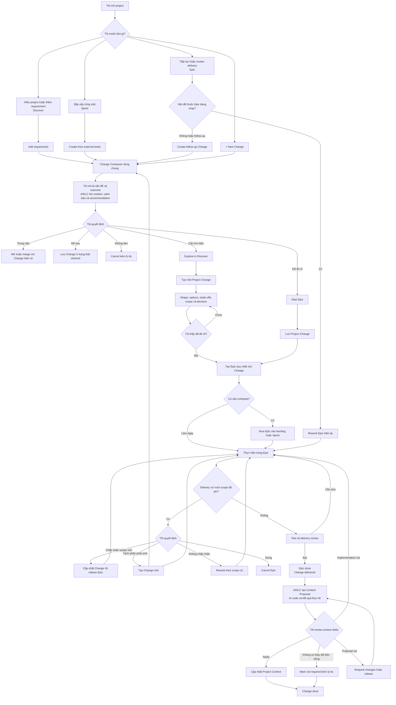
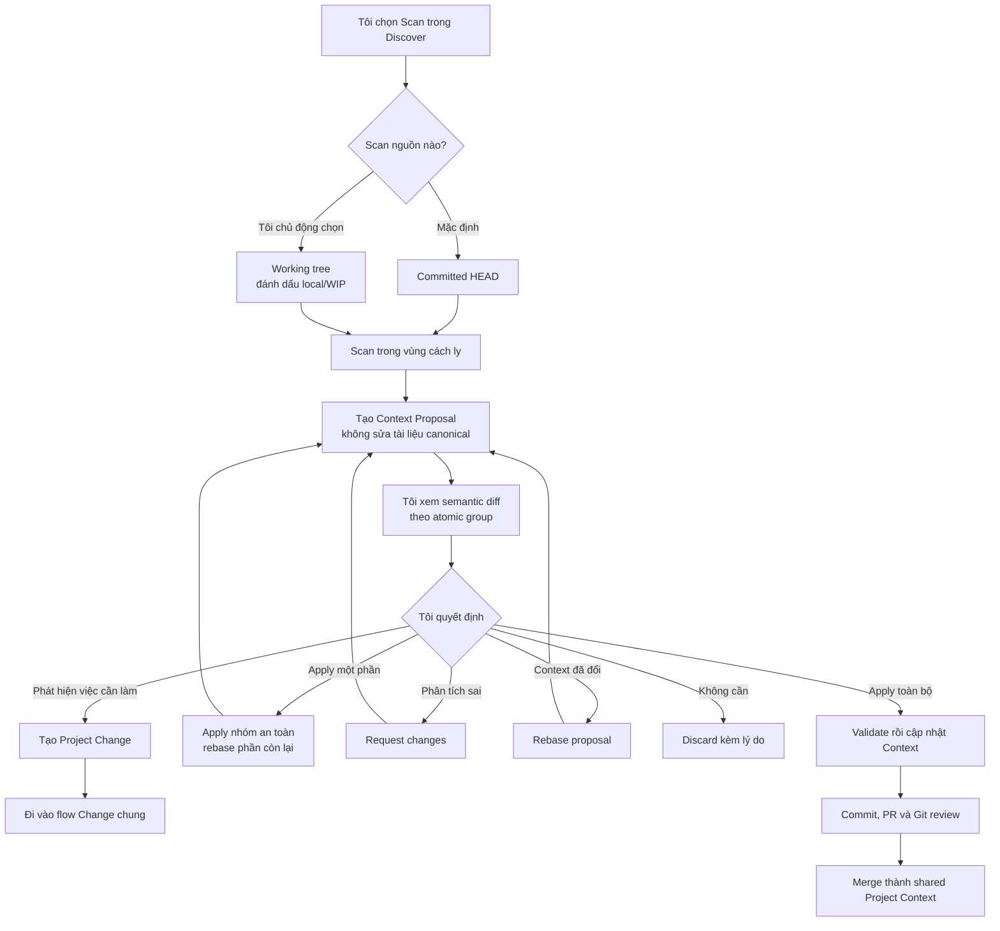

# Quản lý và phát triển project trong AIDLC

> Trạng thái: living architecture guide — dùng làm nguồn chung cho việc thảo
> luận và thiết kế sản phẩm. Đây không phải implementation plan hay checklist.

## 0. Master rule — bức tranh lớn

`Discover`, `Sprint` và `Epic` là ba view của **một hệ thống duy nhất** phục vụ
một mục đích: quản lý và phát triển project từ intent tới delivery rồi cập nhật
lại tri thức bền vững của project.

Master rule này có mức ưu tiên cao hơn mọi quyết định UI, data model, workflow,
implementation convenience và cơ chế tương thích ngược:

1. Một thay đổi chỉ có một identity xuyên suốt ba tab: `Project Change`.
2. Requirement đang được phát triển chỉ có một owner: Change. Epic pin snapshot
   để thi công; Sprint chỉ schedule Epic; Discover giúp hiểu Change và Project
   Context.
3. Tab chỉ quyết định **cách nhìn và action theo ngữ cảnh**, không được sở hữu
   bản copy dữ liệu, status hay lifecycle riêng.
4. `Project Context` là current durable truth. Scan, Shape và delivery chỉ tạo
   proposal; không tự ghi đè canonical context.
5. Human sở hữu các quyết định làm thay đổi intent, scope và canonical context.
   Hệ thống chịu trách nhiệm phân tích, validate, lưu provenance và thực hiện
   transition cơ học.

Bất kỳ thiết kế cục bộ nào tạo thêm backlog, requirement source, work identity,
status machine hoặc approval dead-end riêng cho một tab đều **không hợp lệ**,
dù cách đó dễ implement hơn. Khi các quyết định phía dưới có cách hiểu khác
nhau, phải chọn cách hiểu giữ đúng master rule này.

## 1. Mục tiêu chung

`Discover`, `Sprint` và `Epic` không phải ba sản phẩm hoặc ba workflow độc lập.
Chúng là ba góc nhìn lên cùng một mục tiêu: **quản lý và phát triển một
project từ lúc hiểu hiện trạng, quyết định thay đổi, tổ chức công việc, triển
khai, kiểm chứng, đến khi cập nhật lại tri thức chung của project**.

| Tab | Câu hỏi chính | Trách nhiệm |
| --- | --- | --- |
| Discover | Project hiện là gì và cần thay đổi điều gì? | Project Context, requirement, scope, lựa chọn, quyết định, ảnh hưởng và context delta. |
| Sprint | Việc nào làm trước, khi nào làm và ai phụ trách? | Backlog, ưu tiên, iteration, dependency, assignment và liên kết ticket ngoài. |
| Epic | Thay đổi đang được triển khai và kiểm chứng thế nào? | Delivery workflow, plan, code, test, review, evidence và kết quả thực tế. |

Ba tab không sở hữu ba lifecycle riêng. Mỗi tab chỉ hiển thị và thao tác trên
một phần của cùng một lifecycle project.

## 2. Đối tượng trung tâm

### 2.1 Project Context

Project Context là nguồn sự thật chung mô tả project hiện tại:

- Product intent và boundary.
- Functional/non-functional requirements.
- Feature, use case và user flow.
- Architecture, module, data/API/storage.
- Technical decision, project rule và test strategy.
- Stable ID, provenance, source evidence, revision và hash.

12 bước Discover hiện chiếu ra **14 file Markdown được quản lý** (bước
Architecture sở hữu `ARCHITECTURE.md`, `MODULES.md` và `DATA_FLOW.md`). Các file
này là projection để con người đọc và review Project Context; chúng không phải
12 form hoặc 12 gate bắt buộc cho mỗi thay đổi.

### 2.2 Project Change

`Project Change` là identity chung của một nhu cầu thay đổi project, bất kể nó
đến từ đâu:

- User nhập trực tiếp.
- Jira hoặc hệ thống quản lý công việc khác.
- GitHub issue, requirement file hoặc URL.
- Báo lỗi từ một Epic.
- Scan phát hiện code và context bị lệch.
- Maintenance hoặc refactor định kỳ.

Một Change cần chứa tối thiểu:

- Stable ID và nguồn tạo.
- Problem/outcome, type và priority.
- Acceptance criteria khi đã biết.
- Context revision dùng để hiểu Change.
- Scope/impact proposal và trạng thái freshness.
- Liên kết Shape và Epic nếu có; Sprint placement nội bộ thuộc về Epic.
- Event/audit history.

`Project Change` là trục liên kết; nó không được trở thành một workflow thứ tư
cạnh tranh với Discover, Sprint và Epic.

### 2.3 Shape

Shape là component quyết định tùy chọn nằm trong thư mục Project Change. Nó chỉ
được tạo khi user chọn `Explore in Discover`; Shape không có ID hoặc lifecycle
project độc lập.

Shape cần khi công việc còn mơ hồ, phạm vi lớn, có nhiều phương án hoặc thay đổi
kiến trúc/product boundary.

Shape giữ:

- Appetite và constraints.
- Options/trade-offs.
- Selected approach và rationale.
- Risks, no-gos, open questions và architecture impact.
- Reference tới Change revision/hash chứa problem, outcome và acceptance
  criteria mà quyết định Shape đang dựa trên.

Thay đổi nhỏ, bug đã rõ hoặc maintenance có scope chắc chắn không bị ép phải
đi qua Shape.

### 2.4 Sprint placement

Sprint placement là metadata tổ chức Epic theo thời gian và team:

- Backlog/sprint.
- Priority và ordering.
- Assignee/owner.
- Dependency và blocker.
- External ticket reference.

Nó không copy requirement và không tạo identity mới cho cùng một công việc.
Change có thể giữ priority, backlog order hoặc target release, nhưng không có
`sprintId` nội bộ. Ticket từ Jira/Sprint chưa liên kết Epic chỉ là intake
candidate và không được tính vào delivery capacity của AIDLC.

### 2.5 Epic delivery

Epic là đơn vị delivery. Nó pin đúng Change, context slice, Project Context
revision và source revision được dùng khi bắt đầu.

Một Change có tối đa một Epic và một Epic thuộc đúng một Change. Nếu scope cần
nhiều Epic, Change phải được split thành các Change độc lập trước delivery;
các Change mới giữ `splitFrom` để truy vết nguồn gốc.

### 2.6 Context Proposal

Context Proposal là thay đổi được đề xuất lên Project Context. Nó có thể sinh
ra từ:

- Scan source code.
- Một quyết định trong Shape.
- Kết quả delivery thực tế của Epic.
- Sửa lỗi/correction do con người nhập.

Proposal có base revision, item-level operations, provenance và trạng thái
review riêng. Canonical Project Context chỉ thay đổi khi proposal được apply.

## 3. Lifecycle hiển thị thống nhất

```text
Captured
   ↓
Understanding
   ├─ Needs input
   ├─ Shape required
   └─ Ready
        ↓
      Planned
        ↓
    In delivery
        ↓
  Delivery review
        ↓
     Delivered
        ↓
Context sync resolved
        ↓
       Done
```

Các trạng thái ngoại lệ:

- `stale`: source hoặc context liên quan đã thay đổi.
- `blocked`: dependency hoặc điều kiện kỹ thuật đang chặn.
- `needs-changes`: kết quả phân tích/delivery cần được sửa.
- `shelved`: hợp lệ nhưng chưa muốn làm.
- `cancelled`: đã quyết định không làm.
- `superseded`: đã được merge/split thành Change khác và chỉ còn để audit.

Không phải Change nào cũng phải xuất hiện lần lượt trong cả ba tab. Tab là view,
không phải gate.

Các nhãn trên là display lifecycle được suy ra từ disposition, Shape, Epic,
Context Proposal và freshness. Chúng không phải một field status duy nhất được
lưu và sửa thủ công trên Change.

## 4. Entry point thống nhất

User có thể tạo một thay đổi từ bất kỳ bề mặt phù hợp nào. Tất cả entry path
phải hội tụ về cùng một Change và cùng context resolver.



User mô tả **cái gì sai hoặc kết quả mong muốn**, không bị bắt chọn module,
source file, pipeline step hoặc nơi phải quay lại. Định tuyến kỹ thuật là việc
của hệ thống; lựa chọn hướng đi, quyết định cuối cùng và quyền thay đổi project
thuộc về con người.

## 5. Scope và impact

Impact là kết quả phân tích hỗ trợ quyết định, không phải một approval object
độc lập. Một scope proposal có thể chứa:

- Existing context IDs có liên quan.
- Context entity mới cần tạo.
- Source symbols hoặc module dự kiến liên quan.
- Dependencies và risks.
- Unknowns/conflicts.
- Confidence.
- Project Context/source revision dùng để phân tích.

`0 existing context matches` là kết quả hợp lệ cho một feature hoàn toàn mới.
Nó không được dùng để chặn delivery; hệ thống phải chỉ ra context mới dự kiến
cần tạo hoặc đánh dấu phần chưa xác định.

Review scope có các hành động mang ý nghĩa nghiệp vụ:

- **Bắt đầu delivery**: chọn workflow rồi tạo Epic, đồng thời pin revision.
- **Sửa requirement/scope**: proposal cũ trở thành stale.
- **Yêu cầu phân tích lại**: nhập feedback, giữ revision cũ trong history và
  tạo proposal mới.
- **Liên kết công việc hiện có**: tránh duplicate.
- **Để sau**: shelve và có thể reopen.
- **Huỷ/không làm**: đóng với reason/evidence.

Không có action chung chung `Confirm impact` hoặc `Reject impact`.

## 6. Quan hệ giữa Change và 12 projection

Một Change chỉ tác động các entity cần thiết. Ví dụ:

```text
CHG-123: Thêm cảnh báo vượt ngưỡng
 ├─ tạo FR-034
 ├─ tạo F-018
 ├─ cập nhật UC-007
 ├─ cập nhật FLOW-004
 └─ tham chiếu MODULE-NOTIFICATION
```

Renderer cập nhật các projection chứa những entity trên. Các tài liệu còn lại
không bị chạm tới.

| Loại Change | Context thường liên quan |
| --- | --- |
| Feature mới | Requirement, feature, use case/flow, plan và module liên quan. |
| Bugfix không đổi hành vi mong muốn | Feature/module/rule hiện có và test evidence; thường không sửa product requirement. |
| Refactor | Architecture, project structure, technical decision và rule. |
| Maintenance/dependency | Tech stack, architecture, rule và testing tùy loại. |
| Docs/context correction | Context Proposal; có thể không cần Epic. |

## 7. Scan an toàn trong môi trường team

Scan là một cách tạo Context Proposal, không phải quyền ghi thẳng vào canonical
Project Context.



Các invariant:

- Scan không sửa trực tiếp 14 Markdown projection do 12 bước Discover quản lý.
- Mặc định có thể scan `HEAD` dù working tree đang bẩn.
- Scan working tree là lựa chọn tường minh; proposal phải pin tree hash và được
  đánh dấu local/WIP.
- Proposal giữ base context revision và source revision.
- Teammate publish revision mới làm proposal thành `needs-rebase`, không bị ghi
  đè im lặng.
- Merge theo stable entity ID và field-level operation, không merge nguyên file
  Markdown khi có thể tránh.
- Full scan dùng cho bootstrap/recovery; hoạt động thường ngày ưu tiên
  incremental scan từ source revision đã publish gần nhất.

## 8. Đồng bộ ngược sau delivery

Impact trước delivery chỉ là dự đoán. Sau khi Epic hoàn tất, hệ thống so sánh:

- Scope đã pin.
- Code diff thực tế.
- Test/review evidence.
- Quyết định phát sinh trong delivery.
- Project Context revision hiện tại.

Từ đó tạo Context Proposal thực tế. Các kết quả hợp lệ:

- Cập nhật entity hiện có.
- Tạo entity mới.
- Retire/deprecate entity.
- Không có durable context change, kèm lý do.
- Conflict với context mới của teammate và cần rebase/review.

Epic có thể hoàn tất về mặt code trong khi Change hiển thị
`delivered · context pending` nếu Context Proposal chưa được giải quyết. Hai
trạng thái không được nhập làm một. Change chỉ chuyển `done` khi proposal được
apply hoặc user xác nhận `not-required` kèm lý do.

## 9. Các case chính

### Feature mới, scope chưa rõ

Change vào `Understanding`, tạo Shape, chốt approach rồi tạo Epic. Epic được đưa
vào Sprint; delivery xong thì sinh Context Proposal.

### Thay đổi nhỏ, scope đã rõ

Change có thể chuyển thẳng sang `Ready` và tạo Epic mà không cần Shape. Epic
sau đó có thể được đưa vào Sprint.

### Bug trong Epic đang chạy

User báo observed/expected behavior. Epic nhận feedback và quay lại rework phù
hợp; user không phải chọn pipeline step.

### Bug sau khi feature đã ship

Tạo Change và bugfix Epic mới với `relatesTo` Epic/feature gốc. Evidence ledger
và delivery lifecycle mới được tạo trên source hiện tại.

### Requirement thay đổi giữa delivery

- Thay đổi implementation detail: xử lý qua plan/review của Epic.
- Thay đổi product scope hoặc architecture decision: pause Epic, mở lại hoặc
  cập nhật Shape component của Change, publish Context Proposal rồi rebase
  Epic.

### Teammate thay đổi Project Context

- Không liên quan context slice của Epic: Epic tiếp tục.
- Liên quan nhưng merge được: hiển thị semantic delta và cho refresh/rebase.
- Xung đột scope/decision: pause tại human review.

### User không đồng ý kết quả phân tích

- Phân tích sai: `Request re-analysis` với feedback.
- Requirement sai: sửa requirement, invalidates proposal cũ.
- Trùng công việc: link existing Change/Epic.
- Không muốn làm lúc này: shelve.
- Không làm nữa: cancel.

### Tạo Epic lỗi giữa chừng

Conversion phải crash-safe và idempotent. Retry không tạo Epic thứ hai; trạng
thái pending phải có action tiếp tục hoặc huỷ rõ ràng.

### Hai thành viên tạo Change cùng lúc

ID không được phụ thuộc vào việc đọc “số lớn nhất hiện tại rồi +1” trên local
branch. Dùng UUID/ULID hoặc external stable key để tránh collision khi merge.

## 10. Product invariants

1. Một công việc có một identity xuyên suốt Discover, Sprint và Epic.
2. Không tab nào tạo bản copy requirement riêng làm nguồn sự thật thứ hai.
3. Không bắt user đi qua tab không cần thiết.
4. Human review luôn gắn với một decision cụ thể và có action tiếp theo.
5. Agent không tự publish context, tạo Epic hoặc thay đổi scope đã chấp nhận.
6. Mọi quyết định đều bind vào revision/hash đã được review.
7. Stale và conflict phải hiển thị rõ; không silent overwrite.
8. Scan và delivery chỉ đề xuất context delta; canonical context đổi qua apply.
9. Một Change có tối đa một Epic nhưng có thể giữ nhiều external reference.
10. 12 bước/14 Markdown file là projection, không phải workflow checklist.

## 11. Những anti-pattern đã loại bỏ

- Một tab `Công việc` con nằm riêng trong Discover và tạo backlog thứ hai.
- Lifecycle `WorkItem` cạnh tranh với Shape, Sprint và Epic.
- `Analyze impact → Confirm impact` nhưng không dẫn tới hành động tiếp theo.
- Bắt buộc impact phải match ít nhất một context ID cũ.
- Scan sửa canonical docs trước rồi mới cho user Keep/Revert.
- Bắt mọi feature, bug và maintenance đi qua cùng một chuỗi bước.
- Quan hệ nhiều-nhiều giữa Change và Epic làm ownership/roll-up mơ hồ.
- User phải chọn module, source file hoặc pipeline step để báo vấn đề.

## 12. Các quyết định đã chốt

### D1. Project Change là record operational độc lập

**Quyết định:** Chọn Option A.

`Project Change` được lưu độc lập trong AIDLC, dự kiến theo cấu trúc:

```text
.aidlc/changes/CHG-<ULID>/change.json
```

Khi user chọn Explore, cùng thư mục có thêm `shape.json` và event history.

Change giữ identity, intent, lifecycle, source, priority và các liên kết tới
Context, Shape, Epic. Project Context chỉ mô tả trạng thái bền vững của
project; thay đổi operational như assignee, sprint hoặc delivery status không
làm tăng Project Context revision.

Các hệ quả bắt buộc:

- ID phải an toàn khi nhiều thành viên tạo Change trên các branch khác nhau;
  không dùng cơ chế `max + 1`.
- Change pin Context revision/hash nhưng không copy toàn bộ Context.
- Jira/GitHub là source/reference, không thay thế identity nội bộ.
- Một Change tồn tại được khi không có integration bên ngoài.
- Khi Change hoàn tất, Context chỉ đổi qua một Context Proposal riêng.
- Link tới Shape/Epic phải được validate và có recovery action khi target thiếu
  hoặc stale.

### D2. User tự chọn đi thẳng Epic hay Explore trong Discover

**Quyết định:** Chọn Option C.

Khi tạo Change, user tự chọn một trong hai hướng:

```text
Explore in Discover
Start Epic
```

AIDLC có thể phân tích và hiển thị cảnh báo/recommendation, nhưng không tự định
tuyến và không yêu cầu user giải trình để override một đánh giá chủ quan của hệ
thống.

Hệ thống vẫn chặn các lỗi toàn vẹn khách quan như ID trùng, reference không hợp
lệ, revision conflict hoặc thiếu dữ liệu tối thiểu để tạo record. Các cảnh báo
về scope, độ lớn, architecture hoặc uncertainty chỉ mang tính tư vấn.

User có thể đưa một Change đã bắt đầu trực tiếp quay lại Discover khi delivery
phát hiện scope chưa rõ. Một Shape đã hoàn tất tạo đúng một Epic cho Change;
nếu cần nhiều Epic, user split Change trước khi bắt đầu delivery.

### Discover Context READY (CoFoFo delivery gate)

Pipeline `cofofo-feature` / `cofofo-bugfix` chỉ scaffold khi Discover Context
`inspect()` trả `ready`. **Publish Context** chốt một snapshot nội dung; Start
Epic so sánh live content với snapshot đó.

READY / stale dựa trên **content identity**, không dựa trên sidecar counter:

| Tham gia identity (đổi → stale) | Không làm stale |
| --- | --- |
| Hash tài liệu Discover (Markdown) | `index.revision` bookkeeping |
| Entities / rules đã biên dịch từ docs | Đổi `currentStep`, pin/flag item |
| `sourceTreeHash` (git HEAD + diff ngoài `.aidlc`) | `reindexAll` khi không có doc đổi |
| | File sinh ra dưới `.aidlc/` sau Publish (code-index, ECC bundle, …) |

Hệ quả bắt buộc:

- Publish xong rồi Reload Discover / chuyển bước UI **không** được làm Context
  stale nếu docs và source không đổi.
- Sửa requirement/feature Markdown hoặc source tracked ngoài `.aidlc` → phải
  Publish lại trước Start Epic.
- `scaffoldEpic` fail với “Discover changed after the last Publish Context” khi
  content identity lệch; không dùng Legacy Foundation để mở khóa.

### D3. Sprint chỉ schedule Epic

**Quyết định:** Chọn Option B.

Chỉ Epic là execution unit được đưa vào Sprint, estimate và tính capacity.
Change không xuất hiện như một Sprint item và không có `sprintId` nội bộ.

Các hệ quả bắt buộc:

- Mỗi Change có tối đa một Epic và vì vậy chỉ tham gia tối đa một Sprint tại một
  thời điểm thông qua Epic đó.
- Mỗi Epic hiển thị Change liên quan như provenance/context, không tạo một dòng
  Change riêng trong Sprint.
- Outcome progress của Change được xem ở Project/Discover hoặc Change detail,
  không roll up thành một Sprint row cạnh tranh với Epic.
- Ticket ngoài đã nằm trong Jira Sprint nhưng chưa link Epic được hiển thị như
  intake candidate; nó không được AIDLC tính estimate/capacity.
- Khi user chọn bắt đầu delivery từ một ticket/Change, hệ thống tạo hoặc link
  Epic trước, rồi mới schedule Epic đó.

### D4. Change và Epic có quan hệ một-một

**Quyết định:** Chọn Option C.

Một Change có `0..1` Epic: chưa có Epic trước delivery và đúng một Epic sau khi
bắt đầu. Mỗi Epic bắt buộc có đúng một owning Change.

Các hệ quả bắt buộc:

- `Start Epic` phải idempotent và từ chối gắn Epic thứ hai vào cùng Change.
- Nếu scope cần nhiều Epic, user thực hiện `Split Change` trước delivery. Mỗi
  Change kết quả có outcome/acceptance criteria độc lập và giữ `splitFrom`.
- Change gốc sau split chuyển `superseded`, giữ history nhưng không tham gia
  Sprint hoặc delivery.
- Nếu nhiều Change được nhận ra là cùng một delivery, user phải merge chúng
  thành một Change trước khi tạo Epic; các Change cũ chuyển `superseded`.
- Follow-up sau khi Epic hoàn tất là Change/Epic mới có `relatesTo`, không mở
  rộng quan hệ của Change cũ.
- Trong delivery, trạng thái Change phản ánh Epic duy nhất; `done` vẫn cần kiểm
  tra acceptance criteria và không chỉ dựa vào trạng thái đóng Epic.

### D5. External ticket chỉ là reference, không đồng bộ

**Quyết định:** Chọn Option A.

Mỗi Change luôn dùng AIDLC Change ID. Jira/GitHub/URL bên ngoài chỉ được lưu như
external reference, ví dụ `provider`, `key` và `url`.

Các hệ quả bắt buộc:

- Khi tạo Change từ ticket ngoài, AIDLC có thể dùng nội dung đang hiển thị để
  prefill form. Đây là snapshot một lần do user xác nhận, không phải sync.
- Sau khi Change được lưu, title, description, priority và status trong AIDLC
  độc lập với ticket ngoài.
- Không có background refresh, status mapping, conflict resolution hoặc
  write-back sang hệ thống ngoài.
- Sprint connector vẫn có thể hiển thị danh sách ticket lấy trực tiếp từ Jira
  như một nguồn intake. Chỉ Epic đã được tạo/link mới là item delivery nội bộ.
- UI cung cấp action `Open external ticket`; user tự đối chiếu hoặc cập nhật hệ
  thống ngoài khi cần.
- Việc ticket ngoài bị sửa/xoá không làm hỏng Change; reference có thể được đánh
  dấu unavailable nhưng history nội bộ vẫn còn.

### D6. Chỉ dừng delivery khi vượt scope boundary

**Quyết định:** Chọn Option C.

Trong delivery, AIDLC so sánh plan/code delta với outcome, acceptance criteria,
context slice, no-go và decision đã pin. Implementation detail được tiếp tục
trong Epic mà không hỏi user.

Epic phải dừng tại human review khi đề xuất có một trong các dấu hiệu:

- Thay đổi outcome hoặc acceptance criteria.
- Thêm/bỏ hành vi user-facing.
- Thay đổi public API hoặc data contract.
- Thay đổi security/compliance rule.
- Vượt module/context boundary đã pin.
- Vi phạm no-go hoặc architecture decision.

Review phải giải thích boundary nào bị vượt và đưa evidence cụ thể. User chọn:

- Chấp nhận scope mới: cập nhật Change/Context qua Discover rồi rebase Epic.
- Tách phần phát sinh thành Change mới và giữ scope Epic hiện tại.
- Không chấp nhận: trả plan/implementation về rework.
- Huỷ Epic.

Agent và AIDLC chỉ phát hiện, đề xuất và cung cấp evidence; chúng không tự thay
đổi product hoặc architecture scope.

### D7. Tách delivery status và context-sync status

**Quyết định:** Chọn Option C.

Epic được chuyển `done` khi code, test và delivery review hoàn tất; Sprint dùng
trạng thái này để tính delivery. Change lúc đó ở trạng thái `delivered` và có
một context-sync status riêng.

```text
Epic:             done
Change:           delivered
Context sync:     pending | needs-changes | applied | not-required
```

Nếu Context Proposal bị reject, canonical Context không thay đổi và user chọn
đúng recovery action:

- Proposal sai/thiếu: sửa proposal và review lại.
- Không có durable context change: xác nhận `not-required` kèm reason.
- Implementation sai scope/architecture: reopen Epic về `needs-changes`.
- Proposal dựa trên Context revision cũ: rebase rồi review lại.

Change chỉ chuyển `done` khi context sync là `applied` hoặc `not-required`.
Trạng thái `context pending` phải hiển thị ở Project/Discover nhưng không làm
Epic quay lại Sprint đang thực thi nếu delivery vẫn hợp lệ.

### D8. Partial apply theo dependency-safe group

**Quyết định:** Chọn Option C.

Context Proposal được chia thành các atomic group theo dependency. User chỉ
apply, request changes hoặc discard cả group; không chọn operation tùy ý bên
trong một group.

Các hệ quả bắt buộc:

- Mỗi group phải tự tạo ra một Project Context hợp lệ hoặc khai báo dependency
  bắt buộc với group khác.
- Các group được chọn được validate và apply trong một transaction.
- Project Context tạo revision mới sau mỗi lần partial apply thành công.
- Proposal gốc trở thành immutable history với trạng thái
  `partially-applied` và ghi rõ decision của từng group.
- Các group chưa giải quyết được chuyển sang proposal revision mới, loại bỏ
  operations đã apply và rebase lên Project Context revision vừa tạo.
- Nếu rebase tạo conflict hoặc dependency mới, revision mới phải quay lại
  review; không tự apply tiếp.
- Change giữ `context pending` cho tới khi mọi group được apply, sửa hoặc
  discard bằng một decision có lý do.

### D9. Git thực thi quyền; AIDLC quản lý review policy

**Quyết định:** Chọn Option C.

Quyền identity, write và merge vào nhánh project chính do Git provider, branch
protection và CODEOWNERS thực thi. AIDLC không đóng vai trò identity provider.

AIDLC giữ policy versioned trong repository, dự kiến:

```yaml
# .aidlc/project-policy.yaml
contextReview:
  approvalsRequired: 1
  allowSelfApproval: false
  conflictResolutionRole: maintainer
```

Các hệ quả bắt buộc:

- Contributor được tạo và rebase proposal trên branch của mình.
- AIDLC validate proposal, dependency group, base revision và approval policy.
- Reviewer/maintainer approval trong AIDLC là review evidence, không thay thế
  quyền merge của Git.
- `Apply` tạo canonical context changes trên branch/PR hiện tại; shared
  canonical context chỉ đổi khi Git merge vào nhánh project chính.
- Branch protection/CODEOWNERS là lớp chống bypass thực tế.
- Project solo có policy cho phép self-approval hoặc không yêu cầu approval.
- Project không dùng Git phải có local-owner fallback và UI phải nói rõ mức bảo
  vệ thấp hơn.

### D10. Tự chuyển tiếp khi semantic context slice không đổi

**Quyết định:** Chọn Option B.

Global Project Context revision thay đổi không tự động làm mọi Epic `stale`.
AIDLC tính hash trên dependency closure thực sự được Epic sử dụng, gồm stable
IDs, fields, relations, applicable rules và architecture decisions.

Epic giữ hai mốc khác nhau:

```text
baseContextRevision: revision đã pin khi bắt đầu, bất biến để audit
lastCheckedRevision: revision mới nhất đã được so sánh
contextSliceHash: hash của semantic slice đang sử dụng
```

Các hệ quả bắt buộc:

- Nếu global revision đổi nhưng `contextSliceHash` không đổi, AIDLC tự cập nhật
  `lastCheckedRevision`, ghi audit event và để Epic tiếp tục.
- Trường hợp này được gọi là `current` hoặc `forward-checked`, không phải
  `stale`.
- Nếu stable entity, field, relation, rule hoặc decision trong dependency
  closure thay đổi, Epic chuyển `stale` và hiển thị semantic diff.
- Nếu hệ thống không xác định chắc delta có liên quan hay không, fail closed:
  coi là liên quan và yêu cầu human review.
- Auto-forward không thay đổi `baseContextRevision` hoặc xoá provenance của
  context ban đầu.

### D11. Human sở hữu decision; AIDLC thực hiện transition cơ học

**Quyết định:** Chọn Option C.

UI không cung cấp dropdown để sửa status tùy ý. User thực hiện action có ý nghĩa
nghiệp vụ; AIDLC validate precondition, ghi event và cập nhật trạng thái.

Human sở hữu các quyết định:

- Chọn `Explore in Discover` hoặc `Start Epic`.
- Chấp nhận, sửa hoặc từ chối scope.
- Shelve/cancel Change.
- Split/merge Change.
- Approve hoặc yêu cầu sửa delivery.
- Apply/request changes/discard Context Proposal.
- Xác nhận `not-required`.

AIDLC thực hiện các transition cơ học:

```text
Epic được tạo        → Change: planned
Epic bắt đầu         → Change: in_delivery
Epic được duyệt      → Change: delivered
Context chưa xong    → contextSync: pending
Delivery + context
đã giải quyết        → Change: done
```

AIDLC tự tính `stale`, `blocked` và các precondition từ revision, dependency
và gate. `superseded` chỉ được ghi sau action split/merge do user xác nhận.
Agent chỉ được đề xuất action/transition, không được thực hiện.

### D12. Change sở hữu requirement trong lifecycle

**Quyết định:** Chọn Option A.

Change là canonical editable source của problem, desired outcome, scope và
acceptance criteria trước và trong delivery.

Epic lưu Change ID, revision/hash và một immutable execution snapshot; agent
không sửa requirement bằng cách ghi một bản `REQUIREMENT.md` độc lập trong
Epic. Shape bổ sung option/trade-off/decision nhưng không trở thành nguồn
requirement thứ hai.

Project Context mô tả trạng thái bền vững hiện có của project sau khi Context
Proposal được apply. Nó không trình bày requirement chưa delivery như một
capability đã tồn tại.

Nếu requirement thay đổi giữa delivery:

1. User sửa Change và tạo Change revision mới.
2. Epic giữ provenance revision cũ và chuyển `stale`.
3. User review semantic diff rồi rebase, tách Change hoặc từ chối thay đổi.

Sau khi hoàn tất, Change giữ lịch sử requested state; Project Context giữ
current project state. UI phải phân biệt rõ hai khái niệm này.

### D13. Shape là component tùy chọn của Change

**Quyết định:** Chọn Option A.

Không tạo identity `SHAPE-*` hoặc lưu Shape trong collection riêng. Storage dự
kiến:

```text
.aidlc/changes/CHG-<ULID>/
├── change.json
├── shape.json       # chỉ có khi user chọn Explore in Discover
└── events/
    └── EVT-<ULID>.json
```

Change tiếp tục sở hữu problem, outcome, scope và acceptance criteria. Shape chỉ
giữ options, trade-offs, selected approach, rationale, risks, no-gos, open
questions, architecture impact và acceptance hash/revision.

Các hệ quả bắt buộc:

- Direct Epic không tạo `shape.json` rỗng.
- Shape dùng cùng Change ID và không có top-level status cạnh tranh với Change.
- Epic luôn pin Change ID/revision; nếu đã shape thì pin thêm `shapeHash`.
- Sửa Change làm shape acceptance cũ stale khi nội dung quyết định bị ảnh hưởng.
- Split/merge Change phải xử lý shape component và provenance trong cùng một
  transaction.
- `ShapeService` độc lập hiện tại cần được refactor thành component service của
  Change thay vì tiếp tục tạo `.aidlc/shapes/SHAPE-*`.

### D14. Lưu fact độc lập và suy ra display status

**Quyết định:** Chọn Option B.

Change không lưu một status enum chứa mọi tổ hợp. Mỗi owner giữ fact của mình:

```text
Change     → disposition
Shape      → shaping/decision status
Epic       → delivery status
Context    → context-sync status
Hashes     → freshness được tính
```

Contract dự kiến:

```ts
disposition: 'active' | 'shelved' | 'cancelled' | 'superseded'
shape?: { status: 'exploring' | 'ready' | 'accepted' }
epicId?: string
contextSync: 'not-started' | 'pending' | 'needs-changes'
  | 'applied' | 'not-required'
```

Delivery status được đọc từ Epic duy nhất, không copy sang Change. Freshness
`current | stale | conflict` được tính từ revision/hash và không editable.

UI suy ra display status như `Understanding`, `Ready`, `Planned`,
`In delivery`, `Delivered` hoặc `Done`, đồng thời hiển thị badge độc lập
cho stale, blocked và context pending. Derived-state logic phải có một hàm
canonical dùng chung cho Discover, Sprint và Epic, kèm exhaustive tests.

### D15. Một Change Composer dùng chung, entry point theo ngữ cảnh

**Quyết định:** Chọn Option C — phương án khuyến nghị.

Ba tab dùng chung một `Change Composer`, một command contract và một service.
Mỗi entry point chỉ prefill dữ liệu phù hợp với ngữ cảnh, không tạo flow hoặc
loại Change riêng:

- Top bar `+ New Change`: composer trống.
- Discover `+ Add requirement`: prefill context IDs đang xem và mặc định
  `Explore in Discover`.
- Sprint `Create from ticket`: prefill title, outcome, external reference và
  mặc định `Start Epic`.
- Epic `Report issue`: prefill Epic/Change liên quan, observed/expected; user
  chọn rework Epic hiện tại hoặc tạo Change mới.
- Epic `Create follow-up`: tạo Change mới với `relatesTo` Epic gốc.

Mặc định chỉ là gợi ý. Trước khi submit, user luôn có thể đổi giữa
`Explore in Discover` và `Start Epic` theo D2. Composer trả về cùng một Change
ID; sau đó UI mở đúng view cho action đã chọn.

### D16. Storage và audit phải an toàn khi nhiều branch cùng đóng góp

**Quyết định:** Dùng ULID, immutable event file và optimistic concurrency.

Change, Context Proposal và event dùng ULID; không dùng sequence `max + 1`.
Mỗi event là một file riêng để hai branch không cùng append vào một
`events.ndjson` và tạo conflict không cần thiết.

Mọi mutation phải:

- Đọc `revision` và `contentHash` hiện tại.
- Gửi `expectedRevision`/`expectedHash` trong command.
- Ghi snapshot bằng temp file + atomic rename.
- Ghi event immutable có `actor`, `timestamp`, `commandId`, before/after hash
  và provenance.
- Dùng `commandId` làm idempotency key để retry không tạo Epic, event hoặc
  proposal thứ hai.

Nếu compare-and-swap thất bại, hệ thống hiển thị semantic diff và yêu cầu
reload/rebase. Không có last-write-wins hoặc silent overwrite. Link bị thiếu
được đánh dấu `broken-reference` kèm recovery action, không bị tự xoá.

### D17. Context Proposal là vùng cách ly Git-like

**Quyết định:** Proposal là artifact độc lập, review/apply theo atomic group.

Storage dự kiến:

```text
.aidlc/context-proposals/CP-<ULID>/
├── proposal.json
├── groups/
│   └── GRP-<ULID>.json
└── events/
    └── EVT-<ULID>.json
```

Scan mặc định đọc committed `HEAD`; scan working tree phải được user chọn rõ và
pin source tree hash với badge `local/WIP`. Scan chỉ ghi vào proposal directory,
không sửa 12 projection hoặc canonical context.

Khi apply, AIDLC validate base revision, policy, dependency và current hash;
các group được chọn được apply atomically trên branch hiện tại. Revision chỉ
trở thành shared canonical truth khi branch/PR được Git merge. Partial apply,
rebase và conflict tuân theo D8-D10.

### D18. Ba tab render cùng fact, không nhân bản workflow

**Quyết định:** Dùng một read model và một hàm derived-state dùng chung.

- Discover hiển thị Project Context và các Change đang cần exploration,
  decision hoặc context sync; nó không chứa backlog `WorkItem` riêng.
- Sprint chỉ hiển thị/schedule Epic và intake ticket ngoài; Change xuất hiện
  như provenance của Epic, không thành một row capacity thứ hai.
- Epic hiển thị execution, evidence và delivery state; mọi sửa intent/scope đi
  về owning Change thay vì tạo requirement copy.
- Change detail dùng chung có thể mở từ cả ba tab, giữ nguyên ID, history,
  display lifecycle và freshness badges.

Host/core cung cấp một `ProjectChangeSummary` và một hàm
`deriveProjectChangeState(...)`. Tab chỉ thêm contextual action; không tự ánh
xạ status hoặc tự suy luận một lifecycle khác.

### D19. Tương thích dữ liệu cũ không được giữ lại mô hình sai

**Quyết định:** New writes dùng model mới; legacy data qua compatibility
adapter và migration tường minh.

- Loại bỏ `WorkItem`/`ProjectWorkService` và panel backlog con trong Discover.
- Refactor `ShapeService` độc lập thành Shape component của Change.
- Legacy Shape/Epic được đọc ở chế độ compatibility và gắn badge
  `legacy/unlinked`; không âm thầm rewrite toàn bộ repository.
- Khi user mở hoặc sửa artifact cũ, UI cung cấp one-time action tạo/link Change
  và preview diff trước khi migrate.
- Epic mới bắt buộc có owning Change. Artifact legacy chưa migrate vẫn đọc
  được nhưng không được dùng làm khuôn cho write mới.

Migration phải idempotent, giữ original ID/path trong provenance và có test
fixture cho retry, conflict và interrupted write.

### D20. Product Tour là lớp hướng dẫn và verification, không phải workflow mới

**Quyết định:** Product Tour chỉ giúp user hiểu, tìm và kiểm chứng các action của
lifecycle hiện có. Nó không tạo tab, entity, source of truth, permission hoặc
transition song song với Project Change, Project Context, Discover, Sprint và
Epic.

- Extension giữ đúng một VS Code Walkthrough chính và cập nhật nó cho lifecycle
  mới; không tạo nhiều walkthrough cạnh tranh nhau.
- `WorkspaceShell` luôn có entry point `Hướng dẫn` để Start, Resume, chọn
  scenario và Restart Product Tour không giới hạn. Command Palette là entry
  point dự phòng; card onboarding trong Project chỉ là gợi ý có thể dismiss.
- Product Tour mặc định là non-modal trên project thật: coach và highlight chỉ
  gợi ý next action, không khóa các lựa chọn nghiệp vụ khác.
- Spotlight có thể dim khoảng 45–55% và blur nhẹ `1–2px` khi user bấm
  `Chỉ cho tôi vị trí`, hoặc trong demo sandbox. Spotlight chỉ chặn pointer bên
  ngoài target trong thời gian focus và luôn có `Bỏ qua`, `Thoát` và `Esc`.
- Modal khóa chỉ dùng để lấy lựa chọn bắt buộc trước khi bắt đầu, ví dụ
  `Demo an toàn` hay `Project hiện tại`, hoặc confirmation nguy hiểm vốn đã
  thuộc domain flow. Tour không được dùng blur/modal để ép user Accept impact,
  Start Epic, Apply Context hoặc chọn một route duy nhất.
- Hoàn thành step được suy ra từ command result và shared lifecycle read model
  trên đúng Change/Epic/Proposal đã bind; click hoặc mở tab không tự được tính
  là thành công.
- Tiến độ tour là state cá nhân của VS Code, không ghi vào repository, domain
  event hoặc Project Context. Restart chỉ reset tiến độ tour, không sửa hay xóa
  domain data.
- Menu Hướng dẫn giữ ba scenario cố định và một row **Dynamic tour** (thay demo
  workspace riêng): popup hỏi mục tiêu, đối chiếu state project, lên plan các
  bước còn thiếu. Không mở demo folder trong globalStorage.
- Tour có thể đi nhánh, skip, resume sau reload và thích ứng với reject, stale,
  conflict, cancel, command failure hoặc entity bị teammate thay đổi. Không có
  step nào được biến thành dead-end.
- Trên project dùng CoFoFo delivery (`cofofo-feature` / `cofofo-bugfix`), Product
  Tour phải hướng dẫn Publish Discover Context tới trạng thái `ready` **trước**
  Start Epic khi goal cần delivery. Scaffold fail vì Context stale/draft không
  phải bug domain — đó là thiếu evidence của bước `lifecycle.discover-context-ready`.
- UI phải dùng stable semantic target, hỗ trợ keyboard/screen reader, theme và
  reduced motion. Tour không tự click DOM hoặc dựa vào CSS selector tùy ý.

Product Tour có thể thu hẹp sự chú ý, nhưng không được che giấu hoặc vô hiệu hóa
các lựa chọn nghiệp vụ hợp lệ. Mọi mutation vẫn đi qua command, validation,
permission và recovery của lifecycle gốc.

## 13. Trạng thái quyết định

Baseline kiến trúc hiện không còn câu hỏi mở cần user chọn. Các câu hỏi ban đầu
và các chủ đề tiếp theo đã được chốt tại D1-D20 theo option user chọn hoặc
phương án khuyến nghị.

Chi tiết implementation phát sinh được quyết định theo thứ tự ưu tiên:

1. Master rule.
2. Product invariants và D1-D20.
3. Data integrity, team safety và khả năng audit/recovery.
4. UX đơn giản nhất không làm sai ba tầng trên.
5. Implementation convenience và compatibility.

Nếu một chi tiết không thể thỏa đồng thời các tầng trên, không tự tạo ngoại lệ;
phải đưa nó trở lại thảo luận như một thay đổi kiến trúc có impact rõ ràng.

## 14. Hướng triển khai tiếp theo

Baseline này được chuyển thành implementation theo thứ tự:

1. Contract `ProjectChange`, independent facts, commands và derived-state.
2. Repository transaction, immutable events, optimistic concurrency và
   recovery.
3. Context Proposal isolation, diff/group/rebase/apply semantics.
4. Shared Change Composer và Change detail.
5. Projection vào Discover, Sprint và Epic.
6. Compatibility adapter/migration; sau đó xoá model và UI legacy.
7. Product Tour/Guided Verification bám vào vertical slice đã hoạt động; không
   tạo fake action để che dependency lifecycle còn thiếu.

Mỗi phase phải có contract/invariant tests trước khi nối UI. Acceptance cuối
cùng không phải “tab chạy được”, mà là cùng một Change đi xuyên ba view, sống
sót qua concurrent branch edits và hoàn tất vòng lặp delivery → context sync.
