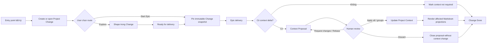
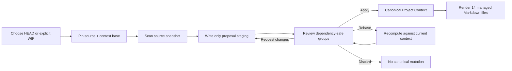
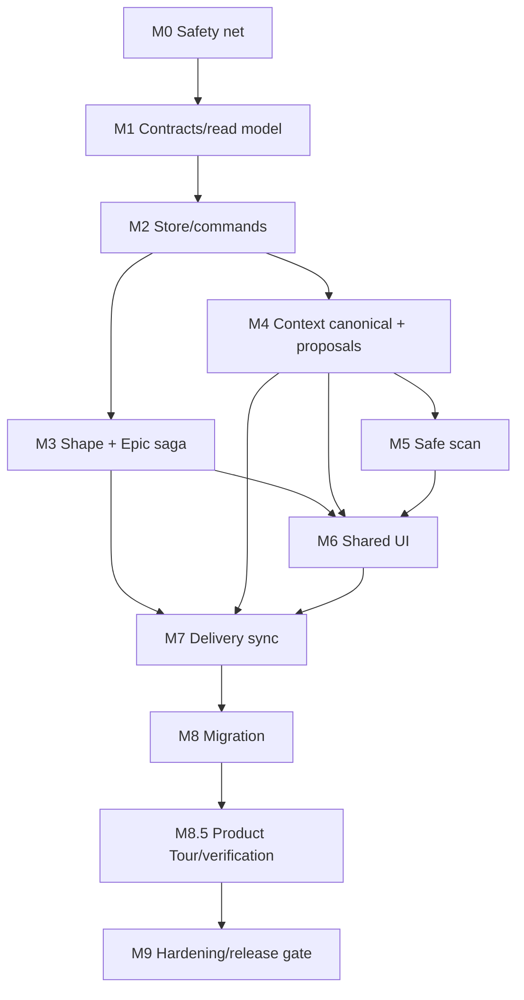
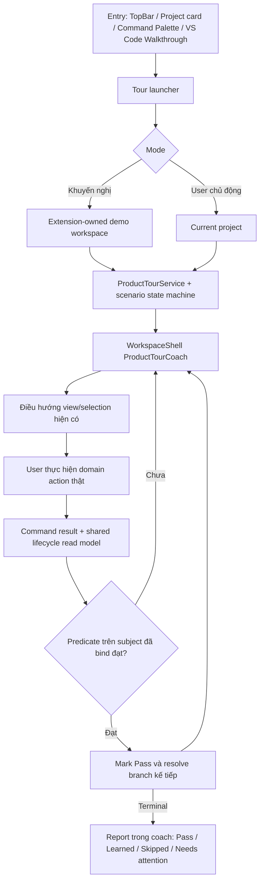

# Implementation plan: một lifecycle quản lý và phát triển project

> Trạng thái: **implementation-ready** sau khi áp dụng các contract khóa ở mục
> 18; session mới không được tự chọn lại domain, storage, migration hoặc UI
> protocol nếu chưa cập nhật Master Rule trước.
>
> Nguồn quyết định bắt buộc: `docs/PROJECT_LIFECYCLE_GUIDE.md`.
>
> Baseline khi lập plan: branch `codex/git-like-context-sync`, commit
> `8afa225 feat(discover): add work items panel, retire stale docs`.
>
> Plan này mô tả **cách implement**. Nếu một chi tiết trong plan mâu thuẫn với
> Master Rule hoặc D1–D20 trong guide, guide thắng và plan phải được cập nhật
> trước khi tiếp tục code.

## 1. Mục tiêu và kết quả cuối

Thay extension từ ba workflow rời rạc thành ba view của cùng một hệ thống:

- `Discover` hiểu project, làm rõ Change, review Context Proposal.
- `Sprint` chỉ tiếp nhận ticket ngoài và schedule Epic.
- `Epic` thực thi, kiểm chứng và bàn giao một Change.
- `Project Change` là identity duy nhất đi xuyên suốt ba tab.
- `Project Context` là current durable truth; 12 bước Discover chiếu ra 14
  Markdown file được quản lý.
- Scan, Shape và kết quả delivery chỉ tạo proposal; human mới Apply vào context.

Khi hoàn thành, một user phải có thể đi trọn luồng sau mà không tạo record hoặc
status trùng lặp:



Scan là một nguồn proposal độc lập, không phải một cách ghi thẳng vào docs:



## 2. Master Rule và các invariant không được thương lượng

Session implement phải đọc toàn bộ `docs/PROJECT_LIFECYCLE_GUIDE.md` trước khi
sửa code. Các invariant dưới đây là checklist rút gọn, không thay thế guide:

1. Một nhu cầu chỉ có một `Project Change`; không có `WorkItem`, Shape, ticket
   hoặc Epic thứ hai sở hữu cùng requirement.
2. Change sở hữu requirement đang thay đổi. Epic chỉ pin snapshot bất biến của
   Change tại thời điểm bắt đầu delivery.
3. Shape là component tùy chọn trong Change, không có top-level ID và không có
   lifecycle riêng cạnh tranh với Change.
4. Sprint chỉ schedule Epic. Ticket Jira/GitHub chỉ là external reference trên
   Change, không phải nguồn requirement đồng bộ hai chiều.
5. Lifecycle hiển thị được **derive** từ các fact canonical. Không có API
   `setStatus` tổng quát và không lưu một display status dễ lệch ở từng tab.
6. Phân tích impact là advisory. User không cần `Confirm impact` mới được đi
   tiếp. Nếu không đồng ý, user có thể sửa requirement, yêu cầu phân tích lại,
   Explore, Start Epic, hoặc shelve Change.
7. Scan mặc định đọc committed `HEAD` dù working tree đang dirty. `WIP` là mode
   explicit, có source hash riêng và cảnh báo rõ.
8. Agent/system chỉ propose. Human sở hữu thay đổi intent, scope, quyết định
   Shape, tạo Epic và Apply canonical context.
9. `delivery complete` và `context synchronized` là hai fact riêng.
10. Ghi dữ liệu phải an toàn khi nhiều branch cùng đóng góp: ID không tuần tự,
    optimistic concurrency, event file bất biến, operation idempotent.
11. Dữ liệu cũ chỉ được đọc/migrate qua adapter; không tiếp tục phát sinh write
    mới theo model sai để giữ compatibility.
12. Discover, Sprint, Epic và Project render cùng một read model do core derive;
    webview không tự suy lifecycle riêng.

## 3. Ranh giới scope

### Trong scope

- Contract, persistence, command và derived state cho Project Change.
- Shape trở thành component của Change.
- Điều phối tạo Epic idempotent, quan hệ Change–Epic 1:1 và provenance snapshot.
- Context Proposal có staging, review group, rebase, apply và discard.
- Scan HEAD/WIP an toàn, không sửa canonical docs trước Apply.
- Chuyển Project Context có cấu trúc thành canonical source; Markdown là
  deterministic projection.
- Shared Change Composer/Detail và projection đúng theo từng tab.
- Luồng delivery-to-context-sync và scope boundary trong Epic.
- Adapter/migration cho `.aidlc/work-items`, `.aidlc/shapes` và Epic không có
  Change.
- Unit, concurrency, integration, webview logic và manual journey tests.

### Ngoài scope của đợt này

- Đồng bộ/writeback hai chiều với Jira, GitHub hoặc hệ thống ticket khác.
- Thay Git làm hệ thống phân quyền; AIDLC chỉ đưa review policy và bằng chứng.
- Tự động Apply context bởi agent.
- Nhiều Epic cho một Change hoặc một Epic cho nhiều Change.
- Xây thêm tab/backlog/lifecycle độc lập.
- Tạo Sprint aggregate/local timebox manager mới; đợt này reuse Jira sprint
  picker và bổ sung internal backlog/placement trong cùng Sprint tab.
- Viết lại toàn bộ Epic engine đang chạy nếu adapter có thể giữ behavior hợp lệ.

## 4. Audit trạng thái code hiện tại

Đây là baseline đã audit tại commit nêu trên. Session mới phải chạy lại
`git status --short`, `git rev-parse --short HEAD` và kiểm tra diff trước khi áp
dụng; không được ghi đè thay đổi của user.

| Khu vực | Hiện trạng | Khoảng cách tới kiến trúc đích |
| --- | --- | --- |
| Work item | `contracts/workItem.ts`, `ProjectWorkService.ts`, `WorkItemsPanel.tsx` tạo `.aidlc/work-items/WORK-*` | Domain identity/lifecycle thứ tư phải thay bằng Change; surface form/list của `WorkItemsPanel` có thể refactor và tái sử dụng |
| Shape | `contracts/shape.ts`, `ShapeService.ts`, `ShapeStore.ts` dùng `SHAPE-nnn` và `.aidlc/shapes` | Shape đang sở hữu problem/outcome/AC và lifecycle riêng; phải nhúng vào Change |
| Epic core | `EpicService`/`EpicStore` dùng `.aidlc/epics` | Có nền tảng mới nhưng event và liên kết Change chưa đạt concurrency/provenance đích |
| Epic extension | `EpicScaffold`, `StartEpicModal`, `epicsList.ts` dùng `docs/epics` | UI vẫn tạo Epic trực tiếp, có persistence song song và ID max+1 |
| Discover scan | `DiscoverService` snapshot docs, agent sửa canonical docs, rồi Keep/Revert | Write-first; phải staging proposal và Apply sau review |
| Project Context | `DiscoverContextPublisher` đọc Markdown rồi publish structured context | Chiều canonical đang ngược; structured context phải là truth, Markdown là projection |
| Discover handoff | `discoverHost.ts`, `HandoffPanel.tsx` scaffold Epic trực tiếp | Mọi handoff phải tạo/mở Change trước |
| Sprint | `sprintStartTask` mở Start Epic và dùng ticket key như Epic ID | Ticket phải prefill Change Composer; Sprint chỉ schedule Epic |
| Read model | Host/webview tự copy DTO và suy trạng thái cục bộ | Phải derive một lần ở core rồi dùng chung |
| Migration | Có `LegacyMigrationService` và `LegacyCompatibility` cho Epic | Có pattern tốt nhưng chưa bao phủ WorkItem/Shape/unlinked Epic/context bootstrap |

Điểm quan trọng: domain WorkItem vừa thêm không phải nền tảng để mở rộng. Nó là
prototype trái Master Rule và phải được thay thế trong cùng feature branch.
Điều này **không** có nghĩa phải vứt bỏ UI form/list đã có: giữ surface, sửa
model/action phía dưới thành Change. Không release trạng thái trung gian sau khi
ngắt WorkItem write path mà trước khi Change UI đã hoạt động.

### 4.1 Audit tái sử dụng UI hiện tại

Audit code ở baseline cho thấy hầu hết surface đã có. Quy tắc implementation là
**extend in place**; không dựng một màn hình song song rồi chuyển user sang đó.

| Nhu cầu UX | Surface/component hiện có | Quyết định implementation |
| --- | --- | --- |
| App shell/top tabs | `WorkspaceShell.tsx`, `TopBar` với `project`, `discover`, `epics`, `sprint` | Giữ nguyên shell và `WorkspaceView`; chỉ thêm selection/overlay state tối thiểu |
| Project overview | `ProjectOverview.tsx` có overview, context, active task, attention metrics | Giữ màn hình; đổi data từ Epic-only sang shared Change read model và đổi primary action |
| Capture requirement/start work | `StartEpicModal.tsx` đã có title, description, external source loading, pipeline và project selection | Refactor modal hiện có thành Change-first composer; không tạo modal `ChangeComposer` thứ hai |
| Change list/form sơ khai | `discover/WorkItemsPanel.tsx` đã có form, list card và impact actions | Giữ/rework markup thành Change list/detail entry; xóa WorkItem semantics và confirmation gate |
| Discover project/context | `DiscoverView.tsx`, `DiscoverWorkspace.tsx`, `StepRail.tsx`, `DocsMode.tsx`, `StepStatusView.tsx` | Giữ toàn bộ master/detail, 12-step rail, docs mode và agent pane; thay canonical data flow |
| Discover entity detail/history | `DiscoverItemDetailDialog.tsx`, `DiscoverRecordDetailDialog.tsx` | Generalize dialog shell/tabs/history cho Change/context detail; không mở full-page detail mới |
| Scan configuration | `DiscoverScopeModal.tsx` đã chọn repo layout/scope | Thêm bước HEAD/WIP và Context base vào modal hiện có; không tạo `StartScanModal` khác |
| Scan/run review | active-run banner, `DiffView.tsx`, `ChecksView` trong `DiscoverWorkspace.tsx` | Đổi nội dung/actions thành Context Proposal/dependency groups; giữ modal/list surface hiện có |
| Discover handoff | `HandoffPanel.tsx` và `SuggestionCard` | Giữ vị trí và cards; action mở Change-first modal thay vì scaffold Epic trực tiếp |
| Sprint | `SprintView.tsx`, `SprintTicketList.tsx`, `SprintTicketDetail.tsx` và Jira modals | Giữ màn hình master/detail và Jira setup; đổi link/action `ticket → Change → Epic` |
| Epic list/detail | `EpicsView.tsx`, `EpicListPanel.tsx`, `EpicDetail.tsx` | Giữ nguyên v3 master/detail; bổ sung owning Change, snapshot, boundary và context close-out |
| Migration entry | nút `Migrate` trong `EpicListPanel`, command `aidlc.migrateEpics`, init/context card trong `ProjectOverview` | Giữ entry points; thêm preview/recovery bằng `Modal` hiện có, không tạo Workspace Upgrade page |
| Modal/confirmation | `Modal.tsx`, `ConfirmModal.tsx` | Reuse accessibility/keyboard/backdrop behavior; chỉ tạo content component khi cần |

Chỉ có **domain presentation chưa tồn tại** cần bổ sung như component con:

- nội dung Change detail đầy đủ;
- Shape editor bên trong Discover;
- dependency-group selector cho Context Proposal;
- migration mapping resolver.

Bốn phần này được mount trong screen/modal hiện có. Chúng không trở thành tab,
route hoặc top-level screen mới.

## 5. Kiến trúc đích

### 5.1 Module ownership

```text
packages/core/src/
  contracts/
    change.ts                 # canonical contracts + validation
    contextProposal.ts        # proposal/operation/group contracts
    projectReadModel.ts       # DTO dùng chung cho các view
  change/
    ChangeStore.ts            # CAS, idempotency, immutable events
    ChangeService.ts          # domain operations, no UI concerns
    deriveProjectChangeState.ts
    ChangeEpicCoordinator.ts  # saga tạo/link Epic
    index.ts
  context/
    ProjectContextRepository.ts
    ContextProposalStore.ts
    ContextProposalService.ts
    ContextProjectionRenderer.ts
    ContextBootstrapService.ts
    ContextRebaseService.ts
    index.ts
  source/
    ProjectSourceReader.ts
    GitHeadSourceReader.ts
    WorkingTreeSourceReader.ts
  storage/
    atomicJson.ts
    WorkspaceTransaction.ts
  migration/
    ProjectLifecycleMigrationService.ts

packages/extension/src/webview/components/
  WorkspaceShell.tsx          # extend current view/overlay coordination
  ProjectOverview.tsx         # evolve existing overview to Change read model
  StartEpicModal.tsx          # evolve in place into Change-first composer
  discover/
    WorkItemsPanel.tsx        # refactor in place; Change list/detail entry
    DiscoverWorkspace.tsx     # keep master/detail + existing modes
    DiscoverScopeModal.tsx    # add HEAD/WIP to existing scan wizard
    DiffView.tsx              # evolve into Context Proposal review modal
    HandoffPanel.tsx          # route handoff through Change
    ChangeShapeEditor.tsx     # new content only, mounted in DiscoverWorkspace
    ProposalGroupSelector.tsx # new content only, mounted in DiffView
  sprint/
    SprintTicketDetail.tsx    # preserve screen, change primary action
  epic-v3/
    EpicDetail.tsx            # preserve screen, add Change/sync sections
```

Không đổi tên `StartEpicModal.tsx` hoặc `WorkItemsPanel.tsx` chỉ để đẹp trong
milestone đầu; rename cơ học chỉ làm sau khi behavior mới ổn định và mọi caller
đã chuyển, trong cùng một commit dễ review. Boundary vẫn bắt buộc: domain và
derived state thuộc core; host chỉ orchestration; webview chỉ render/dispatch
command.

### 5.2 Layout dữ liệu trong workspace của user

```text
.aidlc/
  project.json
  project-policy.yaml
  changes/
    CHG-<ULID>/
      change.json
      shape.json                         # optional, không có Shape ID
      analyses/
        ANL-<ULID>.json
      events/
        EVT-<ULID>.json
  context/
    current.json                         # atomic head pointer; không chứa entity body
    objects/
      <sha256>.json                      # content-addressed objects
    revisions/
      CTX-<ULID>.json
  context-proposals/
    CP-<ULID>/
      proposal.json
      groups/
        GRP-<ULID>.json
      objects/
        <sha256>.json
      approvals/
        APR-<ULID>.json
      events/
        EVT-<ULID>.json
  epics/
    EPIC-<ULID>/
      state.json
      start.json                         # immutable pinned Change/context/source
      events/EVT-<ULID>.json
  runs/
    RUN-<ULID>/
      state.json
      events/EVT-<ULID>.json
  sprint/
    placements/
      EPIC-<ULID>.json
  transactions/
    TXN-<ULID>/
      manifest.json
      before/
      after/
  migrations/
    project-lifecycle-v1/
      migration-<hash>/
        manifest.json
        backups/
```

Existing compatible paths under `.aidlc/discover/objects` và
`.aidlc/discover/history/revisions` có thể được adapter đọc trong migration.
Không copy object nếu hash giống nhau; sau migration, write mới chỉ đi qua
`.aidlc/context`.

`EpicService` là canonical domain API duy nhất. New writes dùng
`.aidlc/epics/<epic-id>` và `.aidlc/runs/<run-id>`; `EpicScaffold` được tách thành
artifact scaffolder, không còn sở hữu identity/status/run. `docs/epics` chỉ giữ
delivery artifacts hiện có và legacy state ở chế độ read-only. Không dual-write
state sang hai cây thư mục và không xóa dữ liệu legacy trước migration. Contract
cutover đầy đủ nằm ở mục 18.3.

## 6. Contract chi tiết

### 6.1 ProjectChange

Contract đích trong `packages/core/src/contracts/change.ts`:

```ts
type ChangeId = Brand<string, 'ChangeId'>; // CHG-<ULID>

interface ProjectChange {
  schemaVersion: 1;
  id: ChangeId;
  revision: number;
  contentHash: string;
  title: string;
  type: 'feature' | 'bug' | 'maintenance' | 'refactor' | 'other';
  priority: 'critical' | 'high' | 'medium' | 'low' | 'unset';
  disposition: 'active' | 'shelved' | 'cancelled' | 'superseded';
  requirement: ChangeRequirement;
  origin: ChangeOrigin;
  externalRefs: ExternalReference[];
  latestScopeAnalysisId?: string;    // body bất biến nằm ở analyses/ANL-*.json
  scopeReview?: ScopeAnalysisReview;
  shapeRef?: { revision: number; contentHash: string }; // body ở shape.json
  epicLink?: ChangeEpicLink;
  contextSync: ContextSyncFact;
  relations: ChangeRelations;
  createdAt: string;
  updatedAt: string;
}
```

Yêu cầu chi tiết:

- `ChangeRequirement` chứa `problem`, `desiredOutcome`, `acceptanceCriteria`,
  `inScope`, `outOfScope`, `constraints`.
- Mỗi acceptance criterion có local stable ID để semantic diff không phụ thuộc
  thứ tự mảng.
- `origin` ghi `kind`, actor và entry point (`project`, `discover`, `sprint`,
  `epic`, `scan`, `migration`).
- `externalRefs` chỉ giữ `provider`, `key`, `url`, `capturedAt`, metadata snapshot
  tối thiểu; không có sync token/writeback state.
- `ScopeAnalysis` là immutable proposal dưới `analyses/`; nó giữ context IDs,
  file/symbol evidence, dependencies, risks,
  unknowns, confidence, `analyzedAgainst` Change revision/hash và Context
  revision/hash. Change chỉ giữ latest ID/review fact. Analysis có thể
  stale/superseded, không phải approval.
- `epicLink` có `pending | linked`, `commandId`, `epicId`, pinned Change
  revision/hash, Context revision/hash và snapshot/object hash.
- `contextSync` là fact độc lập: `not-evaluated | not-required | pending |
  proposed | applied`, kèm proposal/revision/evidence khi có.
- `relations` giữ `splitFrom`, `mergedFrom`, `relatesTo`, `supersededBy` theo ID.
- `contentHash` là SHA-256 của canonical JSON, loại chính field `contentHash`.
  Canonical JSON phải sort object key ổn định; array có ý nghĩa thứ tự thì giữ
  thứ tự, set-like array phải normalize trước khi hash.

Không đưa `displayStatus`, `impactConfirmed` hoặc `currentTab` vào record.

### 6.2 Shape component

`shape.json` có contract:

```ts
interface ChangeShape {
  schemaVersion: 1;
  changeId: ChangeId;
  revision: number;
  contentHash: string;
  status: 'exploring' | 'ready' | 'accepted';
  appetite?: string;
  constraints: string[];
  options: ShapeOption[];
  selectedOptionId?: string;
  rationale?: string;
  risks: string[];
  noGos: string[];
  openQuestions: string[];
  architectureImpact: string[];
  basedOnChange: { revision: number; contentHash: string };
  acceptedBy?: ActorRef;
  acceptedAt?: string;
}
```

Shape không lặp `problem`, `desiredOutcome` hoặc acceptance criteria. Nếu Change
requirement đổi sau khi Shape được accept, derived freshness chuyển `stale`; user
được rebase/re-open Shape hoặc vẫn Start Epic với cảnh báo và snapshot hiện tại.

### 6.3 Immutable event

Mỗi mutation thành công tạo một file riêng để giảm conflict branch:

```ts
interface DomainEvent {
  schemaVersion: 1;
  id: `EVT-${string}`;
  aggregateType: 'change' | 'context-proposal';
  aggregateId: string;
  commandId: string;
  type: string;
  actor: ActorRef;
  at: string;
  beforeHash?: string;
  afterHash?: string;
  evidence?: Record<string, unknown>;
}
```

Không append vào một `events.ndjson` chung cho write mới. Nếu retry cùng
`commandId`, store trả lại kết quả cũ thay vì tạo event hoặc aggregate thứ hai.

### 6.4 Context Proposal

`ContextProposal` phải chứa:

- `id: CP-<ULID>`, revision/hash, origin (`scan`, `shape`, `delivery`,
  `manual-correction`, `drift-correction`, `migration`).
- `baseContext` revision/root hash.
- `sourceSnapshot`: mode `head | working-tree | filesystem`, commit/tree/diff
  hash, captured timestamp và cảnh báo nếu mức bảo vệ thấp hơn HEAD.
- `status`: `draft | review | needs-rebase | changes-requested |
  partially-applied | applied | discarded`.
- Structured operations trên stable context entity IDs: add/update/remove/reorder
  và document operation đúng union ở mục 18.2.
- Affected projection docs để preview, nhưng Markdown diff không phải canonical
  operation.
- Dependency-safe groups. Mỗi group tự atomic và khai báo dependencies sang
  group khác.
- Provenance/evidence đủ để reviewer quay lại file/symbol/Change/Epic nguồn.
- Human decisions và event history.

Apply một phần chỉ cho phép chọn closure hợp lệ của dependency graph. Nếu user
chọn group thiếu dependency, UI phải tự thêm dependency sau khi báo rõ hoặc từ
chối với hướng sửa cụ thể; không tạo context nửa hợp lệ.

### 6.5 Epic provenance

Epic mới bắt buộc có:

```ts
interface ChangeProvenance {
  changeId: ChangeId;
  changeRevision: number;
  changeContentHash: string;
  changeSnapshotHash: string;
  contextRevision: string;
  contextRootHash: string;
}
```

Default Epic ID là `EPIC-<cùng ULID suffix với Change>` để không dùng thuật toán
`max + 1`. Parser vẫn đọc legacy `EPIC-001` nhưng không phát sinh ID tuần tự mới.

## 7. Derived state và shared read model

Tạo một pure function `deriveProjectChangeState(facts)` trong core. Thứ tự ưu
tiên phải được test rõ:

1. `disposition=shelved|cancelled|superseded` → state tương ứng.
2. Epic complete và context `applied|not-required` → `done`.
3. Epic complete nhưng context chưa xử lý → `delivered`.
4. Epic ở review/shipping → `delivery-review`.
5. Epic running/waiting/blocked/paused → `in-delivery`, kèm badge chi tiết.
6. Epic draft/ready → `planned`.
7. Shape ready/accepted và chưa có Epic → `ready`.
8. Shape exploring → `understanding`.
9. Còn lại → `captured`.

Các yếu tố sau chỉ là badge/freshness, không được biến thành lifecycle song
song: analysis `missing/current/stale/conflict`, Shape stale, Context Proposal
needs-rebase, Epic blocked, external ticket state.

Core xuất một `ProjectChangeReadModel` có:

- canonical facts cần hiển thị;
- derived lifecycle state và reason code;
- available actions theo actor/policy;
- warnings và recovery action;
- tab projections (`project`, `discover`, `sprint`, `epic`) chỉ là filter/fields
  trên cùng record.

Webview không được tự suy state từ chuỗi hoặc kết hợp response của từng tab.

## 8. Command surface và quyền quyết định

Mọi write mới đi qua `AidlcApplication`/`CommandBus`. Dùng command name dạng
dotted phù hợp validation hiện tại:

| Command | Actor được phép | Kết quả chính |
| --- | --- | --- |
| `change.create` | user; system khi import có explicit user action | Tạo Change độc lập |
| `change.requirement.update` | user | Tăng revision, làm stale analysis/Shape nếu cần |
| `change.scope.propose` | agent/system | Lưu analysis advisory, không chặn route |
| `change.explore.start` | user | Tạo `shape.json` dưới Change |
| `change.shape.update` | user/agent propose theo policy | Cập nhật working Shape |
| `change.shape.accept` | user | Ghi quyết định human |
| `change.shelve` / `change.reopen` / `change.cancel` | user | Đổi disposition fact |
| `change.split` / `change.merge` | user | Tạo quan hệ và provenance; không mất history |
| `change.epic.start` | user | Saga pin snapshot, tạo Epic, link 1:1 |
| `change.context.notrequired` | user | Kết thúc context-sync khi có rationale |
| `context.proposal.scan.start` | user | Pin HEAD/WIP và tạo proposal staging |
| `context.proposal.start` | user; system chỉ cho delivery đã complete | Tạo staging từ Shape/delivery/manual/drift |
| `context.proposal.finish` | agent/system | Đưa proposal tới review sau validation |
| `context.proposal.apply` | user | Apply all hoặc dependency-safe groups |
| `context.proposal.rebase` | user khởi tạo, system thực thi | Recompute trên context hiện tại |
| `context.proposal.changes.request` | user | Ghi feedback và trả về agent workflow |
| `context.proposal.discard` | user | Đóng proposal, không đổi context |

Không tạo `change.status.set`, `confirmImpact`, `shape.convertToEpic` hoặc
`discover.keepScanWrites` cho write mới.

`CommandResult` phải trả `nextAction`, warnings và recovery có cấu trúc. Core
enforce human-only bằng `ActorRef.kind === 'user'` cho accept Shape, Start Epic,
scope-changing edits và Apply Context. UI disable button chỉ là convenience,
không phải security boundary.

## 9. Persistence, concurrency và recovery

### 9.1 Single-aggregate mutation

`ChangeStore` và `ContextProposalStore` dùng cùng primitive:

1. Parse và validate file hiện tại.
2. Kiểm tra `expectedRevision` và `expectedContentHash`.
3. Kiểm tra `commandId`; nếu đã áp dụng, trả lại prior result.
4. Tạo next value trong memory và validate toàn record.
5. Ghi temp file cùng directory, fsync khi platform hỗ trợ, atomic rename.
6. Ghi immutable event file; nếu event write lỗi, mutation trả recovery state và
   repair command, không giả vờ audit hoàn chỉnh.
7. Trả new revision/hash/read model.

Conflict phải trả typed error chứa expected/actual revision/hash và action
`reload`, `rebase` hoặc `retry`; không silently last-write-wins.

### 9.2 Saga Start Epic

`ChangeEpicCoordinator` phải idempotent vì tạo Epic chạm nhiều file:

1. Validate Change active và chưa linked Epic.
2. Ghi `epicLink=pending` với `commandId`, target Epic ID và pinned Change/context
   snapshot.
3. Gọi Epic facade để scaffold/create Epic với `source_change` provenance.
4. Nếu target Epic đã tồn tại, chỉ resume khi provenance/command ID khớp; khác
   thì typed conflict.
5. Ghi `epicLink=linked`.
6. Retry cùng `commandId` trả cùng Epic; không tạo duplicate.
7. Startup/read path phát hiện pending quá hạn và cung cấp `Resume` hoặc
   `Rollback pending link`; không để record chết không có hành động.

Quan hệ 1:1 được kiểm tra cả từ Change và index Epic. Start lần hai không mở
modal tạo Epic mới mà navigate tới Epic đã linked.

### 9.3 Multi-file Context apply

Filesystem không có transaction thật cho nhiều file. Dùng recoverable journal:

1. Validate proposal/base/dependency closure.
2. Tạo `.aidlc/transactions/TXN-<ULID>/manifest.json` ở `prepared` cùng before/
   after hashes và payload cần thiết.
3. Ghi immutable context objects/revision.
4. Atomically switch `.aidlc/context/current.json` tới revision mới.
5. Render affected Markdown vào temp files rồi atomic rename từng file.
6. Mark transaction `committed`.
7. Nếu crash, startup recovery dựa trên manifest để roll-forward idempotently;
   không tự đoán rollback sau khi canonical pointer đã đổi.

Test phải inject failure sau từng bước để chứng minh retry hội tụ về một state.

### 9.4 Git-like nhưng không giả làm Git

- Git chịu trách nhiệm branch, merge, review, permission và conflict thật.
- AIDLC dùng collision-safe files, hashes, CAS và proposal review để giảm xung
  đột và làm conflict có nghĩa ở domain level.
- Không ghi một registry/map chung chỉ để allocate ID.
- Không coi lock file local là cơ chế chống conflict giữa branch.

## 10. Project Context: đảo chiều source of truth

Hiện `DiscoverContextPublisher` xem Markdown là editable canonical source rồi
publish dữ liệu có cấu trúc. Đích phải đảo lại:

1. Structured, content-addressed Project Context là canonical.
2. 12 bước Discover/14 managed Markdown files là deterministic projection để
   đọc/review.
3. Manual raw edit, Discover refine, scan và delivery delta đều tạo Context
   Proposal; không sửa current context trực tiếp.
4. Apply cập nhật structured context trước, sau đó render đúng các projection
   bị ảnh hưởng.

Tận dụng parser, `DocSpec`, object/history hashing và context pack hiện hữu,
nhưng tách trách nhiệm:

- `ContextBootstrapService`: import một lần từ 14 managed Markdown files cũ,
  có preview.
- `ProjectContextRepository`: đọc current revision/objects/entities.
- `ContextProjectionRenderer`: render structured state ra docs xác định.
- `ContextProposalService`: stage/validate/review/apply changes.
- `DiscoverContextPublisher` tạm là compatibility facade rồi được thu nhỏ/xóa;
  không còn tự đọc live Markdown như truth sau bootstrap.

### Bootstrap và drift

- Workspace chưa có `.aidlc/context/current.json`: hiển thị bootstrap preview,
  parse 14 managed Markdown files, báo unknown/duplicate IDs, rồi human xác nhận
  import revision 0.
- Bootstrap preview không sửa gì. Apply giữ byte của existing managed docs nếu
  round-trip hợp lệ; chỉ tạo managed file còn thiếu từ empty DocSpec projection.
- Sau bootstrap, nếu raw Markdown khác output renderer, đánh dấu `projection
  drift` và cho action `Import as correction proposal` hoặc `Restore projection`.
- Không silently publish raw edit vào canonical context.
- Extension/agent điền từng bước Discover phải ghi proposal/draft operations;
  Apply mới update context và re-render docs.

## 11. Scan an toàn theo môi trường team

### 11.1 Source reader

Thêm abstraction `ProjectSourceReader` để scanner không vô tình đọc working tree:

- `GitHeadSourceReader`: lấy inventory/content từ committed `HEAD` bằng Git
  object access (`git ls-tree`, `git show` hoặc library tương đương). Không đọc
  source file từ filesystem sau khi đã chọn HEAD.
- `WorkingTreeSourceReader`: chỉ dùng khi user chọn `Include local WIP`; pin HEAD,
  dirty file list, content hashes và aggregate diff/tree hash.
- `FilesystemSourceReader`: fallback rõ ràng khi project không phải Git; pin
  inventory/content hashes và báo mức isolation thấp hơn.

Default luôn là HEAD, kể cả working tree dirty. Dirty state chỉ là thông tin,
không phải lỗi chặn scan.

### 11.2 Proposal-only agent contract

Sửa `DiscoverAgentCommand` để prompt/manifest chứa:

- read-only source snapshot descriptor;
- read-only base Context revision/hash;
- `proposalId` và `outputRoot` duy nhất dưới `.aidlc/context-proposals/...`;
- schema operation/group phải tạo;
- cấm write canonical docs/context/source.

Sau agent run, host chỉ nhận proposal nếu:

- output không thoát khỏi staging root;
- schema/hash/provenance hợp lệ;
- operation tham chiếu stable context IDs;
- dependency graph acyclic;
- canonical docs/context chưa đổi ngoài transaction do AIDLC kiểm soát.

Nếu agent cố sửa canonical docs, run fail với danh sách drift và recovery; không
đưa user vào thế chỉ còn Keep/Revert.

### 11.3 Review actions

Review surface có đúng các action:

- `Approve selected groups` khi reviewer khác đáp ứng project policy.
- `Apply all` khi approval policy đã đủ.
- `Apply selected groups` khi dependency closure và approval coverage hợp lệ.
- `Request changes` kèm feedback.
- `Rebase` khi base context đổi.
- `Discard` không đổi canonical state.

`Keep/Revert` chỉ còn trên legacy run được adapter đọc trong giai đoạn migration,
không dùng cho scan mới.

## 12. UI đích và hành vi từng tab

### 12.1 Shared Change Composer

Refactor instance `StartEpicModal` hiện có thành Change-first composer dùng
chung; không mount thêm một modal `ChangeComposer` song song. `WorkspaceShell`
và `EpicsView` hiện đều có caller của modal này, nên trước hết hợp nhất ownership
để chỉ có một active instance. Props/prefill khác nhau nhưng submit cùng
`change.create`:

- Project: form trống hoặc clone/split Change hiện hữu.
- Discover: prefill từ finding/context entity.
- Sprint: prefill title/description và external ref từ Jira ticket.
- Epic: prefill từ issue/follow-up trong delivery và link source Epic.
- Scan: prefill từ finding được user chọn nếu finding cần delivery, còn context
  correction thuần túy ở lại Context Proposal.

Submit tạo Change trước. Sau đó composer cho user chọn trực tiếp:

- `Explore in Discover` → `change.explore.start` và navigate Discover/Change.
- `Start Epic` → `change.epic.start` và navigate Epic.
- `Save for later` → giữ state `captured` trong Project view.

Giữ những capability có giá trị của modal hiện tại: load external requirement,
extra project, pipeline selection, validation và no-folder flow. Scope analysis
có thể chạy nền và hiện result/warning, nhưng không tạo màn `Confirm impact`
bắt buộc.

### 12.2 Khi user reject impact

Không có action mơ hồ `Reject` rồi bỏ record. Trong `ChangeScopeAnalysis`, user
luôn thấy các đường tiếp theo có nghĩa:

- `Edit requirement`: sửa intent/scope, analysis cũ thành superseded.
- `Analyze again`: ghi feedback, chạy proposal mới trên current revision.
- `Explore in Discover`: tạo/mở Shape để xử lý uncertainty.
- `Start Epic anyway`: human quyết định đi tiếp; warning/provenance được ghi.
- `Shelve`: tạm dừng với rationale và có `Reopen`.

Nếu analysis stale vì context/requirement đổi, UI dùng cùng action set và không
gọi đó là confirmed/rejected lifecycle.

### 12.3 Project view

- Giữ layout `ProjectOverview`: header, metrics, context health, Active work và
  flow strip. Đổi card `Shared project context` thành canonical `Project Context`
  health (revision, 14 managed projections, supplemental docs, drift). Root
  `PROJECT.md/STATUS.md/DECISIONS.md` chỉ hiện trong collapsed legacy notes hoặc
  migration attention, không còn được gọi là current context. Card Active work
  hiển thị Change và mở detail dialog.
- Filter attention/active/done/shelved có thể nằm trong card/list mở rộng, không
  dựng Project page thứ hai.
- Metrics từ shared read model, không chỉ đếm Epic/task.
- `New change`, mở detail, route Explore/Start Epic, migration attention.
- Không tạo một backlog khác với Sprint.

### 12.4 Discover view

- Hiện Project Context và các Change cần understanding/decision/context sync.
- Mỗi Change có requirement canonical, Shape component, impact evidence và
  Context Proposal liên quan.
- Giữ slot `WorkItemsPanel`/mode hiện có nhưng đổi thành Change projection; xóa
  WorkItem store/lifecycle và liên kết mỗi Change với đúng Context slice/14
  managed Markdown projections.
- Handoff/suggestion từ Discover mở Change Composer hoặc Change Detail; không
  scaffold Epic trực tiếp.

### 12.5 Sprint view

- Chỉ list/schedule Epic theo backlog/sprint/order/assignee/dependencies.
- Jira ticket chưa có Change → `Create change` bằng shared composer.
- Jira ticket có Change nhưng chưa có Epic → mở Change với `Start Epic`.
- Có Epic → schedule/navigate Epic.
- Link join là `ticket externalRef → Change → Epic`, không phải
  `ticket → epic.inputs.jira` last-write-wins.
- Hai Change cùng claim một external ticket là typed conflict cần user resolve.

### 12.6 Epic view

- Mỗi Epic mới hiển thị owning Change, pinned requirement snapshot và current
  Change freshness.
- `Report issue`/`Create follow-up` mở Change Composer với source Epic.
- Requirement đổi khi Epic chạy không silently update snapshot. UI so sánh và
  cho human quyết định tiếp tục current scope, replan trong boundary, hoặc tạo
  follow-up Change.
- Chỉ pause/block khi vượt scope boundary theo D6; mismatch không mặc định chặn.
- Sau delivery, Epic tạo context delta proposal hoặc user đánh dấu not required.

### 12.7 Wireframe tổng thể

Các wireframe dưới đây là specification về information architecture, hierarchy
và action; không phải pixel-perfect visual design. Khi implement có thể dùng
component/design token hiện hữu, nhưng không được đổi ownership hoặc thêm
lifecycle cục bộ để làm UI dễ hơn.

Các ký hiệu A–J **không có nghĩa là mười màn hình mới**. Chúng mô tả trạng thái
đích của surface hiện hữu đã audit ở mục 4.1. Cụ thể: A/G/H/I giữ nguyên các tab
hiện có; B/E/F/J dùng modal/entry point hiện có; C/D là content/detail state được
mount trong Project/Discover hiện có. Chỉ thêm component con khi surface hiện
tại thật sự chưa có nội dung domain tương ứng.

Quy ước:

- `[Primary]` là action chính duy nhất trong một action group.
- `[Action]` là action phụ.
- `(status)` là fact/derived state chỉ đọc, không phải button đổi trạng thái.
- Cùng một `CHG-*` phải mở cùng `ChangeDetail` dù user đi vào từ tab nào.

#### A. App shell và Project view

```text
┌──────────────────────────────────────────────────────────────────────────────┐
│ [Dự án] [Discover] [Công việc] [Sprint] [Thiết lập] [Kiến trúc] [...]      │
├──────────────────────────────────────────────────────────────────────────────┤
│ ┌ Shared workspace · repo_for_loop_engine ─────────────────────────────────┐ │
│ │ Shared context and lifecycle overview                                    │ │
│ │                  [Open Discover] [New change · Primary] [All work]        │ │
│ └───────────────────────────────────────────────────────────────────────────┘ │
│                                                                              │
│ [12 Changes] [4 In delivery] [5 Done] [3 Need attention]                    │
│                                                                              │
│ ┌ Shared project context ───────────────┐ ┌ Active changes ────────────────┐ │
│ │ Context revision 20 · 12/12 ready     │ │ CHG-01... Guest mode          │ │
│ │ Requirements · Features · Flows ...  │ │ Planned · [Open]              │ │
│ │ 1 proposal needs rebase              │ │                               │ │
│ │ [Open Discover context]              │ │ CHG-03... Session invalidation│ │
│ │ [Review proposal]                    │ │ Delivered · Context attention │ │
│ └───────────────────────────────────────┘ └───────────────────────────────┘ │
│                                                                              │
│ How work moves: Capture → Explore optional → Epic → Context sync            │
└──────────────────────────────────────────────────────────────────────────────┘
```

Behavior:

- Giữ header card, bốn stat card, layout hai cột và flow strip đang có trong
  `ProjectOverview`; đổi nội dung Epic-only thành Change/context attention.
- Row click mở shared Change detail dialog, không navigate sang bản copy theo tab.
- `Attention` được derive từ missing decision, stale/conflict, pending recovery,
  delivery/context-sync fact; không phải một status user tự set.
- Không đặt `New task` hoặc `New Epic` cạnh `New change` ở Project view.

#### B. Shared Change Composer

```text
┌────────────────────────────── New Project Change ────────────────────────────┐
│ Project context                                                              │
│ ● Current workspace  repo_for_loop_engine      [+ Local] [+ GitHub]         │
│                                                                              │
│ Requirement source: Jira · ABC-123                         [Load]            │
│ Origin after load: Sprint · Jira ABC-123                reference only      │
│                                                                              │
│ Title *              [ Improve guest sign-in ____________________________ ]  │
│ Type                 [ Feature ▾ ]       Priority [ Medium ▾ ]               │
│ Problem *            [ Users cannot try the app without registration...  ]  │
│ Desired outcome *    [ Let users enter a restricted guest session...     ]  │
│ Acceptance criteria                                                          │
│   AC-1 [ Guest can enter from login screen _____________________________ ]   │
│        [ + Add criterion ]                                                   │
│ In scope             [ _________________________________________________ ]  │
│ Out of scope         [ _________________________________________________ ]  │
│                                                                              │
│ Delivery workflow    [ cofofo-feature ▾ ]                                   │
│ Optional evidence: Discover finding F-18 · Source Epic ...                  │
│                                                                              │
│                                         [Cancel] [Save for later]            │
│                              [Explore in Discover] [Start Epic · Primary]    │
└──────────────────────────────────────────────────────────────────────────────┘
```

Behavior:

- Form tạo `Project Change` trước; route được thực thi bằng command tiếp theo có
  cùng operation context, không nhét Shape/Epic record vào draft form.
- Primary mặc định phụ thuộc entry point nhưng hai route luôn nhìn thấy được:
  Discover/finding ưu tiên Explore; Sprint/ticket rõ scope ưu tiên Start Epic;
  Project không đủ dữ liệu ưu tiên Save for later.
- Nếu Start Epic fail sau khi Change đã tạo, modal chuyển sang recovery state
  với `Resume creating Epic` và link tới Change; không giả vờ toàn bộ submit fail.
- Composer không có bước `Confirm impact`.

#### C. Shared Change Detail và impact chưa được user chấp nhận

```text
┌────────────────── Change detail ────────────────────────────────────────── × ┐
│ CHG-01HF... · Guest mode                                      (Captured)    │
│ Origin: Jira ABC-123    Updated 10:32    Context: CTX-01...                  │
├──────────────────────────────────────────┬───────────────────────────────────┤
│ Requirement                              │ Recommended next                  │
│ Problem                                  │ Scope still has 2 unknowns        │
│ Users need a restricted guest session.   │ [Explore in Discover · Primary]  │
│                                          │ [Start Epic anyway]              │
│ Outcome / Acceptance criteria            │ [Shelve]                         │
│ • Guest enters without account           │                                  │
│ • Restricted data never persists         │ Epic                             │
│                                          │ Not created                      │
│ [Edit requirement]                       │                                  │
├──────────────────────────────────────────┴───────────────────────────────────┤
│ Scope analysis                                              (Proposal)       │
│ Likely affected: Domain/Auth, SessionManager                                 │
│ Risks: session boundary ·  Unknown: analytics identity                       │
│ Evidence: 8 symbols · Context CTX-01... · analyzed against revision 3        │
│                                                                              │
│ Your feedback [ The analysis should not include analytics ______________ ]   │
│ [Analyze again]  [Edit requirement]  [Explore]  [Start Epic anyway]         │
└──────────────────────────────────────────────────────────────────────────────┘
```

Behavior:

- Render bằng dialog/detail pattern hiện có của `DiscoverItemDetailDialog`, mở
  đè lên surface gọi nó; không tạo top-level Change page mới.
- UI không dùng nhãn `Rejected` như một terminal state. Feedback tạo analysis
  proposal mới; proposal trước chuyển superseded nhưng vẫn còn trong audit.
- `Start Epic anyway` luôn hiện với warning nếu input tối thiểu hợp lệ. Quyết
  định human và version analysis được ghi vào provenance.
- Khi analysis stale, cùng panel đổi `(Proposal)` thành `(Stale)` và action
  `Analyze again`; không khóa các route khác.

#### D. Discover: Change + Shape trong cùng identity

```text
┌──────────────────────────────────────────────────────────────────────────────┐
│ OtenPass iOS  docs/   [Pipeline] [Docs] [Changes]     [Checks] [Scan] [AI] │
├──────────────────────────────────────────────────────────────────────────────┤
│ Changes needing exploration                         [New change · Primary]  │
│                                                                              │
│ ┌ CHG-01HF... · Guest mode ──────────── (Understanding) ──────────────────┐ │
│ │ Problem: users cannot try the app without registration                 │ │
│ │ Context slice: FR-23 · UF-08 · Domain/Auth · SessionManager            │ │
│ │ Shape: 3 options · 2 open questions                                    │ │
│ │ [Open details] [Explore Shape] [Analyze again] [Start Epic anyway]     │ │
│ └──────────────────────────────────────────────────────────────────────────┘ │
│ ┌ CHG-02... · Auth redesign ──────────────── (Ready) ─────────────────────┐ │
│ │ Shape accepted · Context slice current                                 │ │
│ │ [Open details]                         [Start Epic · Primary]           │ │
│ └──────────────────────────────────────────────────────────────────────────┘ │
│                                                                              │
│ Explore Shape opens the existing detail dialog with tabs:                   │
│ [Requirement] [Shape] [Impact] [History]                                    │
└──────────────────────────────────────────────────────────────────────────────┘
```

Behavior:

- Tái sử dụng slot/mode `work` và markup list đã có trong `WorkItemsPanel`, đổi
  label thành Change/Khám phá phù hợp. Đây là projection của shared Change read
  model, không phải WorkItem store/backlog/lifecycle riêng.
- Giữ mode switch/header của `DiscoverWorkspace` và list-card layout của
  `WorkItemsPanel`; Shape editor nằm trong generalized detail dialog, không tạo
  một master/detail shell khác.
- Shape không cho sửa bản copy problem/outcome/acceptance criteria. Link `Open
  Change detail` mở dialog C.

#### E. Start scan modal

```text
┌────────────────────────────── Scan project ──────────────────────────────────┐
│ Repo layout/scope (existing wizard)                                          │
│ Layout: single repo · repo_for_loop_engine (app)            [Edit scope]    │
│ Excludes: node_modules, out, dist                                             │
│                                                                              │
│ Source snapshot (new final step)                                             │
│                                                                              │
│ ● Committed HEAD (recommended)                                               │
│   commit 7bc91e2 · ignores 4 local modified files                            │
│                                                                              │
│ ○ Include local WIP                                                          │
│   pins HEAD + current diff/content hashes; results may be personal/uncommitted│
│                                                                              │
│ Context base: CTX-01J... · revision 18                                      │
│ Output: isolated Context Proposal; current context/docs will not be changed  │
│                                                                              │
│                                                    [Cancel] [Scan · Primary] │
└──────────────────────────────────────────────────────────────────────────────┘
```

Behavior:

- Đây là bước bổ sung trong `DiscoverScopeModal`, sau khi repo layout/scope hiện
  có đã được xác định; không tạo modal scan thứ hai.
- Dirty working tree không tạo warning kiểu lỗi ở HEAD mode; chỉ ghi rõ số local
  file bị bỏ qua.
- Non-Git workspace thay radio HEAD bằng `Filesystem snapshot` và warning mức
  isolation thấp hơn.
- Modal không có `allowDirtySource` kỹ thuật hoặc lựa chọn mơ hồ `Scan current`.

#### F. Context Proposal review

```text
┌──────────────────────── Context Proposal diff/review ───────────────────── × ┐
│ Context Proposal CP-01J...     Scan HEAD 7bc91e2     Base CTX rev 18        │
│ Status: Review                 3 groups · 7 operations · 2 projections       │
├───────────────────────┬──────────────────────────────────────────────────────┤
│ Dependency groups     │ Selected group: Authentication model                │
│                       │                                                      │
│ ☑ G1 Auth entities    │ Structured changes                                  │
│   required by G2      │ + NFR-SEC-07 Guest token expires after 30 minutes   │
│ ☑ G2 Guest flow       │ ~ FR-23 Add restricted guest session                │
│ ☐ G3 Analytics note   │ → links FR-23 to NFR-SEC-07                         │
│                       │                                                      │
│ Selection: G1 + G2    │ Evidence                                             │
│ 6 of 7 operations     │ SessionManager · GuestTokenService · 6 callers      │
│                       │                                                      │
│                       │ Projection preview                                   │
│                       │ REQUIREMENTS.md  +8 -2                               │
│                       │ USER_FLOWS.md    +6 -0                               │
├───────────────────────┴──────────────────────────────────────────────────────┤
│ Review: 1 approval required · 0 valid · self-approval disabled              │
│ Feedback [ ______________________________________________________________ ] │
│ [Discard] [Request changes] [Rebase] [Approve]      [Apply selected · locked]│
└──────────────────────────────────────────────────────────────────────────────┘
```

Needs-rebase variant:

```text
┌──────────────────────────────── Proposal changed underneath ────────────────┐
│ Current context is revision 20; this proposal was based on revision 18.     │
│ Conflicts: FR-23 changed · NFR-SEC-07 unchanged                              │
│                                                                              │
│ [Discard] [View conflict]                              [Rebase · Primary]    │
└──────────────────────────────────────────────────────────────────────────────┘
```

Behavior:

- Reuse `DiffView` làm proposal-review modal và `ChecksView` làm proposal list;
  không tạo full-page Context Proposal Review mới.
- Canonical review là structured operation. Markdown diff là projection preview.
- Check dependency tự chọn/khóa dependency bắt buộc và giải thích lý do.
- Approval hiển thị reviewer, proposal hash và groups được cover. `Approve`
  disabled cho chính `requestedBy` khi policy cấm self-approval; `Apply` chỉ mở
  khi đủ unique approval cho đúng current hash/selection.
- Khi stale/conflict, Apply disabled ở UI và bị core từ chối nếu gọi trực tiếp.
- `Request changes` cần feedback; `Discard` cần confirm vì đóng proposal nhưng
  vẫn không đụng Project Context.

#### G. Sprint view

```text
┌──────────────────────────────────────────────────────────────────────────────┐
│ Sprint Sep 1–14 · Mobile board                 [Refresh] [Jira settings]     │
│ [Của tôi|Cả team] [All] [In progress] [Unlinked]       Search [________]    │
├───────────────────────────────────────┬──────────────────────────────────────┤
│ Existing grouped list surface         │ Selected Epic / external intake      │
│                                       │                                     │
│ Đang làm                              │ ABC-123 · Guest mode                 │
│ EPIC-01HF... Guest mode               │ EPIC-01HF... · CHG-01HF...           │
│   Jira ABC-123 · CHG-01HF...          │ Status · Assignee · Dependencies      │
│                                       │                                     │
│ Chưa bắt đầu                          │ AIDLC link                           │
│ EPIC-01JG... Session cleanup          │ CHG-01HF... → EPIC-01HF...           │
│   CHG-01JG...                         │ [Open Change] [Open Epic]            │
│                                       │                                     │
│ External intake                       │ Placement                            │
│ Jira ABC-201 · no Change              │ Linh · blocked by EPIC-01AB...       │
│                                       │                                     │
│                                       │ [Subtask…] [Open Jira] [Copy key]   │
│                                       │ If no Change: [Create change]       │
└───────────────────────────────────────┴──────────────────────────────────────┘
```

Behavior:

- Giữ list/detail, group, filter, Jira settings và subtask action đang có; đổi
  row canonical đã link thành Epic row, Jira chỉ là reference/intake.
- Link badge đổi từ direct Epic-only thành `Change → Epic`; ticket chưa link nằm
  trong group External intake và hiện `Create change` thay cho `Start task in
  AIDLC` tạo Epic trực tiếp.
- Sprint placement hiển thị trong detail hiện có và không cho sửa requirement.

#### H. Epic delivery và context close-out

```text
┌──────────────────────────────────────────────────────────────────────────────┐
│ Tasks 8 [Search/filters]              Epics dir ...          Memory: On     │
├─────────────────────────┬────────────────────────────────────────────────────┤
│ Existing EpicListPanel  │ EPIC-01HF... · Guest mode      (Step 6/12)        │
│                         │ Owns delivery for CHG-01HF... [Open Change]        │
│ ★ EPIC-01HF... selected │                                                    │
│   Guest mode · running  │ Existing delivery pipeline / step detail / history │
│                         │ ✓ Idea  ✓ Product  ● Implementation  ○ Test       │
│   EPIC-01JG... pending  │                                                    │
│                         │ Pinned snapshot                                    │
│   EPIC-01KL... done     │ Change rev 4 · Context rev 18                     │
│                         │ Current Change rev 5: AC-3 added                   │
│ [Migrate] [New change]  │ [Compare] [Continue] [Replan] [Follow-up Change]  │
│                         │                                                    │
│                         │ Evidence: 18 tests · 6 files      [Report issue]   │
│                         ├────────────────────────────────────────────────────┤
│                         │ Delivery complete · Context delta detected         │
│                         │ [Context not required] [Review proposal · Primary] │
├─────────────────────────┴────────────────────────────────────────────────────┤
└──────────────────────────────────────────────────────────────────────────────┘
```

Behavior:

- Giữ `EpicListPanel` bên trái và toàn bộ pipeline/step/history trong
  `EpicDetail`; các block Change/snapshot/context chỉ được chèn vào detail stack.
- Pinned snapshot và current Change cùng hiện khi có khác biệt; không silently
  thay requirement đang thi công.
- `Report issue`/`Create follow-up Change` mở shared composer có provenance.
- Sau delivery, trạng thái là Delivered cho tới khi Context Proposal applied
  hoặc human chọn `not required` có rationale.

#### I. Discover Project Context

```text
┌──────────────────────────────────────────────────────────────────────────────┐
│ OtenPass iOS docs/  [Pipeline] [Docs] [Changes]  Context rev20 [Checks 1]  │
│                                      [Reload] [Open editor] [Scan] [AI] [Run]│
├───────────────────┬───────────────────────────────────────┬──────────────────┤
│ Existing StepRail │ Existing StepDetail / DocsMode        │ Existing Agent   │
│                   │                                       │ panel (optional) │
│ ✓ 1 Idea          │ 3 · Requirements                      │ Current run      │
│ ✓ 2 Product       │                                       │ Evidence         │
│ ● 3 Requirements  │ Current Project Context               │ Suggestions      │
│ ✓ 4 Features      │ 28 FR · 5 NFR                         │                  │
│ ✓ 5 Use cases     │                                       │ [Open diff]      │
│ ✓ 6 User flows    │ FR-23 Guest mode                      │                  │
│ ✓ 7 Architecture  │ Related UF-08 · NFR-SEC-07            │                  │
│ ✓ 8 Data/API      │ Provenance CP-01J...                  │                  │
│ ✓ 9 Decisions     │ [Open entity] [View history]          │                  │
│ ✓ 10 Structure    │                                       │                  │
│ ✓ 11 Plan         │ Projection: synchronized              │                  │
│ ✓ 12 Skeleton     │ [Preview] [Rendered Markdown]         │                  │
└───────────────────┴───────────────────────────────────────┴──────────────────┘
```

Drift variant:

```text
┌──────────────────────────── Projection drift detected ──────────────────────┐
│ REQUIREMENTS.md differs from the deterministic projection of CTX rev 20.    │
│ Canonical Project Context has not been changed.                              │
│                                                                              │
│ [View diff] [Restore projection]       [Import as correction proposal]      │
└──────────────────────────────────────────────────────────────────────────────┘
```

Behavior:

- Rail 12 mục là navigation giữa projection của cùng Context, không phải wizard
  bắt user fill tuần tự.
- Giữ StepRail, StepDetail/DocsMode và AgentPanel hiện có; chỉ thay semantics
  `Publish context` bằng proposal/review flow phù hợp canonical context mới.
- Edit có semantic meaning phải bắt đầu proposal. `View rendered Markdown` chỉ
  là human-readable output, không phải canonical editor sau bootstrap.
- `Scan project` mở modal E. Drift không tự publish và không đưa action Keep.

#### J. Migration và bootstrap review modal

```text
┌──────────────────────────── Workspace upgrade ──────────────────────────── × ┐
│ Nothing will be rewritten until you review and apply.                       │
├──────────────────────────────────────────────────────────────────────────────┤
│ Project Context bootstrap                                      Required      │
│ 14 managed Markdown files → structured Context revision 0                  │
│ 2 warnings: duplicate FR-23 · unknown link UC-7                             │
│ [Review context import]                                                     │
│                                                                              │
│ Legacy lifecycle records                                      Optional      │
│ 4 WorkItems → 4 candidate Changes                                          │
│ 2 SHAPEs → 1 new Change + 1 possible merge                                 │
│ 3 Epics → 2 linked candidates + 1 unlinked                                 │
│ [Review mappings]                                                           │
│                                                                              │
│ Backup destination: .aidlc/migrations/...                                   │
│ [Remind me later]                                  [Apply reviewed · Primary]│
└──────────────────────────────────────────────────────────────────────────────┘
```

Mapping conflict detail:

```text
┌──────────────────────────── Resolve one ambiguous mapping ──────────────────┐
│ WORK-014 and SHAPE-003 may describe the same requirement.                   │
│                                                                              │
│ ○ Merge into one Change                                                     │
│ ○ Keep as separate Changes                                                  │
│ ○ Link SHAPE-003 to existing CHG-01HF...                                    │
│                                                                              │
│ [Back]                                                    [Resolve · Primary]│
└──────────────────────────────────────────────────────────────────────────────┘
```

Behavior:

- Mở từ nút `Migrate` hiện có trong `EpicListPanel` hoặc init/context attention
  card hiện có trong `ProjectOverview`; render bằng `Modal` hiện có. Không thêm
  top-level Workspace Upgrade page hoặc mục Settings mới trong scope này.
- Preview là read-only và hiển thị source/target IDs, hashes, warnings.
- `Apply reviewed` chỉ enable khi required bootstrap issue đã resolve; legacy
  mapping ambiguity chưa resolve có thể bị bỏ qua thay vì ép migration toàn bộ.
- Sau partial failure, màn hình hiển thị `Resume`/`Rollback safe outputs`, không
  chạy lại mù hoặc xóa source legacy.

### 12.8 Responsive và trạng thái chung

Ở webview hẹp:

- Chuyển layout hai cột thành master-list → detail route hoặc stack dọc; không
  thu nhỏ chữ/action đến mức khó dùng.
- Primary action ở cuối nội dung; action phụ wrap trước, không dùng horizontal
  scroll cho form.
- Table Project/Sprint đổi thành row summary; vẫn giữ visible `Change ID`, state,
  attention và next action.

Mọi surface mutation phải có bốn trạng thái nhất quán:

```text
Idle → Submitting → Success + next action
                  ↘ Conflict + Reload/Rebase
                  ↘ Recoverable partial + Resume/Roll forward
                  ↘ Validation error + focus field/group cần sửa
```

Không dùng toast đơn lẻ cho conflict hoặc partial failure. Các trạng thái cần
user action phải nằm trong panel/modal tương ứng và còn thấy được sau reload.

### 12.9 Screen map: chức năng và nơi mở

Không thay `WorkspaceShell` bằng router mới. Giữ `WorkspaceView`, `view`,
`selectedTaskId`, host message `setView`/`selectEpic` và local selection đang có.
Chỉ mở rộng shell bằng selection/overlay tối thiểu để một Change/Proposal có thể
được mở từ nhiều tab mà không copy domain object:

```ts
interface LifecycleUiContext {
  view: WorkspaceView; // field hiện có, không tạo enum tab mới
  selectedTaskId?: EpicId;
  overlay?:
    | { name: 'change-composer'; prefill: ChangePrefill; returnTo: ExistingViewSelection }
    | { name: 'change-detail'; changeId: ChangeId; returnTo: ExistingViewSelection }
    | { name: 'context-proposal'; proposalId: ContextProposalId; returnTo: ExistingViewSelection }
    | { name: 'migration-review'; returnTo: ExistingViewSelection };
}
```

`ExistingViewSelection` chỉ lưu tab và selected row/key/step cần khôi phục. Domain
data luôn refetch bằng stable ID. `DiscoverScopeModal`, `DiffView` và các modal
local tiếp tục được owner hiện tại quản lý; không dồn toàn bộ UI state lên shell.

| Ký hiệu | Reuse status và component | Chức năng | Nơi mở |
| --- | --- | --- | --- |
| A | **Có rồi:** `ProjectOverview` | Control tower của toàn bộ Change; tìm attention và next action | Tab `Dự án` hiện có; restore tab hiện tại khi reload |
| B | **Mở rộng:** `StartEpicModal` | Capture requirement một lần và chọn Save/Explore/Start Epic | `New task` hiện có đổi thành `New change`; handoff/check Discover; ticket Sprint; issue/follow-up Epic |
| C | **Thiếu content, có dialog shell:** generalize `DiscoverItemDetailDialog`/`Modal` | Xem/sửa canonical requirement, analysis, Shape/Epic/context-sync facts | Click Change card/row trong Project/Discover; link Change trong Sprint/Epic; sau Save for later |
| D | **Mở rộng:** `DiscoverWorkspace` + `WorkItemsPanel` slot | Giải quyết uncertainty/options trong Shape thuộc Change | Tab Discover → mode Change hiện có; Explore từ B/C; Shape stale attention |
| E | **Mở rộng:** `DiscoverScopeModal` | Chọn repo scope, HEAD/WIP và pin Context base | Nút `Quét dự án` hiện có trong Discover/empty state |
| F | **Mở rộng:** `ChecksView` + `DiffView` | List/review structured operations, dependency groups; Apply/rebase/request/discard | Nút `Kiểm tra` và active-run banner hiện có; Project/Epic attention chuyển sang Discover rồi mở modal |
| G | **Có rồi:** `SprintView` + ticket list/detail | External intake và schedule/assignment/dependency của Epic | Tab `Sprint` hiện có; link từ Change/Epic chỉ chọn đúng item trong screen này |
| H | **Có rồi:** `EpicsView` + `EpicListPanel` + `EpicDetail` | Delivery, pinned snapshot, scope boundary, evidence và context close-out | Tab `Công việc`/internal view `epics`; Start Epic success; link từ Change/Sprint |
| I | **Có rồi:** `DiscoverWorkspace` pipeline/docs + 12-step rail | Đọc/history 14 managed projections của canonical Context và phát hiện drift | Tab Discover hiện có; mode Pipeline/Docs; context entity links chỉ chọn item |
| J | **Mở rộng flow hiện có:** `EpicListPanel` Migrate, `ProjectOverview` init card, `Modal` | Preview bootstrap/migration, resolve mapping, apply/rollback an toàn | Nút `Migrate` hoặc context/init attention hiện có; không thêm tab/page Settings |

#### A. Project view

Đây là điểm nhìn cấp project, không phải bảng Sprint. Nó trả lời “project đang
có những Change nào, cái gì cần tôi quyết định và bước hợp lệ tiếp theo là gì?”.
Mở bằng tab `Project/Dự án`. Click một row chuyển sang C và lưu
selection Project để modal C đóng về đúng danh sách/filter.

#### B. Change Composer

Đây là `StartEpicModal` hiện có được refactor in place thành modal capture duy
nhất. Giữ khả năng load Jira/GitHub/file/URL, chọn pipeline và extra project của
component hiện tại. Không clone nó thành `New Epic`, `New WorkItem`, `New
Discover request`. Mỗi entry point chỉ cung cấp `prefill` và recommended route.
Kết quả:

- `Save for later` → mở C với Change vừa tạo.
- `Explore in Discover` → mở D với cùng Change ID.
- `Start Epic` → mở H với Epic đã được saga link.
- Cancel/error trước create → quay `returnTo`; partial Start Epic → C ở recovery.

#### C. Change Detail

Đây là detail dialog canonical operational của một Change. User dùng nó để sửa
requirement, xem provenance, hiểu analysis, mở Shape/Epic, xử lý context sync,
shelve/reopen/split/merge. Reuse dialog header, Details/History tabs, focus trap
và keyboard behavior của `DiscoverItemDetailDialog`; chỉ thay/generalize content.
Nó được mở từ mọi view qua `changeId`; không truyền nguyên object snapshot từ row
vì có thể stale. Khi mở, host load shared read model mới nhất bằng ID.

#### D. Discover Change + Shape

Đây là mode/content state trong `DiscoverWorkspace`, không phải screen/record
riêng. Refactor `WorkItemsPanel` hiện có để list shared Change và dùng pane hiện
có cho Shape. Nó mở khi user chọn mode Change, chọn Explore hoặc Change có Shape
cần attention. Requirement section là read-only summary/link về C; editor chỉ
sửa Shape. Accept xong vẫn ở Discover để user chọn Start Epic hoặc quay lại.

#### E. Start Scan

Đây là bước source-snapshot thêm vào `DiscoverScopeModal` hiện có, sau/đồng thời
với repo layout. Nó chỉ thuộc Project Context trong Discover, vì scan trả lời
context hiện tại có lệch code hay không. Submit tạo proposal/run rồi modal đóng.
Run progress tiếp tục hiện ở banner/stepper hiện có; khi hoàn tất mở F, không mở
Keep/Revert.

#### F. Context Proposal Review

Đây là `DiffView` hiện có được nâng thành nơi duy nhất human Apply thay đổi vào
canonical Project Context; `ChecksView` là list để chọn proposal. Modal nhận
`proposalId` chứ không nhận diff tạm từ component gọi. Sau Apply:

- proposal từ scan/manual drift → quay I và highlight entities/docs vừa đổi;
- proposal từ delivery → quay H, đồng thời Change có thể chuyển Done;
- partial Apply → ở lại F với remaining groups;
- request changes/rebase → ở lại F với progress/recovery state;
- discard → quay đúng `returnTo`.

#### G. Sprint view

Đây là `SprintView` master/detail hiện có. Giữ list/detail layout, filter, Jira
settings, subtask flow và right pane; evolve row đã link để Epic là scheduling
identity, còn Jira chỉ là reference. Ticket chưa có Change nằm trong group intake.
Bổ sung Change/Epic link và Sprint placement ngay trong row/pane hiện tại. Từ G
có thể mở B để capture ticket, C để xem requirement hoặc H để delivery; G không
mở editor requirement nội bộ.

#### H. Epic view

Đây là `EpicsView` v3 hiện có với resizable `EpicListPanel` và `EpicDetail`; giữ
filter/search/follow/list collapse và toàn bộ delivery pipeline. Tab hiện được
label `Công việc` trong tiếng Việt và có internal view `epics`; không đổi tên tab
trong scope này. Start Epic thành công chọn đúng Epic trong H. Link owning Change
mở modal C; review context chuyển Discover và mở modal F.

#### I. Discover Project Context

Đây chính là `DiscoverWorkspace` hiện có với Pipeline, Docs, `StepRail`,
`StepStatusView` và `DocsMode`. Không tạo `ProjectContextView` mới. Chọn một
projection/entity chỉ thay local selection đang có. Scan mở E; history hoặc drift
mở F. Không đặt action trực tiếp “Save to canonical docs” trên màn hình này.

#### J. Migration/bootstrap flow

Đây không phải page mới. Giữ nút `Migrate` trong `EpicListPanel`, init/context
card trong `ProjectOverview` và command `aidlc.migrateEpics`; thay direct mutation
bằng preview modal dùng `Modal` hiện có. Detector có thể thêm attention card vào
Project, nhưng không thêm `Workspace data` route trong Settings. Retry/rollback
mở lại cùng modal từ entry point hiện có.

### 12.10 Navigation acceptance criteria

- Từ mỗi primary action trong A–J phải có target view/selection/overlay xác định
  trong screen map; không có button chỉ hiện toast rồi để user tự tìm bước tiếp.
- Cancel/close modal khôi phục view và selected row/step trước đó; không reset về
  tab mặc định.
- Reload giữ cơ chế `initialView`/persist prefs hiện có. Chỉ persist stable ID cần
  thiết; không persist stale domain object trong UI state.
- Nếu selected ID đã bị xóa/migrate, surface hiện có hiển thị typed not-found và
  bỏ selection an toàn; không blank screen.
- Một modal không mở chồng modal domain thứ hai. Ví dụ Composer Start Epic chạy
  inline progress rồi chọn H; không mở modal thứ hai.
- Cross-view open tiếp tục dùng host messages như `setView`/`selectEpic`; thêm
  `selectChange`/`selectContextProposal` nếu cần thay vì dựng navigation system
  song song.

## 13. Milestone implementation

Không release từng milestone khi trạng thái giữa chừng chưa có UI hoàn chỉnh.
M0–M5 nằm trên cùng feature branch, build/test được nhưng legacy UI vẫn là path
đang dùng. M6 là atomic cutover sang new lifecycle và xóa legacy mutations; M8
chỉ giữ read-only migration adapter. Mỗi milestone chỉ hoàn thành khi exit
criteria và tests đạt.

### M0 — Safety net và đóng băng hướng WorkItem sai

**Phụ thuộc:** không.

**Việc làm:**

1. Ghi characterization tests cho các entry point Project/Discover/Sprint/Epic
   hiện có trước khi refactor.
2. Không thêm runtime feature flag. Giữ build usable bằng cách để legacy path
   nguyên trạng nhưng đánh dấu deprecated/frozen trong M0–M5; không thêm behavior
   hoặc caller mới vào nó.
3. Lập danh sách chính xác domain/write path sẽ bị xóa tại cutover M6:
   - `packages/core/src/contracts/workItem.ts`
   - `packages/core/src/work/ProjectWorkService.ts`
   - các export/import/handler `createProjectWorkItem`,
     `analyzeProjectWorkItemImpact`, `confirmProjectWorkItemImpact`.
4. Giữ `WorkItemsPanel.tsx` như surface để refactor sang Change ở M6;
   M6 phải xóa cùng lúc `confirmImpact`, WorkItem DTO và mọi legacy mutation
   registration trước khi bật UI mới.
5. Không xóa `.aidlc/work-items` của user. Chỉ đưa nó vào migration preview ở M8.
6. Giữ build xanh; không tạo facade write mới và không dual-write WorkItem/Change.

**Tests:** compile core/extension; characterization khóa behavior `Confirm
impact` cũ để M6 chứng minh đã thay đúng action set; fixture legacy WorkItem vẫn
không bị sửa/xóa.

**Exit:** characterization bảo vệ behavior hiện có, inventory cutover đầy đủ và
không có code mới phụ thuộc WorkItem. Không release bất kỳ commit M0–M5.

### M1 — Contracts, IDs và derived read model

**Phụ thuộc:** M0 characterization.

**Tạo/sửa:**

- Tạo `contracts/change.ts`, `contracts/contextProposal.ts`,
  `contracts/projectReadModel.ts` và export từ `contracts/index.ts`, root index.
- Mở rộng `contracts/ids.ts` với ULID parser/generator cho Change, Epic mới, Run
  mới, analysis, proposal, operation, group, approval, external ref, event,
  request, command và transaction; legacy Epic/Run ID chỉ read-compatible.
- Tạo `change/deriveProjectChangeState.ts`.
- Bổ sung `source_change` provenance vào Epic contract/scaffold args.

**Tests bắt buộc:**

- valid/invalid ID và canonical hash ổn định;
- mọi precedence của derived state;
- stale badge không đổi lifecycle;
- no duplicate external ref trong một Change;
- new Epic ID collision-safe; legacy numeric vẫn parse;
- serialize/parse round trip và schema version rejection rõ ràng.

**Exit:** core có model đầy đủ nhưng chưa cần UI; không còn lý do để webview tự
suy status.

### M2 — Store, service, command và concurrency

**Phụ thuộc:** M1.

**Tạo/sửa:**

- Tạo `storage/atomicJson.ts`, `storage/WorkspaceTransaction.ts`.
- Tạo `change/ChangeStore.ts`, `ChangeService.ts`, index.
- Đăng ký command trong `AidlcApplication.ts`; dùng `CommandBus` hiện hữu.
- Mỗi write nhận `commandId`, `expectedRevision`, `expectedContentHash`, actor.
- Event-per-file; typed conflicts/recovery.

**Tests bắt buộc:**

- create đồng thời tạo ID khác nhau;
- hai update từ cùng revision: đúng một thành công, một conflict;
- retry cùng command ID idempotent;
- crash/failure injection ở temp write/rename/event write;
- agent không được accept Shape/Start Epic/Apply context;
- split/merge/shelve/reopen giữ provenance và không mất requirement.

**Exit:** CLI/test có thể đi `create → update → analyze proposal → shelve →
reopen` an toàn mà không cần extension UI.

### M3 — Shape component và Change–Epic coordinator

**Phụ thuộc:** M2 và Epic facade decision.

**Tạo/sửa:**

- Thay `contracts/shape.ts`, `ShapeService.ts`, `ShapeStore.ts` bằng Shape under
  Change; có thể giữ legacy adapter trong migration namespace.
- Tạo `ChangeEpicCoordinator.ts` và saga pending/resume.
- Sửa `contracts/epic.ts`, `EpicService.ts`, `EpicStore.ts`, `EpicScaffold.ts`
  để nhận `source_change` và pinned snapshot.
- Chuyển mọi new-user path khỏi `nextEpicId(max+1)`.
- Hợp nhất facade để extension không tự chọn giữa `.aidlc/epics` và `docs/epics`.

**Tests bắt buộc:**

- Shape không có independent ID/requirement copy;
- Change edit làm Shape freshness stale đúng semantic slice;
- Start Epic success và quan hệ 1:1;
- retry sau failure ở từng saga step chỉ tạo một Epic;
- target Epic tồn tại với provenance khác → conflict;
- pending saga được resume/repair sau restart;
- Start Epic lần hai navigate/return Epic đã có;
- Epic snapshot không đổi khi Change update sau đó.

**Exit:** core đi trọn `Change → optional Shape → Epic` với audit và recovery.

### M4 — Canonical Project Context và safe Context Proposal

**Phụ thuộc:** M2; tích hợp delivery cần M3.

**Tạo/sửa:**

- Tạo module `context/*` và repository content-addressed.
- Tách `DiscoverContextPublisher` thành bootstrap/repository/renderer/proposal;
  giữ compatibility facade có deprecation comment trong migration window.
- Reuse `DocSpec`, `mdParse`, validation và object hashing; thêm deterministic
  round-trip tests.
- Implement proposal dependency graph, preview, partial Apply, rebase, discard,
  request changes.
- Parse `.aidlc/project-policy.yaml`, store hash-bound approval evidence và
  enforce reviewer/self-approval/local-owner rules trong core.
- Implement transaction journal và recovery.

**Tests bắt buộc:**

- bootstrap preview không mutate;
- import → render round trip không semantic diff;
- Apply cập nhật canonical pointer rồi chỉ render docs affected;
- partial Apply đóng dependency closure;
- base đổi → needs-rebase, không last-write-wins;
- request changes/discard không đổi current context;
- approval chỉ cover đúng proposal hash/groups; self-approval và thiếu approval
  bị core chặn theo `.aidlc/project-policy.yaml`;
- failure injection sau từng transaction step và restart recovery;
- raw doc drift không tự trở thành truth.

**Exit:** có thể bootstrap workspace fixture, stage proposal, Apply/rebase/discard
và chứng minh canonical context không bị sửa trước Apply.

### M5 — Safe scan trên HEAD/WIP

**Phụ thuộc:** M4.

**Tạo/sửa:**

- Tạo `source/*Reader.ts`.
- Sửa `discoverScan.ts` để nhận reader/snapshot, không tự đọc working tree.
- Sửa `DiscoverAgentCommand.ts` để output chỉ vào proposal staging.
- Sửa `DiscoverService.ts` từ Keep/Revert scan sang proposal state machine.
- Sửa host handlers `continueDiscoverScan`, `scanDiscoverProject`,
  `runDiscoverScanPass`; legacy Keep/Revert chỉ route legacy run.

**Tests bắt buộc:**

- dirty working tree + HEAD scan: result bằng committed HEAD, local source và
  docs không đổi;
- explicit WIP: proposal pin đúng dirty hashes;
- file đổi giữa scan start/finish: snapshot vẫn nhất quán hoặc fail typed;
- agent path traversal/canonical write bị reject;
- base Context đổi trước review → needs-rebase;
- non-Git fallback có warning và pinned hashes;
- hai scan cùng lúc tạo proposal/event path khác nhau.

**Exit:** không còn scan mới nào phải dùng Keep/Revert để cứu canonical docs.

### M6 — Shared Change UI và ba tab projection

**Phụ thuộc:** M1–M5 APIs ổn định.

**Tạo/sửa:**

- Giữ `WorkspaceShell.tsx` và `WorkspaceView`; mở rộng overlay/cross-view
  selection tối thiểu, không tạo router hoặc top-level lifecycle screen mới.
- Refactor `StartEpicModal.tsx` in place thành Change-first composer; giữ external
  loading, pipeline và project selection hiện có. Không tạo modal composer thứ hai.
- `ProjectOverview.tsx` giữ layout overview/context/task list, đổi sang Change
  inventory/attention và primary action `New change`.
- Refactor `WorkItemsPanel.tsx` thành projection của Change read model; có thể
  rename sau khi caller đã chuyển, nhưng giữ slot/mode trong `DiscoverWorkspace`.
- Generalize dialog pattern `DiscoverItemDetailDialog.tsx` cho Change detail;
  không tạo full-page Change screen.
- `DiscoverWorkspace.tsx`, `HandoffPanel.tsx`, suggestion actions route qua
  Change; reuse `ChecksView` + `DiffView` cho Context Proposal review.
- Mở rộng `DiscoverScopeModal.tsx` với source mode HEAD/WIP; không thêm scan modal.
- `SprintView.tsx`, `SprintTicketDetail.tsx`, `jiraSprintLogic.ts` giữ master/
  detail hiện có, route ticket qua external ref → Change → Epic.
- `EpicsView.tsx`, `EpicListPanel.tsx`, `EpicDetail.tsx` giữ nguyên v3 surface;
  bỏ direct creation cho user path và thêm owning Change/snapshot/context sync.
- Migration dùng nút `Migrate`, Project init/attention card và `Modal` hiện có;
  không thêm Workspace Upgrade page/Settings route.
- `workspaceWebview.ts` và `discoverHost.ts` dispatch command/use shared read
  model, không ghi domain file trực tiếp.
- `webview/lib/types.ts` chỉ chứa transport view types generated/re-exported từ
  shared contract; không fork domain status.
- Trong cùng cutover M6, xóa legacy WorkItem/direct-Epic/new-scan mutation
  registrations đã inventory ở M0. Không giữ setting để user quay lại write path
  cũ; compatibility sau đó chỉ read/migrate.

**UI tests/pure logic tests:**

- mọi entry point prefill khác nhau nhưng tạo đúng một Change;
- chọn Explore/Start Epic/Save for later;
- reject/stale impact vẫn có năm đường tiếp theo, không dead-end;
- Start Epic lần hai mở Epic cũ;
- Sprint không tạo Epic trước Change;
- Discover mode hiện có đọc shared Change, không còn WorkItem store/lifecycle;
- cùng Change ID/state hiển thị nhất quán trên Project/Discover/Sprint/Epic;
- không có duplicate Project/Discover/Sprint/Epic/scan/proposal/migration screen;
- loading/error/conflict/pending-recovery states có action cụ thể.

**Build bắt buộc sau webview edit:**

```bash
pnpm --filter aidlc-o00ontcong bundle:webviews
pnpm --filter aidlc-o00ontcong typecheck
```

Xác nhận `packages/extension/out/webviews/workspace.js` mới hơn source vừa sửa.

**Exit:** user đi được vertical slice chính bằng UI hiện có đã nâng cấp, không
gặp record trung gian không có next action và không có replacement screen chạy
song song với screen cũ.

### M7 — Delivery sync, scope boundary và follow-up Change

**Phụ thuộc:** M3, M4, M6.

**Tạo/sửa:**

- Epic completion ghi delivery fact/evidence nhưng không tự set Change Done.
- Tạo Context Proposal từ delivery delta, liên kết Change/Epic/source snapshot.
- Action human `context not required` bắt rationale.
- So sánh observed delivery với pinned requirement/context slice.
- Chỉ tạo pause/block khi vượt boundary; within-boundary variance ghi evidence và
  tiếp tục.
- `Report issue`/`Follow-up` tạo Change mới, relation tới source Change/Epic.

**Tests bắt buộc:**

- delivery complete + pending context → Delivered, chưa Done;
- proposal applied hoặc not-required → Done;
- context delta auto-forward chỉ khi semantic slice không đổi;
- slice đổi → review/rebase, không auto-apply;
- bug within boundary không pause; out-of-boundary có human decision;
- follow-up không sửa ngược requirement snapshot của Epic cũ.

**Exit:** closed loop delivery → durable context hoạt động và trạng thái nhất quán.

### M8 — Migration và compatibility

**Phụ thuộc:** M3–M7.

Reuse pattern preview/apply/backup/rollback/idempotency của
`LegacyMigrationService`/`LegacyCompatibility`.

**Migration inventory:**

- `.aidlc/work-items/*` → candidate Change.
- `.aidlc/shapes/*` → candidate Change + embedded Shape; mapping problem/outcome/
  AC về Change requirement.
- Epic legacy không có Change → `legacy/unlinked` attention item.
- Discover run kiểu write-first/Keep-Revert → read-only history; không tự biến
  thành Context Proposal đã apply.
- Markdown context hiện tại → bootstrap revision 0 preview.

**Rules:**

- scan/preview trước; không silently rewrite.
- không xóa source legacy.
- backup manifest ghi original path/hash và new target IDs.
- apply idempotent; retry không duplicate Change/Epic link.
- ambiguous mappings yêu cầu user chọn merge/separate/link existing.
- rollback chỉ xóa/revert output do chính migration command tạo khi hashes còn
  khớp; nếu user đã sửa thì dừng với conflict.
- sau migration, compatibility adapter read-only; write mới dùng new model.

**Tests bắt buộc:** empty, clean, mixed, corrupt, partial previous migration,
duplicate refs, ambiguous WorkItem+Shape, unlinked Epic, rollback after untouched,
rollback after edited conflict.

**Exit:** workspace cũ mở được, preview rõ, migrate/rollback an toàn và không có
silent data loss.

### M8.5 — Product Tour và Guided Verification

**Phụ thuộc:** M6 vertical slice phải usable; lifecycle basics hoàn thiện sau
M7 và migration scenario chỉ được bật sau M8. Không tạo target hoặc action giả
để tour che một dependency chưa implement.

**Tạo/sửa:** thực hiện specification khóa ở mục 19:

- Giữ một native VS Code Walkthrough và đổi nội dung sang lifecycle mới.
- Thêm Product Tour service/state machine, persistent `Hướng dẫn` entry point,
  non-modal coach, optional spotlight và completion predicates từ shared read
  model.
- Thêm demo workspace versioned, extension-owned, deterministic và không cần
  Jira/provider/network.
- Thêm ba scenario `lifecycle-basics`, `safe-scan` và
  `rejection-recovery`; final report nằm trong coach, không có top-level page.
- Sửa nội dung demo cũ đang không khớp implementation; xóa media walkthrough
  không còn được `package.json` tham chiếu.

**Tests bắt buộc:** reducer/definition validation, scoped completion predicates,
Start/Resume/Restart, reload, route branching, skip/exit, target unavailable,
failure không auto-complete, demo path ownership, spotlight escape/accessibility,
native Walkthrough context completion và manual journeys ở mục 19.13.

**Exit:** user mở lại tour không giới hạn, học trong sandbox mà không chạm repo
thật, hoặc dùng guide non-blocking trong project thật; mọi Pass có evidence từ
đúng subject và không có lifecycle/source of truth mới.

### M9 — Hardening, cleanup và release gate

**Phụ thuộc:** tất cả milestone trước, gồm M8.5.

**Việc làm:**

- Xóa compatibility UI/handlers không còn caller sau khi telemetry/manual audit
  chứng minh migration path.
- Chạy dead-code/import audit; không giữ cả old/new write path.
- Security review path traversal, symlink, untrusted Markdown/agent output,
  command actor checks và external URL rendering.
- Performance test workspace lớn; list view dùng index/read model cache có
  invalidation theo root hashes.
- Cập nhật help text và only user-facing docs thực sự cần; không thêm design docs
  rời rạc ngoài guide và plan này.
- Chuẩn bị release notes/migration warning; không tự publish trong plan.

**Exit:** toàn bộ Definition of Done bên dưới đạt.

## 14. Thứ tự dependency và chiến lược commit



Commit sequence bắt buộc giữ từng commit buildable và review theo boundary:

1. contracts + derived state;
2. atomic store + command handlers;
3. Shape migration in domain;
4. Change–Epic saga/provenance;
5. context repository/bootstrap/renderer;
6. Context Proposal/apply/recovery;
7. HEAD/WIP source readers + scan;
8. shared composer/detail;
9. Project/Discover projection;
10. Sprint/Epic integration;
11. delivery sync;
12. migration;
13. Product Tour/Guided Verification;
14. hardening/cleanup.

Không trộn formatting hoặc refactor không liên quan vào các commit trên. Không
commit generated bundle riêng mà thiếu source tương ứng.

## 15. Test matrix end-to-end

### Automated commands

Chạy tối thiểu sau mỗi milestone liên quan:

```bash
pnpm --filter @aidlc/core test
pnpm --filter @aidlc/core test:concurrency
pnpm --filter aidlc-o00ontcong typecheck
pnpm --filter aidlc-o00ontcong test
pnpm --filter aidlc-o00ontcong bundle:webviews
pnpm -r compile
git diff --check
```

Trước release chạy thêm root `pnpm test` và test packaged extension/Extension
Development Host nếu repo có script tương ứng.

### Manual journey 1 — feature chưa rõ từ Project

1. New Change, nhập problem/outcome cơ bản.
2. Chọn Explore; thấy Shape ngay trong cùng Change ID.
3. Agent đề xuất options; user sửa và accept.
4. Start Epic; Epic hiển thị pinned Change snapshot.
5. Complete delivery; review Context Proposal.
6. Reviewer khác approve đúng proposal hash/groups; Apply render các managed
   docs affected; Change thành Done.

### Manual journey 2 — maintenance rõ scope từ Sprint/Jira

1. Chọn Jira ticket chưa link trong Sprint.
2. Shared Change Composer được prefill và lưu external reference.
3. Chọn Start Epic, không qua Shape/confirm impact.
4. Epic được schedule; Jira chỉ còn reference, không writeback.
5. Complete và chọn context not required có rationale; Change thành Done.

### Manual journey 3 — user không đồng ý impact

1. Mở Change có analysis proposal.
2. Chọn Edit requirement hoặc Analyze again với feedback.
3. Xác nhận proposal cũ superseded, Change không bị stuck.
4. Lặp lại và chọn Start Epic anyway; audit ghi human decision/warning.

### Manual journey 4 — safe scan khi team đang làm việc

1. Tạo uncommitted source/docs changes.
2. Chạy default scan; xác nhận scanner dùng HEAD và local files không đổi.
3. Review proposal; trong lúc đó apply context update từ branch/session khác.
4. Proposal chuyển needs-rebase; Apply cũ bị chặn typed.
5. Rebase làm approval cũ stale; reviewer approve revision mới, rồi Apply
   selected dependency-safe groups; chỉ affected docs đổi.

### Manual journey 5 — crash/retry

1. Inject fail sau pending Epic link; restart extension.
2. Resume cùng command và nhận đúng một Epic.
3. Inject fail giữa Context apply; restart.
4. Recovery roll-forward; current pointer, objects, projections và manifest đồng
   nhất, không mất dữ liệu.

### Manual journey 6 — migration workspace cũ

1. Mở fixture có WorkItem, SHAPE, numeric Epic và 14 managed docs.
2. Preview cho thấy mapping/ambiguity, chưa file nào đổi.
3. Apply selected migration; reload không duplicate.
4. Rollback untouched thành công; apply lại rồi sửa Change, rollback báo conflict
   và không ghi đè edit.

### Manual journey 7 — Product Tour mở lại và verification thật

1. Mở `Hướng dẫn`, chọn demo và hoàn thành lifecycle basics; project thật không
   có file thay đổi và report chỉ Pass step có evidence.
2. Reload giữa một step, Resume đúng tour/step/subject; Restart chỉ reset tour
   progress, không sửa Change/Epic/Proposal.
3. Mở lại Product Tour từ TopBar và Command Palette nhiều lần; chạy safe-scan và
   rejection-recovery mà không gặp dead-end.
4. Trên current project, coach không block mặc định; `Chỉ cho tôi vị trí` bật
   spotlight, `Esc` trả về coach và Skip/Exit luôn dùng được.
5. Thử reset demo với missing/wrong marker và symlink escape; mọi case bị từ
   chối trước mutation. Marker hợp lệ chỉ reset exact extension-owned directory.

## 16. Definition of Done

Chỉ coi feature hoàn thành khi tất cả điều kiện sau đúng:

- Không có new write path tạo `WORK-*`, top-level `SHAPE-*`, Epic max+1 hoặc
  direct user Epic không có Change.
- Một Change ID xuất hiện nhất quán trên Project, Discover, Sprint và Epic.
- Requirement chỉ editable/canonical trên Change; Epic snapshot bất biến.
- Scope analysis không có confirmation gate và mọi rejection/stale state đều có
  next action có nghĩa.
- Sprint không sở hữu requirement/lifecycle; external ticket không writeback.
- Scan default HEAD chạy khi working tree dirty và không mutate canonical state.
- Mọi scan/delivery/manual correction tạo Context Proposal trước Apply.
- Project Context structured là canonical; Markdown drift không silently import.
- Partial apply chỉ theo valid dependency groups.
- Context Apply enforce approval bound đúng proposal hash/group và project
  policy; rebase không reuse approval cũ.
- Human-only decisions được enforce trong core, không chỉ UI.
- Change/Epic saga và Context apply có idempotency, concurrency conflict và crash
  recovery tests.
- Legacy data có preview/apply/rollback và không bị xóa tự động.
- Shared derived state tests chứng minh ba tab không lệch nhau.
- Tất cả command ở mục test automated pass; webview bundle được rebuild sau
  source edits.
- Product Tour mở lại được từ `WorkspaceShell`, không đánh dấu Pass chỉ vì click,
  không ghi progress vào repo và không khóa các route nghiệp vụ hợp lệ.
- Demo tour chỉ reset thư mục extension-owned có ownership marker hợp lệ; không
  dùng fixed home folder hoặc current repository làm scratch space.
- Không còn dead handler/export/docs rác phát sinh từ implementation cũ.

## 17. Checklist khởi động cho session mới

Checklist này áp dụng cho session bắt đầu/tiếp tục foundation M0–M8. Session chỉ
implement Product Tour phải dùng prompt mục 20 và dependency gate M8.5, không
quay lại hoặc làm lại milestone đã có evidence hoàn thành.

Session mới bắt đầu bằng đúng thứ tự này:

1. Đọc toàn bộ `docs/PROJECT_LIFECYCLE_GUIDE.md` và file plan này.
2. Chạy:

   ```bash
   git status --short
   git rev-parse --abbrev-ref HEAD
   git rev-parse --short HEAD
   git diff -- docs/PROJECT_LIFECYCLE_GUIDE.md docs/PROJECT_LIFECYCLE_IMPLEMENTATION_PLAN.md
   ```

3. Giữ nguyên mọi thay đổi không thuộc task; nếu baseline đã khác, cập nhật mục
   audit trước khi code.
4. Audit lại caller của WorkItem/Shape/direct Epic/Keep-Revert bằng AST graph nếu
   available; nếu graph stale thì rescan. Chỉ dùng `rg`/read cho body/config/prose.
5. Bắt đầu bằng M0 characterization tests và M1 contracts/read model. Không bắt
   đầu từ việc vẽ thêm UI.
6. Sau mỗi milestone, ghi test evidence và cập nhật checkbox/ghi chú ngay trong
   PR hoặc task; không sửa D1–D20 để hợp thức hóa implementation convenience.

### First executable slice bắt buộc

Slice đầu tiên đủ nhỏ để review nhưng mở đúng kiến trúc:

1. Thêm `ChangeId`, `ProjectChange`, `ChangeShape`, `ChangeProvenance` contracts.
2. Thêm canonical hashing và `deriveProjectChangeState` pure function.
3. Thêm test exhaustive cho contract/state precedence.
4. Chưa nối UI và chưa xóa legacy file ở slice này.
5. Khi slice pass, tiếp tục `ChangeStore` CAS/idempotency ở M2.

Nếu baseline khiến slice này không thể thực hiện đúng thứ tự, session phải cập
nhật plan và xin quyết định trước khi code; không tự đổi dependency hoặc tạo
source of truth/write path song song.

## 18. Contract khóa để implementation không phải tự đoán

Mục này giải quyết các khoảng trống còn lại sau audit code. Đây là specification
thực thi, không phải danh sách option. Nếu code hiện tại khác contract dưới đây,
milestone phải migrate/adapter code hiện tại về contract này; không được giữ hai
source of truth chỉ vì compatibility.

### 18.1 Thuật ngữ và ownership của tài liệu

Tên chính thức trong code/UI là **12 Discover steps / 14 managed Markdown
projections**. `DISCOVER_STEPS` trong `DocSpec.ts` là registry duy nhất quyết
định step, file, section order, section kind, ID pattern và required fields.
Không hard-code một danh sách thứ hai trong Context repository hoặc renderer.

| Step | Managed file | Managed sections và entity form |
| --- | --- | --- |
| 1 Idea | `product/IDEA.md` | `seed/problem/value/mvp` = prose; `users` = item `U-*` |
| 2 Product | `product/PRODUCT.md` | `problem/value` = prose; `targetUsers/platforms/mvpScope/outOfScope/future` = `TU/PLAT/MVP/OOS/FUT-*` |
| 3 Requirements | `product/REQUIREMENTS.md` | `functional` = `FR-*`; `nonFunctional` = grouped `NFR-<GROUP>-*` |
| 4 Features | `product/FEATURES.md` | `tree` = fenced text; `features` = grouped `F-<GROUP>-*` |
| 5 Use cases | `product/USE_CASES.md` | record `UC-*`; fields `Actor`, `Trigger`, `Preconditions[]`, `Main flow[]`, `Alternate flows[]`, `Postconditions[]` |
| 6 User flows | `product/USER_FLOWS.md` | `screenFlow` = Mermaid; `screens` = `SCR-*`; `flows` = record `FLOW-*` với `Use cases`, `Steps[]` |
| 7 Architecture | `architecture/ARCHITECTURE.md` | `layering` = fenced text; `layers` = `L-*`; `patterns` = `PAT-*`; `rationale` = prose |
| 7 Architecture | `architecture/MODULES.md` | record `M-*`; fields `Responsibility`, `Depends on[]`, `Folder` |
| 7 Architecture | `architecture/DATA_FLOW.md` | `dataFlow` = fenced text |
| 8 Data/API | `architecture/DATA_MODEL.md` | `overview` = fenced text; `entities/repositories/api` = `E/REPO/API-*`; `storage` = prose |
| 9 Decisions | `architecture/TECH_STACK.md` | record `TECH-*` với `Choice`, `Why`, `Alternatives considered[]`; `openQuestions` = `TQ-*` |
| 10 Structure | `architecture/PROJECT_STRUCTURE.md` | `tree` = fenced text; `naming/mapping` = `NC/MAP-*` |
| 11 Plan | `plans/IMPLEMENTATION_PLAN.md` | record `PH-*` với `Goal`, `Depends on[]`, `Deliverables[]`, `Definition of done[]` |
| 12 Skeleton | `plans/SKELETON.md` | `tree` = fenced text; `files/interfaces/config/tests` = `SK/IF/CFG/TST-*` |

Ngoài 14 file trên:

- `architecture/ADR/ADR-*.md` và ba file `development/CODING_RULES.md`,
  `development/TESTING_RULES.md`, `development/GIT_WORKFLOW.md` là
  **supplemental Context documents**. Chúng được lưu canonical như nguyên văn,
  content-addressed và chỉ đổi qua Context Proposal; không ép vào item schema.
- File khác dưới docs root là user-owned/unmanaged. Renderer không đọc, xóa,
  move hoặc sửa chúng.
- `AGENTS.md` là guide/rule cho agent, nằm ngoài Project Context và không được
  renderer sửa.
- Root `PROJECT.md`, `STATUS.md`, `DECISIONS.md` và `.aidlc/foundation` là
  legacy shared notes/Foundation. Chúng được giữ nguyên và hiển thị dưới nhãn
  legacy trong migration window, nhưng new Change/Shape/Epic không dùng chúng
  làm canonical context hoặc freshness source.
- `ProjectFoundationService` chỉ còn trong legacy adapter. Sau bootstrap,
  `ProjectContextRepository` thay thế vai trò pin context cho flow mới.

### 18.2 Canonical Project Context schema và projection algorithm

Các ID mới:

```ts
type ContextRevisionId = `CTX-${Ulid}`;
type ContextProposalId = `CP-${Ulid}`;
type ContextGroupId = `GRP-${Ulid}`;
type TransactionId = `TXN-${Ulid}`;
type DomainEventId = `EVT-${Ulid}`;
type ProjectId = `PRJ-${Ulid}`;

type ContextEntityKey =
  | string // ID hợp lệ do DocSpec quản lý, ví dụ FR-01, M-02
  | `SEC:${string}#${string}`; // prose section, ví dụ SEC:product/IDEA.md#problem
```

ULID dùng Crockford Base32 uppercase, 26 ký tự, monotonic trong một process.
Parser validate timestamp hợp lệ nhưng không dùng timestamp để quyết định thứ
tự nghiệp vụ. Mọi path trong contract là POSIX workspace-relative, cấm absolute,
`..`, NUL và symlink escape.

Project identity nằm ở `.aidlc/project.json` và bất biến:

```ts
interface ProjectIdentity {
  schemaVersion: 1;
  id: ProjectId;
  createdAt: string;
  createdBy: ActorRef;
}
```

Bootstrap tạo file này một lần nếu thiếu, trong cùng transaction với Context
revision 0. `workspace.yaml.name` chỉ là display name và không dùng làm ID. Hai
branch bootstrap độc lập sẽ conflict đúng trên `project.json`; migration không
tự merge hai Project ID.

Immutable object dưới `.aidlc/context/objects/<sha256>.json` có một trong ba
shape sau:

```ts
interface ProseContextObject {
  schemaVersion: 1;
  kind: 'prose';
  entityKey: `SEC:${string}#${string}`;
  documentPath: string;
  sectionKey: string;
  markdown: string;
}

interface ItemContextObject {
  schemaVersion: 1;
  kind: 'item';
  entityKey: string;
  documentPath: string;
  sectionKey: string;
  title: string;
  description: string;
}

interface RecordContextObject {
  schemaVersion: 1;
  kind: 'record';
  entityKey: string;
  documentPath: string;
  sectionKey: string;
  title: string;
  fields: Array<{ label: string; values: string[] }>;
  trailingMarkdown: string;
}
```

`fields` phải theo đúng order/label của `DocSpec`; scalar field có tối đa một
value, list field giữ order. Unknown record field không bị mất: bootstrap đặt nó
trong `trailingMarkdown`, báo warning và round-trip nguyên văn cho tới khi user
resolve bằng correction proposal.

Metadata của một managed document cũng là immutable object:

```ts
interface ManagedDocumentMetaObject {
  schemaVersion: 1;
  title: string;
  preambleMarkdown: string;
  unmanagedBlocks: Array<{
    afterSectionKey?: string;
    markdown: string;
  }>;
}

interface SupplementalDocumentObject {
  schemaVersion: 1;
  kind: 'supplemental-document';
  documentPath: string;
  markdown: string;
}
```

Revision manifest:

```ts
interface ProjectContextRevision {
  schemaVersion: 1;
  id: ContextRevisionId;
  number: number;                    // bootstrap = 0, mỗi apply +1
  parentRevisionId?: ContextRevisionId;
  docSpecVersion: 1;
  rootHash: string;                  // lowercase SHA-256, 64 hex
  createdAt: string;
  createdBy: ActorRef;
  sourceProposalId?: ContextProposalId;
  managedDocuments: Record<string, {
    metaObjectHash: string;
    sections: Record<string, {
      kind: 'prose' | 'items' | 'records';
      entityKeys: ContextEntityKey[];
    }>;
    projectionHash: string;
  }>;
  supplementalDocuments: Record<string, {
    objectHash: string;
    projectionHash: string;
  }>;
}

interface ProjectContextHead {
  schemaVersion: 1;
  projectId: ProjectId;
  currentRevisionId: ContextRevisionId;
  currentRevisionNumber: number;
  rootHash: string;
  updatedAt: string;
}
```

`rootHash` là SHA-256 của canonical JSON gồm `docSpecVersion`,
`managedDocuments` và `supplementalDocuments`, bỏ timestamps, actor,
`sourceProposalId` và chính `rootHash`. Canonical JSON sort object keys; các array
có order hiển thị giữ nguyên. Object hash tính trên toàn object canonical và
không có prefix `sha256:` để tương thích hash hiện tại.

Bootstrap rules:

- Missing managed file không chặn preview. Preview tạo empty document object,
  liệt kê file sẽ được tạo; `context.bootstrap.apply` tạo nó sau khi switch
  revision 0. Missing required DoD content là attention, không phải corruption.
- Existing file phải đạt semantic parse → render → parse equality. Byte diff chỉ
  do newline/format cũng được hiển thị; bootstrap không rewrite existing file.
- Duplicate entity ID toàn context, malformed managed ID, syntax không
  round-trip được, path escape và invalid fenced shape là blocker. Missing
  required field/DoD content là attention; unknown field/heading/content được
  giữ trong `trailingMarkdown`/`unmanagedBlocks`, không phải blocker.
- Supplemental document thiếu đơn giản là absent; bootstrap không tự tạo ADR hay
  development doc.
- Apply validate lại toàn bộ source hashes từ preview. Một file đổi giữa preview
  và Apply trả `source.snapshot_changed`, không import bản mới âm thầm.
- Bootstrap là human-only và idempotent theo command ID. Khi `current.json` đã
  tồn tại, gọi lại trả current head; nếu preview trỏ content khác thì yêu cầu
  drift proposal, không tạo revision 0 thứ hai.

Renderer bắt buộc:

1. Load đúng revision từ `current.json`; không parse live Markdown để render.
2. Render LF newline, đúng một final newline, `# <title>`, section order/heading
   từ `DocSpec`, rồi chèn `unmanagedBlocks` tại anchor đã lưu.
3. Prose giữ Markdown; item/record dùng formatter hiện hữu của `mdParse` để bảo
   toàn syntax và fenced blocks.
4. Tính byte hash và so với `projectionHash` trước atomic rename.
5. Chỉ render file nằm trong affected set của transaction. File supplemental
   chỉ render khi object hash của chính file đổi.
6. Sau render, parse lại và so semantic object hashes. Mismatch làm transaction
   `recovery-required`; không mark committed.

Reference graph là **derived index**, không phải field user phải duy trì. Core
scan ID token trong title/description/field/markdown theo ID registry của
`DocSpec`, tạo `referencesFrom/referencesTo` trong read cache. Proposal muốn đổi
link phải đổi content object có chứa reference; không tồn tại operation chỉ sửa
hidden link mà Markdown không thể hiện.

Context operation union được khóa như sau:

```ts
type ContextOperation =
  | { kind: 'entity.add'; entityKey: ContextEntityKey; afterObjectHash: string }
  | { kind: 'entity.update'; entityKey: ContextEntityKey; beforeObjectHash: string; afterObjectHash: string }
  | { kind: 'entity.remove'; entityKey: ContextEntityKey; beforeObjectHash: string }
  | { kind: 'entity.reorder'; entityKey: ContextEntityKey; documentPath: string; sectionKey: string; afterEntityKey?: ContextEntityKey }
  | { kind: 'document.meta.update'; documentPath: string; beforeObjectHash: string; afterObjectHash: string }
  | { kind: 'supplemental.put'; documentPath: string; beforeObjectHash?: string; afterObjectHash: string }
  | { kind: 'supplemental.remove'; documentPath: string; beforeObjectHash: string };
```

`entity.add/update` object phải tự khai đúng document/section và pass DocSpec.
`remove` bị block khi còn inbound reference trong result graph, trừ khi cùng
dependency closure cũng update/remove mọi reference. `entity.reorder` chỉ thay
manifest order, không tạo object mới. Không có arbitrary JSON Patch.

Source snapshot và proposal root dùng schema cụ thể sau:

```ts
interface SourceSnapshot {
  schemaVersion: 1;
  mode: 'head' | 'working-tree' | 'filesystem';
  root: string; // logical workspace/project ref, không phải absolute path gửi UI
  sourceHash: string;
  capturedAt: string;
  git?: {
    headCommit: string;
    treeHash?: string;
    diffHash?: string;
    dirty: boolean;
  };
  files: Array<{
    path: string;
    contentHash: string;
    status: 'tracked' | 'modified' | 'added' | 'deleted' | 'untracked';
  }>;
  warnings: string[];
}

interface ContextProposal {
  schemaVersion: 1;
  id: ContextProposalId;
  revision: number;
  contentHash: string;
  origin: 'scan' | 'shape' | 'delivery' | 'manual-correction'
    | 'drift-correction' | 'migration';
  originRef?: {
    changeId?: ChangeId;
    shapeRevision?: number;
    epicId?: EpicId;
    analysisId?: `ANL-${Ulid}`;
    migrationId?: string;
  };
  requestedBy: ActorRef;
  producedBy?: ActorRef;
  baseContext: { revisionId: ContextRevisionId; rootHash: string };
  sourceSnapshot: SourceSnapshot;
  status: 'draft' | 'review' | 'needs-rebase' | 'changes-requested'
    | 'partially-applied' | 'applied' | 'discarded';
  operations: Array<{ id: `OP-${Ulid}`; value: ContextOperation }>;
  groups: ContextProposalGroup[];
  createdAt: string;
  updatedAt: string;
}

interface ContextProposalGroup {
  id: ContextGroupId;
  title: string;
  summary: string;
  operationIds: Array<`OP-${Ulid}`>;
  dependsOnGroupIds: ContextGroupId[];
  affectedDocumentPaths: string[];
  risk: 'low' | 'medium' | 'high';
  decision: 'pending' | 'changes-requested' | 'applied' | 'discarded';
}
```

HEAD snapshot dùng output Git object, không đọc content tương ứng từ filesystem.
WIP snapshot pin `headCommit`, hash normalized diff và content hash của tracked,
modified, untracked file trong scope. Deleted file có hash của tombstone canonical
`{"deleted":true,"path":"..."}`. Filesystem fallback pin sorted inventory +
hash; thay đổi file sau capture không đổi snapshot đang scan. `sourceHash` hash
canonical của mode/git/files, bỏ `capturedAt` và warnings.

Policy review nằm tại `.aidlc/project-policy.yaml` và parse theo default khóa:

```yaml
schemaVersion: 1
contextReview:
  approvalsRequired: 1
  allowSelfApproval: false
  conflictResolutionRole: maintainer
localFallback:
  ownerIds: []
```

Nếu file thiếu, core dùng đúng default trên ở chế độ read-only. Existing
`project.setup` preview/apply được mở rộng để tạo **chỉ file còn thiếu**, không
overwrite policy đã có. Với non-Git project, setup form phải yêu cầu ít nhất một
local owner ID trước khi ghi policy; Git project có thể giữ `ownerIds: []`.

Approval là immutable file
`.aidlc/context-proposals/<proposal-id>/approvals/APR-<ULID>.json`:

```ts
interface ContextProposalApproval {
  schemaVersion: 1;
  id: `APR-${Ulid}`;
  proposalId: ContextProposalId;
  proposalRevision: number;
  proposalContentHash: string;
  groupIds: ContextGroupId[];
  actor: ActorRef; // bắt buộc user
  source: 'aidlc-local' | 'git-provider';
  at: string;
}
```

Một approval chỉ cover đúng proposal hash và group closure ghi trong file;
rebase/request-changes làm approval cũ hết hiệu lực nhưng vẫn giữ audit. Apply
đếm unique user ID, kiểm tra `approvalsRequired` và `allowSelfApproval` so với
`requestedBy`. AIDLC không cấp quyền Git: dù đủ approval evidence, branch
protection/CODEOWNERS vẫn quyết định merge vào shared branch.

`requestedBy` luôn là human đã khởi tạo intent: user bấm Scan/Shape/manual, hoặc
user đã Start/approve delivery của Epic sinh proposal. Agent/system chỉ nằm ở
`producedBy`; không dùng system actor để né self-approval policy.

Actor ID resolution của extension theo thứ tự: setting workspace/user
`aidlc.user.id` → `git config user.email` →
`local-<sha256(machineId)[0..15]>`. Fallback cuối hiển thị warning “local
identity, not team-verifiable”. Với non-Git workspace, chỉ ID nằm trong
`localFallback.ownerIds` được approve/apply; nếu list rỗng, bootstrap yêu cầu user
thêm local owner trước canonical write. Không âm thầm đổi default policy thành
self-approval.

### 18.3 Epic/Run cutover: một canonical store, không dual-write

Layout new write được khóa:

```text
.aidlc/epics/<EPIC-ID>/
  state.json
  start.json
  events/EVT-<ULID>.json
.aidlc/runs/<RUN-ID>/
  state.json
  events/EVT-<ULID>.json
<configured-state.root>/<EPIC-ID>/artifacts/
```

- Epic mới: `EPIC-<same ULID suffix as owning CHG>`. Ví dụ
  `CHG-01...ABC` → `EPIC-01...ABC`.
- Run mới: `RUN-<ULID>`. Run luôn có `epicId`; không allocate sequence.
- Event mới: `EVT-<ULID>`, một immutable JSON file/event.
- Parser đọc legacy `EPIC-001`, `<EpicId>--run-001` và `events.ndjson`, nhưng
  generator không tạo các dạng đó nữa.

`Epic` được nâng lên schema v2. Ngoài fields hiện hữu, v2 bắt buộc có:

```ts
interface EpicV2 {
  schemaVersion: 2;
  // existing execution fields...
  sourceChange: ChangeProvenance;
  startSnapshotHash: string;
  artifactRoot: string;              // workspace-relative
  legacy?: { sourcePaths: string[]; migratedAt: string };
}

interface EpicStartSnapshot {
  schemaVersion: 1;
  commandId: string;
  epicId: EpicId;
  change: {
    id: ChangeId;
    revision: number;
    contentHash: string;
    title: string;
    type: ProjectChange['type'];
    requirement: ChangeRequirement;
    externalRefs: ExternalReference[];
  };
  shape?: ChangeShape;
  scopeAnalysis?: ScopeAnalysis;
  context: {
    baseRevisionId: ContextRevisionId;
    baseRootHash: string;
    entityObjectHashes: Record<ContextEntityKey, string>;
    contextSliceHash: string;
  };
  pipeline: { id: string; runMode: 'guided' | 'autonomous'; extraProjects: string[] };
  source: SourceSnapshot;
  createdAt: string;
  createdBy: ActorRef;
}
```

`start.json` là immutable. `startSnapshotHash` hash toàn file và Change
`epicLink` giữ cùng hash. Requirement sau đó chỉ được đọc từ snapshot khi xem
delivery history; không copy requirement vào mutable Epic state.

Cutover behavior:

1. `EpicService` là facade duy nhất cho create/list/get/update new lifecycle.
2. `EpicArtifactScaffolder` (tách từ `EpicScaffold`) chỉ tạo/check artifact root
   và pipeline seed; không viết Epic/Run identity hoặc status.
3. New Epic không viết `<state.root>/<id>/state.json`, `inputs.json` hoặc
   `.aidlc/runs/<epicId>.json`.
4. Legacy `docs/epics/<id>/state.json`, `inputs.json`, artifacts và old run files
   vẫn read-only qua adapter. UI gắn badge `legacy/unlinked` hoặc `legacy/linked`.
5. Migration copy legacy inputs vào canonical `start.json`, giữ nguyên artifact
   directory làm `artifactRoot`, và không move/delete source.
6. Không có giai đoạn dual-write hoặc runtime flag quay lại writer cũ. M6 chuyển
   toàn bộ UI mutation sang new flow; legacy adapter sau đó chỉ read/migrate.

### 18.4 SprintPlacement contract

Đợt này không tạo Sprint aggregate hoặc màn quản lý iteration mới. Existing Jira
board/sprint picker vẫn là nguồn iteration snapshot; khi chưa connect Jira,
AIDLC vẫn quản lý backlog nội bộ nhưng chưa có local timebox. Local Sprint
definition là scope riêng sau lifecycle migration.

Mỗi Epic có tối đa một file:
`.aidlc/sprint/placements/<EPIC-ID>.json`.

```ts
interface SprintPlacement {
  schemaVersion: 1;
  epicId: EpicId;
  revision: number;
  contentHash: string;
  bucket: 'backlog' | 'sprint';
  sprint?: {
    provider: 'jira';
    site: string;
    boardId: number;
    sprintId: number;
    name: string;
    startAt?: string;
    endAt?: string;
    capturedAt: string;
  };
  rank: string;                       // 12 uppercase base36 chars
  deliveryPriority?: 'critical' | 'high' | 'medium' | 'low';
  assignee?: { kind: 'user' | 'external'; id: string; label: string };
  dependsOnEpicIds: EpicId[];
  manualBlocker?: { summary: string; externalRefId?: string };
  externalRefId?: string;             // trỏ tới Change.externalRefs[].id
  updatedAt: string;
  updatedBy: ActorRef;
}
```

Invariant:

- `bucket=sprint` bắt buộc có `sprint`; `backlog` bắt buộc không có `sprint`.
- `externalRefId` chỉ là foreign key; ticket title/status không được copy vào
  placement. Host join qua owning Change.
- `deliveryPriority` là override scheduling có chủ ý; nếu vắng mặt, UI dùng
  `Change.priority`. Nó không sửa business priority trên Change.
- Dependency chỉ trỏ Epic canonical, không self-reference, và graph phải acyclic.
  Epic chưa complete trong dependency closure tạo derived blocker badge.
- `rank` dùng fixed-width base36. Append cách nhau `0x100000`; move dùng midpoint
  của hai rank. Khi hết midpoint, `sprint.placement.rebalance` chạy một
  `WorkspaceTransaction`. Hai branch tạo cùng rank vẫn sort ổn định bằng
  `(rank, epicId)`; không mất dữ liệu. Cùng sửa một Epic thì Git/CAS conflict là
  hành vi đúng.
- `SprintTicket` external chưa link không có placement và không tính capacity.

### 18.5 ProjectChange bổ sung để xử lý impact/rejection đầy đủ

M1 implement root/nested value đúng shape sau; appendix này thay thế sketch rút
gọn ở mục 6.1 nếu tên field khác nhau:

```ts
interface ChangeRequirement {
  problem: string;
  desiredOutcome: string;
  acceptanceCriteria: Array<{ id: `AC-${string}`; text: string }>;
  inScope: string[];
  outOfScope: string[];
  constraints: string[];
}

interface ChangeOrigin {
  kind: 'user' | 'external-ticket' | 'scan-finding' | 'epic-follow-up' | 'migration';
  entryPoint: 'project' | 'discover' | 'sprint' | 'epic' | 'scan' | 'migration';
  actor: ActorRef;
  sourceChangeId?: ChangeId;
  sourceEpicId?: EpicId;
  migrationSourceIds?: string[];
}

type ChangeEpicLink =
  | {
      state: 'pending';
      commandId: string;
      epicId: EpicId;
      changeRevision: number;
      changeContentHash: string;
      contextRevisionId: ContextRevisionId;
      contextRootHash: string;
      startedAt: string;
    }
  | {
      state: 'linked';
      commandId: string;
      epicId: EpicId;
      changeRevision: number;
      changeContentHash: string;
      changeSnapshotHash: string;
      contextRevisionId: ContextRevisionId;
      contextRootHash: string;
      linkedAt: string;
    };

type ContextSyncFact =
  | { status: 'not-evaluated' }
  | { status: 'pending'; epicId: EpicId; deliveryCompletedAt: string }
  | { status: 'proposed'; epicId: EpicId; proposalIds: ContextProposalId[] }
  | {
      status: 'applied';
      epicId: EpicId;
      proposalIds: ContextProposalId[];
      contextRevisionIds: ContextRevisionId[];
      resolvedAt: string;
      resolvedBy: ActorRef;
    }
  | {
      status: 'not-required';
      epicId: EpicId;
      reason: string;
      resolvedAt: string;
      resolvedBy: ActorRef;
    };

interface ChangeRelations {
  splitFrom?: ChangeId;
  mergedFrom: ChangeId[];
  relatesTo: ChangeId[];
  supersededBy?: ChangeId;
}

interface ProjectChange {
  schemaVersion: 1;
  id: ChangeId;
  revision: number;
  contentHash: string;
  title: string;
  type: 'feature' | 'bug' | 'maintenance' | 'refactor' | 'other';
  priority: 'critical' | 'high' | 'medium' | 'low' | 'unset';
  disposition: 'active' | 'shelved' | 'cancelled' | 'superseded';
  requirement: ChangeRequirement;
  origin: ChangeOrigin;
  externalRefs: ExternalReference[];
  latestScopeAnalysisId?: `ANL-${Ulid}`;
  scopeReview?: ScopeAnalysisReview;
  shapeRef?: { revision: number; contentHash: string };
  epicLink?: ChangeEpicLink;
  contextSync: ContextSyncFact;
  relations: ChangeRelations;
  createdAt: string;
  updatedAt: string;
}
```

`scopeAnalysis` immutable dùng schema:

```ts
interface ScopeAnalysis {
  schemaVersion: 1;
  id: `ANL-${Ulid}`;
  changeId: ChangeId;
  supersedesAnalysisId?: `ANL-${Ulid}`;
  analyzedAgainst: {
    changeRevision: number;
    changeContentHash: string;
    contextRevisionId: ContextRevisionId;
    contextRootHash: string;
    sourceSnapshotHash: string;
  };
  contextEntityKeys: ContextEntityKey[];
  files: Array<{ path: string; contentHash?: string; reason: string }>;
  symbols: Array<{ id: string; file?: string; reason: string }>;
  dependencies: string[];
  risks: string[];
  unknowns: string[];
  confidence: 'low' | 'medium' | 'high';
  legacyImpactStatus?: 'not-analyzed' | 'proposed' | 'confirmed';
  producedBy: ActorRef;
  createdAt: string;
}
```

`ContextSyncFact.proposed` giữ toàn bộ proposal chain sau rebase/partial apply.
Nó chỉ thành `applied` khi mọi remaining group đã `applied` hoặc `discarded` bằng
human decision và có ít nhất một resulting Context revision. Discard toàn bộ
proposal không tự resolve Change; user phải tạo proposal khác hoặc dùng
`change.context.notrequired`. `not-required.reason` bắt buộc nonblank.

`ExternalReference` bắt buộc có stable ID để Sprint placement tham chiếu:

```ts
interface ExternalReference {
  id: `XREF-${Ulid}`;
  provider: 'jira' | 'github' | 'linear' | 'redmine' | 'url' | 'other';
  key: string;
  url?: string;
  capturedAt: string;
  snapshot?: { title?: string; description?: string; priority?: string; status?: string };
  availability: 'unknown' | 'available' | 'unavailable';
}
```

`ChangeRequirement.desiredOutcome` bắt buộc nonblank khi user tạo mới;
`problem` có thể rỗng để migration không bịa dữ liệu và khi đó read model phát
warning `change.problem_missing`. Acceptance criteria có ID local `AC-01`,
`AC-02`, không renumber item cũ khi reorder/delete.

Scope analysis không ghi đè lịch sử trong `change.json`. Mỗi proposal nằm tại
`.aidlc/changes/<change-id>/analyses/ANL-<ULID>.json`; Change chỉ giữ
`latestScopeAnalysisId` và review fact mới nhất:

```ts
interface ScopeAnalysisReview {
  analysisId: string;
  outcome: 'feedback-recorded' | 'used-for-exploration' | 'bypassed-for-delivery';
  feedback?: string;
  reason?: string;
  at: string;
  actor: ActorRef; // user
}
```

Analysis là advisory nên không có `approved/confirmed`. Khi user không đồng ý:

- `Edit requirement` sửa Change, analysis cũ tự stale.
- `Analyze again` ghi feedback rồi tạo analysis ID mới; analysis cũ superseded.
- `Explore` ghi `used-for-exploration`, tạo/reopen Shape.
- `Start Epic anyway` ghi `bypassed-for-delivery` với warning/reason optional,
  rồi pin requirement hiện tại; impact không trở thành gate.
- `Shelve` chỉ đổi disposition.

Nếu user đóng dialog mà chưa chọn gì, Change vẫn `captured/understanding`, không
có pending approval ẩn. Khi mở lại, cả năm action vẫn còn. Đây là acceptance
case bắt buộc cho complaint “reject impact rồi làm gì”.

### 18.6 Command payload/result đã khóa

Mọi mutation payload dùng guard chung khi target đã tồn tại:

```ts
interface VersionGuard { expectedRevision: number; expectedContentHash: string }
interface ContextGuard { expectedContextRevisionId: ContextRevisionId; expectedContextRootHash: string }
```

Create không dùng guard nhưng phải idempotent theo `ApplicationCommand.id`.
Update dùng **full replacement** cho semantic value (`requirement`, `shapeDraft`,
placement) thay vì optional patch mơ hồ; UI merge form với current read model
trước khi gửi.

| Command | Payload chính xác | `data` khi thành công |
| --- | --- | --- |
| `change.create` | `{title,type,priority,requirement,origin,externalRefs}` | `{change,readModel}` |
| `change.requirement.update` | `{changeId,guard,requirement,title,type,priority}` | `{change,readModel,staleFacts[]}` |
| `change.scope.propose` | `{changeId,guard,analysis}`; actor agent/system | `{change,analysis,readModel}` |
| `change.scope.feedback` | `{changeId,guard,analysisId,feedback,nextRoute}` | `{change,readModel}` |
| `change.explore.start` | `{changeId,guard}` | `{change,shape,readModel}` |
| `change.shape.update` | `{changeId,changeGuard,shapeGuard,shapeDraft}` | `{change,shape,readModel}` |
| `change.shape.ready` | `{changeId,changeGuard,shapeGuard}` | `{change,shape,readModel,blockers:[]}` |
| `change.shape.accept` | `{changeId,changeGuard,shapeGuard}` | `{change,shape,readModel}` |
| `change.shape.reopen` | `{changeId,changeGuard,shapeGuard,reason}` | `{change,shape,readModel}` |
| `change.shelve/reopen/cancel` | `{changeId,guard,reason?}` | `{change,readModel}` |
| `change.split` | `{changeId,guard,children:[{title,type,priority,requirement}],reason}` | `{source,children,readModels}` |
| `change.merge` | `{sourceIds,sourceGuards,target:{title,type,priority,requirement},reason}` | `{sources,target,readModels}` |
| `change.epic.start` | `{changeId,guard,contextGuard,pipelineId,runMode,extraProjects,sourceSnapshot}` | `{change,epic,readModel,alreadyLinked}` |
| `change.epic.pending.resume` | `{changeId,guard,pendingCommandId}` | `{change,epic,readModel}` |
| `change.epic.pending.rollback` | `{changeId,guard,pendingCommandId,reason}` | `{change,readModel}` |
| `change.context.notrequired` | `{changeId,guard,epicId,reason}` | `{change,readModel}` |
| `context.bootstrap.preview` | `{docsRoot}` | `{previewId,sourceHashes,roundTripDiff,warnings,blockers}` |
| `context.bootstrap.apply` | `{previewId,sourceHashes}` | `{head,revision}` |
| `context.proposal.scan.start` | `{contextGuard,sourceMode:'head'|'working-tree'|'filesystem',scope}` | `{proposal,sourceSnapshot}` |
| `context.proposal.start` | `{origin:'shape'|'delivery'|'manual-correction'|'drift-correction',originRef,contextGuard,sourceSnapshot}` | `{proposal}` |
| `context.proposal.finish` | `{proposalId,guard}`; actor agent/system | `{proposal,groups,validation}` |
| `context.proposal.approve` | `{proposalId,guard,groupIds}` | `{approval,proposal}` |
| `context.proposal.apply` | `{proposalId,guard,contextGuard,groupIds}` | `{proposal,newHead,newRevision,renderedPaths}` |
| `context.proposal.rebase` | `{proposalId,guard,contextGuard}` | `{supersededProposal,newProposal,conflicts}` |
| `context.proposal.changes.request` | `{proposalId,guard,groupIds,feedback}` | `{supersededProposal,newDraftProposal}` |
| `context.proposal.discard` | `{proposalId,guard,groupIds?,reason}` | `{proposal,remainingProposal?}` |
| `context.projection.restore` | `{contextGuard,documentPaths}` | `{renderedPaths}` |
| `sprint.placement.set` | `{epicId,guard?: VersionGuard,placement}` | `{placement,sprintReadModel}` |
| `sprint.placement.clear` | `{epicId,guard}` | `{epicId,sprintReadModel}` |
| `sprint.placement.rebalance` | `{sprintRef,expectedPlacements:[{epicId,revision,contentHash}]}` | `{placements}` |
| `migration.preview` | `{kind:'project-lifecycle-v1'}` | `ProjectLifecycleMigrationPreview` |
| `migration.apply` | `{kind,migrationId,sourceHashes,selectedItemIds,resolutions,confirm:true}` | `ProjectLifecycleMigrationManifest` |
| `migration.rollback` | `{kind,migrationId,confirm:true}` | `ProjectLifecycleMigrationManifest` |

`nextRoute` chỉ nhận
`'edit-requirement'|'analyze-again'|'explore'|'start-epic'|'shelve'`.
`change.scope.feedback` tự ghi review fact nhưng không tự chạy command route thứ
hai; UI dispatch command thứ hai sau success để retry không tạo side effect kép.

Human-only trong core: mọi command đổi intent/disposition, Shape ready/accept,
split/merge, Epic start/repair decision, Context approve/Apply/discard/request
changes, projection restore, Sprint placement và migration apply/rollback. Agent/system
chỉ được `change.scope.propose`, `change.shape.update` khi policy cho phép và
`context.proposal.finish`; system còn được `context.proposal.start` duy nhất với
`origin=delivery` khi Epic reference đã complete. `context.proposal.rebase` do
user khởi tạo; worker system dùng cùng command ID và actor provenance giữ cả
initiator/executor.

`CommandResult` invariant:

- `ok`: có `data`, không có `error`.
- `waiting-for-user`: có `nextAction`; không mutate human decision thay user.
- `blocked`: có `nextAction` và ít nhất một recovery action.
- `error`: bắt buộc có `AidlcError`; raw exception chỉ vào extension output log.
- Retry cùng command ID trả cùng status/data hashes.

Mở rộng `AidlcError` tương thích ngược bằng field optional
`metadata: Record<string, string | number | boolean | null>`. Vocabulary tối
thiểu phải có:

```text
change.not_found                 change.duplicate
change.revision_conflict         change.invalid_state
change.human_required            change.already_linked
change.relation_cycle            shape.not_found
shape.not_ready                  shape.revision_conflict
context.not_bootstrapped         context.revision_conflict
context.projection_drift         context.reference_conflict
proposal.not_found               proposal.revision_conflict
proposal.invalid_operation       proposal.invalid_dependency
proposal.needs_rebase            proposal.path_escape
epic.provenance_conflict         epic.pending_recovery
sprint.revision_conflict         sprint.dependency_cycle
source.snapshot_changed          source.git_unavailable
migration.preview_changed        migration.ambiguous_mapping
migration.target_conflict        migration.rollback_conflict
storage.recovery_required        transport.invalid_message
```

Recovery actions bổ sung vào enum hiện hữu: `reload`, `rebase`, `resume`,
`rollback`, `open-item`. Conflict metadata chứa expected/actual revision/hash;
path traversal error không echo nội dung file hoặc secret.

### 18.7 Extension host ↔ webview protocol

Giữ `ready`, `state`, theme/file-picker và các message UI không thuộc lifecycle.
Mọi write lifecycle mới chỉ dùng một gateway:

```ts
type LifecycleClientMessage =
  | {
      type: 'applicationCommand.execute';
      requestId: `REQ-${Ulid}`;
      name: LifecycleCommandName;
      payload: unknown;
    }
  | {
      type: 'lifecycle.detail.request';
      requestId: `REQ-${Ulid}`;
      entity: 'change' | 'context-proposal' | 'migration';
      id: string;
    };

type LifecycleHostMessage =
  | {
      type: 'applicationCommand.result';
      requestId: string;
      result: CommandResult;
    }
  | {
      type: 'lifecycle.detail.result';
      requestId: string;
      entity: 'change' | 'context-proposal' | 'migration';
      data?: unknown;
      error?: AidlcError;
    }
  | {
      type: 'lifecycle.navigate';
      view: 'project' | 'discover' | 'sprint' | 'epics';
      changeId?: ChangeId;
      epicId?: EpicId;
      proposalId?: ContextProposalId;
    };
```

Host rules:

1. Parse client message bằng discriminated Zod schema và allowlist
   `LifecycleCommandName`; không forward arbitrary VS Code command.
2. Host tạo `CMD-<ULID>`, `issuedAt` và `ActorRef` từ local extension identity.
   Webview không được truyền actor, commandId hoặc filesystem path.
   Bảng mục 18.6 là payload application sau hydration: với `docsRoot`,
   `SourceSnapshot` và path/hash nhạy cảm, client chỉ gửi lựa chọn/ID; host tự
   resolve lại từ workspace rồi mới dispatch CommandBus.
3. Correlate reply bằng `requestId`; duplicate in-flight request ID trả
   `transport.invalid_message`.
4. Sau mutation `ok`, host rebuild một lifecycle read model rồi post một `state`
   mới. UI không merge domain aggregate vào cache thủ công.
5. On-demand detail luôn load lại theo ID; dialog không tin object snapshot cũ.
6. Handler catch chuyển known domain error thành `CommandResult`; unexpected
   exception thành `storage.recovery_required`/generic structured error và ghi
   diagnostic vào output channel, không show raw toast như hiện tại.

`WorkspaceState` thêm đúng một field, không copy Change vào từng tab:

```ts
interface LifecycleWorkspaceState {
  schemaVersion: 1;
  context: { status: 'missing' | 'ready' | 'drift' | 'recovery-required'; head?: ProjectContextHead };
  changes: ProjectChangeReadModel[];
  placements: SprintPlacementReadModel[];
  attention: Array<{ id: string; kind: string; severity: 'info'|'warning'|'error'; summary: string; action: AvailableAction }>;
  migration?: { required: boolean; previewId?: string; counts: Record<string, number> };
}
```

`WorkspaceState.lifecycle?: LifecycleWorkspaceState` là optional trong feature
flag window và required khi release new lifecycle. `EpicSummaryUi` chỉ thêm
`changeId`, `changeSnapshotHash`, `contextSync`; `SprintTicket` chỉ thêm
`linkedChangeId` bên cạnh `linkedEpicId`. Project/Discover/Sprint/Epic filter
`state.lifecycle.changes`; không nhận bốn bản copy.

Các handler legacy sau bị remove khỏi release path sau M6:
`createProjectWorkItem`, `analyzeProjectWorkItemImpact`,
`confirmProjectWorkItemImpact`, `scaffoldEpicFromSuggestion`,
`scaffoldEpicFromPhase`, `sprintStartTask` direct-to-Epic và new-scan
`keepDiscoverRun/revertDiscoverRun`. Adapter chỉ giữ read/history và route user
qua command mới.

### 18.8 Migration mapping và ambiguity resolution

Migration ID là `migration-<first16 sha256>` của canonical list
`{relativePath,sourceContentHash}` đã sort. Apply bắt buộc recompute toàn bộ hash;
khác preview trả `migration.preview_changed`. Preview tuyệt đối read-only.

Target ID trong preview phải ổn định giữa các lần chạy: tạo ULID deterministic
bằng timestamp 48-bit từ `createdAt` hợp lệ sớm nhất (không có thì dùng Git
first-seen timestamp, cuối cùng epoch 0) và 80-bit entropy từ SHA-256 của
workspace-relative source paths + content hashes. Không randomize lại ở Apply.
Collision với target không cùng migration là conflict, không tự thêm suffix.

#### WorkItem → Change

| Legacy field | Target |
| --- | --- |
| `id/path/schemaVersion` | `origin.kind=migration` và migration provenance; không reuse `WORK-*` |
| `title` | `Change.title` |
| `type=feature/bug/refactor/maintenance` | giữ nguyên |
| `type=spike` | `Change.type=other`, provenance giữ `legacyType=spike` |
| priority `critical/high/normal/low` | `critical/high/medium/low` |
| `requirement.outcome` | `desiredOutcome`; `problem=''` + warning `change.problem_missing` |
| acceptance criteria | tạo stable `AC-01...` theo source order |
| `inScope/outOfScope` | giữ nguyên |
| URL trong `links` | `ExternalReference(provider=url)`; text khác giữ trong constraints/provenance note |
| impact | tạo immutable `ScopeAnalysis` với `legacyImpactStatus`; `confirmed` không thành gate/approval |
| `epicId` | candidate link, chỉ apply sau khi Epic source/target resolve duy nhất |
| `contextPatch=proposed` | attention `needs-context-review`; không bịa ContextOperation từ summary |
| `contextPatch=applied` | chỉ map `contextSync=applied` nếu Epic link resolve và sau bootstrap mọi context ID resolve; dùng `proposalIds=[]`, revision 0 và immutable migration event; nếu không, attention |
| status `cancelled` | disposition `cancelled`; các status khác disposition `active` |

Lifecycle cuối derive lại từ Epic/context facts; không map trực tiếp legacy
`ready/active/completed` thành display status.

#### Shape → Change component

- Nếu Shape đứng riêng, tạo candidate Change từ `title`, `problem`,
  `desiredOutcome`, `acceptanceCriteria`; phần còn lại map vào `shape.json`.
- `draft/exploring → exploring`, `ready → ready`, `accepted/converted → accepted`
  và giữ acceptance audit. `shelved` tạo Change `shelved`; shape content vẫn giữ
  với status `exploring` và provenance `legacyStatus=shelved`.
- `selectedApproach` map sang option được chọn. Nếu không khớp option ID/title,
  tạo ambiguity; không tạo option giả.
- `architectureImpact` string trở thành array một phần tử nếu nonblank.
- Foundation hash/revision chỉ là legacy provenance. Nếu Context bootstrap có
  semantic snapshot khớp thì bind revision 0; không khớp thì Shape freshness
  `stale` và cần user review.
- `conversion.epicId` chỉ là candidate relation; không tự tạo Epic thứ hai.

#### Correlate WorkItem, Shape và Epic

Không fuzzy auto-merge. Preview chỉ đề xuất correlation khi có một trong các
bằng chứng deterministic:

1. WorkItem `epicId` bằng Shape `conversion.epicId` hoặc Epic ID.
2. Legacy input/provenance chứa explicit WorkItem/Shape ID.
3. Normalized title **và** fingerprint của outcome + ordered acceptance criteria
   giống hoàn toàn.

Một candidate duy nhất vẫn chỉ là default selection trong preview; user confirm
qua `migration.apply`. Nhiều candidate hoặc field conflict tạo resolution item:

```ts
type MigrationResolution =
  | { itemId: string; action: 'merge'; sourceIds: string[]; fieldSources: Record<string, string> }
  | { itemId: string; action: 'separate' }
  | { itemId: string; action: 'link-existing-change'; changeId: ChangeId }
  | { itemId: string; action: 'create-change-for-epic' }
  | { itemId: string; action: 'skip'; reason: string };
```

Không có resolution hợp lệ thì item bị skip có chủ ý hoặc toàn apply bị block;
không silently chọn record mới nhất.

Epic legacy không owning Change tiếp tục hiện `legacy/unlinked` qua adapter.
Action `create-change-for-epic` tạo Change từ Epic title/description, để
acceptance criteria trống với warning, tạo canonical Epic v2 + start snapshot
migration trong cùng transaction và giữ artifact root cũ. `link-existing-change`
chỉ hợp lệ khi Change chưa có Epic. Epic đã link khác tạo target conflict.

Discover Keep/Revert run chỉ nhập như read-only audit evidence. Current Markdown
được bootstrap theo mục 18.2; migration không suy rằng một old run đã Apply chỉ
dựa vào tên `keep`.

Manifest apply ghi:

- source path/hash;
- target path/hash và target aggregate ID;
- resolution user chọn;
- created vs pre-existing target;
- backup path;
- command ID và timestamp.

Rollback chỉ xóa target do migration tạo khi hash vẫn đúng manifest, phục hồi
file mà migration thực sự sửa từ backup, và không chạm source legacy. Bất kỳ
target nào user/team đã sửa làm toàn rollback dừng trước mutation với
`migration.rollback_conflict`; không rollback nửa chừng.

### 18.9 Readiness gate trước dòng code đầu tiên

Plan được coi là đủ thông tin vì đã khóa:

- identity, ownership và derived lifecycle;
- 12-step/14-file Context mapping, schema, hash và renderer;
- HEAD/WIP scan isolation và Context Proposal operations;
- Epic/Run canonical paths và no-dual-write cutover;
- Sprint placement storage/order/dependency semantics;
- actor permissions, command payload/result/error;
- host/webview protocol và shared read model;
- migration ID, field mapping, ambiguity, idempotency và rollback;
- screen reuse/wireframe/navigation ở mục 12;
- Product Tour ownership, focus modes, state, protocol, demo isolation,
  completion predicates và reopen semantics ở D20/mục 19;
- milestone dependency, tests và release Definition of Done.

Không còn domain/UI/storage choice nào cần hỏi user trước M0/M1. Chỉ dừng để hỏi
nếu audit lúc code phát hiện dữ liệu thực tế không khớp schema đã liệt kê, thay
đổi baseline đè vào cùng file, hoặc một quyết định mới làm đổi Master Rule.

Trước khi bắt đầu implementation, session ghi evidence baseline bằng
`git status`, chạy characterization tests M0, rồi làm first executable slice ở
mục 17. Không bắt đầu từ UI và không phát sinh thêm design document.

## 19. Product Tour và Guided Verification — specification khóa

Mục này là specification đủ để session mới implement M8.5 mà không phải tự phát
minh UX, storage hoặc completion semantics. Nếu implementation convenience xung
đột D20, D20 thắng.

### 19.1 Outcome và non-goals

Kết quả cần đạt:

1. User luôn mở lại được Product Tour từ `WorkspaceShell` hoặc Command Palette.
2. User có thể học an toàn trong demo workspace hoặc nhận hướng dẫn non-blocking
   trên project thật.
3. Tour kiểm chứng kết quả từ đúng `ProjectChange`, Epic và Context Proposal đã
   bind; không coi một click là Pass.
4. Tour hỗ trợ route tùy chọn, rejection, stale, conflict, retry, skip, exit và
   resume sau reload.
5. Tour dùng màn hình hiện có và không trở thành tab/workflow/source of truth mới.

Không làm trong feature này:

- Không tạo top-level Product Tour page, tab hoặc router riêng.
- Không đưa React Joyride/Shepherd hoặc dependency tour bên thứ ba vào extension.
- Không tự click action, tự accept decision, tự Apply context hoặc bypass core.
- Không lưu progress, fixture hoặc report vào repository thật.
- Không dùng tour thay automated test, domain validation hoặc permission check.
- Không thêm telemetry nếu project chưa có privacy/telemetry contract được user
  chấp thuận.

### 19.2 Audit baseline bắt buộc

Session implement phải đọc code thực tế trước vì lifecycle đang được triển khai
trên working tree và có thể đã tiến xa hơn baseline `8afa225`:

| Surface | Trạng thái hiện tại cần audit | Hướng thay đổi |
| --- | --- | --- |
| Native Walkthrough | `packages/extension/package.json` đã có `aidlc.gettingStarted` với 6 step pipeline cũ | Giữ đúng một walkthrough; thay nội dung bằng lifecycle mới, tối đa 5 step |
| Walkthrough media | `packages/extension/media/walkthrough/*.md` mô tả Builder/Epic cũ | Chỉ giữ media còn được manifest tham chiếu; content EN/VI phải thống nhất thuật ngữ mới |
| Getting Started command | `openGettingStartedGuide(...)` đang mở `media/getting-started.md` | Đổi `aidlc.openGettingStarted` sang `workbench.action.openWalkthrough` cho `o00ontcong.aidlc-o00ontcong#aidlc.gettingStarted`; không giữ hai guide cạnh tranh |
| Workspace navigation | `WorkspaceShell.tsx` + `TopBar` đang sở hữu tab và host `setView` | Gắn menu/coach vào shell hiện có; không tạo router |
| Project onboarding | `ProjectOverview.tsx` đã có header/actions | Thêm dismissible `Try Product Tour` card chỉ cho unseen version; persistent entry vẫn ở TopBar |
| Host state | `WorkspaceWebview.buildWebviewState()` tạo snapshot; message switch ở cùng class | Thêm tour view state và typed message handlers; domain mutation vẫn gọi command hiện có |
| UI persistence | `workspaceUiPrefs.ts` đã dùng `workspaceState` | Product Tour có store riêng, không nhét progress vào generic UI prefs |
| Demo | `demoProject.ts` dùng `~/aidlc-demo-project`; media nói sai current folder/`.aidlc` only | Product Tour không dùng path này; tạo extension-owned demo riêng và sửa guide cũ cho đúng |
| Tests | Extension đang dùng Node Vitest; chưa có DOM harness đầy đủ | Tách reducer/geometry/predicate thành pure function để unit test; bổ sung Extension Host smoke nếu thêm harness |

Nếu lifecycle UI M6/M7 chưa có, không tạo button giả hoặc nối tour vào legacy
WorkItem/direct-Epic path. Có thể implement contract/service/focus component độc
lập, nhưng scenario chỉ được bật khi target action và completion selector thật
sự tồn tại.

### 19.3 Experience architecture



Ba lớp có ownership riêng:

- **VS Code Walkthrough:** onboarding ngắn, rich content và entry vào tour. VS
  Code sở hữu progress của walkthrough.
- **ProductTourService:** source of truth duy nhất cho session/progress tour,
  target resolution, predicate evaluation và persistence cá nhân.
- **ProductTourCoach/FocusLayer:** chỉ render, điều hướng và gửi intent; không tự
  suy domain success.

### 19.4 Entry point và navigation

TopBar desktop:

```text
[Dự án] [Discover] [Công việc] [Sprint] ...   [PROJECT name] [? Hướng dẫn ▾] [VI] [Theme]
```

TopBar hẹp dùng icon `?`/`CircleHelp` với `aria-label="Hướng dẫn"`; menu vẫn có:

- `Bắt đầu Product Tour` khi chưa active.
- `Tiếp tục — bước n/m` khi progress là `paused` hoặc coach đang collapsed.
- `Chọn scenario`: Lifecycle cơ bản, Safe scan, Reject và recovery.
- `Chạy lại từ đầu`.
- `Mở VS Code Walkthrough`.
- `Thoát tour` khi active.

Command IDs bắt buộc:

```text
aidlc.startProductTour
aidlc.resumeProductTour
aidlc.restartProductTour
aidlc.openGettingStarted          # reuse id hiện có, mở native walkthrough
```

Command `aidlc.startProductTour` phải reveal/reuse `WorkspaceWebview`, rồi mở
launcher trong panel. Không tự chọn demo/current project. `ProjectOverview` chỉ
hiện onboarding card nếu `seenVersion < CURRENT_PRODUCT_TOUR_VERSION`; dismiss
card không đánh dấu tour completed và không xóa persistent TopBar entry.

Không stack modal: nếu domain modal đang mở, launcher/focus request phải đợi
modal đóng hoặc hiển thị coach collapsed; không mở modal tour chồng lên.

### 19.5 Focus behavior đã khóa

| Mode | Khi dùng | Pointer/keyboard | Visual |
| --- | --- | --- | --- |
| `coach` | Mặc định trên project thật | Không chặn UI khác | Target outline/pulse nhẹ, không blur |
| `spotlight` | User bấm `Chỉ cho tôi vị trí`; mặc định trong demo action step | Chặn pointer ngoài target nhưng luôn cho Guide, Skip, Exit và Esc; screen reader/reduced-motion fallback về coach + programmatic focus | Dim 45–55%, blur 1–2px |
| `blocking` | Chọn Demo/Project trước start, hoặc confirmation vốn đã có trong domain | Focus trap trong modal; có Cancel | Dim tối đa 70%, blur tối đa 4px |

`ProductTourFocusLayer` không clone target và không dùng một overlay có lỗ giả.
Nó đo `getBoundingClientRect()` của target rồi render bốn fixed overlay rectangles
bao quanh target với padding 8px. Cách này để target thật nhận click, phần ngoài
bị chặn. Recompute bằng `ResizeObserver`, window resize và scroll; clamp rect vào
viewport. Nếu target unmount hoặc không tìm thấy sau timeout 2 giây:

1. bỏ overlay ngay;
2. giữ coach visible;
3. hiện `Không tìm thấy action trên màn hình này`;
4. cho `Thử lại`, `Bỏ qua`, `Thoát`; không click selector dự phòng.

`Esc` trong spotlight chỉ thoát focus về coach, không xóa progress. `Esc` lần
sau hoặc nút `Thoát` pause tour. Blocking modal tuân keyboard/focus trap của
`Modal` hiện có. Không animation khi `vscode-reduce-motion` hoặc
`prefers-reduced-motion` active.

Stable anchors là allowlist typed, không nhận selector từ file/user/agent:

```ts
export const PRODUCT_TOUR_ANCHORS = [
  'topbar-help',
  'project-new-change',
  'change-route-save',
  'change-route-explore',
  'change-route-start-epic',
  'discover-change-shape',
  'discover-scan',
  'context-proposal-review',
  'context-proposal-rebase',
  'context-proposal-apply',
  'sprint-create-from-ticket',
  'sprint-epic-placement',
  'epic-delivery-review',
  'epic-context-closeout',
] as const;
```

Component gắn `data-tour-id` từ constant; tour definition chỉ tham chiếu anchor
ID. `Show target` đầu tiên dùng host `setView`/selection để mount đúng existing
surface, rồi FocusLayer mới tìm anchor.

### 19.6 Shared contract và persisted state

Tạo `packages/extension/src/shared/productTour.ts`; host tsconfig đã include
`src/**/*`, còn `tsconfig.webview.json` phải include thêm `src/shared/**/*.ts` để
hai runtime import cùng contract. File shared không được import `vscode`, React,
Node/fs hoặc core service.

```ts
export const PRODUCT_TOUR_SCHEMA_VERSION = 1 as const;
export const CURRENT_PRODUCT_TOUR_VERSION = 'project-lifecycle-v1' as const;

export type ProductTourId =
  | 'lifecycle-basics'
  | 'safe-scan'
  | 'rejection-recovery';

export type ProductTourMode = 'demo' | 'current-project';
export type ProductTourTargetView = 'project' | 'discover' | 'epics' | 'sprint';
export type ProductTourStatus =
  | 'not-started'
  | 'active'
  | 'paused'
  | 'completed'
  | 'needs-attention';

export type ProductTourStepResult =
  | 'passed'       // có domain/read-model evidence
  | 'learned'      // content-only acknowledgement, không gọi là verified
  | 'skipped'
  | 'needs-attention';

export type ProductTourAnchor = typeof PRODUCT_TOUR_ANCHORS[number];

export interface ProductTourSubjectRefs {
  changeId?: string;
  epicId?: string;
  proposalId?: string;
  scanRunId?: string;
  sprintId?: string;
}

export interface ProductTourStepProgress {
  stepId: string;
  result: ProductTourStepResult;
  completedAt?: string;
  evidenceRef?: string;
  note?: string;
}

export interface ProductTourProgress {
  schemaVersion: typeof PRODUCT_TOUR_SCHEMA_VERSION;
  definitionVersion: typeof CURRENT_PRODUCT_TOUR_VERSION;
  tourId: ProductTourId;
  mode: ProductTourMode;
  status: ProductTourStatus;
  currentStepId: string;
  subjects: ProductTourSubjectRefs;
  steps: ProductTourStepProgress[];
  startedAt: string;
  updatedAt: string;
  pausedAt?: string;
  completedAt?: string;
}

export interface ProductTourStoreState {
  schemaVersion: typeof PRODUCT_TOUR_SCHEMA_VERSION;
  activeTourId?: ProductTourId;
  progressByTourId: Partial<Record<ProductTourId, ProductTourProgress>>;
}

export interface ProductTourViewState {
  progress?: ProductTourProgress;
  launcherOpen: boolean;
  coachOpen: boolean;
  availableTours: ProductTourId[];
  seenVersion?: string;
  error?: { code: string; message: string; retryable: boolean };
}
```

Persistence keys:

```text
workspaceState: aidlc.productTour.progress.v1
globalState:    aidlc.productTour.seenVersion
globalState:    aidlc.productTour.dismissedCardVersion
```

`workspaceState` lưu `ProductTourStoreState` authoritatively cho folder đang mở;
mỗi scenario có progress riêng nên đổi scenario không làm mất Resume state.
`acquireVsCodeApi().setState()` chỉ giữ presentation state nhỏ như coach
collapsed/position nếu cần; nó không sở hữu current step. Không ghi state này
vào `.aidlc`, `.vscode`, Markdown, event log hoặc Project Context.

Version mismatch:

- cùng schema nhưng definition đổi: migrate bằng stable step ID; giữ result cho
  step còn tồn tại, bỏ step đã xóa, resolve lại `currentStepId`;
- schema không hỗ trợ: archive value trong memory/log, reset progress an toàn và
  hiện thông báo; không crash activation;
- Restart current-project: reset progress/subject binding sau confirm, không xóa
  Change/Epic/Proposal;
- Restart demo: mặc định chỉ reset progress. `Reset demo data` là action riêng.

### 19.7 Tour definition và completion semantics

Tour definitions là TypeScript packaged, không đọc executable JSON/Markdown từ
workspace. Chúng được validate ở test/startup:

```ts
export interface ProductTourStepDefinition {
  id: string;
  kind: 'learn' | 'action' | 'verify';
  titleKey: string;
  bodyKey: string;
  target?: { view: ProductTourTargetView; anchor: ProductTourAnchor };
  focus: 'coach' | 'spotlight';
  allowSkip: boolean;
  completion:
    | { kind: 'acknowledge' }
    | { kind: 'predicate'; predicate: ProductTourPredicate };
  next:
    | { kind: 'fixed'; stepId: string }
    | { kind: 'branch'; resolver: ProductTourBranchResolver }
    | { kind: 'terminal' };
}
```

`acknowledge` chỉ hợp lệ cho `kind: learn` và report là `learned`, không `passed`.
`action`/`verify` bắt buộc predicate. Predicate là discriminated union allowlist,
không phải callback/eval được persist. Các predicate tối thiểu:

```text
subject.change.exists
subject.change.route-is
subject.shape.accepted
subject.epic.linked
subject.epic.scheduled-or-explicitly-skipped
subject.epic.delivery-complete
subject.context-proposal.exists
subject.context-proposal.needs-rebase
subject.context-proposal.applied
subject.change.done
subject.scan.source-is-head
subject.scan.did-not-mutate-working-tree
subject.command.failed-or-cancelled
```

Mọi predicate phải scope theo `progress.subjects`; không dùng global count kiểu
“project có một Epic” vì action của teammate/unrelated Change có thể làm false
Pass. Khi subject bị teammate thay đổi nhưng vẫn đạt predicate, mark Pass với
note `completed externally`. Khi subject bị xóa/mất link, chuyển
`needs-attention` và cho bind lại/repair/exit.

ProductTourService không ghi domain event tour. Sau mỗi domain command result và
mỗi shared read-model refresh, service evaluate current predicate; chỉ khi đạt
mới append immutable-in-progress step result và resolve next. Failure/cancel
giữ nguyên step và hiện retry/recovery; không complete từ `onCommand` đơn thuần.

Native Walkthrough dùng `onContext` do service set sau evidence, ví dụ:

```text
aidlc.productTour.demoReady
aidlc.productTour.changeBound
aidlc.productTour.epicBound
aidlc.productTour.lifecycleCompleted
```

`setContext` chỉ bridge completion tới VS Code Walkthrough; persisted Product
Tour state vẫn là source of truth của guide trong app.

### 19.8 Scenario khóa

#### A. `lifecycle-basics`

| Step | Target | Pass/branch |
| --- | --- | --- |
| `lifecycle.choose-mode` | launcher | Learn; user chọn demo/current project |
| `lifecycle.open-project` | Project tab | Learn; navigate bằng existing `setView` |
| `lifecycle.bind-change` | `project-new-change` hoặc Change picker | Pass khi exact `changeId` tồn tại; current project cho create hoặc select existing, không auto-bind latest |
| `lifecycle.choose-route` | shared Change Composer/detail | Branch theo fact: Explore, Start Epic, Save/Shelve, Cancel |
| `lifecycle.shape` | `discover-change-shape` | Chỉ có trên Explore branch; Pass khi Shape của exact Change accepted |
| `lifecycle.epic` | `change-route-start-epic` | Pass khi exact Change link đúng một Epic |
| `lifecycle.sprint` | `sprint-epic-placement` | Optional: Pass nếu scheduled; `skipped` nếu user xác nhận làm ngay, không fake placement |
| `lifecycle.delivery` | `epic-delivery-review` | Pass khi exact Epic delivery complete |
| `lifecycle.context` | `epic-context-closeout`/proposal | Pass khi proposal applied hoặc domain fact `context not required` có rationale |
| `lifecycle.done` | coach report | Pass khi exact Change derived state là Done |

Nếu user Save/Shelve, tour pause hợp lệ và Resume mở lại exact Change. Nếu Cancel,
scenario kết thúc `needs-attention` với action bind Change khác hoặc Restart;
không tự chuyển sang một Change bất kỳ.

#### B. `safe-scan`

1. Bind Context base và snapshot current working-tree hashes trong tour memory.
2. Điều hướng Discover → `discover-scan`.
3. User chạy default HEAD scan; Pass khi source fact là HEAD và proposal/scan ID
   được bind.
4. Verify source + managed projection hashes trước/sau scan chưa đổi; nếu đổi,
   Fail/needs-attention chứ không chỉ warning.
5. Review exact proposal trong existing Checks/Diff surface.
6. Demo mode cung cấp action rõ `Simulate teammate context advance`; action chỉ
   có trong owned demo fixture. Current-project mode không giả lập teammate và
   cho user thực hiện thật hoặc skip conflict sub-scenario.
7. Verify proposal `needs-rebase`, approval cũ invalid, rồi rebase/review/apply.
8. Report Pass theo exact proposal/groups/context revision.

#### C. `rejection-recovery`

Fixture/bound Change bắt đầu với analysis proposal. User reject; next step phải
hiện đủ route hợp lệ từ shared read model: Edit requirement, Analyze again,
Explore, Start Epic anyway hoặc Shelve. Scenario không hard-code một action bắt
buộc. Demo có thêm deterministic failure injection cho Start Epic/proposal apply;
current project không expose failure injection. Verify retry/resume idempotent,
stale/rebase và no duplicate Epic/apply.

### 19.9 Host ↔ webview protocol

Mở rộng `WorkspaceState` với:

```ts
productTour?: ProductTourViewState;
```

Webview → host messages, validate payload trước khi dùng:

```text
productTourOpenLauncher
productTourStart        { tourId, mode }
productTourResume
productTourRestart
productTourPause
productTourExit
productTourSkipStep     { stepId }
productTourAcknowledge  { stepId }
productTourShowTarget
productTourBindSubject  { kind, id }
productTourOpenWalkthrough
productTourResetDemo
```

Host → webview:

```text
productTourState        { state }
productTourFocusTarget  { anchor, mode }
productTourClearFocus
productTourError        { code, message, retryable }
setView                 # reuse message hiện có
selectChange/selectEpic/selectContextProposal  # reuse/add only when domain UI needs it
```

`ProductTourService` là singleton init bằng `ExtensionContext`, tương tự
`workspaceUiPrefs`, nhưng không import React/WorkspaceWebview. Host commands và
`WorkspaceWebview` gọi service; service phát `onDidChange` để panel refresh.

Trình tự `Show target`:

1. service resolve target từ current definition;
2. host set existing view và exact entity selection;
3. webview render surface;
4. webview tìm allowlisted `data-tour-id` và trả `ready/not-found`;
5. chỉ sau `ready` mới bật FocusLayer.

Không cho definition gửi file path, URL, raw command ID hoặc CSS selector tới
webview. Domain action luôn do component hiện có thực hiện; tour chỉ quan sát.

### 19.10 Demo workspace an toàn

Tạo Product Tour demo riêng dưới:

```text
<ExtensionContext.globalStorageUri>/product-tours/project-lifecycle-v1/
```

Không dùng `~/aidlc-demo-project`, current folder, system temp hoặc user-chọn path.
Mở demo bằng `vscode.openFolder(demoUri, { forceNewWindow: true })` để không thay
project thật đang mở. Root có marker:

```json
{
  "owner": "o00ontcong.aidlc-o00ontcong",
  "schemaVersion": 1,
  "tourVersion": "project-lifecycle-v1"
}
```

Reset phải:

1. resolve/realpath candidate và global product-tour root;
2. chứng minh candidate là descendant trực tiếp, không symlink escape;
3. đọc marker và match `owner/schemaVersion/tourVersion`;
4. nếu bất kỳ check nào fail, dừng trước mutation;
5. chỉ xóa/reseed exact owned directory; không dùng broad glob.

Seed deterministic, không cần provider/Jira/network:

- minimal `.aidlc/workspace.yaml`;
- canonical Project Context và projection fixtures hợp lệ;
- Change draft, shaped, in-delivery, delivered/context-pending và done;
- một accepted Shape dưới owning Change;
- Epic/sprint placement theo canonical paths của mục 18;
- Context Proposal ready và needs-rebase;
- fake external ticket chỉ là local fixture/reference, không gọi Jira;
- failure injection chỉ enable khi ownership marker hợp lệ và mode demo.

Marker có thể mang `pendingTourId` để window mới auto-resume sau activation;
không chứa secret hoặc absolute path ngoài owned root. `Reset demo data` cần
confirmation riêng; Restart tour không gọi reset này.

Sửa walkthrough/demo copy cũ để nói đúng file/path nó thực sự tạo. Nếu generic
demo vẫn được giữ, không silently đổi behavior/destructive scope của command cũ
trong Product Tour commit; tách `ProductTourDemoService` trước, refactor chung
sau khi có characterization test.

### 19.11 Accessibility, theme và responsive

- `Hướng dẫn`, coach, menu, target và progress phải có semantic label bằng EN/VI.
- Coach dùng `role="region"`, `aria-live="polite"` chỉ cho step/state thay đổi;
  không đọc lại toàn trang sau mỗi refresh.
- Khi show target, focus action bằng API DOM sau khi mount; khôi phục focus về
  Help button khi close.
- Screen reader hoặc reduced-motion dùng coach mode, không blur/pulse/pointer lock.
- Spotlight không là nguồn thông tin duy nhất; title/body/step count luôn có text.
- Contrast dùng VS Code theme tokens hiện có; không hard-code dark-only color.
- Desktop coach neo bottom-right nhưng tránh target; panel hẹp dùng bottom sheet
  không che primary action, có max-height và scroll nội bộ.
- Target highlight không làm thay đổi layout; không scroll ngang.

### 19.12 File map implementation

Tạo mới:

```text
packages/extension/src/shared/productTour.ts
packages/extension/src/v2/productTour/ProductTourService.ts
packages/extension/src/v2/productTour/ProductTourStore.ts
packages/extension/src/v2/productTour/ProductTourDefinitions.ts
packages/extension/src/v2/productTour/ProductTourDemoService.ts
packages/extension/src/v2/productTour/ProductTourPredicates.ts
packages/extension/src/webview/components/product-tour/ProductTourMenu.tsx
packages/extension/src/webview/components/product-tour/ProductTourCoach.tsx
packages/extension/src/webview/components/product-tour/ProductTourFocusLayer.tsx
packages/extension/src/webview/lib/productTourI18n.ts
packages/extension/src/webview/lib/productTourGeometry.ts
packages/extension/test/product-tour-definitions.test.ts
packages/extension/test/product-tour-store.test.ts
packages/extension/test/product-tour-predicates.test.ts
packages/extension/test/product-tour-demo-safety.test.ts
packages/extension/test/product-tour-geometry.test.ts
```

Sửa có chủ đích:

```text
packages/extension/package.json
packages/extension/tsconfig.webview.json
packages/extension/src/extension.ts
packages/extension/src/v2/workspaceCommands.ts
packages/extension/src/v2/workspaceWebview.ts
packages/extension/src/webview/lib/types.ts
packages/extension/src/webview/components/WorkspaceShell.tsx
packages/extension/src/webview/components/ProjectOverview.tsx
packages/extension/media/walkthrough/*.md
```

Chỉ thêm `data-tour-id` vào những component lifecycle action thực sự nằm ở đó.
Session phải audit tên file sau M6 cutover; không tạo component duplicate nếu
action đã được refactor sang file khác.

### 19.13 Thứ tự implementation và test

#### T0 — Baseline và dependency gate

- Ghi `git status`, branch, HEAD; đọc full guide/plan và diff đang có.
- Audit M6/M7/M8 actual state, existing command/results/read model và target UI.
- Characterize `aidlc.gettingStarted`, `aidlc.openGettingStarted`, generic demo,
  `WorkspaceShell` restore và message protocol.
- Không sửa domain model để làm tour dễ hơn.

#### T1 — Pure contracts, definitions và store

- Thêm shared types, definition validator, branch resolver, scoped predicates.
- Thêm ProductTourStore với schema/version migration và injected clock.
- Unit tests: unique/reachable step IDs, terminal reachable, learn/action rule,
  anchor allowlist, invalid persisted state, restart/resume và exact subject.

#### T2 — Persistent entry, coach và focus

- Register commands; add state to webview; add TopBar menu và optional Project card.
- Implement coach/focus geometry, Show target handshake, Esc/skip/exit.
- Không bật scenario step có missing target/predicate; surface dependency rõ.
- Unit test reducer/geometry plus manual keyboard/theme/narrow panel.

#### T3 — Demo sandbox

- Implement extension-owned demo, marker/path validation, deterministic seed và
  safe reset.
- Test symlink/path traversal/wrong marker/wrong version/missing marker; mỗi case
  phải fail trước delete/write.
- Open new window và auto-resume exact scenario.

#### T4 — Scenario và native Walkthrough

- Implement ba scenario ở 19.8, EN/VI copy và final report.
- Update một `aidlc.gettingStarted`, tối đa 5 step; dùng `onContext` cho evidence
  completion. Xóa media không còn manifest reference.
- Retarget `aidlc.openGettingStarted` về native Walkthrough.
- Sửa generic demo copy mismatch đã audit.

#### T5 — Integration và release verification

Automated minimum:

```bash
pnpm --filter @aidlc/core test
pnpm --filter aidlc-o00ontcong test
pnpm --filter aidlc-o00ontcong typecheck
pnpm --filter aidlc-o00ontcong bundle:webviews
pnpm -r compile
git diff --check
```

Sau webview edit, xác nhận `packages/extension/out/webviews/workspace.js` mới hơn
source mới nhất. Nếu thêm Extension Host integration harness, dùng official
`@vscode/test-cli` + `@vscode/test-electron`, thêm script riêng và không thay
Vitest unit test hiện có.

Manual journeys trong Extension Development Host:

1. Mở `? Hướng dẫn`, Start demo, xác nhận demo mở new window và project thật còn
   nguyên; finish lifecycle basics; report chỉ Pass action có evidence.
2. Reload giữa step, Resume đúng scenario/step/subject; đóng coach rồi bấm
   `Guide n/m`; Restart không đổi Change/Epic/Proposal.
3. Chạy lại tour nhiều lần; native Walkthrough mở lại từ menu và Command Palette.
4. Current-project mode: coach không blur/block mặc định; Show target bật
   spotlight; Esc trả về coach; Skip/Exit luôn dùng được.
5. Reject analysis; verify đủ next actions và không dead-end/auto-pick.
6. Safe scan với dirty worktree: HEAD scan không đổi source/projection; proposal
   stale cần rebase; old approval không được reuse.
7. Demo reset thành công với marker đúng; wrong/missing marker và symlink bị từ
   chối mà không xóa file.
8. Test keyboard-only, screen reader class, reduced motion, light/dark theme và
   panel hẹp.

### 19.14 Definition of Done riêng cho Product Tour

- Một persistent `Hướng dẫn` entry tồn tại ở mọi Workspace tab và mở lại tour
  không giới hạn.
- Có Start, Resume, chọn scenario, Restart, mở Walkthrough và Exit; active state
  hiện `Guide n/m`.
- Restart progress không mutate domain; demo reset tách riêng và path-safe.
- Không có Product Tour tab/page/entity/domain event/source of truth mới.
- Current project mặc định không blur hoặc pointer-lock; spotlight chỉ theo D20.
- Không action/verify step nào Pass bằng click/onCommand đơn thuần.
- Predicate scope đúng bound subject; unrelated teammate work không false Pass.
- Failure/cancel/reject/stale/conflict có retry/branch/skip/exit, không dead-end.
- Demo không dùng current repo, fixed home path, Jira, provider hoặc network.
- Native Walkthrough còn đúng một instance, tối đa 5 step và mở lại được bằng
  public `workbench.action.openWalkthrough` command.
- Media guide khớp behavior/path thực tế và không còn file unreferenced.
- Keyboard, screen reader, reduced motion, theme và responsive checks đạt.
- Unit/integration/manual commands ở 19.13 pass và webview bundle được rebuild.

Nguồn API/UX chính thức để implementation đối chiếu:

- <https://code.visualstudio.com/api/references/contribution-points#contributes.walkthroughs>
- <https://code.visualstudio.com/api/ux-guidelines/walkthroughs>
- <https://code.visualstudio.com/api/ux-guidelines/webviews>
- <https://code.visualstudio.com/api/extension-guides/webview#accessibility>
- <https://code.visualstudio.com/api/references/commands>
- <https://code.visualstudio.com/api/working-with-extensions/testing-extension>

## 20. Prompt handoff cho session/model implement Product Tour

Copy nguyên khối dưới đây vào session mới. Prompt không giả định lifecycle code
đã hoàn thành; session phải audit working tree thực tế và tôn trọng dependency
gate M6/M7/M8.

```text
Bạn đang implement Product Tour / Guided Verification cho Project Lifecycle tại:
/Users/o00ontcong/Projects/github/aidlc

Hãy làm việc trên branch hiện tại, không tự tạo/chuyển branch. Trước khi sửa code,
đọc toàn bộ theo đúng thứ tự:

1. /Users/o00ontcong/Projects/github/aidlc/AGENTS.md
2. /Users/o00ontcong/Projects/github/aidlc/docs/PROJECT_LIFECYCLE_GUIDE.md
3. /Users/o00ontcong/Projects/github/aidlc/docs/PROJECT_LIFECYCLE_IMPLEMENTATION_PLAN.md

`PROJECT_LIFECYCLE_GUIDE.md` là Master Rule. Đặc biệt D20 khóa Product Tour:
tour là lớp hướng dẫn/verification, không phải workflow, tab, entity, source of
truth hoặc permission mới. Mục 19 của implementation plan là specification khóa
cho feature này; thực hiện M8.5 theo T0–T5, không tự đổi UX/storage/protocol để
tiện code. Nếu có mâu thuẫn thật với Master Rule, dừng trước mutation, trích
chính xác hai đoạn mâu thuẫn và hỏi user.

Working tree có thể đang chứa implementation lifecycle chưa commit từ session
khác. Không tin bất kỳ mô tả cũ nào nói “chỉ có planning”. Không overwrite,
discard, reset, checkout hoặc format unrelated changes. Bắt đầu bằng:

git status --short
git rev-parse --abbrev-ref HEAD
git rev-parse --short HEAD
git diff -- docs/PROJECT_LIFECYCLE_GUIDE.md docs/PROJECT_LIFECYCLE_IMPLEMENTATION_PLAN.md

Sau đó audit actual implementation của M6/M7/M8 và các file sau trước khi edit:

- packages/extension/package.json
- packages/extension/src/extension.ts
- packages/extension/src/v2/workspaceCommands.ts
- packages/extension/src/v2/workspaceWebview.ts
- packages/extension/src/v2/workspaceUiPrefs.ts
- packages/extension/src/v2/demoProject.ts
- packages/extension/src/webview/components/WorkspaceShell.tsx
- packages/extension/src/webview/components/ProjectOverview.tsx
- packages/extension/src/webview/lib/bridge.ts
- packages/extension/src/webview/lib/types.ts
- packages/extension/media/walkthrough/*.md

Với câu hỏi structural, dùng ast-graph trước nếu MCP khả dụng; nếu graph stale,
yêu cầu `AIDLC: Rescan AST Graph`. Dùng file tools để đọc body/config/prose.

Implement outcome hoàn chỉnh:

1. Shared Product Tour contract và versioned ProductTourStore trong VS Code
   workspaceState/globalState; tuyệt đối không ghi progress vào repo.
2. ProductTourService, definition validator, scoped predicates và ba scenario:
   lifecycle-basics, safe-scan, rejection-recovery.
3. Persistent `? Hướng dẫn`/`Guide n/m` menu trong WorkspaceShell; Start, Resume,
   scenario picker, Restart, open native Walkthrough và Exit.
4. ProductTourCoach non-modal, stable typed data-tour-id anchors, Show-target
   handshake và ProductTourFocusLayer bốn overlay rectangles theo mục 19.5.
5. Current project mặc định không blur/block. Spotlight chỉ khi user chọn Show
   target hoặc demo; luôn có Skip, Exit, Esc. Blocking modal chỉ chọn mode hoặc
   confirmation domain vốn có.
6. Action/verify completion chỉ từ command result + shared lifecycle read model
   trên exact bound Change/Epic/Proposal/scan. Không Pass bằng click/onCommand,
   global counts hoặc unrelated teammate action.
7. Extension-owned deterministic demo tại
   ExtensionContext.globalStorageUri/product-tours/project-lifecycle-v1, mở new
   window, có ownership marker, safe path/symlink validation và reset riêng.
   Không dùng current repo, ~/aidlc-demo-project, Jira, provider hay network.
8. Giữ đúng một `aidlc.gettingStarted` Walkthrough, tối đa 5 step; dùng onContext
   cho evidence completion. Reuse `aidlc.openGettingStarted` để gọi
   workbench.action.openWalkthrough. Sửa demo copy mismatch và xóa media không
   còn được manifest tham chiếu.
9. EN/VI copy, keyboard, aria-live/focus restore, screen-reader/reduced-motion,
   theme và narrow panel behavior theo mục 19.11.
10. Unit tests và manual acceptance theo mục 19.13; final DoD theo mục 19.14.

Dependency gate:

- Không tạo fake lifecycle button, duplicate composer/detail hoặc legacy
  WorkItem/direct-Epic integration chỉ để tour có target.
- Nếu M6/M7/M8 action/read-model chưa tồn tại, implement phần Product Tour độc
  lập có thể chứng minh bằng test, giữ affected scenario unavailable với lý do
  typed, và báo chính xác dependency còn thiếu. Không tự xây lại lifecycle ngoài
  scope Product Tour.
- Product Tour không được thay core validation, human decision hoặc recovery.
- Không thêm third-party tour library hoặc telemetry.

Dùng apply_patch cho edit thủ công. Không commit, push, publish hoặc xóa user
data nếu chưa được yêu cầu. Không sửa generated bundle bằng tay.

Verification bắt buộc:

pnpm --filter @aidlc/core test
pnpm --filter aidlc-o00ontcong test
pnpm --filter aidlc-o00ontcong typecheck
pnpm --filter aidlc-o00ontcong bundle:webviews
pnpm -r compile
git diff --check

Sau mọi webview edit, xác nhận
packages/extension/out/webviews/workspace.js mới hơn source mới nhất. Nếu command
không tồn tại, báo rõ và chạy script gần nhất có thật; không giả vờ pass.

Khi hoàn tất, báo ngắn gọn:

- T0–T5 nào đã hoàn thành và dependency nào còn thiếu;
- file source/test/media đã đổi;
- automated commands cùng pass/fail thực tế;
- manual journey đã chạy trong Extension Development Host;
- bằng chứng progress không ghi repo, Restart không mutate domain, demo reset
  path-safe và completion scope đúng subject;
- rủi ro/phần còn lại. Hãy bắt đầu implement, không chỉ tóm tắt plan.
```
