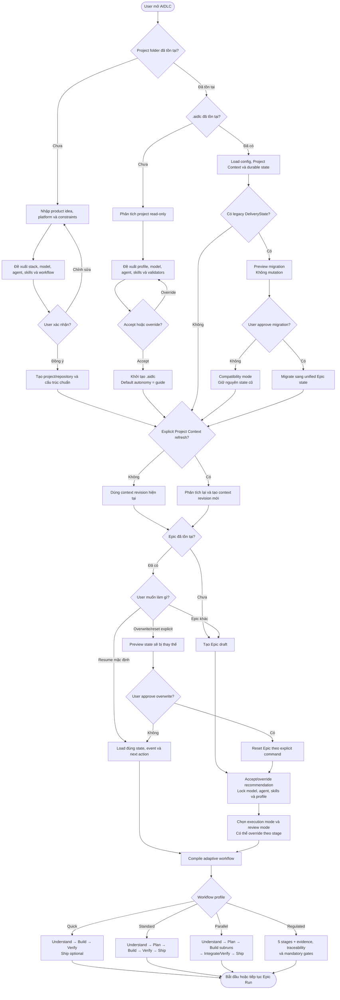
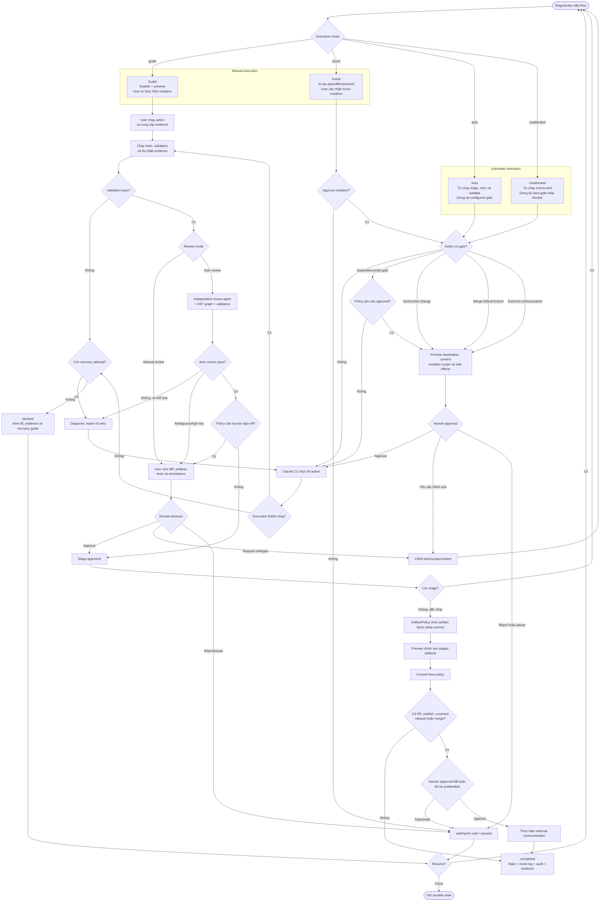

# AIDLC User Workflow

Tài liệu này mô tả workflow user-facing của AIDLC cho các trường hợp:

- Project mới hoặc đã tồn tại.
- Project chưa hoặc đã được khởi tạo AIDLC.
- Epic mới, resume Epic hiện có hoặc explicit overwrite/reset.
- Manual execution và automatic execution.
- Manual review và automatic review.
- Approval gate, recovery, pause và resume.
- Commit artifact và external communication.

Execution mode và review mode là hai lựa chọn độc lập. Ví dụ, một Epic có thể chạy Build ở chế độ `auto` nhưng vẫn dùng manual review.

## 1. Project onboarding và Epic entry

## 2. Execution, review, approval và recovery

## 3. Quy tắc bắt buộc

1. Project mới mặc định dùng `guide`.
2. Project Context chỉ refresh bằng explicit command.
3. Start một Epic đã tồn tại phải resume state hiện tại, không tạo state trùng.
4. Overwrite/reset Epic chỉ xảy ra qua explicit command có preview và approval.
5. Manual và automatic execution dùng chung engine, Epic state và event log.
6. Execution mode và review mode có thể cấu hình độc lập cho từng stage.
7. Auto review không được thay thế human approval tại hard gate.
8. Destructive change, merge default branch và external communication phải dừng tại hard gate.
9. External communication luôn cần human approval, kể cả `unattended`.
10. Chỉ artifact được `ArtifactPolicy` chọn mới xuất hiện trong commit preview.
11. Mọi failure phải tạo evidence, recovery action và durable state để có thể resume.
