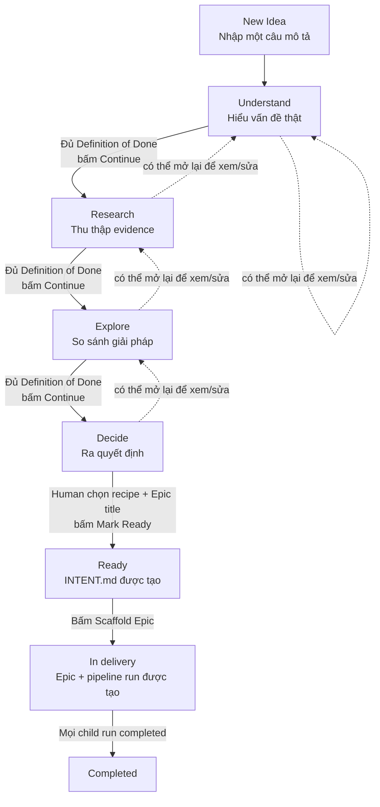
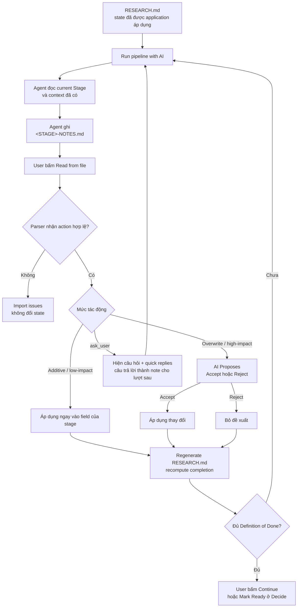

# Hướng dẫn sử dụng pipeline của tab Ideas

Tài liệu này mô tả **pipeline đang được tab Ideas thực thi trong source code hiện tại**:

`New Idea → Understand → Research → Explore → Decide → Ready → Scaffold Epic → Delivery`

> Lưu ý: flow thiết kế cũ (`question batch → INTENT.md → route`) và journal cũ
> (`spark → research → rewrite → ready`) không còn là flow chính của UI. Một số
> field/checkpoint cũ vẫn được giữ trong contract để đọc và migrate dữ liệu cũ.

## 1. Flow tổng thể mà user nhìn thấy



Các node trên thanh stage có ý nghĩa như sau:

- `✓`: stage đã đi qua.
- `●`: stage hiện tại của workflow.
- `○`: stage chưa tới.
- Viền được highlight: stage user đang mở để xem. Click một node chỉ đổi màn
  hình đang xem, **không tự advance workflow**.
- `⚠`: dữ liệu của stage cũ đã thay đổi sau khi workflow đi tiếp; kết quả phía
  sau cần được review lại.

## 2. Bảng output của từng step

| Step | User làm gì | Output hiển thị trong tab Ideas | Output được ghi xuống disk | Điều kiện để đi tiếp |
|---|---|---|---|---|
| **0. New Idea** | Bấm `+ New Idea`, nhập một câu và bấm `Start` | Một row mới có `IDEA-nnn`, title suy ra từ câu nhập, stage `Understand`, tiến độ `0%` | `.aidlc/ideas/<ID>/state.json`; event `created` trong `events.ndjson`; `docs/ideas/<ID>/RESEARCH.md` | Câu nhập không được rỗng |
| **1. Understand** | Điền trực tiếp hoặc dùng AI; review các đề xuất quan trọng | `Original idea`, `Problem`, `Context`, `Users / use cases`, `Assumptions`, `Unknowns`; chip `UNDERSTAND-NOTES.md` nếu AI đã tạo file | State `understand`; `RESEARCH.md` được render lại; AI có thể tạo `UNDERSTAND-NOTES.md` | Bắt buộc có `Problem`, `Context`, ít nhất 1 `User/use case` |
| **2. Research** | Ghi finding, cách giải hiện tại, source và unknown; hoặc import kết quả AI | Danh sách `Findings` có nhãn `Fact/Assumption/Inference`, `Existing solutions`, `Sources`, `Unknowns`; chip `RESEARCH-NOTES.md` | State `research`; `RESEARCH.md` được render lại; AI có thể tạo `RESEARCH-NOTES.md` | Ít nhất 2 findings; ít nhất 1 existing solution; nếu có finding loại `fact` thì phải có ít nhất 1 source |
| **3. Explore** | Tạo và so sánh từ 2 option trở lên | Mỗi option có `Title`, `Description`, `Pros`, `Cons`, `Risks`, `Trade-offs`, `Validation`; thêm `Idea-level validation ideas`; chip `EXPLORE-NOTES.md` | State `explore`; `RESEARCH.md` được render lại; AI có thể tạo `EXPLORE-NOTES.md` | Ít nhất 2 option; mọi option có ít nhất 1 pro và 1 con; có ít nhất 1 validation ở cấp idea hoặc trong một option |
| **4. Decide** | Chọn decision, chốt recommendation/final idea/next step; chọn recipe và Epic title | `Decision`, `Recommendation`, `Final idea`, `Scope`, `Out of scope`, `Validation`, `Success criteria`, `Next step`; chip `DECIDE-NOTES.md`; khối chọn recipe | State `decision`; `RESEARCH.md` được render lại; AI có thể tạo `DECIDE-NOTES.md` | Bắt buộc có `Decision`, `Recommendation`, `Final idea`, `Next step`; chỉ human mới được bấm `Mark Ready` |
| **5. Ready** | Kiểm tra recipe và Epic title, có thể mở `RESEARCH.md`, rồi bấm `Scaffold Epic` | Callout “ready”, recipe đã chọn, Epic title và nút `Scaffold Epic` | State chuyển thành `stage: ready`; `docs/ideas/<ID>/INTENT.md` được tạo; `RESEARCH.md` vẫn giữ toàn bộ lịch sử nghiên cứu | Phải ở `Ready`, recipe hợp lệ và Epic title không rỗng |
| **6. Scaffold Epic** | Bấm `Scaffold Epic` | Ideas chuyển sang read-only; panel Delivery hiện child Epic, recipe, run status và nút mở Canvas | Tạo Epic directory, Epic `state.json`, `inputs.json`, `artifacts/INTENT.md`, `.aidlc/runs/<EPIC-ID>.json`; Idea chuyển `checkpoint: in_delivery` | Pipeline/recipe phải resolve được và Epic ID chưa bị một Epic khác sử dụng |
| **7. Delivery completed** | Hoàn tất pipeline của child Epic | Child run status là `completed`; Idea nằm trong filter `Done` | Idea chuyển `checkpoint: completed`, bỏ pointer `inDelivery`, ghi event `completed` | Tất cả child run của Idea đều `completed` |

`RESEARCH.md` là bản chiếu tổng hợp của state hiện tại, không chỉ là output của
riêng stage Research. File này chứa Original idea và toàn bộ nội dung
Understand, Research, Explore, Decide, pending AI proposals và phần trăm hoàn
thành của stage hiện tại.

## 3. Vòng lặp AI trong mỗi stage

AI hỗ trợ nghiên cứu nhưng application và user vẫn sở hữu workflow. Mỗi lần
chạy AI chỉ xử lý **một stage hiện tại**, ghi một notes file rồi dừng.



### Ba cách đưa AI vào vòng lặp

1. **Run pipeline with AI** — cách thuận tiện nhất. Extension mở terminal của
   provider mặc định và chạy:

   ```text
   /aidlc-idea-research-pipeline <IDEA_ID> [optional note]
   ```

   Agent tự đọc `**Stage:**` trong `RESEARCH.md`, làm đúng một stage và ghi
   `<STAGE>-NOTES.md`.

2. **Copy command** — copy command cố định cho stage đang mở để user paste vào
   một session agent đã có:

   ```text
   /aidlc-idea-research <IDEA_ID> <stage> [optional note]
   ```

3. **Copy full prompt / Paste from AI** — dùng khi AI không có quyền đọc file
   workspace. Prompt chứa state liên quan, các requirement còn thiếu và format
   `### action_type`; user paste reply trở lại modal.

Sau cách 1 hoặc 2, user phải bấm **Read from file**. Việc agent tạo notes file
không đồng nghĩa nội dung đã vào Idea.

## 4. Output cụ thể của AI theo từng stage

| Stage | File AI phải tạo | Heading/output được importer hiểu | Kết quả sau import |
|---|---|---|---|
| **Understand** | `UNDERSTAND-NOTES.md` | `## Problem`, `## Context`, `## Users / use cases`, `## Assumptions`, `## Unknowns` | `Problem` và `Context` vào hàng chờ Accept/Reject; user, assumption và unknown được thêm ngay |
| **Research** | `RESEARCH-NOTES.md` | `## Findings`, `## Existing solutions`, `## Sources`, `## Unknowns` | Finding, existing solution, source và unknown được thêm ngay. Mỗi finding nên bắt đầu bằng `[fact]`, `[assumption]` hoặc `[inference]`; nếu không có nhãn thì importer mặc định là `inference` |
| **Explore** | `EXPLORE-NOTES.md` | Mỗi `## <Option title>` là một option, bên dưới có `Pros:`, `Cons:`, `Risks:`, `Tradeoffs:`, tùy chọn `Validation:`; `## Validation ideas` dành cho validation cấp idea | Option/validation mới được thêm ngay; option trùng title và finding trùng text bị bỏ và hiện trong `Import issues` |
| **Decide** | `DECIDE-NOTES.md` | `## Recommendation`, `## Final idea`, `## Scope`, `## Out of scope`, `## Success criteria`, `## Next step` | Tất cả là thay đổi high-impact, nên chỉ được ghi vào state sau khi user bấm `Accept` |
| **Ready** | Không có notes file | Không có AI action hợp lệ | AI không thể advance sang Ready hoặc scaffold Epic |

Importer cũng hiểu format chặt `### <action_type>` do **Copy full prompt** tạo.
Action sai stage, block rỗng, payload sai shape, finding/option trùng hoặc option
đích không còn tồn tại đều được báo trong `Import issues`; chúng không được áp
dụng âm thầm.

## 5. Definition of Done của từng stage

Phần trăm trên row Idea chỉ tính các rule **required**. Rule optional có thể
giúp chất lượng tốt hơn nhưng không khóa nút Continue.

| Stage | Required | Optional / không khóa |
|---|---|---|
| **Understand** | `Problem`; `Context`; ít nhất 1 `User/use case` | `Assumptions`; `Unknowns` |
| **Research** | Ít nhất 2 findings; ít nhất 1 existing solution; ít nhất 1 source nếu có bất kỳ `fact` finding nào | Source không bắt buộc nếu toàn bộ finding là `assumption`/`inference`; `Unknowns` |
| **Explore** | Ít nhất 2 option; mỗi option có ≥1 pro và ≥1 con; ít nhất 1 validation ở cấp idea hoặc option | Description, risks và trade-offs không khóa Continue |
| **Decide** | `Decision`; `Recommendation`; `Final idea`; `Next step` | Scope, out of scope, validation và success criteria không khóa Mark Ready |
| **Ready** | Không có DoD riêng; Ready là đích của hành động human `Mark Ready` | — |

Nếu nút Continue/Mark Ready bị disable, hover nút để xem tên các requirement
còn thiếu. Row bên trái cũng hiển thị phần trăm và số requirement còn thiếu.

## 6. Chọn recipe ở Decide

| Recipe | Dùng khi | Pipeline output tiếp theo |
|---|---|---|
| `cofofo-feature` | Xây hành vi/tính năng mới | `requirement → create-plan → implement → test` |
| `cofofo-bugfix` | Sửa defect/hành vi sai | `diagnose → reproduce → implement → test` |
| `cofofo-bootstrap` | Project chưa có foundation đầy đủ | `scan-stack → define-rules → map-system → select-ecc-catalog → install-ecc-assets → publish-context` |
| `cofofo-refresh-context` | Stack/system map/context đã cũ | `scan-stack → map-system → publish-context` |
| `cofofo-update-rules` | Cần cập nhật project rules/policy | `define-rules → publish-context` |
| `cofofo-repin-bundle` | Cần chọn và cài lại pinned ECC catalog | `select-ecc-catalog → install-ecc-assets → publish-context` |

Recipe không do AI tự chốt. User phải chọn recipe và xác nhận Epic title trước
khi `Mark Ready` khả dụng.

## 7. Các file output và vai trò của chúng

| Path | Ai ghi | Vai trò | Có phải source of truth? |
|---|---|---|:---:|
| `.aidlc/ideas/<ID>/state.json` | AIDLC | Toàn bộ state có cấu trúc, current stage, revision, pending actions, recipe và child Epic | **Có** |
| `.aidlc/ideas/<ID>/events.ndjson` | AIDLC | Audit log append-only: created, updated, imported, accepted/rejected, stage advanced, ready, scaffolded, completed | Audit source |
| `docs/ideas/<ID>/RESEARCH.md` | AIDLC | Bản Markdown tổng hợp để user/agent đọc; được regenerate sau mỗi save | Không; được render từ state |
| `docs/ideas/<ID>/<STAGE>-NOTES.md` | AI agent | Kết quả nghiên cứu đề xuất của một stage | Không; chỉ có hiệu lực sau `Read from file` và review |
| `docs/ideas/<ID>/INTENT.md` | AIDLC | Brief cuối cùng được tạo khi Ready và dùng làm handoff sang Epic | Snapshot từ state |
| `docs/ideas/<ID>/translation-input.json` | AIDLC | Snapshot tạm của phần text cần dịch | Tạm thời |
| `docs/ideas/<ID>/translation.json` | AI agent | Bản dịch có cùng IDs/array shape; watcher tự áp dụng rồi xóa hai JSON | Tạm thời |
| `<epics-root>/<EPIC-ID>/state.json` | AIDLC | State UI của Epic vừa scaffold | Có, cho Epic UI |
| `<epics-root>/<EPIC-ID>/inputs.json` | AIDLC | Input của Epic; có `source_idea` khi Idea đã capture được Foundation snapshot | Input/provenance |
| `<epics-root>/<EPIC-ID>/artifacts/INTENT.md` | AIDLC | Snapshot immutable của intent được giao cho Epic | Handoff snapshot |
| `.aidlc/runs/<EPIC-ID>.json` | Pipeline runner | Durable execution state của delivery pipeline | **Có**, cho run |

`<epics-root>` lấy từ `workspace.yaml`; mặc định thường là `docs/epics`.

## 8. Quy tắc an toàn và hành vi cần nhớ

1. **AI không sở hữu stage transition.** AI không được tự bấm Continue, không
   thể đặt `stage: ready`, và không thể scaffold Epic.
2. **Low-impact được import ngay; high-impact phải duyệt.** Add finding/source/
   option là additive và có thể xóa lại. Problem, Context, Decision,
   Recommendation, Final idea, Scope, Success criteria và Next step phải qua
   Accept/Reject.
3. **Một lần Run pipeline chỉ làm một stage.** Agent không sleep, poll hoặc tự
   chạy tiếp stage sau. Sau import/review/Continue, user chạy pipeline lần nữa
   cho stage mới.
4. **Sửa stage cũ không xóa dữ liệu stage sau.** Workflow vẫn ở stage hiện tại,
   nhưng Idea được gắn `needsReview` để user biết quyết định phía sau có thể đã
   cũ. `Mark Ready` sau khi review xong sẽ xóa cờ này.
5. **Sau Scaffold, Idea là read-only.** User theo dõi execution trong Delivery
   panel/Canvas của child Epic; nội dung nghiên cứu vẫn mở được qua
   `RESEARCH.md`.
6. **Mọi save dùng `ideaRevision`.** Nếu tab đang giữ revision cũ, UI hiện
   conflict modal; bấm Reload để lấy state mới trước khi sửa tiếp.
7. **Translate không làm research.** Nó chỉ thay ngôn ngữ của prose, giữ nguyên
   IDs, thứ tự và số phần tử; `translation.json` được watcher áp dụng tự động,
   không cần bấm Read from file.

## 9. Checklist thao tác nhanh

- [ ] Tạo Idea từ một câu mô tả đủ nghĩa.
- [ ] Ở Understand, điền/duyệt Problem, Context và ít nhất một User/use case.
- [ ] Bấm Continue sang Research.
- [ ] Có ít nhất hai findings và một existing solution; bổ sung source nếu có fact.
- [ ] Bấm Continue sang Explore.
- [ ] Có ít nhất hai option, mỗi option có pro/con và có validation.
- [ ] Bấm Continue sang Decide.
- [ ] Chốt Decision, Recommendation, Final idea và Next step.
- [ ] Chọn đúng recipe, kiểm tra Epic title, rồi bấm Mark Ready.
- [ ] Kiểm tra `INTENT.md`, sau đó bấm Scaffold Epic.
- [ ] Theo dõi child Epic trong Delivery panel cho tới khi run completed.
