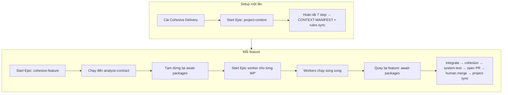
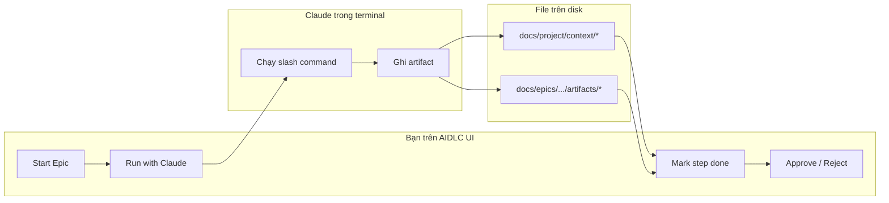
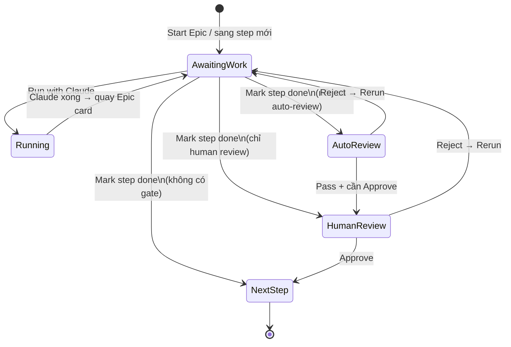
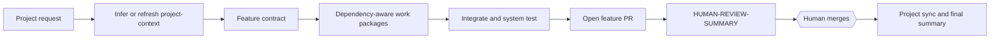
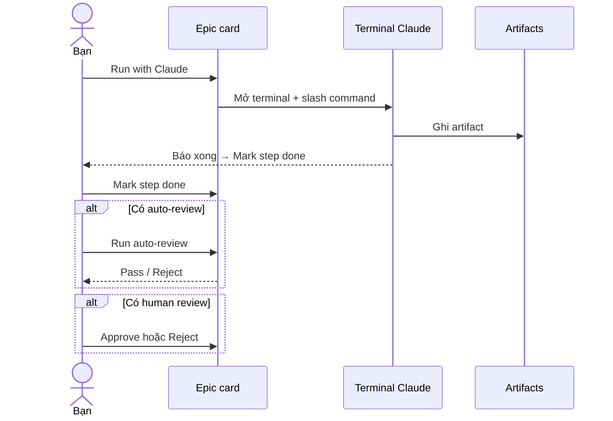
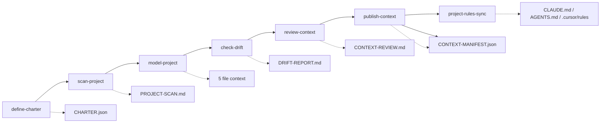
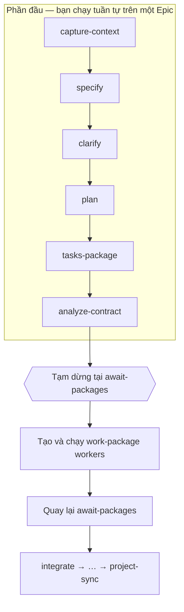
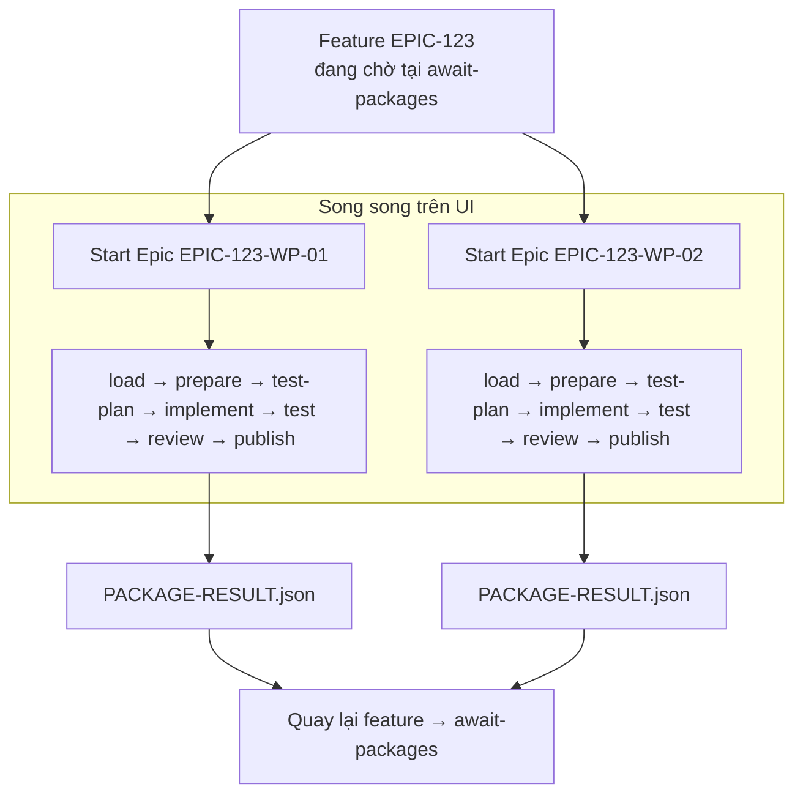
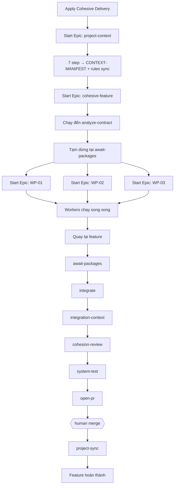

# Hướng dẫn sử dụng Cohesive Delivery trên UI

Tài liệu này dành cho người mới đã cài AIDLC extension và đang mở project cần làm việc trong VS Code hoặc Cursor.

Cohesive Delivery có hai cách chạy cùng tồn tại:

- **Guided**: human chạy và review từng step như các mục 2–10 bên dưới.
- **Existing Project Autonomous Delivery**: execution profile opt-in ở level project;
  mở một **Claude master command** chạy từ `project-context` đến review bundle,
  nhưng không tự merge default branch.

Profile autonomous là tính năng mở rộng cho project có sẵn. Nó không đổi mặc định
của Cohesive Delivery và không bắt buộc request đến từ Jira.

## 0. Bản đồ storyboard (nhìn nhanh)

Đọc phần này trước khi làm theo checklist bên dưới. Ba lớp pipeline và thứ tự người dùng thao tác trên UI:



Storyboard vai trò trên UI:



Loop một step (lặp lại cho mọi phase):



> Sơ đồ này là **Guided mode**. Autonomous Delivery dùng master command riêng ở
> phần 1.1; không yêu cầu bạn bấm **Mark step done** giữa các phase.

## 1. Cài Cohesive Delivery vào project

1. Nhấn biểu tượng **AIDLC** trên Activity Bar.
2. Trong sidebar AIDLC, mở phần **Workflows**.
3. Trong nhóm **Common**, chọn **Cohesive Delivery**.
4. Nếu project đã có `.aidlc/workspace.yaml`, UI sẽ hiện hộp thoại **Apply template**:
   - Nhấn **View guide** để mở file Markdown hướng dẫn workflow (storyboard + checklist).
   - Nhấn **Overwrite & apply** — **thay** các pipeline/agent trùng id từ template
     (vd. nâng `project-context` 4-step cũ → 7-step) và refresh skill trong `~/.claude/`.
     Pipeline id khác (custom) được giữ nguyên.
5. Khi VS Code hỏi cài agents và skills vào `~/.claude/`, nhấn **Install**.
6. Chờ thông báo **Applied preset `cohesive-delivery`** (có thể kèm “Upgraded pipelines: …”).
7. Có thể chọn **Open Builder** để mở Workspace Builder.
8. Mở tab **Workflows** và kiểm tra có đủ ba pipeline:

   - `project-context` — 7 steps (define-charter → scan → model → check-drift → review → publish → project-rules-sync);
   - `cohesive-feature` — 14 steps;
   - `cohesive-work-package` — 7 steps.

> **Lưu ý về badge:** trong một số view hiện tại, chỉ `cohesive-feature` có badge built-in. Hai pipeline còn lại có thể nằm trong nhóm **Your pipelines**. Đây chỉ là khác biệt hiển thị, không ảnh hưởng chức năng.

### 1.1 Bật luồng autonomous cho project có sẵn

Sau khi apply preset, profile sau được thêm vào workspace và chỉ được dùng khi
human chủ động gọi command autonomous:

```yaml
cohesive_delivery:
  execution_profiles:
    existing-project-autonomous:
      project_context: infer-or-refresh
      review_strategy: aggregate
      max_parallel_workers: 3
      open_feature_pr: true
      merge: human-only
```

Mở **Open Workspace → Epics**, rồi nhấn nút **Autonomous Delivery** ngay cạnh
**Start Epic**. Modal này là entry point UI chính cho toàn bộ lifecycle:

| Action trên UI | Khi nào dùng |
|---|---|
| **Start new delivery** | Bắt đầu flow A→Z cho một feature mới |
| **Resume interrupted delivery** | Tiếp tục delivery bị dừng/lỗi từ state đã lưu |
| **Open review summary** | Mở lại review bundle để human kiểm tra |
| **Add review task** | Ghi yêu cầu sửa và selective rework phần bị ảnh hưởng |
| **Edit inferred project context** | Sửa charter/context AI đã suy luận rồi refresh downstream |
| **Complete after merge** | Sau khi human merge PR, chạy project-sync và final summary |

Nếu preset thiếu hoặc còn bản cũ (ví dụ `project-context` chỉ có 4 step), modal sẽ
hiển thị **Apply / upgrade Cohesive Delivery** thay vì bắt user tìm template ở nơi khác.
Nút **Help & guide** trong cùng modal mở lại tài liệu này.

Chọn **Start new delivery** để mở form ngay trong AIDLC. Nhập feature id, title và mô
tả trực tiếp, hoặc nhấn **Load requirement file**. Nhấn **Start delivery**: extension
ghi request/state bền vững rồi mở terminal Claude hiển thị lệnh:

```text
/aidlc-autonomous-delivery <delivery-id>
```

Claude master thực hiện toàn bộ chain project-context → feature → work packages →
integration/tests → PR → aggregate review. Extension **không** chạy ngầm global
`aidlc cohesive` CLI, vì vậy bạn luôn thấy lệnh và output trong terminal Claude.
Jira/GitHub chỉ là source metadata tùy chọn, không phải điểm bắt đầu của flow. Command
Palette vẫn là đường dự phòng với command **AIDLC: Start Autonomous Delivery for
Existing Project**.

> Setting **Epic Autopilot** (`aidlc.autopilot.enabled`) là thử nghiệm pre-plan cho
> **Start Epic** thông thường và không bật flow này. Có thể để setting đó **Off**.

Hệ thống tự chạy trong phiên Claude master:



Các human review gate trong pipeline vẫn được ghi đầy đủ vào audit trail nhưng được
gom vào `HUMAN-REVIEW-SUMMARY.md`; chúng không bị ghi sai thành “human approved”.
Nếu terminal Claude bị đóng hoặc một phase lỗi, chọn **Resume interrupted delivery**.
Extension mở lại đúng master command; Claude đọc checkpoint trong state, báo checkpoint
được chọn trước khi làm việc, giữ artifacts/phase đã approved và chỉ chạy lại nhánh
chưa xong hoặc failed cùng downstream cần thiết — **không chạy lại từ đầu**.

Tại review bundle, human có thể:

1. Chấp nhận và merge PR bằng tay, rồi chạy **Resume Autonomous Delivery After Merge**.
2. Chạy **Add Autonomous Delivery Review Task** để thêm yêu cầu sửa; Claude master
   route task và chỉ rerun context/feature/package/integration bị ảnh hưởng.
3. Chạy **Edit and Confirm Inferred Project Context**, sửa charter đã được AI suy luận,
   lưu file rồi xác nhận; charter tăng revision và downstream alignment được refresh.

> Agent không merge default branch. `project-sync` chỉ chạy sau khi validator thấy PR
> đã thực sự merged (hoặc local flow được human xác nhận theo policy).

Nếu preset phát hiện validator đã được project customize, file custom được giữ nguyên
và bản bundled mới được ghi dưới hậu tố `.aidlc-new`. Autonomous execution dừng cho
đến khi human reconcile và xóa file `.aidlc-new`; guided mode vẫn có thể được dùng.

Hiện tại artifact contracts của bundle dùng canonical root `docs/epics`; autonomous
command fail-fast nếu workspace đặt `state.root` sang thư mục khác.

## 2. Cách thao tác một step

Trên Epic card, mỗi step có nút **Help** (bên cạnh badge trạng thái). Nhấn để mở Markdown hướng dẫn step đó: việc cần làm, slash command, agent/model, input/output, và tiêu chuẩn để sang step tiếp theo.

Mỗi step trong Epic card thường đi qua chu trình sau:



1. Nhấn **Run with Claude**.
2. Extension tự mở một terminal Claude mới và chạy đúng slash command.
3. Chờ Claude hoàn thành công việc và artifact.
4. Quay lại Epic card.
5. Nhấn **Mark step done**.
6. Nếu xuất hiện **Run auto-review**, nhấn nút đó.
7. Nếu xuất hiện **Approve / Reject**:
   - Đọc và kiểm tra artifact;
   - Nhấn **Approve** để sang bước tiếp theo;
   - Hoặc nhấn **Reject** và nhập lý do cần sửa.
8. Nếu terminal Claude fail/đóng nhưng step vẫn ở **Awaiting work**, nhấn **Run again
   with Claude**. Lệnh slash cùng run id được mở lại để tiếp tục step đó.
9. Nếu auto-review hoặc human review reject:
   - Đọc lý do reject trên step;
   - Nhấn **Run again with Claude** để tăng revision, reset step và mở lại lệnh với
     feedback; hoặc chọn **Edit feedback first** nếu cần sửa prompt trước;
   - Sau khi Claude xong, **Mark step done** và chạy review lại.

> **Quan trọng:** hãy tạo các run của Cohesive Delivery bằng nút **Start Epic**. Không dùng nút **Run** trực tiếp trên Pipeline card, vì `Start Epic` mới tạo đầy đủ `state.json`, `inputs.json` và thư mục artifacts mà các workflow này cần.

> **Artifact chip:** khi file đã có trên disk đúng path `produces:`, chip Artifact trên Epic card chuyển từ *not produced yet* sang nút mở file. Với `project-context`:
> - scan/model/review/publish → `docs/project/context/…` (không nằm trong `docs/epics/<id>/artifacts/`);
> - `define-charter` → `docs/epics/<id>/artifacts/CHARTER-DISCOVERY.md` + `docs/project/charter/…`;
> - `project-rules-sync` → `CLAUDE.md`, `AGENTS.md`, `.cursor/rules/aidlc-charter.mdc` (chip hiện file đầu tiên).

## 3. Khởi tạo Project Context

Project Context là nguồn thông tin chung: **Intent** (charter + conventions), **Reality** (scan/model), và chiếu rule files. Hãy hoàn thành pipeline này trước feature đầu tiên.



### 3.1 Tạo Project Context epic

1. Trong AIDLC sidebar, nhấn **Start Epic**.
2. Trong phần **Workflow**, chọn `project-context`.
3. Điền thông tin, ví dụ:

   - **Epic id:** `PROJECT-CONTEXT-001`
   - **Title:** `Initialize project context`
   - **Description (Project idea — bắt buộc):** mô tả ý tưởng / bối cảnh project
     (product là gì, ai dùng, ràng buộc thô). Đây là **seed**, chưa phải charter.

4. Nhấn **Start epic** — scaffold ghi `idea` vào `inputs.json` và seed
   `docs/project/charter/*` + `CONVENTIONS.md` once if missing.
5. Mở Epic card `PROJECT-CONTEXT-001`.

### 3.2 Chạy các step

Chạy lần lượt:

1. `define-charter` (human + AI 1:1) — **Run with Claude**; agent đọc `idea`, hỏi từng
   câu trong terminal, ghi `CHARTER-DISCOVERY.md`, rồi draft charter; auto-review
   `charter.mjs`; **Approve**
2. `scan-project`
3. `model-project`
4. `check-drift` — Reality vs Intent per `INV-x`
5. `review-context`
6. `publish-context`
7. `project-rules-sync` — project markers into `CLAUDE.md`, `AGENTS.md`, `.cursor/rules/aidlc-charter.mdc`

Tại `define-charter`:

1. Nhấn **Run with Claude** (`/project-context-define-charter`).
2. Trả lời lần lượt trong terminal (Goals + metric, non-goals, INV, tech policy, quality, ship).
3. Kiểm tra `CHARTER-DISCOVERY.md` có `## Discovery decisions` và các file charter.
4. **Mark step done** → **Run auto-review** → **Approve**.

Tại `review-context`:

1. Đọc `CONTEXT-REVIEW.md`.
2. Chỉ nhấn **Approve** khi verdict là `GO`.

Tại `publish-context`:

1. Nhấn **Mark step done**.
2. Nhấn **Run auto-review**.
3. Nhấn **Approve** nếu validator pass.

Sau khi hoàn tất, project phải có các file:

```text
docs/project/context/
├── PROJECT-SCAN.md
├── PROJECT-CONTEXT.md
├── ARCHITECTURE-MAP.md
├── DOMAIN-MODEL.md
├── SHARED-CONTRACTS.md
├── ENGINEERING-RULES.md
├── CONTEXT-REVIEW.md
└── CONTEXT-MANIFEST.json
```

## 4. Tạo Feature Coordinator

Ví dụ trong phần này sử dụng feature ID `EPIC-123`.



### 4.1 Tạo feature epic

1. Nhấn **Start Epic**.
2. Chọn workflow `cohesive-feature`.
3. Điền:

   - **Epic id:** `EPIC-123`
   - **Title:** tên feature rõ ràng;
   - **Description / requirement:** mô tả yêu cầu đủ chi tiết, gồm mục tiêu và phạm vi.

4. Nếu cần, điền thêm **Capability inputs**, ví dụ file scope hoặc GitHub repository.
5. Nhấn **Start epic**.

### 4.2 Chạy phần đầu của feature

Chạy lần lượt:

1. `capture-context`
2. `specify`
3. `clarify`
4. `plan`
5. `tasks-package`
6. `analyze-contract`

Các review quan trọng:

- `clarify`: human review;
- `plan`: human review;
- `tasks-package`: auto-review và human review;
- `analyze-contract`: auto-review và human review.

Sau `analyze-contract`, kiểm tra thư mục sau:

```text
docs/epics/EPIC-123/artifacts/
├── PROJECT-CONTEXT-SNAPSHOT.md
├── SPEC.md
├── PLAN.md
├── TASKS.md
├── WORK-PACKAGES.json
├── ANALYSIS.md
└── FEATURE-CONTRACT.md
```

### 4.3 Xác định các work package

1. Mở `WORK-PACKAGES.json`.
2. Xem danh sách package và `runId` của từng package, ví dụ:

```json
{
  "id": "WP-01",
  "runId": "EPIC-123-WP-01"
}
```

3. Khi feature chuyển tới `await-packages`, tạm dừng ở đó.
4. Chưa chạy `await-packages` cho đến khi tất cả worker cần thiết đã hoàn thành.

## 5. Tạo một Work Package worker

Ví dụ dưới đây tạo worker cho `WP-01` của feature `EPIC-123`.

### 5.1 Tạo worker epic

1. Nhấn **Start Epic**.
2. Chọn `cohesive-work-package`.
3. Điền:

   - **Epic id:** đúng bằng `runId` trong `WORK-PACKAGES.json`, ví dụ `EPIC-123-WP-01`;
   - **Title:** `EPIC-123 — WP-01`;
   - **Description:** `Execute WP-01 for EPIC-123`.

4. Nhấn **Start epic**.
5. Mở Epic card `EPIC-123-WP-01`.

### 5.2 Khai báo feature và package cho worker

UI hiện tại chưa có field riêng cho `feature_id` và `package_id`. Thực hiện như sau:

1. Trên Epic card, nhấn **Open inputs.json**.
2. Thêm hai field sau:

```json
{
  "feature_id": "EPIC-123",
  "package_id": "WP-01"
}
```

3. Nếu file đã có field khác, giữ nguyên chúng và chỉ thêm `feature_id`, `package_id`.
4. Lưu `inputs.json` trước khi chạy `load-package`.

### 5.3 Chạy worker

Chạy lần lượt:

1. `load-package`
2. `prepare-worktree`
3. `package-test-plan`
4. `implement-package`
5. `package-test`
6. `package-review`
7. `publish-result`

Gate tương ứng:

- `load-package`: auto-review;
- `prepare-worktree`: auto-review;
- `package-test-plan`: tạo failing-test evidence;
- `implement-package`: human review;
- `package-test`: artifact validation;
- `package-review`: independent review + auto-review;
- `publish-result`: auto-review và human review.

Worker hoàn thành khi có đủ:

```text
docs/epics/EPIC-123-WP-01/artifacts/
├── PACKAGE-CONTEXT.md
├── WORKTREE-STATE.json
├── PACKAGE-TEST-PLAN.md
├── IMPLEMENT-STATE.md
├── PACKAGE-SUMMARY.md
├── REVIEW-DIFF.md
├── PACKAGE-TEST-REPORT.md
├── PACKAGE-REVIEW.md
└── PACKAGE-RESULT.json
```

## 6. Chạy nhiều worker song song

Giả sử `WORK-PACKAGES.json` có hai package độc lập là `WP-01` và `WP-02`.



### 6.1 Tạo các worker runs

Tạo worker thứ nhất:

- Epic id: `EPIC-123-WP-01`
- `feature_id`: `EPIC-123`
- `package_id`: `WP-01`

Tạo worker thứ hai:

- Epic id: `EPIC-123-WP-02`
- `feature_id`: `EPIC-123`
- `package_id`: `WP-02`

### 6.2 Chạy song song

1. Mở worker `EPIC-123-WP-01` và nhấn **Run with Claude**.
2. Không cần chờ toàn bộ pipeline WP-01 kết thúc.
3. Mở worker `EPIC-123-WP-02` và nhấn **Run with Claude**.
4. Extension tạo terminal Claude riêng cho mỗi lần chạy.
5. Chuyển qua lại giữa các Epic card để:
   - Mark step done;
   - Run auto-review;
   - Approve hoặc Reject;
   - Chạy step tiếp theo.

Mỗi worker có:

- RunState riêng;
- Branch riêng;
- Worktree riêng;
- Artifact directory riêng.

> Chỉ chạy song song những package không phụ thuộc nhau. Nếu package có `dependsOn`, hãy chờ package dependency tạo `PACKAGE-RESULT.json` hợp lệ trước. Validator sẽ reject worker bắt đầu quá sớm.

## 7. Thu kết quả về Feature Coordinator

Sau khi tất cả worker cần thiết đã tạo `PACKAGE-RESULT.json` hợp lệ:

1. Quay lại Epic `EPIC-123`.
2. Mở step `await-packages`.
3. Nhấn **Run with Claude**.
4. Claude đọc package results và tạo:

   - `PACKAGE-RESULTS.md`;
   - `TASK-BOARD.md`.

5. Nhấn **Mark step done**.
6. Nhấn **Run auto-review**.
7. Nếu validator xác nhận mọi package dùng đúng context và contract revision, nhấn **Approve**.

Nếu auto-review reject, thông báo sẽ chỉ rõ package gặp vấn đề, ví dụ:

- Thiếu `PACKAGE-RESULT.json`;
- Sai Feature Contract hash;
- Project Context revision đã stale;
- Package chưa ở trạng thái merge-ready;
- Package deferred nhưng thiếu danh sách deferred tasks.

## 8. Tích hợp và hoàn tất feature

Sau khi `await-packages` được approve, tiếp tục trên Epic `EPIC-123`.

### 8.1 `integrate`

1. Nhấn **Run with Claude**.
2. Claude tích hợp package branches theo dependency order.
3. Đọc `INTEGRATION-SUMMARY.md`.
4. Mark step done và **Approve** nếu kết quả đúng.

### 8.2 `integration-context`

1. Nhấn **Run with Claude**.
2. Kiểm tra `INTEGRATION-CONTEXT.md` phản ánh code thực tế sau tích hợp.
3. Nhấn **Mark step done**.

### 8.3 `cohesion-review`

1. Nhấn **Run with Claude**.
2. Kiểm tra `COHESION-REPORT.md`.
3. Nhấn **Mark step done**.
4. Nhấn **Run auto-review**.
5. Nhấn **Approve** nếu verdict là GO.

### 8.4 `system-test`

1. Nhấn **Run with Claude**.
2. Kiểm tra `SYSTEM-TEST-REPORT.md` ghi lại các command thực tế như `lint`, `typecheck`, `test` hoặc `build`.
3. Nhấn **Mark step done**.
4. Nhấn **Run auto-review**.
5. Nhấn **Approve** nếu toàn bộ test pass.

### 8.5 `open-pr`

1. Agent mở đúng một feature PR từ `feature/<feature-id>` vào default branch.
2. Validator kiểm tra head/base/status trong `PR-LINK.md`.
3. Package workers không được mở PR riêng.

### 8.6 `await-merge`

Đây là human-only gate. Human review và merge PR trên Git provider; agent không được
merge default branch. Sau merge, chạy lại step để validator xác nhận status `merged`.

### 8.7 `project-sync`

1. Nhấn **Run with Claude**.
2. Kiểm tra `PROJECT-UPDATE.md` ghi lại thay đổi đối với project knowledge.
3. Nhấn **Mark step done**.
4. Nhấn **Run auto-review**.
5. Nhấn **Approve**.

Feature chỉ hoàn thành sau `project-sync`, không phải ngay khi các worker hoàn thành.

## 9. Luồng tổng quát

Storyboard end-to-end (cùng nội dung checklist các mục trên, dạng sơ đồ):



Thứ tự người dùng nhớ nhanh:

1. Context trước, feature sau.
2. Feature chạy đến contract rồi mới mở worker.
3. Worker xong hết mới `await-packages`.
4. Human merge feature PR; feature chỉ xong sau post-merge `project-sync`.

## 10. Xử lý lỗi thường gặp

### Không thấy Cohesive Delivery trong Workflows

- Kiểm tra đã reload VS Code/Cursor sau khi cài extension.
- Mở lại AIDLC sidebar.
- Kiểm tra đang mở một project folder.

### Không thấy nút Autonomous Delivery

1. Kiểm tra footer AIDLC đang dùng extension version hỗ trợ tính năng.
2. Mở **Open Workspace → Epics**; nút **Autonomous Delivery** nằm cạnh **Start Epic**.
3. Nếu đang dùng bản cũ, cài lại VSIX với `--force` rồi chạy **Developer: Reload Window**.
4. Nếu máy có hai extension AIDLC, chỉ giữ `hueanmy.aidlc`; extension cũ có thể gây
   lỗi trùng command.

Không dùng checkbox **Epic Autopilot** để thay thế: đó là tính năng pre-plan khác.

### Không thấy `project-context` hoặc `cohesive-work-package` trong nhóm built-in

Tìm trong nhóm **Your pipelines**. Đây là giới hạn badge của UI hiện tại.

### Step không cho Mark done

- Chờ terminal Claude hoàn thành.
- Kiểm tra artifact bắt buộc đã được tạo đúng path `produces:` trên pipeline step.
- `project-context` ghi vào `docs/project/context/`, không phải `docs/epics/<epic>/artifacts/`.
- Feature / work-package ghi vào `docs/epics/<epicId>/artifacts/`.
- Chip Artifact trên Epic card phải hiện nút mở file (không còn *not produced yet*).

### Auto-review reject

1. Đọc lý do trên Epic card.
2. Mở artifact liên quan.
3. Nhấn **Rerun**.
4. Sửa theo feedback.
5. Mark step done và chạy auto-review lại.

### Worker báo thiếu feature hoặc package

Mở **inputs.json** và kiểm tra có đúng:

```json
{
  "feature_id": "EPIC-123",
  "package_id": "WP-01"
}
```

Epic ID của worker cũng phải trùng `runId` trong `WORK-PACKAGES.json`.

### Worker báo dependency chưa hoàn thành

Mở `WORK-PACKAGES.json`, kiểm tra `dependsOn`, sau đó hoàn thành package dependency trước khi chạy lại worker.
