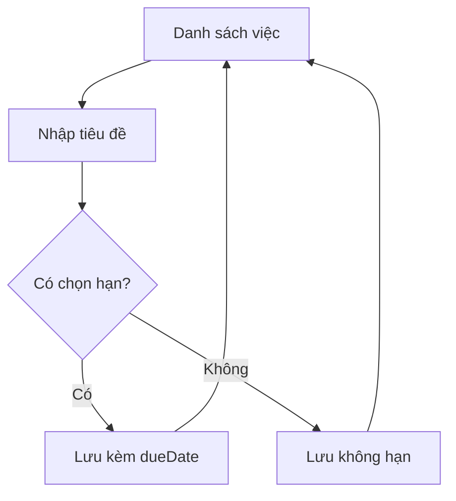

# Requirement — DEMO-TODO-002-PLAN

**Status:** Ready
**Date:** 2026-08-20

## 1. Summary

Cho phép đặt hạn cho một việc và làm nổi bật việc đã quá hạn trong danh sách.

## 2. Problem / Goal

- **Problem:** `Todo` đã có trường `dueDate` và `isOverdue()`, nhưng người dùng không có cách nào đặt hạn từ giao diện.
- **Goal:** Đặt được hạn khi tạo việc, và nhìn ra ngay việc nào trễ.

## 3. Scope

### In scope
- Chọn hạn khi thêm việc mới
- Nhãn "Quá hạn" trên dòng việc trễ

### Out of scope (non-goals)
- Sửa hạn của việc đã tạo
- Thông báo đẩy, nhắc lịch

## 4. Screens

| Screen | Change | Screen file | View/Type trong `src/` |
|---|---|---|---|
| Danh sách việc | Update | `screens/todo-list.png` | `TodoListView`, `TodoRow` |

## 5. Screen Flow

## 6. Acceptance Criteria

- **AC-1** Thêm việc kèm hạn ở quá khứ → dòng đó hiện nhãn "Quá hạn".
- **AC-2** Đánh dấu việc quá hạn là hoàn thành → nhãn "Quá hạn" biến mất.
- **AC-3** Việc không có hạn → không bao giờ hiện nhãn "Quá hạn".
- **AC-4** Hạn không ảnh hưởng thứ tự sắp xếp hiện có.

## 7. Business Rule Impact

- Chạm `BR-3` (điều kiện quá hạn) — chỉ hiển thị, không đổi luật.
- Không đề xuất luật mới.

## 8. Open Questions

Không còn câu hỏi blocking.
