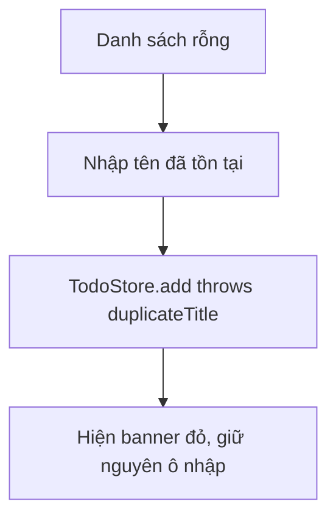

# Requirement — DEMO-TODO-004-REJECTED

**Status:** Ready
**Date:** 2026-08-21

## 1. Summary

Thêm trạng thái rỗng cho danh sách và banner lỗi khi tên việc bị trùng.

## 2. Problem / Goal

- **Problem:** Danh sách rỗng chỉ là một khoảng trắng; lỗi trùng tên không được giải thích.
- **Goal:** Người dùng mới hiểu phải làm gì, và biết vì sao thêm việc thất bại.

## 3. Scope

### In scope
- Empty state khi chưa có việc nào
- Banner đỏ khi `TodoError.duplicateTitle`

### Out of scope (non-goals)
- Empty state riêng cho từng bộ lọc

## 4. Screens

| Screen | Change | Screen file | View/Type trong `src/` |
|---|---|---|---|
| Danh sách — rỗng + lỗi trùng | Update | `screens/add-todo-duplicate.png` | `TodoListView` |

## 5. Screen Flow

## 6. Acceptance Criteria

- **AC-1** Chưa có việc nào → hiện empty state thay vì danh sách trống.
- **AC-2** Thêm tên trùng với một việc **chưa xong** → banner đỏ, việc không được tạo.
- **AC-3** Banner biến mất khi lần thêm kế tiếp thành công.

## 7. Business Rule Impact

- Chạm `BR-2` (không trùng tên trong việc chưa xong) — chỉ hiển thị lỗi, không đổi luật.

## 8. Open Questions

Không còn câu hỏi blocking.
