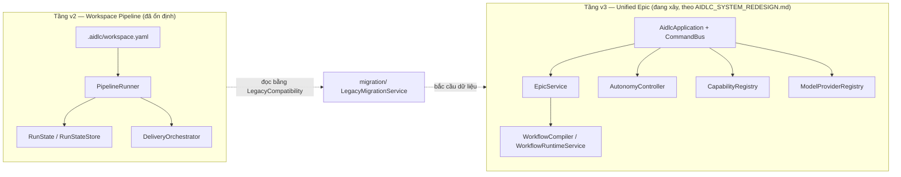

# Phân tích chức năng — AIDLC Monorepo

> Tài liệu này phân tích chức năng của repo `aidlc-monorepo` dựa trên khảo sát mã nguồn, README, và các tài liệu thiết kế hiện có trong repo (README.md, AGENTS.md, docs/UNIFIED_SYSTEM_GUIDE.md, docs/USER_WORKFLOW.md, COHESIVE_CHARTER_ARCHITECTURE.md, AIDLC_SYSTEM_REDESIGN.md).

## 1. Tổng quan

**AIDLC** ("AI-Driven SDLC") là một hệ thống điều khiển **Claude Code** để tự động hoá vòng đời phát triển phần mềm theo pipeline khai báo. Ý tưởng cốt lõi: mọi cấu hình (agent, skill, pipeline, compliance standard) sống trong một file khai báo dưới `.aidlc/` của project đích; một *runner* dùng cấu hình đó để gọi `claude` (shell-out CLI) theo từng bước, ghi lại state, và cho phép người dùng theo dõi/approve/reject qua nhiều giao diện khác nhau.

Repo là **pnpm monorepo** với 3 package:

| Package | Vai trò |
|---|---|
| `packages/core` (`@aidlc/core`) | Engine lõi thuần TypeScript, không phụ thuộc `vscode` — loader, schema, runner, pipeline, application boundary. Dùng chung bởi CLI, extension, và test. |
| `packages/cli` (`aidlc`) | CLI terminal độc lập, gọi `@aidlc/core` để chạy pipeline, quản lý workspace, xem dashboard. |
| `packages/extension` (`aidlc-o00ontcong`, publisher `o00ontcong`) | VS Code extension — sidebar webview, Builder UI, tích hợp MCP server `ast-graph`, wizard command palette. |

Cả CLI và Extension đều là **lớp mỏng (thin adapter)** phía trên `@aidlc/core` — không tự cài lại logic nghiệp vụ.

## 2. Hai tầng hệ thống song song

Repo hiện đang trong giai đoạn **migrate** giữa hai kiến trúc, cùng tồn tại trong mã nguồn:

- **Tầng v2 — "workspace.yaml pipeline"**: `packages/core/src/runs`, `delivery/`, `schema/WorkspaceSchema.ts`, `presets/builtinWorkflows.ts`; phía CLI là các lệnh `run`, `step`, `watch`, `tail`, `dashboard`, `cohesive`. Mô hình pipeline/step cổ điển: pipeline gồm nhiều step, mỗi step gọi 1 skill, state lưu trong `.aidlc/runs/*.json`. Đây là hệ đã có test/CI đầy đủ.
- **Tầng v3 — "unified Epic redesign"**: `packages/core/src/application`, `epic/`, `workflows/`, `autonomy/`, `capabilities/`, `models/`, `migration/`; phía CLI là `packages/cli/src/commands/v3/registerRedesign.ts`; phía extension là `packages/extension/src/v3/`. Mô hình mới: **Project → Epic → Workflow (compiled) → Run → Stage → Action**, với một **CommandBus** duy nhất mà CLI, Extension, và slash-command Claude (`/aidlc`) đều gọi vào — đảm bảo logic nghiệp vụ chỉ tồn tại một nơi.
- `migration/` (`LegacyCompatibility.ts`, `LegacyMigrationService.ts`) là cầu nối: đọc (read-only) record cũ (delivery/run/epic-scaffold/workspace) và cho phép migrate tường minh, có thể rollback, sang Epic thống nhất.

## 3. `packages/core` — engine lõi

### 3.1 Application boundary

- **`AidlcApplication.ts`** — "single application boundary shared by CLI, Claude command, and Extension adapters". Khởi tạo toàn bộ service con (Epic, ProjectIntelligence, ArtifactPolicy, Autonomy, Capability, ModelProvider, WorkflowRuntime, Guide, Migration…) và đăng ký ~30 command qua `registerCommands()`.
- **`CommandBus.ts`** — cơ chế CQRS đơn giản: `register(name, handler)`, `dispatch(command)` (validate bằng Zod, lỗi → `CommandResult` chuẩn với `error.code`), `command(id, name, actor, payload)`. Mọi command trả về hình dạng thống nhất: `status, nextAction, evidence, warnings, recoveryActions, error`.

### 3.2 Các module theo thư mục `src/`

| Module | Chức năng |
|---|---|
| `application/` | Boundary command duy nhất (CLI/Claude/Extension đều đi qua đây). |
| `artifacts/` | `ArtifactPolicyService` — chọn artifact nào được phép commit, preview commit set trước khi ghi (an toàn đường dẫn). |
| `autonomy/` | `AutonomyController` (đánh giá gate theo mode), `AutonomyPolicyStore` (`.aidlc/autonomy.yaml`), `AutonomyRunCoordinator` (gate approve/reject gắn với Epic). |
| `capabilities/` | `CapabilityRegistry` — enable/disable capability (`ast-graph`, `artifact-annotation`…) độc lập với state machine workflow. |
| `contracts/` | Zod schema + type dùng toàn hệ thống (epic, stage, run, autonomy, capability, command, model, project, artifact, errors, ids) — nguồn sự thật chung. |
| `delivery/` | Hệ **Cohesive Delivery cũ**: `DeliveryOrchestrator`, `DeliveryReview`, `DeliveryStateStore` — autonomous delivery cho project hiện có, dựa trên pipeline + charter artifacts. |
| `epic/` | `EpicService` (state machine Epic idempotent + audit log), `EpicStore` (filesystem store dưới `.aidlc/epics`, `.aidlc/runs`). |
| `epics/` | Tiện ích autopilot: `ContextCollector` (tự phát hiện spec_url/codebase_paths), `PlanGenerator` (sinh preview plan), `alignmentArtifacts.ts` (ALIGNMENT.md), `charterArtifacts.ts` (NORTH-STAR.md, ARCHITECTURE-PRINCIPLES.md, CHARTER.json ở tầng project). |
| `guide/` | `GuideService` — next-action theo stage (understand/plan/build/verify/ship), giải thích vì sao Epic bị blocked. |
| `help/` | `aidlcGuide.ts` — nội dung help dùng chung cho CLI `ask`/`guide` và Extension "Ask AIDLC", tránh drift giữa 2 UI. |
| `loader/` | `WorkspaceLoader` (find→parse→validate→resolve→cache `workspace.yaml`), `SkillLoader`, `EnvResolver` (`${env:VAR}`), `AssetDiscovery` (scan skill/agent ở 3 scope: aidlc/project/global). |
| `migration/` | Cầu nối dữ liệu cũ ↔ mới, reversible. |
| `models/` | Trừu tượng hoá model provider: `ClaudeCliProvider` (spawn `claude`), `FakeModelProvider` (test), `ModelProviderRegistry`, `ModelProviderConfigStore`, `ModelSelectionLockStore`, `modelResolution.ts` (ranking theo capability/tier). |
| `packs/` | `SdlcPacks.ts` (built-in workflow pack), `WorkflowPackLock.ts` (hash lock cho pack). |
| `presets/` | `builtinWorkflows.ts` (preset 9-phase SDLC cho nhiều stack: iOS/web/.NET/Spring/Go/Electron/React Native…), `globalDefaults.ts` (cài persona/skill mặc định vào `~/.claude`), `commandModel.ts` (2 lớp command: shortcut `/plan` + dispatcher `/aidlc <epic> [phase]`), `annotationTools.ts` (cài annotron + epic-memory vào `~/.claude`), `templateRenderer.ts`, `validatorManifest.ts`. |
| `profiles/` | `StandardProfile.ts` — resolve compliance standard (`none/agile-lite/hybrid/iso-ieee`) theo precedence epic > workspace > default. |
| `project/` | `ProjectIntelligenceService` — phân tích project, sinh recommendation, accept/override/lock, quản lý Project Context (`.aidlc/project.yaml`). |
| `release/` | `ClaudeCommandInstaller` (cài `.claude/commands/aidlc.md`), `ProjectLayoutMigration` (layout chuẩn, additive), `ReleaseVerification`. |
| `runner/` | `RunnerRegistry`, `DefaultRunner` (shell-out `claude`), `CustomRunnerLoader` (runner JS tuỳ biến), `claudeEnv.ts` (strip API key gây lỗi auth). |
| `runs/` | Engine pipeline v2: `PipelineRunner`, `RunState(Store)`/`GitRunStateStore`, `PipelineAssembler`/`TaskClassifier`/`PipelineAdapter` (autopilot brief→recipe→pipeline), `execEngine.ts` (vòng lặp unattended step→review→advance), `AutoReviewer.ts`, `budget.ts` (cost ceiling), `verifyRun.ts` (drift check), `runReport.ts`, `EpicScaffold.ts`, `ExecutionFailureLog.ts` (secret-redacted). |
| `schema/` | `WorkspaceSchema.ts` — Zod schema cho `.aidlc/workspace.yaml`. |
| `validators/` | `ValidatorResolver` — chọn version validator bundled cho path redesign. |
| `workflows/` | `WorkflowCompiler` (Epic + facts + pack + autonomy → `CompiledWorkflow` có hash), `CompiledWorkflowStore` (`.aidlc/epics/<id>/workflow.json`), `WorkflowRuntimeService` (`next()`, `executeApproved()`). |

## 4. `packages/cli` — CLI terminal

CLI chỉ gọi `claude --print --append-system-prompt <skill>` — **không** gọi Anthropic SDK trực tiếp, không hỗ trợ model runner khác ngoài Claude Code. `packages/cli/src/index.ts` dùng `commander`; hook `preAction` bật quiet mode và activate run-state backend từ `workspace.yaml` trước mọi lệnh.

| Lệnh | Chức năng |
|---|---|
| `init` | Scaffold `.aidlc/` workspace cho project mới |
| `validate` | Validate `workspace.yaml` theo schema + cross-reference |
| `list` | In agents/skills/pipelines từ workspace.yaml |
| `status` | List runs hoặc xem chi tiết 1 run |
| `doctor` | Kiểm tra workspace, claude binary, env, skills, run state |
| `agent` / `skill` / `pipeline` | Quản lý agent/skill/pipeline trong workspace.yaml (add/list/show/remove) |
| `preset` | Apply/list preset (built-in + saved) |
| `run` | Quản lý run: start/mark-done/approve/reject/rerun/exec/verify/report |
| `cohesive` | Orchestration Cohesive Delivery cấp project |
| `step` | Điều khiển step trực tiếp (start/done/skip/reset/set/jump) |
| `watch` / `tail` | Live-render / stream state transitions |
| `dashboard` | Serve dashboard browser cho runs/workflows/epics (click-to-approve) |
| `epic` | Unified Epic lifecycle (list/status…) |
| `recipe` | Quản lý task-type recipe |
| `monitor` | Cài/kiểm tra agents-observe plugin (token usage, observability) |
| `ask` | Hỏi Claude về AIDLC (grounded bằng knowledge nội bộ) |
| `guide` | In reference card getting-started tĩnh (không LLM) |
| `globals` | Install/uninstall workflow agents+skills vào `~/.claude/` |
| `analyze` | Analyze requirement, scaffold task breakdown (REQ-NNN) |
| `-v3` (registerRedesign) | Adapter terminal cho `AidlcApplication` (tầng redesign) — chỉ parse/present |

## 5. `packages/extension` — VS Code Extension

Publisher `o00ontcong`, name `aidlc-o00ontcong`. Extension khai báo "v2 architecture": mọi thứ dựa trên `workspace.yaml`, extension chỉ thêm lớp mỏng: sidebar webview, Builder panel main-area, wizard command palette, terminal helper cho Claude CLI. Toàn bộ UI "legacy" (SDLC epic tree, MCP auto-config cũ, dashboard, review panel, example loader) đã gỡ ở bản 0.8.0.

- **`src/v2/astGraph/`** — tích hợp **MCP server `ast-graph`**: download/cache/verify binary (SHA256, strip macOS quarantine), ghi hint block vào `.claude/CLAUDE.md` (chính là block mà file `CLAUDE.md`/`AGENTS.md` của repo này đang có), đăng ký MCP, scanner, report webview.
- **`src/v3/`** — surface cho redesign: `ExtensionV3ApplicationClient`, `ExtensionV3Host` (nối CommandBus của `AidlcApplication` với VS Code command, ví dụ `capability.ast.graph.open`, `capability.annotation.open`), `V3WorkspacePanel`, subfolder `capabilities/`, `annotation/`, `astGraph/`.
- **`src/webview/`** — UI React: BuilderView, AgentsView, AnalyzeView, AutonomousDeliveryModal, AlignmentStrip, sidebar/, workspace/, monitor/, report/, standard/, v3/ (capabilities, contracts, epics, guide, home, shell, studio) — nhiều entry riêng cho từng webview.

## 6. Ba "Workflow Pack" (`packages/core/templates/`)

Mỗi pack là một tập agent + skill + validator + artifact template đại diện cho một triết lý quy trình khác nhau, chọn được theo project:

| Pack | Vai trò | Agent chính | Skill tiêu biểu |
|---|---|---|---|
| `sdlc` | Quy trình SDLC truyền thống, waterfall-like theo epic | PO, Tech Lead, Dev, QA | `prd.md`, `tech-design.md`, `test-plan.md`, `implement.md`, `unit-test.md`, `execute-test.md`, `discovery-gate.md` (gate, không phải phase — sinh questionnaire khi có ≥3 câu hỏi mở) |
| `cohesive` | Feature-coordination với nhiều work package chạy song song, có "charter" tầng project chi phối intent | Project Context Curator, Feature Coordinator, Work Package Engineer, Reviewer | `project-context-workflow.md`, `cohesive-feature-workflow.md` (SPEC/PLAN/TASKS/FEATURE-CONTRACT là nguồn sự thật chung), `cohesive-work-package-workflow.md` (thực thi trong worktree cách ly), `cohesive-reviewer-workflow.md` (read-only, không tự merge) |
| `speckit` | Port của GitHub Spec Kit — spec-driven development | Analyst, Tech Lead, Dev, QA | `specify.md` → SPEC.md, `plan.md` → PLAN.md, `tasks.md` → TASKS.md, `speckit-implement.md` |

Mỗi skill trong `sdlc` bắt đầu bằng "Pipeline Gate Check" (`_gate-check.md`) trước khi chạy.

## 7. Mô hình vận hành (tầng redesign v3)

Theo `docs/UNIFIED_SYSTEM_GUIDE.md` và `docs/USER_WORKFLOW.md`:

- **Command reference canonical**: `project setup/analyze`, `context status/refresh`, `project recommend/-accept/-lock`, `epic start/prepare/run/next/status/explain/resume/review/ship`, `gate approve/reject`, `migration preview/apply/rollback`.
- **3 con đường onboarding**: (1) Workflow runner biết pack có sẵn, tự compile `.aidlc/epics/<id>/workflow.json`; (2) Opinionated SDLC pack (`sdlc-core`, `speckit`, `cohesive`, `regulated`); (3) Automate existing project (analyze → recommend → lock → epic theo profile đã lock).
- **Autonomy 4 mức**: `guide` (không execute/mutate, mặc định) < `assist` (analyze, dừng trước mutation) < `auto` (tự hoàn thành stage, retry giới hạn) < `unattended` (chạy xuyên nhiều stage, dừng ở hard gate). Hard gate luôn áp dụng cho: external communication, destructive change, merge vào default branch — **bất kể mức autonomy**.
- **5 stage chuẩn** (thay cho 7+14+7 step cũ): Understand → Plan → Build → Verify → Ship, với 4 adaptive profile: Quick / Standard / Parallel / Regulated.
- **Durable state**: `.aidlc/project.yaml`, `.aidlc/epics/<id>/{state.json,events.ndjson,workflow.json}`, `.aidlc/runs/<run-id>/{state.json,events.ndjson,evidence/}`.

## 8. Định hướng redesign — vấn đề & giải pháp

`COHESIVE_CHARTER_ARCHITECTURE.md` chỉ ra vấn đề của Cohesive Delivery hiện tại: tầng project-context chỉ mô tả code hiện trạng (Reality), không mang "ý chí con người" (Intent) → mỗi epic tự quyết kiến trúc riêng, không ai làm trọng tài, drift bị "hợp thức hoá" qua `project-sync`. Đề xuất 4 luật kiến trúc:

- **L1** — Intent sống ở tầng 1 (charter), không phải ở epic.
- **L2** — feature chỉ được thu hẹp phạm vi từ charter, không được nới lỏng.
- **L3** — không có artifact mồ côi: Goal → Requirement → Task → Package phải luôn nối được.
- **L4** — tách biệt rõ Intent / Reality / Conformance.

`AIDLC_SYSTEM_REDESIGN.md` hợp nhất 3 hướng sản phẩm (Workflow Runner, SDLC Framework, Autonomous Engineering) thành 3 lớp của một hệ thống, với 7 quyết định sản phẩm đã chốt: autonomy mặc định `guide`, chỉ artifact được policy chọn mới commit, Project Context chỉ refresh bằng explicit command, model-provider abstraction từ đầu (Claude là default), `ast-graph` + `artifact-annotation` là capability bundled mặc định, giữ tên "Epic" trong UI/CLI, external communication luôn là hard gate.

## 9. Công cụ hỗ trợ

| Công cụ | Chức năng |
|---|---|
| `tools/epic-memory.mjs` | CLI zero-dependency quản lý `epic-memory.json` per-epic (show/add/reflect/summary) — resume epic rẻ token, không cần đọc lại toàn bộ artifact + git history. |
| `tools/epic-memory-hook.mjs` | Hook `UserPromptSubmit` của Claude Code — tự inject memory digest vào context khi prompt nhắc tới epic có memory (opt-in). |
| `tools/md-to-html.mjs` | Render Markdown artifact → HTML standalone (self-contained, dùng `marked` vendored) để mở trong annotron; Markdown vẫn là nguồn canonical. |
| `vendor/annotron/` | Bản vendor đầy đủ của package `annotron` — review editor browser-based cho artifact do agent sinh ra: point-and-click annotation, xem agent hoạt động live, approve tool permission, gửi feedback ngược lại vào file nguồn. |

## 10. Test & CI

- **CI** (`.github/workflows/ci.yml`): trigger trên PR + push `main`, dùng pnpm 10.32.1 + Node 20 → `pnpm install --frozen-lockfile` → `pnpm -r compile` → `pnpm --filter @aidlc/core test` (chỉ test `core` trong CI).
- **`packages/core/test/`**: 60 file `*.test.ts` mirror cấu trúc `src/`, có `fixtures/redesign/` riêng cho hệ thống mới.
- **`packages/cli/test/`**: 3 smoke test dạng script (`.cjs`, không dùng framework unit test): `clean-room-install-smoke.cjs` (pack `.tgz` → npm install thật → chạy `aidlc --help`), `redesign-cli-smoke.cjs` (build `dist/bundle.js`, giả binary `claude` để test end-to-end không cần API key), `cohesive-recovery-smoke.cjs` (test khả năng recovery khi có failure log `runner.authentication_required`).

## 11. Tổng kết

Repo là một **hệ thống orchestration cho Claude Code** áp dụng vào vòng đời phát triển phần mềm, với kiến trúc engine/CLI/extension tách bạch rõ ràng và một mô hình "workflow pack" cho phép chọn triết lý quy trình (SDLC truyền thống / feature-coordination song song / spec-driven). Codebase đang ở giữa một cuộc **redesign lớn**: chuyển từ mô hình pipeline/step gắn chặt `workspace.yaml` (v2) sang mô hình Epic/Stage/Action thống nhất với autonomy controller và command bus chung cho mọi giao diện (v3), được dẫn dắt bởi các quyết định kiến trúc ghi trong `AIDLC_SYSTEM_REDESIGN.md` và `COHESIVE_CHARTER_ARCHITECTURE.md`.
